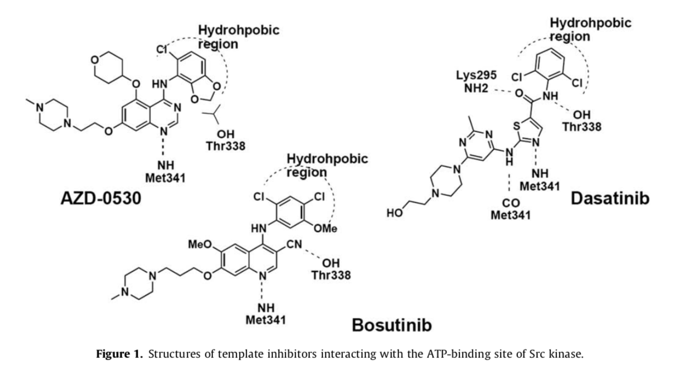
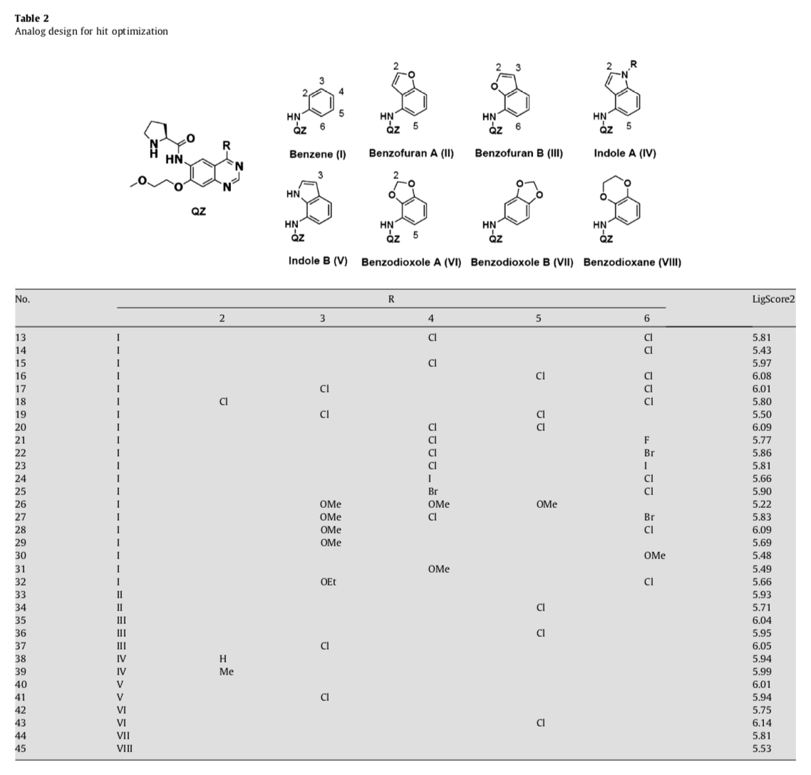
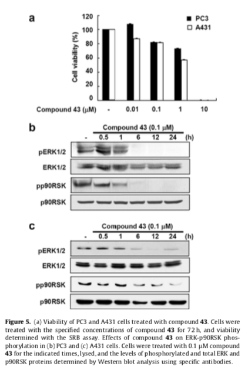
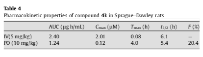
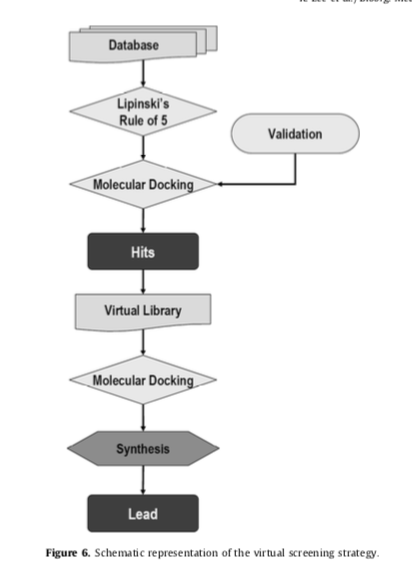

# Structure-based virtual screening of Src kinase inhibitors 基于结构的对Src激酶抑制剂的虚拟扫描（筛选）

## 0. Abstract

**Src**是与肿瘤生长发育**tumor growth**相关的多个过程中的一个重要靶点**target**，包括增殖**proliferation**、新生血管化**neovascularization**和转移**metastasis**。在本研究中，使用商业的虚拟筛选**virtual screening**的方法和内部化合物库**in-house compound libraries**进行了命中识别**hit identification**。对命中点**hits**进行对接研究**dock studies**，使用评分函数**scoring functions**评估对接结果**the docking results**并对配体结合亲和力进行排序**rank ligand-binding affinities**。随后，通过重点库设计**focused library design**和对接分析**dock analyses**，对强效选择性**Src**抑制剂进行hit优化。因此，我们报告一种新型化合物**novel compound** “**43**”与89 nM的$IC_{50}$值，代表`(S)-N-(4-(5-chlorobenzo[d] [1,3]dioxol-4-ylamino)-7-(2-methoxyethoxy)quinazolin-6-yl)pyrrolidine-2-carboxamide`，是高度选择性的Src与表皮生长因子受体($IC_{50}\ \ ratio> 80-fold$)和VEGFR-2 ($IC_{50}\ \ ratio> 110-fold$)。**Compound 43**对表达src的PC3人前列腺癌和A431人表皮样癌细胞均有抗增殖作用，计算$IC_{50}$值分别为1.52和0.78 $\mu M$。此外，**compound 43** (0.1 $\mu M$)对PC3和A431细胞系中Src下游分子细胞外信号调节激酶和p90核糖体S6激酶的磷酸化均有时间依赖性的抑制作用。**Compound 43**与Src的对接结构表明，C-6喹唑啉的氯代二氮二氧基和吡咯烷酮环似乎与Src的疏水口袋紧密配合。此外，吡咯烷酮NH **the pyrrolidine NH**与Asp348的羧基**the carboxyl group of Asp348**形成氢键**hydrogen bond**。这些结果证实了虚拟筛选研究**virtual screening studies**在铅**lead**发现过程中的成功应用，并表明我们的新化合物 **novel compound** **43**可以作为进一步铅优化**lead optimization**的有效Src抑制剂的候选。

> **HIT：**应该就是我们常说的[药物作用](https://www.baidu.com/s?wd=药物作用&tn=SE_PcZhidaonwhc_ngpagmjz&rsv_dl=gh_pc_zhidao)靶点，一般药物研发的第一个阶段就是找到机体内，影响某一疾病发生发展的关键靶点，然后给予该靶点的三维结构，设计出可能的治疗药物（[先导化合物](https://www.baidu.com/s?wd=先导化合物&tn=SE_PcZhidaonwhc_ngpagmjz&rsv_dl=gh_pc_zhidao)）。

## 1. Introduction

劳斯肉瘤病毒(RSV)**Rous sarcoma virus**编码的病毒Src基因 **viral Src gene** 是第一个确定的致癌基因**defined oncogene**，编码了第一个公认的酪氨酸激酶**the first recognized tyrosine kinase**。酪氨酸激酶(TK)诱导的蛋白磷酸化 **(TK)-induced phosphorylation of proteins** 是控制细胞生长和分化 **growth and differentiations** 的基本机制。Src激酶是存在于细胞质中的非受体TKs的一个结构同源群**structurally homologous group**的成员，被称为“Src激酶家族”**Src family of kinases**。Src参与多种调控增殖**proliferation**、分化**differentiation**和迁移**migration**的信号通路**signaling pathway**，目前研究人员正在研究，将这种蛋白的小分子抑制剂作为治疗多种疾病的潜在药物。

提示SRC磷酸化抑制剂可能阻碍肿瘤细胞不受控制的生长，从而成为治疗肿瘤的新药物。具体来说，SRC活性升高。具体来说，SRC活性在乳腺癌、胰腺癌、卵巢癌、食管癌、肺癌、胃癌、结肠癌和头颈癌中升高。6-10许多平面异芳香族小分子抑制剂模板已被开发用于识别新型SRC激酶抑制剂。迄今为止，已报道了嘌呤、吡咯嘧啶、吡咯嘧啶、环烷酮、喹唑啉和喹啉类抑制剂。其中，达沙替尼（BMS354825；百时美施贵宝肿瘤学）、12 AZD-0530（阿斯利康）和博苏替尼（SKI-606；惠氏研究）已达到1期或2期临床试验（图1）。这些小分子抑制剂具有来源于“扁平”杂环核的类似结构，并特别使SRC家族激酶的ATP结合位点失活。双SRC/ABL抑制剂AZD-0530基于苯胺喹唑啉支架。该化合物对SRC显示效力，IC 50值为10 nm。达沙替尼（BMS-354825）是一种新的口服和有效的BCR-ABL和SRC家族激酶（SFK）多靶向抑制剂，是一种有前途的癌症治疗剂，其IC50为0.6nM。惠氏公司开发了一种基于喹啉支架的双BCR ABL/SRC抑制剂博苏替尼（SKI-606），其结构与阿斯利康喹唑啉模板有关。该化合物相对于SRC显示1.2 nm的IC 50。

配体对接是一种化合物构象选择对所提出的结合位置的可行性有很大影响的方法。虚拟筛选技术与传统的高通量筛选新的活性化合物一样，已被认为是一种有价值的硅技术，在制药工业中取得了越来越大的成功。基于结构的虚拟筛选方法正在成为从命中识别到铅优化的铅发现过程中高吞吐量筛选的可靠补充方法。这些过程分两个阶段进行：（i）姿势的精确预测；（ii）结合紧密性的估计（评分）。一旦提出假定的蛋白-配体相互作用，就可以使用评分函数来估计目标的相对配体亲和力。这些筛选结果是通过对接和进一步的生物测试评估结合模式的候选分子的一个有希望的来源。
在这项研究中，我们提出了分子的计算虚拟筛选的对接程序，以确定SRC激酶抑制剂的新的潜在作用。对接程序，LIGANDFIT，用于对接命中，并应用几个评分和共识评分功能评价对接结果和等级配体结合亲和力。一种新的潜在的铅是根据对接分数和检查关键相互作用如何保留激酶结合的基础上确定的。21我们的研究结果表明，该化合物是SRC的有效抑制剂，并在表达SRC的PC3人前列腺癌和A431人表皮样癌细胞系中诱导抗增殖作用。

## 2. 结果
SRC是抗肿瘤治疗中为数不多的完全特征化和有效的靶点之一。本研究的主要目的是建立SRC激酶抑制剂的虚拟筛选模型。为了在合理的时间内实现这一目标，我们需要一个快速而强大的对接工具。我们的初步研究是使用软件，配体配合，被广泛认为是最好的对接程序之一。该模型被进一步应用于筛选一个内部数据库，以确定SRC激酶抑制剂的新引线。

### 2.1. 化合物1-3的结合模型
近年来，SRC激酶的几种X射线结构被确定为与许多小分子抑制剂的复合物，包括AP23464和AP23451、普瓦拉诺、CPG77675和STI-571（伊马替尼）。22-24选择人SRC（条目2H8H）的X射线结构作为分子对接分析的起始参考。13为了验证对接程序配体配合的准确性和本研究所采用的方法，计算了与配体配合对接的AZD-0530晶体结构（PDB 2H8H）和最合理结合方式之间的均方根偏差。控制对接的结果表明，配体配合决定了对接抑制剂AZD-0530的最佳取向与晶体中发现的原始取向接近（图2）。SRC中AZD-0530的实验对接构象与计算对接构象的均方根偏差为0.34A
三种抑制剂（1-3），达沙替尼（BMS354825；布里斯托尔-迈耶斯Squibb肿瘤学，普林斯顿，NY），AZD-0530（阿斯利康，麦克斯菲尔德，英国）和博苏替尼（SKI-606；惠氏研究，珠江，NY），停靠在SRC的优化结构上，并进一步最小化产生的复合物，以克服蛋白质刚性。我们评估了各种评分功能（ligscore1、ligscore2、plp1、plp2和pmf），试图准确预测配体分子与其蛋白质受体之间的结合亲和力。与其他功能相比，Ligscore2作为配体匹配对接系统中的最高得分者，更能成功地获得准确的姿势，因此，Ligscore2被用于获得各种分数。
 

 
图1描述了三种已知抑制剂的化学结构，以及抑制剂与SRC激酶催化域的ATP结合位点之间的相互作用。抑制剂分子占据ATP结合位点。喹唑啉、喹啉和吡啶环模板跨越了ATP中核糖所占据的区域。这种高度保守的氢键是由环TEM板的N1形成的，它与MET 341的主链酰胺结合。博苏替尼的氰基与THR338的侧链OH基氢键结合。模拟结果表明，与Met341和Thr338形成的氢键网络限制了SRC的铰链区域内的抑制剂，其分子支架位于腺嘌呤囊内。此外，还发现了苯胺类分子与Met314、Val323、Ile336、Leu393、Ala403和Phe405形成的疏水区之间的疏水相互作用。在达沙替尼中，在赖氨酸295的酰胺羰基和侧链NH 2之间发现了一个额外的氢键。2-氯-6-甲基苯甲酰胺具有很深的疏水性。12这些结构模型有助于为进一步的配体设计提供具体的起点。
 
### 2.2. 通过虚拟筛选识别点击
首先，通过使用分子性质过滤器过滤虚拟筛选的所有化合物，以消除具有不希望的分子性质的化合物。SRC激酶活性化合物（候选化合物和研究国家的化合物），分子量400-500，H-键供体62，H-键受体7-10，2d极性表面积65-100和alogp 4-5。首先，根据标准对所有化合物进行预过滤。为了寻找具有活性化合物的相似结构，我们进行了基于化学相似性的二维搜索。这些过滤器帮助从总共1561000个分子中选择2300个分子。由于降低了成本、时间、试剂和化合物消耗，分子物理性质过滤器和相似性的概念非常有吸引力。
迄今为止开发的对接模型提供了一个精确的概念，即新铅所需的足够的分子属性。我们的目标是筛选公司收集的大量化合物。我们在一个包含2300个从优化的商业和内部数据库中提取的Druglike分子的相对较大的库中进行了灵活的Ligniad对接。分子对接率约为65%。在这些化合物中，我们只考虑与MET341（SRC结合位点的主要相互作用）具有H-键的HIT化合物，并通过ligscore2选择得分最高的化合物。

 
 
通过对所选化合物与配体配合物的对接计算，确定了四种在纳米摩尔范围内具有活性的有效抑制剂，产生了12个具有高轻量2的点击量（表1）。按照上述步骤，最终从化学档案中选出十几种化合物，用于在单一10 L M浓度下进行SRC磷酸化抑制试验的实际测试。这种预筛选分析的目的是消除大部分不活性剂，并保存“活性”剂。所选的四种化合物在浓度为10 l m时抑制SRC活性。在四种活性化合物中（如图3所示），选择最有效的化合物进行进一步研究。命中选择过程不仅基于有效性和新颖性，还基于随后影响铅优化阶段成功结果的所有其他参数。从对接分数、一致性分数、结合构象和与SRC激酶结合位点的匹配度等方面进一步研究了HIT。特别考虑了酶结合位点中重要氨基酸残基（MET 341）的相互作用。

化合物4是汉米制药有限公司合成的喹唑啉酮衍生物，具有良好的对接性（ligscore2=6.00），最具活性（ic 50=300nm），支持其作为SRC激酶强抑制剂的活性。因此，虚拟筛选AP-Proch从有限的化合物中产生了一种新的有效的SRC激酶抑制剂。

### 2.3. 类似物的设计与合成
从虚拟筛选分析中选择化合物4，（S）-N-（4-（3-氯-4-氟苯基氨基）-7-（2-甲氧基乙氧基）喹-奈唑啉-6-基）吡咯烷-2-甲酰胺作为设计新的SRC抑制剂的热门药物。这是一种在喹唑啉环的C-6位置被取代的新型苯胺基喹唑啉化合物，从结构模型可以推测，喹唑啉环与激酶的腺嘌呤结合位点相互作用，而苯胺环则埋藏在相邻的疏水囊中。喹唑啉N1与MET 341的主链酰胺结合，形成保守的氢键。喹唑啉类化合物与SRC模型的对接表明，与喹唑啉C-6位置相连的吡咯烷环与疏水囊相匹配。吡咯烷NH与Asp348的侧链羧基有一个额外的相互作用。

我们能够利用扩展疏水囊中结构相关激酶的序列差异来提高铅化合物的选择性。苯胺苯环上取代基的修饰导致了对SRC激酶抑制活性的显著变化。为了深入了解我们的苯胺系列抑制活性的结构基础，我们利用SRC激酶的可用3D结构进行了分子建模和对接研究。
 
我们使用一组由虚拟合成方案连接的预定义分子构建块。19.在公布的实验数据的基础上，我们建立了一个小型的重点图书馆（表2）。通过改变喹唑啉C-4上的苯胺或双环苯胺取代基，分析了其最佳构象。

对苯胺取代模式的操纵使人们发现了一种有效的选择性SRC抑制剂。以结构为导向的碎片优化方法可以快速产生效力更高的化合物，从最初的低活性的碎片击中到通常与高质量的铅分子有关的纳米摩尔活性。虚拟化合物是由化合物4在C-4上以33个芳香环基团生成的。接下来，对这些化合物进行对接研究。鉴于化合物43的结构相似性和与SRC的结合亲和力，基于ligscore2的对接分数，将其作为SRC选择性抑制的一种新的潜在先导物。苯并二恶英杂环埋在含有Met314、Val323、Ile336、Leu393、Ala403和Phe405的疏水袋中。这种潜在的铅对SRC具有很强的选择性。该化合物是通过方案1中概述的路线合成的，第4节描述了合成步骤和结构特征。

### 2.4. 绑定模型

将铅化合物43固定在SRC激酶结合位点，并对有利的蛋白-配体相互作用区域进行目视分析。结果表明，该化合物与SRC激酶结合位点的重要残基结合良好并相互作用（图4）。虽然氢键对于这种抑制模式是必要的，但是蛋白质和配体之间氢键的数量与效力无关。

我们还使用结合模型和构象分析来确定抑制剂和酶之间相互作用的重要性。与化合物43复合物中活性SRC激酶结构域的对接结构表明喹唑啉环占据腺嘌呤结合位点，类似于晶体分析的结果（图4a）。SRC激酶域采用所有激酶中典型的细长双叶结构。
喹唑啉类化合物在SRC激酶中的结合方式已被广泛研究。13,25喹唑啉的N1形成了一个高度保守的氢键，它结合到Met341的主链酰胺上。此外，所述化合物以预测的方向结合并且满足预期的疏水和芳香相互作用（图4b和c）。根据喹唑啉抑制剂的信息预测，一个大体积的C-4苯胺是靶向SRC激酶所必需的。氯苯并二恶英部分紧密结合到由Met314、Val323、Ile336、Leu393、Ala403和Phe405形成的疏水囊中，如图3b所示。在本研究中，我们进一步研究了在Qui-Nazoline环的C-6位置取代的一系列新的苯胺基喹唑啉。C-6位置允许进入ATP核糖结合位点，因此可以为酶提供额外的结合亲和力。C-6喹唑啉的吡咯烷环似乎与疏水性囊袋紧密结合。与蛋白质的疏水相互作用占主导地位，吡咯烷NH与ASP348侧链羧基之间有一个额外的氢键。蛋白与配体在吡咯烷环区内的疏水性表面积可能是结合亲和力增加的原因。对潜在抑制剂的对接研究显示，与喹唑啉C-6位置相关的杂环符合核糖囊的形状。此外，分子的C-7侧链指向溶剂暴露区。这些结果表明，柔性侧链的增溶基团提高了该化合物的体外药效，优化了其理化性质。

### 2.5. 生物活性
 
为了进一步确定化合物43的酶抑制特性，对该化合物对内部激酶的选择性进行了评估，如表3所示
 
 

SRC信号传导是骨功能正常和失调的关键途径，骨转移是晚期前列腺癌和黑色素瘤亚时态发病的原因。因此，SRC抑制对于处于不同阶段的前列腺癌患者来说是一种潜在的有用的治疗策略。PC3细胞来源于人类前列腺癌骨转移。A431细胞中EGFR的致癌信号可能有助于SRC家族激酶的激活。用不同浓度的化合物43处理PC3和A431细胞以评估其抗增殖作用。我们观察到对PC3和A431细胞生长的剂量依赖性抑制作用（图5a）。此外，在化合物43（0.78L M）的亚摩尔水平上，EGF刺激的a431细胞中的总细胞酪氨酸磷酸化明显受到抑制。然而，该化合物对人乳腺腺癌细胞系sk-br3（HER2蛋白高度表达的细胞系）或mcf-7（数据未显示）没有抑制作用。由于SRC激酶下游的细胞外信号调节激酶（ERK）参与细胞增殖，我们研究了化合物43是否影响PC3和A431细胞中ERK和P90RSK（ERK的下游信号）的磷酸化。值得注意的是，化合物43（0.1 L M）以时间依赖性方式减弱ERK和P90RSK磷酸化。6小时后，在PC3和A431细胞中观察到ERK和P90RSK磷酸化的完全抑制（图5b和c）。结果表明，化合物43强烈抑制SRC激酶活性，导致SRC下游信号、ERK和P90RSK抑制，肿瘤细胞增殖。

### 2.6. 大鼠药代动力学研究
 
根据初步筛选数据，对大鼠进行了化合物43的药代动力学（pk）研究（表4）。单剂量给予10 mg/kg（伊万多）后，该化合物的血浆暴露峰值为0.4 mm（c max），最大T max为1 h。测定43对大鼠的口服生物利用率为20%。尽管这种新的化合物尚未被认为是一种潜在的临床候选物，但结合特殊的生物学特性的分子支架使其被认为是进一步开发有效的酪氨酸激酶抑制剂的一个有希望的打击。

## 3. 结论

基于结构的虚拟筛选方法有助于识别有效抑制SRC激酶活性的化合物。设计了一个计算对接研究，以优化每一步的时间和成本效率。提出了一种虚拟筛选应用，成功地鉴定了新型的纳米摩尔SRC激酶抑制剂。该方法采用基于结构的内部激酶数据库筛选。软件包，配体匹配，用于蛋白质-配体相互作用位点的识别和可视化和数据库搜索。
BMS354825、AZD-0530和SKI-606的LIGANDFIT对接分析证实了这些配位体与SRC激酶结合位点的匹配是合理的。我们通过虚拟筛选确定了一种C-6取代的奎纳唑啉化合物作为一种新的强力蛋白SRC激酶抑制剂。我们选择hit化合物4（300nm）作为设计新的SRC激酶抑制剂的模板，以进行进一步的协同工作。

杂环核4位的取代基被合成以优化抗增殖活性，并被评价为SRC激酶抑制剂。我们通过对接研究、合成和基于酶的分析发现了高效选择性的SRC抑制剂。具体来说，化合物43通过酶基分析抑制SRC活性。化合物43和SRC复合物中的低纳米摩尔IC 50值（IC 50=89 nm）的对接结构揭示了由qui-nazoline的n1形成的高度保守的氢键，该氢键与met341的主链酰胺相互作用。此外，C-6喹唑啉的吡咯烷环似乎与疏水袋紧密结合。提出了化合物43与蛋白质侧链羧基氧ASP348之间的一个附加氢键。蛋白质和配体在吡咯烷环区域的疏水表面积可能是结合亲和力增加的原因。

SRC信号传导是肿瘤增殖和发展的主要途径。SRC信号的激活负责-晚期前列腺癌的可考虑发病率。A431细胞中EGFR的致癌信号可能有助于SRC家族激酶的激活。ERK和P90RSK是SRC的下游信号，有助于细胞增殖、运动和肿瘤细胞的侵袭。在我们的实验中，化合物43在PC3和A431细胞中以时间依赖性方式强烈抑制细胞增殖和抑制ERK和P90RSK的磷酸化。这些结果表明，化合物43对SRC激酶活性的抑制导致ERK和P90RSK磷酸化的下调，最终抑制PC3和A431细胞的增殖。

因此，我们得出结论，大型数据库对接，结合适当的评分和过滤过程，在医学化学中是有用的。这种方法已经达到了一个高级阶段，在这一阶段它可以有效地促进潜在客户发现过程。进一步的优化和SAR研究，以提高细胞和体内效力正在进行中。

## 4. 实验
### 4.1. 配体和酶结构的生成

通过对接进行虚拟筛选需要一个精确的三维目标结构。SRC激酶结构域与其抑制剂azd-0530，n-（5-氯-1,3-本-唑-4-基）-7-[2-（4-甲基管-razin-1-基）乙氧基]-5-（四氢-2H-吡喃-4-基氧基）qui-nazolin-4-胺结合，从数据库中的蛋白质（pdbentry2h8h）。13最初，氢原子被添加到蛋白质中，假设所有的残余物都是中性的。包括活性部位的所有水分子。使用最陡下降（梯度<0.1）和共轭梯度算法（梯度<0.01）将蛋白质最小化，并在SightII中使用Charmm力场。29使用抑制剂azd-0530 N-（5-氯-1,3-苯并二恶英-4-基）-7-[2-（4-甲基哌嗪-1-基）乙氧基]-5-（四氢-2H-吡喃4-氧基）喹唑-lin-4-胺确定SRC活性位点，并包括配体中心10_半径内的所有残基。检索到与配体的蛋白质活性位点构象进行进一步分析。

### 4.2. 化合物收集

我们分析了1561000种化合物的理化性质，进行了虚拟筛选。编纂了各种商业化合物。通过商用数据库，即amri（175000）、asinex（358000）、enamine（400000）、interbioscreen（322000）、life chemicals（296000）30和in-house（10000）syn-thesis，丰富和丰富了化合物的收集。虽然对接协议已经在一些案例研究中进行了内部开发，并且能够将相似目标的已知抑制剂排名在命中列表的顶部，在这种情况下，我们应用了所有建议的后处理过滤和重新定位任务，以提高对接中的命中率。学习。31为了设计适合长期口服的具有良好口服生物利用度的化合物，我们着重研究了影响吸收的分子性质，如二维极表面积（psa）、alogp、分子量（mw）、H-键供体受体（hbda）性质和可旋转键数。32.使用美国加利福尼亚州圣地亚哥Accelery公司的Excel 6插件工具DS-Accord计算物理性质和化学相似性。

### 4.3. LIGANDFIT对接与划线
 
虚拟筛选是实现智能化和导程优化的重要策略之一。表示虚拟筛选策略的示意图如图6所示。来自Discovery Studio 1.7版本（美国圣地亚哥Accelerys）的LIGANDFIT适用于所有**runs**。从与4-氨基喹唑啉复合的SRC激酶的X射线结构中获得对接的参考蛋白坐标。根据化合物4-氨基喹唑啉的晶体结构，采用基于形状的方式进行对接位点搜索。所有计算均使用CFF 1.01力场进行。通过蒙特卡罗模拟（10000次试验）生成了结构，并选择了柔性拟合。

网格分辨率设置为0.5$\overset{\circ}{A} $。使用默认的刚体最小化参数将每个构象的四个方向对接到该位置，然后对每个对接配体进行500步最终最小化。如Discovery Studio 1.7中所实现的，使用一组功能对10个保存的配体构象中的每一个进行评分，包括ligscore1、ligscore2、plp1、plp2、jain、pmf和ludi。

### 4.4. 虚拟图书馆建设与对接研究
我们通过虚拟筛选获得的初始点击量属于苯胺喹唑啉家族（图3，化合物4）。利用C-4上33个芳香环基团的化合物4生成了可实现触铅的虚拟化合物，以确保SRC激酶的活性和选择性。选择具有不同取代基图案的芳香环（表2）。25分子结构通过charmm力场程序最小化（Accelerys，Inc.Sandiego，USA）。上述方法的所有对接模拟都进行了介绍。在SRC激酶抑制剂与蛋白质活性位点的进一步对接研究中，应用ligscore2选择评分功能。

### 4.5. 体外SRC激酶抑制试验
用SRC激酶检测试剂盒（美国麦迪逊普罗米加）进行酶选择性筛选。反应是在96孔聚苯乙烯圆底板中形成的。简言之，在含有ATP和激酶溶液中特定底物的情况下，将试验化合物添加到平板上，并在添加蛋白酶溶液之前在室温下培养1小时。在使用稳定剂溶液后，使用荧光阅读器在485/530 nm处测量荧光偏振值。所有化合物溶解在二甲基亚砜中，并在缓冲液中稀释，在分析中得到1%的最终二甲基亚砜浓度。

### 4.6. 体外生长抑制试验
PC3细胞从韩国细胞系银行（韩国首尔）获得。a431和sk-br3细胞取自美国型培养标本（Rockville，MD）。将PC3和SK-BR3细胞维持在RPMI 1640中，添加10%胎牛血清（FBS，GiBCO-BRL），100单位/毫升青霉素，和100 Lg/ml硫酸链霉素。A431和MCF-7细胞保存在含有10%FBS的DMEM中。为了评估细胞的效能，细胞被镀在96孔板（康宁Costar）上，密度在10000到15000个细胞/孔之间。微量滴定板在37℃孵育。C低于5%的二氧化碳。24小时后，按指定浓度添加药物。72小时后，加入冷的10%三氯乙酸终止反应。用流动的去离子水清洗盘子，然后风干。向每个孔中加入亚磺罗丹明B溶液（1%乙酸中的0.4%w/v），并洗掉未结合的染料。随后用10 mM Trizma碱溶解结合染色剂，并在自动平板阅读器上读取吸光度。生长抑制率为50%（gI50），计算公式如下：【Ti？】TZ）/（C？Tz）是否？100=50（Ti：试验生长，Tz：时间零点，C：控制生长）。

### 4.7. 蛋白质印迹分析
PC3和A431细胞在6 cm培养皿中培养48 h，然后用化合物43（0.1 L M）处理不同时间段。在冰上刮取细胞溶解物并用溶解缓冲液（10 mM Tris，pH7.5；150 mM NaCl；5 mM EDTA；1%Triton X-100；1 mM DTT；0.1 mM PMSF；10%甘油和蛋白酶抑制剂鸡尾酒片）处理，然后在14000 rpm下离心10分钟。上清液中的蛋白质浓度如制造商手册中所述，使用染料结合蛋白分析试剂盒（Bio-Rad Laboratories Hercules，CA）测定。裂解液蛋白进行10%十二烷基硫酸钠（SDS）-聚丙烯酰胺凝胶电泳（PAGE），并电泳转移到PVDF膜（美国密理博公司，贝德福德，MA，美国）。吸墨纸吸干后，用5%脱脂奶粉将膜封闭1h，室温下用特异性一级抗体孵育2h。用增强化学发光（ECL）检测试剂盒（Amersham，Piscataway，NJ）与HRP结合的二级抗体杂交后检测蛋白带。

### 4.8. 大鼠药代动力学
成年雄性Sprague-Dawley大鼠来自Orient Co.（韩国庆吉道），可免费获得颗粒食物（Picolab啮齿动物饮食5053）和自来水。在整个实验过程中，动物被安置在层流笼（三个滤器）中，保持在22±2？。c，相对湿度为50±20%，在12 h光/12 h暗循环下。实验前，动物被关在这些设施中至少一周。在口服研究中，大鼠在给药前一整夜挨饿，给药后约2小时喂食。大鼠静脉内研究不禁食。静脉注射（IV）和口服给药的载体是23%的ERI载体（PEG 200，0.02 5%CHCL/Tween 80（20:3，V/V）。静脉注射和口服后不同时间采集血样。在含有肝素的试管中从尾静脉收集约0.3ml血液，并通过离心分离获得血浆。血浆样本储存在？80岁？C直到使用。用LCMS分析化合物43的样品。峰时间（t max）和最大浓度（c max）直接从观测值中获得。半衰期（t 1/2）是使用消除率常数（ke）计算的，而消除率常数又是根据直线的斜率通过回归分析估算的。半衰期值从0.693/ke获得。曲线下面积由0-5h（AUC5）的线性梯形法则计算。AUC 1的值计算为AUC5+[给药后5小时血浆浓度/消除率常数]。

### 4.9. 化学
#### 4.9.1. 7-氟-3H-喹唑啉-4-酮
将催化量（1 ml）的N，N-二甲酰胺添加到2-氨基-4-氟苯甲酸（50 g，322 mmol）和甲酰胺（77 ml，1934 mmol）的溶液中，并搅拌所得溶液。溶液加热到180度？C搅拌14小时，冷却至室温，加入300毫升蒸馏水。将所得混合物搅拌约30分钟，过滤得到7-氟-3H-喹唑啉-4-酮（41.3 g，产率：78%）。1 h NMR（DMSO-D 6）d:7.47–7.35（m，2h），8.20–8.13（m，2h），11.85（Br s，1h）。

#### 4.9.2. 7-氟-6-硝基-3H-喹唑啉-4-酮

将7-氟-3H-喹唑啉-4-酮（25 g，152 mmol）添加到浓硫酸（50 ml）和发烟硝酸（51 ml）在0？下的混合物中。c.将所得溶液在室温下搅拌1 h，加热至110℃。搅拌2小时，将溶液冷却至室温，加入300毫升冰水。将所得混合物搅拌约30分钟，过滤得到7-氟-6-硝基-3H-喹唑啉-4-酮（25 g，产率79%）。核磁共振氢谱（cdcl 3）d:7.79（d，1h），8.32（s，1h），8.72（d，1h），12.83（br s，1h）。

#### 4.9.3. 4-氯-7-氟-6-硝基喹唑啉

将7-氟-6-硝基-3H-喹唑啉-4-酮（20 g，96 mmol）、亚硫酰氯（170 ml）、氧化磷（30 ml）和N，N-二甲基甲酰胺（1 ml）添加到反应瓶中并搅拌。将所得溶液加热至100？直到固体溶解，然后搅拌2小时。反应冷却到室温，在减压下去除溶剂。加入300毫升甲苯后，对所得残渣进行再蒸馏，重复三次，得到4-氯-7-氟-6-硝基喹唑啉（21g，收率99%）。1 h核磁共振（cdcl 3）d:7.73（d，1h），8.30（s，1h），8.72（d，1h）。
#### 4.9.4.（5-氯-苯并[1,3]二恶英-4-基）-（7-氟-6-硝基）-

将喹唑啉-4-基）-胺4-氯-7-氟-6-硝基喹唑啉（1.67 g，7.42 mmol）和5-氯-苯并-[1,3]二氧杂-4-基胺23（1.27 g，7.42 mmol）添加到2-丙醇（15 ml）中。在加入6 N HCl（1.5 ml）后，将反应混合物加热回流2 h，冷却至室温，并用饱和NaHCO 3（AQ）制成碱性。接下来，用乙酸乙酯（20毫升）萃取混合物。3）用盐水清洗。有机层经MgSO 4干燥。滤液在真空中浓缩，得到5-氯-苯并[1,3]二恶英-4-基）-（7-氟-6-硝基-喹唑啉-4-基）-胺（2.4 g，89%）。1 h NMR（DMSO-D 6）d:10.60（s，1h），10.11（d，j=8.1 Hz，1h），8.61（s，1h），8.32（s，1h），7.12（d，j=6 Hz，1h），7.00（d，j=6 Hz，1h），6.10（s，2h）。

#### 4.9.5.（5-氯苯并[1,3]二恶英-4-基）-[7-（2-甲氧基-乙氧基）-6-硝基喹唑啉-4-基]-胺

将三甲基矽酸钾（3.40 g，26.5 mmol）添加到（5-氯-苯并[1,3]二恶英-4-基）-（7-氟-6-硝基-喹-奈唑啉-4-基）-胺（2.4 g，6.62 mmol）和2-甲氧基-乙醇（1.57 ml，19.9 mmol）和二甲基亚砜（50 ml）的混合物中。注视4小时后，用水骤冷反应，并用乙酸乙酯（30毫升）萃取混合物。3）。用水（30 ml）洗涤有机层。4）和盐水（30 ml），经MgSO 4干燥，然后真空浓缩，用快速色谱法纯化，得到5-氯-苯并[1,3]二恶英-4-基][7-（2-甲氧基-乙氧基）-6-硝基喹唑啉-4-基]-胺（1.44 g，52%）。1h核磁共振（DMSO-d 6）d:10.18（s，1h），9.30（s，1h），8.52（s，1h），7.08（d，j=7.5hz，1h），7.00（d，j=7.5hz，1h），6.25（s，2h），4.43（m，2h），3.75（m，2h），3.31（s，3h）。

#### 4.9.6. N4-（5-氯-苯并[1,3]二恶英-4-基）-7-（2-甲氧基-乙氧基）-喹唑啉-4,6-二胺

将浓缩HCl（0.115 ml）添加到铁（961 mg，17.2 mmol）存于50%乙醇（AQ）（20 ml）中的混合物中。将混合物加热回流1 h。向反应混合物中添加5-氯-苯并[1,3]二恶英-4-基][7-（2-甲氧基-乙氧基）-6-硝基-喹唑啉-4-基]-胺（1.44 g，3.43 mmol），并在相同温度下连续搅拌1 h。反应混合物经硅藻土热过滤，滤液冷却至室温。用饱和NaHCO 3（AQ）将混合物制成碱性，用乙酸乙酯（20 ml）萃取。3）。用水和盐水洗涤有机层，并经MgSO 4干燥。然后，将混合物在真空中浓缩，得到N4-（5-氯-苯并[1,3]二恶英-4-基）-7-（2-甲氧基-乙氧基）-喹唑啉-4,6-直径-矿山（1.25 g，95%）。1 h NMR（DMSO-D 6）d:9.12（s，1h），8.12（s，1h），7.35（s，1h），7.13（s，1h），7.08（d，j=7.5Hz，1h），6.80（d，j=7.5Hz，1h），6.05（s，2h），5.23（s，2h），4.43（m，2h），3.75（m，2h），3.31（s，3h）。

#### 4.9.7.（S）-2-[4-（5-氯-苯并[1,3]二恶英-4-基氨基）-7-（2-甲基-甲氧基乙氧基）-喹唑啉-6-基氨基甲酰]-吡咯烷-1-甲酸第三-丁基酯

将N4-（5-氯-苯并[1,3]二恶英-4-基）-7-（2-甲氧基-乙氧基）-喹-奈唑啉-4,6-二胺（200 mg，0.342 mmol）添加到boc-l-脯氨酸（219 mg，0.512 mmol）和1-（3-二乙氨基丙基）-3-乙基碳化二亚胺HCl（295 mg，0.684 mmol）在吡啶（3 ml）中的反应混合物中。将混合物搅拌2小时，然后用水骤冷反应。然后，用乙酸乙酯萃取混合物，用盐水洗涤有机层，干燥MgSO 4，真空蒸发。用快速色谱法纯化残余物，得到2-[4-（5-氯-苯并[1,3]二恶英-4-基氨基）-7-（2-甲氧基-乙氧基）-喹唑啉-6-基氨基甲酰]-吡咯烷-1-甲酸第三-丁基酯（150 mg，75%）。

1 h核磁共振（CDcl 3）d:9.08（s，1h），8.60（s，1h），7.26（m，1h），7.03（s，1h），6.95（d，j=7.5 Hz，1h），6.65（d，j=7.5 Hz，1h），6.00（s，2h），4.33（m，3h），3.85（m，2h），3.50（m，5h），2.30–1.80（m，4h），1.70–1.40（m，9h）。

#### 4.9.8.（s）-吡咯烷-2-羧酸[4-（5-氯-苯并[1，3]二恶英-4-基氨基）-7-（2-甲氧基-乙氧基）-喹唑啉-6-基].-酰胺

用二氯甲烷（3 ml）稀释2-[4-（5-氯-苯并[1,3]二恶英-4-基氨基）-7-（2-甲氧基乙氧基）-喹唑啉-6-基甲酰胺基]-吡咯烷-1-羧酸第三丁基酯（150 mg，0.256 mmol）。将三氟乙酸（3ml）滴入反应混合物中，搅拌1h，真空蒸发除去溶剂。用乙酸乙酯（10 ml）稀释残余物，并用饱和NaHCO 3（aq）使其基本化。将各层分离，用盐水洗涤有机层并经MgSO 4干燥。将混合物在真空中浓缩，得到吡咯烷-2-甲酸[4-（5-氯-苯并[1,3]二氧杂环-4-基氨基）-7-（2-甲氧基-乙氧基）-喹唑啉-6基]-酰胺（60 mg，48%）。1 h核磁共振（cd 3 od）d:8.95（s，1h），8.31（s，1h），7.26（s，1h），7.03（d，j=7.5 Hz，1h），6.85（d，j=7.5 Hz，1h），6.01（s，2 od）h），4.39（m，2h），4.10（m，1h），3.91（m，2h），3.46（s，3h），3,29（m，2h），2.30（m，1h），2.00–1.87（m，3h）。
