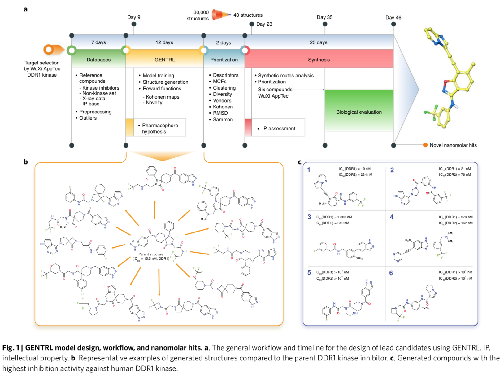
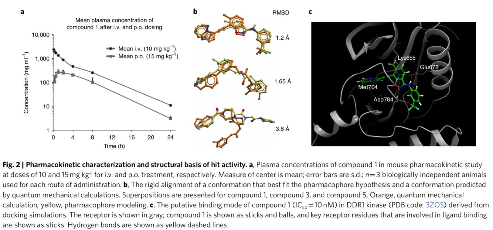

# 0. Abstract

我们已经开发了一种深层生成模型**a deep generative model** ，生成性张量强化学习方法(GENTRL) ，用于新的小分子设计。 Gentrl 优化了合成的可行性、新颖性和生物活性。 我们使用 GENTRL  在21天内发现了强效的椎间盘蛋白结构域受体1(DDR1)抑制剂，这是一种与纤维化和其他疾病有关的激酶**a kinase target implicated in fibrosis and other diseases** 。  四种化合物在生化检测中有活性，其中两种在细胞检测中得到验证。 其中一个领先候选者在小鼠身上进行了测试并证明了良好的药代动力学。

# 1. Introduction

药物开发是资源密集型的，通常需要10-20年的时间，成本从5亿美元到26亿美元不等。 人工智能有望通过促进快速识别化合物来加速这一过程并降低成本。 深层生成模型**Deep generative models** 是一种利用神经网络产生新数据对象的机器学习技术。  这些技术可以生成具有特定性质的物体，例如针对给定目标的活动，这使得它们非常适合于发现候选药物。  然而，很少有生成药物设计的例子已经通过实验验证，包括新化合物的合成进行体外和体内研究。

盘状蛋白结构域受体1(DDR1)是一种胶原激活的促炎症受体酪氨酸激酶，在上皮细胞中表达，参与纤维化17。 然而，还不清楚是否 DDR1直接调节纤维化过程，如肌成纤维细胞活化和胶原沉积，或早期炎症事件与减少巨噬细胞浸润有关。  自2013年以来，至少有8种化学类型被公布为选择性 DDR1(或 DDR1和 DDR2)小分子抑制剂(补充表1)。  最近，一系列高选择性的、以螺旋吲哚啉为基础的 DDR1抑制剂被证明对 Alport 综合征的 Col4a3  /-小鼠模型的肾纤维化有潜在的治疗效果。 因此，更广泛的 mdr1抑制剂的多样性将有助于进一步的基础理解和治疗干预。

我们开发了生成性张量强化学习(GENTRL) ，这是一种用于新药设计的机器学习方法。 Gentrl  优先考虑一种化合物的合成可行性**prioritizes the synthetic feasibility of a compound** ，它的效用是针对特定的生物靶点**its effectiveness against a given biological target** ，以及它与文献和专利空间中的其他分子有什么区别。 在这项工作中，GENTRL  被用来快速设计新的化合物是 DDR1激酶有活性。 其中六个化合物，每个都遵循 Lipinsk‘s rule，设计，合成，并在46天内进行了实验测试，这表明了这种方法提供快速和有效的分子设计的潜力(图1a)。

为了创建 GENTRL，我们将强化学习**reinforcement learning** 、变分推理**variational inference** 和张量分解**tensor decompositions** 结合到一个生成式两步机器学习算法中**a generative two-step machine learning algorithm**（如supplementary中的**Fig 1**） 。  首先，我们学习了化学空间的映射**a mapping of chemical space** ，一组离散的分子图**a set of discrete molecular graphs** ，到一个50维的连续空间**to a continuous space of 50 dimensions** 。 我们将学习到的流形的结构**structure of the learned manifold** 参数化为张量训练格式**the tensor train format** ，以使用部分已知的属性。  我们的基于自动编码器的模型**auto-encoder-based model** 将结构空间压缩到一个分布上**compresses the space of structures onto a distribution** ，这个分布参数化了高维格点中的潜在空间**parameterizes the latent space in a high-dimensional lattice** ，其节点中有大量的多维高斯数**multidimensional Gaussians** 。  该参数化将潜在的代码和属性**ties latent codes and properties** 绑定在一起，在没有显式输入的情况下处理缺失的值**works with missing values without their explicit input** 。 在第二步，我们和强化学习一起探索这个空间，以发现新的化合物。

Gentrl  使用三种不同的自组织映射**self-organizing maps (SOMs)**作为奖赏函数: 趋势 SOM **the trending SOM** 、一般激酶 SOM **the general kinase SOM** 和特异性激酶 SOM **the specific kinase SOM** 。 该方法是一种基于 kohonen  的奖励函数**a Kohonen-based reward function** ，利用专利中已公开的结构的申请优先权数据对复合新颖性进行评分**scores compound novelty**  。 充满了新奇的化学物质的神经元是对生成模型的奖赏。 一般激酶 SOM 是一个 Kohonen map，他可以区分激酶抑制剂和其他类别的分子。 特异性激酶 SOM 从靶向激酶的分子总库中分离出 ddr1抑制剂。  通过按顺序使用这三个 SOM，GENTRL 对其生成的结构进行优先排序。

我们使用了六个数据集来建立模型: (1)一大组ZINC数据集衍生的分子**a large set of mole- cules derived from a ZINC data set** ，(2)已知的 DDR1激酶抑制剂**known DDR1 kinase inhibi- tors** ，(3)普通激酶抑制剂(阳性组)**common kinase inhibitors (positive set)**   ，(4)作用于非激酶靶标(阴性组)的分子**molecules that act on non-kinase targets (negative set)** ，(5)制药公司声称具有生物活性分子的专利数据**patent data for biologi- cally active molecules that have been claimed by pharmaceutical companies** ，以及(6)  DDR1抑制剂的三维(3D)结构(补充表1)**three-dimensional (3D) structures for DDR1 inhibitors (Supplementary Table 1)** 。 数据集进行了预处理，以排除总异常值，并减少包含相似结构的化合物的数量(见Methods)。

我们开始在a filtered ZINC database (数据集1，前面描述过)上训练 GENTRL (预训练) ，然后继续使用 DDR1和普通激酶抑制剂(数据集2和数据集3)进行训练。 然后我们用之前提到的奖励启动了强化学习。  我们获得了30,000个结构的初始输出**(Supplementary Data Set)**  ，然后自动过滤去除带有结构警告或活性基团的分子，由此产生的化学空间通过聚类和多样性排序**clustering and diversity sorting** 被缩小**(Supplementary Table 2 )**。 然后我们使用(1)一般和特异性激酶  SOMs 评价结构，(2)药效团模型的基础上化合物的晶体结构与 DDR1的复合物(**Supplementary Figs. 2 and 3** )。  在前两步计算的分子描述符和均方根差**the values of molecular descriptors and root-mean- square deviation (RMSD)** 的基础上，我们使用 Sammon 映射来评估剩余结构的分布。

为了缩小我们分析的范围，我们随机选择了40个结构，顺利地**smoothly**覆盖了最终的化学空间和 RMSD 值的分布**(Supplementary Fig. 4 and Supplementary Table 3 )**。  在40个选定的结构中，有39个可能不属于任何已发表的专利或应用的范围**(Supplementary Table 4) **。  其中六个因为合成的易达性而被选择做实验验证。 值得注意的是，我们的方法导致了几个潜在的非平凡的生物同位素置换和拓扑修改**nontrivial potentially bioisosteric replacements and topological modifications** 的例子(**Fig. 1b** )。

到目标选择后的第23天，我们已经确定了6个候选分子，到第35天，这些分子已经成功合成**(Fig. 1c)** 。 然后他们在体外酶激酶抑制活性测试 **(Supplementary Fig. 5)** 。 化合物1和2具有强烈的 DDR1活性抑制作用(半最大抑制浓度(IC50)分别为10和21nM) ，化合物3和4具有中等效力(IC50值分别为1m 和278nm) ，化合物5和6没有活性。 化合物1和2都表现出对 DDR1超过  DDR2的选择性(图1c)。 此外，与44种不同的激酶相比，化合物1具有较高的选择性指数(补充图6)。

接下来，我们研究了化合物1和化合物2在 U2OS 细胞中的 DDR1抑制活性，该活性是由自体磷酸化测定的。 化合物的 IC50值分别为10.3和5.8 nM (补充图7)。  这两种分子都能抑制 MRC-5肺成纤维细胞中肌动蛋白和 CCN2的表达(图8)。 这些分子也抑制 LX-2肝星状细胞中胶原的表达(纤维化的标志) ，化合物1在13nM 处显示出强大的活性(补充图9)。

然后我们进行了体外微粒体稳定性研究，以确定化合物1和2在人、大鼠、小鼠和狗肝微粒体中的代谢稳定性。 化合物1和2的半衰期和清除值与常规使用的对照分子相似或更有利(补充表5)。 化合物2也被发现是非常稳定的缓冲条件(补充表6)。  两种化合物对细胞色素 P450均无明显抑制作用，两种化合物均具有良好的理化性质，符合 Lipinski 定律(补充表7和8)。

最后，我们在一个啮齿动物模型中测试了化合物1。 化合物1静脉注射(10mg kg-1) ，口服(15mg kg-1)。 两种药物导致相似的半衰期，约3.5小时(图2a 和补充表9和10)。  静脉注射给药初次分娩血浆浓度峰值为2,357 ng ml-1，而静脉注射给药的最高峰值为266 ng $ml^{-1}$，在分娩后1小时达到峰值。

用定量分析方法研究了化合物1活性的机理基础。 根据药效团模型预测化合物1的构象与定量机理计算**quantum mechanical calculations** 预测的首选构象和稳定构象非常相似(图2b)。 我们提出了化合物1和 DDR1之间由熵驱动的“锁匙”结合机制，并通过分子对接进一步表征了这种结合。 假定的结合模式表明了一种 II  型抑制机制(图2c)。 综上所述，化合物1形成多重氢键，与 DDR1激酶的活性位点残基具有良好的电荷和疏水相互作用。 化合物1与 ATP  位点的互补性可能有助于解释其对 DDR1的抑制活性。

- 笑死我了，定量分析or量子力学

尽管有合理的微粒体稳定性和药代动力学性质，这里已经确定的化合物可能需要在选择性、特异性和其他药物化学属性方面进一步优化。

在这项工作中，我们在不到两个月的时间内设计、合成并通过实验验证了靶向 DDR1激酶的分子，而且成本只是传统药物发现成本的一小部分。  这说明了我们的深度生成模型在成功的快速设计化合物方面的效用，这些化合物是综合可行的，对感兴趣的目标具有活性，并且在现有的知识产权方面具有潜在的创新性。 我们期望这项技术将得到进一步改进，成为确定候选药物的有用工具。

# 2. Methods

## 2.1. **Pretraining data set** 

对于预训练程序，我们已经准备了一个数据集，它使用的结构是从**the ZINC database** 中的**the Clean Leads set** 和我们的合作伙伴的专有数据库中得到的。 我们已经去除了碳、氮、氧、硫、氟、氯、溴和氢以外的原子结构。 常规的药物化学过滤器被用来排除具有潜在毒性和活性基团的化合物**Routine medicinal chemistry filters were applied to exclude compounds with potentially toxic and reactive groups.** 。

**Kinase inhibitors and ‘negative’ data set.** 激酶抑制剂和阴性数据集。 数据集的分子积极抑制和不抑制各种激酶是利用完整性和化学 / 生物学数据库的数据准备的。

**Compounds from patent records by priority date.** 按专利优先日期记录的化合物。 完整性数据库用于收集1950年至今排名前10位的制药公司的专利记录中声称为新药物的结构数据集(根据美国市值药品管理局2017年的  https://www.globaldata.com 排名)。 最终的数据集包含17,000条记录。

## 2.2. Model

我们的生成流水线**generative pipeline** 是使用 GENTRL 模型创建的，这是一个在潜在空间中具有丰富先验分布的变分自动编码器**a variational auto-encoder with a rich prior distribution in the latent space** (**Supplementary Code and Supplementary Fig. 1** )。 我们使用张量分解**tensor decomposition** 对分子结构及其性质之间的关系进行编码**encode the relationships between molecular structures and their properties** ，并以半监督的方式训练了一个模型，而没有插入未知的分子生物化学性质**in a semisupervised fashion without imputing unknown biochemical properties of molecules** 。

张量-训练分解**tensor-train decomposition** 使用相对较少的参数来近似高维张量。 离散随机变量$r_{i} \in\left\{0, \ldots N_{i}-1\right\}$的联合分布 $p\left(r_{1}, r_{2}, \dots, r_{n}\right)$可表示为 n 维张量的元素:
$$
p\left(r_{1}, r_{2}, \ldots, r_{n}\right)=\frac{1}{Z} \mathbf{1}_{\mathrm{m}} \cdot \prod_{i=1}^{n} Q_{i}\left[r_{i}\right] \cdot \mathbf{1}_{\mathrm{m}}^{\mathrm{T}}
$$
其中，张量$Q_{i} \in \mathbb{R}_{+}^{N i \times m \times m}$是核**cores**，$\mathbf{1}_{\mathbf{m}}$是由1组成的向量，$Z$是一个归一化常数**a normalizing constant**。随着核尺寸**core sizes**的增大，模型的参数数目随**core sizes** $m$ 的增大呈二次增长，但模型的灵活性有所提高。 在tensor train中，我们可以对任何变量有效地边缘化分布，如下所示:
$$
p\left(r_{1}, \ldots, r_{k-1}, r_{k+1}, \ldots, r_{n}\right)=\frac{1}{Z} \mathbf{1}_{\mathrm{m}} \cdot\left(\prod_{i=1}^{k} Q_{i}\left[r_{i}\right]\right) \cdot \widetilde{Q}_{k} \cdot\left(\prod_{i=k+1}^{n} Q_{i}\left[r_{i}\right]\right) \cdot \mathbf{1}_{\mathrm{m}}^{\mathrm{T}}
$$
其中$\widetilde{Q}_{k}=\sum_{r_{i}} Q_{k}\left[r_{i}\right]$是可以被有效计算的。对于边际分布，我们可以用链式规则计算条件分布和采样**compute the conditional distributions and sample using a chain rule** 。 给出了归一化常数 $Z$
$$
Z=\mathbf{1}_{\mathrm{m}} \cdot \prod_{i=1}^{n} \widetilde{Q}_{i} \cdot \mathbf{1}_{\mathrm{m}}^{\mathrm{T}}
$$
由于生成式自动编码器使用连续的潜码**continuous latent codes** ，我们使用连续的张量训练表示**continuous tensor-train representation** 。 为了简单起见，假设潜码 $z$ 是连续的，性质 $y$ 是离散的。 本文将$p_{\psi}\left(z_{i}\right)$的分布近似为组分指数**component index** 为$s_{i}$的高斯分布的混合**mixtures of Gaussians** 。 $z$ 和 $y$ 的联合分布为
$$
P_{\psi}(\mathbf{z}, \mathbf{y})=\sum_{s_{1}, \ldots, s_{d}} p_{\psi}(\mathbf{s}, \mathbf{z}, \mathbf{y})=\sum_{s_{1}, \ldots, s_{d}} P[\mathbf{s}, \mathbf{y}] \cdot p_{\psi}(\mathbf{z} | \mathbf{y}, \mathbf{s})
$$
对于条件分布$p_{\psi}(\mathbf{z} | \mathbf{y}, \mathbf{s})$，我们选择一个不依赖于 y 的完全分解的高斯分布**a fully factorized Gaussian** :
$$
P_{\psi}(\mathbf{z} | \mathbf{y}, \mathbf{s})=p_{\psi}(\mathbf{z} | \mathbf{s})=\prod_{k=1}^{d} \mathcal{N}\left(z_{k} | \mu_{k, s_{k}}, \sigma_{k, s_{k}}^{2}\right)
$$
分布$p_{\psi}$可调整的参数$\psi$是张量-训练核**tensor-train cores**$Q_i$，高斯分量的均值为$\mu_{k, s_{k}}$，方差为$\sigma_{k, s_{k}}^{2}$。我们把张量$P[\mathbf{s}, \mathbf{y}]$存成张量-训练格式**tensor-train format.** 最终分布变成
$$
p_{\psi}(\mathbf{z}, \mathbf{y})=\sum_{s_{1}, \ldots, s_{d}} P[\mathbf{s}, \mathbf{y}] \cdot \prod_{k=1}^{d} \mathcal{N}\left(z_{k} | \mu_{k, s_{k}}, \sigma_{k, s_{k}}^{2}\right)
$$
我们的模型是一个具有先验分布**a prior distribution**  $p_{\psi}(\mathbf{z}, \mathbf{y})$、编码器**encoder** $q_{\varphi}$和解码器**decoder** $p_{\theta}$ 的变分自动编码器**a variational auto-encoder** 。 考虑一个训练示例$\left(\mathbf{x}, \mathbf{y}_{\mathrm{ob}}\right)$，其中 $x$ 是一个分子，$\mathbf{y}_{\mathrm{ob}}$是它的已知属性**its known properties** 。 我们的模型的对数边际似然**a log-marginal likelihood**  (也称为证据下界**the evidence lower bound** )的下界是
$$
\begin{aligned} \mathrm{L}(\boldsymbol{\theta}, \boldsymbol{\phi}, \boldsymbol{\psi})=& \mathbb{E}_{q_{\phi}\left(\mathbf{z} | \mathbf{x}, \mathbf{y}_{o b}\right)}\left(\log p_{\theta}\left(\mathbf{x} | \mathbf{z}, \mathbf{y}_{o b}\right)+\log p_{\psi}\left(\mathbf{y}_{o b} | \mathbf{z}\right)\right) \\ &-\mathcal{K} \mathcal{L}\left(q_{\phi}\left(\mathbf{z} | \mathbf{x}, \mathbf{y}_{o b}\right) \| p_{\psi}\left(\mathbf{z} | \mathbf{y}_{o b}\right)\right) \end{aligned}
$$
由于分子决定了它的性质**the molecule determines its properties** ，我们假设$q_{\varphi}\left(\mathbf{z} | \mathbf{x}, \mathbf{y}_{\mathrm{ob}}\right)=q_{\varphi}(\mathbf{z} | \mathbf{x})$。 我们还假设$p_{\theta}\left(\mathbf{x} | \mathbf{z}, \mathbf{y}_{\mathrm{ob}}\right)=p_{\theta}(\mathbf{x} | \mathbf{z})$ ，这表示一个对象完全由其潜在编码**an object is fully defined by its latent code** 定义。 由此得到的证据下限为
$$
\begin{aligned} L(\theta, \phi, \psi)=& \mathbb{E}_{q_{\phi}(\mathbf{z} | \mathbf{x})}\left(\log p_{\theta}(\mathbf{x} | \mathbf{z})+\log p_{\psi}\left(\mathbf{y}_{o b} | \mathbf{z}\right)\right) -\mathcal{K} \mathcal{L}\left(q_{\phi}(\mathbf{z} | \mathbf{x}) \| p_{\psi}\left(\mathbf{z} | \mathbf{y}_{o b}\right)\right) \\ \approx & \frac{1}{l} \sum_{i=1}^{l}\left[\log p_{\theta}\left(\mathbf{x} | \mathbf{z}_{i}\right)+\log p_{\psi}\left(\mathbf{y}_{o b} | \mathbf{z}_{i}\right)-\log \frac{q_{\phi}\left(\mathbf{z}_{i} | \mathbf{x}\right)}{p_{\psi}\left(\mathbf{z}_{i} | \mathbf{y}_{o b}\right)}\right] \end{aligned}
$$
其中$\mathbf{z}_{i} \sim q_{\varphi}(\mathbf{z} | \mathbf{x})$。 对于所提出的联合分布$p_{\psi}(\mathbf{z}, \mathbf{y})$，我们可以根据给定的观察到的性质$p_{\psi}\left(\mathbf{z} | \mathbf{y}_{\mathrm{ob}}\right)$，来解析地计算潜码上后验概率的概率密度**the density of the posterior distribution on the latent codes,** 。

通过最大化证据下界，我们训练了一个自动编码器**an auto-encoder**和在上述三个数据集(预训练，激酶和专利数据集)**(pretraining, kinase and patent data sets)** 的先验分布: 我们在一个简化的分子输入线输入系统(SMILES)格式的数据集及其属性中对分子进行采样，包括  MCE-18，pIC50(IC50的负常用对数)和一个二进制特征 **a binary feature** ，表明分子是否通过药物化学过滤器(MCFs)。  对模型进行训练，得到从化学空间到潜在编码的映射关系**a mapping from the chemical space to the latent codes** 。 这个映射意识到了分子和它们的生化特性之间的关系**relationship between molecules and their biochemical properties** 。

在接下来的训练阶段，我们对模型进行微调，以优先生成 DDR1激酶抑制剂。 我们使用强化学习用奖励函数(一般激酶 SOM，特异性激酶 SOM，和趋势 SOM，在下一节中描述) **(general kinase SOM, specific kinase SOM, and trending SOM)**  ，来扩展潜在的多方面**expand the latent manifold** 从而发现新的抑制剂。 我们使用一种 **REINFORCE** 算法(也称为对数导数技巧**a log-derivative trick** )直接优化模型:
$$
\max _{\psi} \mathbb{E}_{\mathbf{z} \sim p_{\psi}(\mathbf{z})} R(\mathbf{z}), \quad R(\mathbf{z})=\mathbb{E}_{\mathbf{x} \sim p_{\theta}(\mathbf{x} | \mathbf{z})}\left[R_{\text {general }}(\mathbf{x})+R_{\text {specific }}(\mathbf{x})+R_{\text {trending }}(\mathbf{x})\right]
$$

$$
\nabla_{\psi} \mathbb{E}_{\mathbf{z} \sim p_{\psi}(\mathbf{z})}{R(\mathbf{z})}=\mathbb{E}_{\mathbf{z} \sim p_{\psi}(\mathbf{z})} \nabla_{\psi} \log p_{\psi}(\mathbf{z}) \cdot \mathbf{R}(\mathbf{z})
$$

我们使用一种称为基线 **‘baseline’** 的标准方差减少技术**a standard variance reduction technique** 来减少梯度的方差。 一个batch中每个分子的奖励被计算和平均，然后从每个单独的奖励中减去平均奖励:
$$
\nabla_{\psi} \mathbb{E}_{\mathbf{z} \sim p_{\psi}(\mathbf{z})}{R(\mathbf{z})} \approx \frac{1}{\mathrm{N}} \sum_{i=1}^{N} \nabla_{\psi} \log p_{\psi}\left(\mathbf{z}_{i}\right)\left[R\left(\mathbf{z}_{i}\right)-\frac{1}{N} \sum_{j=1}^{N} R\left(\mathbf{z}_{j}\right)\right]
$$
为了保持化学空间的映射，我们固定了编码器和解码器的参数，只训练流形分布**the manifold distribution**  $p_{\psi}(z)$。 我们把**exploration and exploitation** 结合起来。 为了探索，我们从当前探索的潜在空间**the currently explored latent space** 的外部取样$z^{\text {explore }} \sim \mathcal{N}\left(\mu,(2 \sigma)^{2}\right)$，其中$\mu$和$\sigma^{2}$是$p_{\psi}(z)$对所有维度的均值和方差。 如果一个新发现的区域的奖励$R\left(z^{\text {explore }}\right)$是高的，潜在的多方面向它扩大**the latent manifold expanded toward it** (Supplementary Fig. 1 )。

生成式化学模型的比较对于这一新兴领域的进展非常重要，在开发中有几个基准平台。 我们成功地将 GENTRL  的性能与以前的方法进行了比较，包括客观强化生成对抗性网络**objective-reinforced generative adversarial networks (ORGAN)** 、强化对抗性神经计算机**reinforced adversarial neural computer (RANC)** 和对抗性阈值神经计算机**adversarial threshold neural computer (ATNC)** 。 训练细节写在补充说明中。

## 2.3. Reward Function

在 Kohonen  自组织映射图**self-organizing maps (SOM)**的基础上建立奖励函数(**Supplementary Fig. 3** )。 该算法由 Teuvo Kohonen 提出，是一种独特的无监督机器学习降维技术。它可以以忠实和无偏见的方式，有效地再现一个隐藏在输入化学空间的内在的拓扑结构和模式**an intrinsic topology and patterns** 。输入的化学空间通常用分子描述符(输入向量)**molecular descriptors (input vector)** 来描述，输出通常包括一个二维或三维特征映射**a 2D or 3D feature map** ，以方便视觉检查。 第一个 SOM (general  kinase SOM，$R_{\text {general }}$)被训练用于预测化合物对激酶的活性，第二个 SOM (specific kinase  SOM，$R_{\text {specific }}$)被开发用于在整个激酶图谱中选择与 DDR1抑制剂相关的神经元中的化合物，最后一个 SOM (trending  SOM，$R_{\text {trending }}$)被训练用于根据目前的趋势评估化学结构的新颖性。 在学习过程中，当所产生的结构被归类为作用于位于  DDR1抑制剂所属的神经元中的激酶的分子时，生成模型被奖励。 该模型还因为生成新颖的结构而得到奖励。

## 2.4. **Pharmacophore hypotheses** 药效团假说

根据蛋白质数据库(Protein Data Bank，PDB)数据库(PDB codes 3ZOS，4BKJ，4CKR，5BVN，5BVO，5FDP，5FDX，6GWR)的 x 射线数据，我们建立了描述 DDR1抑制剂的三个药效团模型 **pharmacophore models** 。 为了得到配体的叠加态**the superposition of the ligands** ，对配合物进行了三维对齐**3D alignment** 。  这三个、四个和五个中心的药效团假说包含了与 DDR1激酶活性位点结合的关键特征，包括铰链区域的氢键受体、芳香族或疏水性连接体以及位于 DFG  基序附近的口袋中的疏水性中心。 有关药效团特征和距离的详细信息，请参阅附图2。

## 2.5. **Nonlinear Sammon mapping **非线性 Sammon 映射

为了进行最终的选择，我们使用了基于 Sammon 的映射技术。 该算法的主要目标是在一个直观易懂的二维或三维图形**a visually intelligible 2D or 3D plot.** 上逼近隐藏在输入化学空间中的局部几何和拓扑关系**approximation of local geometric and topological relationships** 。  这种方法的基本思想是将原始数据集的高维数据大幅度降低到低维特征空间，在这方面，它类似于一个带有多维标度的 SOM 方法 **an SOM approach with multidimensional scaling** 。  然而，与其他算法不同的是，经典的基于 sammon  的方法允许科学家构造一个投影，反映全局拓扑关系**global topographic relationships** ，即输入矢量样本整个空间内所有物体之间的成对距离**pair-wise distances** 。成功通过前面描述的所有选择程序的结构会被输入到化学空间。 对于映射，我们使用相同的分子描述符集应用于特定的激酶 SOM 和添加 RMSD  值药效团模型作为额外的输入。 欧氏距离被用作相似性度量。 应力阈值为0.01，相互作用次数为300，优化步骤为0.3，结构相似性因子为0.5。  结果图(补充图4)表明，结构是正态分布的 Sammon 图。

## 2.6. **Molecule generation and selection procedure** 分子生成和选择过程

使用我们的模型，我们从学习到的流形$p_{\psi}(z)$中采样的潜码**sampling latent codes** 和从解码器分布 $p_{\theta}(x | z)$采样的结构**sampling structures** 中生成30,000个唯一的有效结构**unique valid structures** 。  为了选择用于合成和生物学研究的一批分子，我们开发了一个优先级管道(对于排斥分子的例子，见附图10)。  在最初的步骤，数据集减少到12,147个化合物使用以下分子描述子阈值:$-2<\log P<7,250<\mathrm{MW}<750, \mathrm{HBA} +\mathrm{HBD}<10, \mathrm{TPSA}<150, \text { and } \mathrm{NRB}<10$。 在此之后，应用了150个内部 MCFs 去除具有潜在毒性的结构和含有反应性和不良基团的化合物。  这些基质包括1,4加成物(含 Michael 基团)和其他亲电性物种(例如，对位或邻位卤代吡啶，2- 卤代呋喃和噻吩，烷基卤化物，醛和酐)  ，双硫醚，异硫氰酸盐，巴比妥酸盐，张力杂环，稠合多环芳烃体系，偶氮，羟基酸和二元化合物，过氧化物，不稳定碎片和磺酰基酯衍生物。  此外，我们使用了更多的平凡过滤规则，排除了以下几点: $<2\text { NO}_2\text{ groups, }<3 \mathrm{Cl},<2 \mathrm{Br},<6 \mathrm{F}, \text { and }<5 \text { aromatic rings }$，以及不想要的原子，如硅，钴或磷。  这减少了扩散到整个化学空间的类药物分子的结构数量，而没有结构警报。 这个过程产生了7912个结构。 然后使用 Tanimoto 相似度作为  RDKit 包中实现的度量和标准 Morgan 指纹进行**聚类分析**。 所有满足0.6相似性阈值的化合物被分配到同一个簇中，每个簇中至少有五个结构。 在每个聚类中，根据化合物的内部差异系数进行分类，得到结构差异最大的前五个项目。 结果，数据集减少到5542个分子。  然后，我们使用供应商的收集物(MolPort ( https://www.MolPort.com )和  ZINC18)进行了一个相似性搜索分析 **a similarity search**  ，并进一步删除了900个相似度>0.5的化合物，以增加生成结构的新颖性。 一般激酶 SOM 和特异性激酶  SOM 被用来优先化化合物的潜在活性对 DDR1激酶。 在2,570个被一般激酶 SOM 分类为激酶抑制剂的分子中，1,951个被特异性激酶  SOM 分类为 DDR1抑制剂，并用于基于药效团的虚拟筛选。 对于每个分子，通过使用 RDKit  的通用力场28的实现，生成并最小化了10个构象。 利用发展的假设，进行了筛选程序，导致了一组848个分子的 RMSD 值符合至少一个药效团假设。 在 Sammon 映射的基础上，我们从椭圆中统一选择了20个分子，它们分别对应于四个和五个中心的药物载体(补充表3和补充图4)。  选择了40个分子进行合成和随后的生物学评价。

## 2.7. Ab initio calculation details 从头计算细节
我们进行了第一性原理计算**first-principles calculations**的最低成员与预测的通用力场方法提出了前面。 采用6-31++G 基组的单激发和双激发局域相关耦合团簇方法(lcssd)进行了几何优化。 最后的能量计算在 lcsd  (t)的理论水平。 采用局域化的 Pipek-Mezey 程序获得了初始分子轨道。

### 2.7.1. **Docking simulations** 对接模拟

在 Maestro 组曲**Maestro suite** 中进行了分子建模 https://www.schrodinger.com。 Pdb 结构3ZOS 使用 Prep  模块进行了预处理并使能量最小化。 结合位点网格是围绕 ATP 结合位点生成的，具有20个缓冲尺寸。  利用优化的配体结构，通过超精度滑翔运动生成对接姿态。 最终模型的选择是基于其对接分数 -15千卡 mol-1，这是所有获得的模型中最低的。

### 2.7.2. 体外活性测定

用 KinaseProfiler (Eurofins Scientific)检测了这些分子对人类 DDR1和人类 DDR2激酶的活性。

### 2.7.3.细胞培养活性测定

为了检测自体磷酸化，将携带血凝素标签的人 cdr1b 基因克隆到 pCMV Tet-On 载体中，并用 U2OS 中建立的稳定的诱导细胞系进行 IC50检测。 在 DDR1被鼠尾胶原 i (Sigma 11179179001)激活前48小时诱导 DDR1的表达。  细胞用胰蛋白酶消化分离，转移到15毫升试管中。 经0.5 h 预处理后，用10g ml-1鼠尾胶原 i 在37c 条件下处理细胞1.5 h。

### 2.7.4. 细胞培养纤维化试验

Mrc-5或人肝 LX-2细胞在减少的血清培养基中生长，并用化合物处理30分钟。 随后，用10ng ml-1或4ng ml-1的 tgf-  (r & d Systems，240-B-002)刺激细胞48或72h。  这些细胞在放射免疫沉淀分析缓冲液中溶解，每个样本的细胞溶解物被装载到韦斯自动免疫印迹系统(Bio-Techne 牌蛋白质简单)上。

### 2.7.5. 细胞色素抑制

分析中使用的水由 ELGA 实验室净化系统进行纯化。 磷酸二氢钾缓冲液(PB，浓度100mm)和 MgCl2(浓度33mm)。  制备了试验化合物(化合物1和化合物2)和标准抑制剂(- 萘黄酮、磺胺苯唑、(+)-n-3- 苄基硝钒醇、奎尼丁和酮康唑)工作溶液(100)。  微粒体从冰箱(- 80 °c)取出，在冰上解冻，贴上日期标签，使用后立即返回冰箱。 其次，在相应的井中加入20 l  的基质溶液，在空白井中加入20 l 的 PB，在相应的井中加入2 l 的试验化合物和阳性对照工作液。 然后制备人肝微粒体工作液(HLM)  ，并将158l 的 HLM 工作液加入培养板的所有孔中。 盘子在37摄氏度的水浴中预热了大约10分钟。  然后制备还原性烟酰胺腺嘌呤二核苷酸磷酸辅因子溶液，并在所有培养液中加入20l NADPH 辅因子。 溶液混合后在37 °c  的水浴中培养10分钟。 此时，在乙腈(ACN)中加入400l 冷停止溶液(200ng ml ー1甲苯磺丁脲和200ng ml ー1拉贝洛尔)  ，反应终止。 样品在每分钟4000转的速度下离心20分钟以沉淀蛋白质。 然后，将200l 的上清液转移到100l  的高效液相色谱水中，摇晃10min。 使用 XLfit 绘制了车辆控制百分比与测试化合物浓度的关系图，并对数据进行了非线性回归分析。  采用三参数或四参数 logistic 方程确定 IC50值。 当最高浓度(50m)的抑菌率小于50% 时，IC50值为50m。

### 2.7.6. 微粒体稳定性

化合物2的微粒体稳定性评价如下: 制备了化合物2的工作液和对照化合物(睾酮、双氯芬酸和普罗帕酮)。 将适量的 NADPH 粉末(-  烟酰胺腺嘌呤二核苷酸磷酸还原形，四钠盐，NADPH 4Na，编号00616; Chem-Impex International)称量，稀释成  MgCl2(10mm)溶液(工作液浓度10unitml-1，反应体系终浓度1unitml-1)。 微粒体工作溶液的适当浓度(人类:  HLM，目录编号452117，康宁; SD 大鼠: RLM，目录编号。 R1000，Xenotech; CD-1鼠标: MLM，目录号。  1000，Xenotech; Beagle dog: DLM，catalog no. 以100mm PB 为原料制备了  D1000，Xenotech)。 以100ng · ml-1甲苯磺丁脲和100ng · ml-1拉贝洛尔为内标，采用冷 ACN 作为停止溶液。  除基体空白外，所有钢板(T0、 T5、 T10、 T20、 T30、 T60、 NCF60)均加入复合或对照工作液(每井10l)。  微粒体溶液(每孔80l)加入杏仁中，微粒体溶液与化合物混合液在37 °c 下培养约10分钟。 杏经预热后，加入辅酶 NADPH  再生系统(每井10l) ，使之发生反应。 然后溶液在37 °c 温度下培养。 然后加入停止溶液(每井300l，4c)终止反应。  取样板摇动约10分钟。 样本以每分钟4,000转的速度在4摄氏度下离心20分钟。 在离心过程中，用300l  高效液相色谱水装载8个96孔板，然后转移100l 上清液混合用于液相色谱-串联质谱法(lc / ms / ms)。

### 2.7.7. 缓冲区稳定性

考察了化合物2在 ph7.0和7.4的磷酸盐缓冲液中的稳定性。 试验化合物(10m)在25c 下，加入50mm  磷酸盐缓冲液(ph7.4)、8mm 磷酸盐缓冲液(ph7.0)和0.2mm EDTA (ph7.0)。 我们使用了相同的样本。  时间样品(0,120,240,360，和1,440分钟)被取出，立即与含有 IS 的50% 冷 ACN 水溶液混合。  在中性-碱性条件下，以姜黄素作为阳性对照。 样品用 lc / ms / ms 进行分析，并根据分析物和 IS  的峰面积比值(无标准曲线)评价试验化合物的消失情况。

### 2.7.8. 药代动力学研究

这项研究得到了上海市动物保护和使用机构委员会(IACUC-SH，无锡市阿普泰克(上海)有限公司)的批准。 用 c57bl /  6雄性小鼠(7-9周龄)进行药代动力学研究。 然后静脉滴注(10mg kg-1)和缓释(15mg kg-1)复方1。 每组由三只老鼠组成。 以  n- 甲基 -2- 吡咯烷酮: 聚乙二醇400: h2o1:7:2溶液为载体，分别以5和3 ml kg-1静脉滴注和 PO 滴注。  所有的血液样本(大约每个时间点25升血液)都被转移到预冷的商用 K2-EDTA 试管中，然后置于湿冰上。 血液样本立即处理血浆通过离心大约4  c，3,200克10分钟。 等离子体转移到一个预标记的聚丙烯微量离心管，在干冰上快速冷冻，并保持在 -7010 °c 直到 LC / ms /  ms 分析。 血浆浓度随时间的变化数据采用非分室方法，使用 Phoenix WinNonlin 6.3软件进行分析。

### 2.7.9. 统计学和可重复性

样本大小可以在图表或相应的图例中找到。 微粒体稳定性实验，计算 R2值。 每个实验的样本数可以在补充表4的脚注中找到。 所有的免疫印迹实验至少进行两次，结果相似。