# 0. Abstract

在这项工作中，我们提出了一种深度学习方法来改进基于对接的虚拟筛选**docking-based virtual screening**。 提出的深度神经网络 DeepVS 利用对接程序的输出**the output of a docking program**，学习如何从基本数据中提取相关特征，例如从蛋白质-配体复合物**protein-ligand complexes**中获得的原子和残基类型**atom and residues types**。 我们的方法介绍了原子和氨基酸嵌入**atom and amino acid embeddings**的使用，并实现了一种有效的方法，通过把化合物建模为一组原子上下文**a set of atom contexts**，进一步通过卷积层的处理，从而创建出蛋白质配体复合物的分布式矢量表示**distributed vector representations**。 该方法的主要优点之一是不需要特征工程。 我们使用两个对接程序Autodock Vina1.1.2和 Dock 6.6的输出，在**Directory of Useful Decoys (DUD)**上评估 DeepVS：使用**leave-one-out cross-validation**的严格评估，DeepVS 在 AUC ROC 和浓缩因子**enrichment factor**方面都优于对接程序。 此外，利用 Autodock Vina1.1.2的输出，DeepVS 实现了0.81的 AUC ROC，据我们所知，这是迄今为止使用 DUD 的40个受体**receptors**所报道的虚拟筛选的最好的 AUC。

# 1. Introduction

药物发现过程**Drug discovery process**是一项耗时而昂贵的任务。 已知化合物的开发甚至重新定位都是一项艰巨的任务**a difficult chore**。如果我们考虑到在每个开发阶段能够合成成千上万的分子，情况就会变得更糟。

在过去，像 **high-throughput screening(HTS)** 这样的实验方法可以通过针对生物靶标筛选大型化学文库**large chemical libraries**来帮助做出这个决定。 然而，整个过程的高成本和低成功率使得这种方法难以为学术界所接受。

为了克服这些困难，大力鼓励使用低成本的计算性的替代办法，并经常采用这种办法来帮助开发新药物。

计算性的虚拟筛选**Computational virtual screening**基本上是一个过滤器(或预过滤器) **a filter (or a prefilter)** ，它由分子的虚拟选择组成，基于一个针对确定的药理学目标**a determined pharmacological target**的潜在活性化合物**potentially active compounds**的特定的预定义标准**a particular predefined criterion**。

这种方法有两种变体：基于配体的虚拟筛选**ligand-based virtual screening**和基于结构的虚拟筛选**structure-based virtual screening**。 第一个方面涉及活性配体的相似性和理化分析**the similarity and the physicochemical analysis of active ligands**，以预测其他具有相似特点的化合物的活性**to predict the activity of other compounds with similar characteristics**。 第二种是当目标受体的三维(3D)结构以某种方式(实验或计算模型)已经阐明时使用**3D structure of the target receptor was already elucidated** 。 这种方法被用来探索可能的活性配体和结合位点残基之间**between possible active ligands and residues of the binding site**的分子相互作用**explore molecular interactions**。当与仅仅基于配体结构的注重于鉴定新的化合物具有治疗潜力的方法相比， 基于结构的方法有更好的表现。

分子对接**molecular docking**是研究这些相互作用的广泛使用的计算方法之一。使用基于对接的虚拟筛选**Docking-based Virtual Screening (DBVS)**选择更有效的配体是通过从化合物文库**compound library**到一个具有阐明的3d结构的靶受体的特定区域，执行每个化合物的插入。 在该过程的第一阶段，对上千种可能的插入**insertion**进行了启发式搜索**a heuristic search**。 在第二阶段，插入的质量**the quality of the insertion**是通过一些数学函数(评分函数)来描述的，这些数学函数提供了关于化合物和目标之间能量互补性的线索。最后阶段成为计算科学家的一个挑战，考虑到在一个活性位点内恢复一个化合物的合适结合模式**recover the proper binding mode of a compound**比得到一个确定的状态的低能量得分**assess a low energy score to a determined pose**更容易。 这个障碍构成了对接方法的中心问题。

基于机器学习(ML)的系统已被成功地用于改善 DBVS 的结果，提高了评分函数的性能和构建了结合亲和分类器**binding affinity classifiers**。在虚拟筛选分类中使用的主要策略是神经网络(NN) ，支持向量机(SVM) ，随机森林(RF) 。 使用 ML 的主要优点之一是能够解释配体与受体之间分子相互作用的非线性依赖关系。

传统的机器学习策略依赖于数据的呈现方式。 例如，在虚拟筛选的方法中，科学家通常分析对接输出来生成或提取人工特征。 虽然这一过程在一定程度上是有效的，但人工识别特征是一个费时费力的复杂过程，不能大规模应用，会导致相关信息的丢失，最终导致一系列特征无法解释问题的实际复杂性。

另一方面，最近在深度学习(DL)领域 ，这是机器学习中最小化特征工程的一族，已经证明了在不同领域中的不同任务上取得了巨大的成功。DL 方法通常直接从原始数据中学习特征(表示)**learn features (representations)** ，最小化或没有人工干预，这使得产生的系统更容易适应新的数据集。

在过去的几年中，DL 作为一种可行的新药发现替代方案**a viable alternative to aid in the discovery of new drugs**，已经引起了学术界和大型制药企业的关注。 2012年，默克公司首次成功应用 DL 解决了与定量构效关系**quantitative structure−activity relationships(QSAR)**相关的问题。 几年后，Dahl 等人开发了一个多任务的深度神经网络，可以直接根据化合物的分子结构来预测其生物和化学性质。 最近，多任务深层神经网络**Multitask deep neural networks**被用来预测活性位点定向药效团和毒性**foresee the active-site directed pharmacophore and toxicity**。同样在2015年，Ramsundar 等人使用大规模多任务神经网络预测与指纹相关的药物活性。 最近在发现新药物和测定其特性如水溶性预测和指纹**Aqueous Solubility prediction and Fingerprints**方面的应用也突出了 DL 的相关应用前景。

本文提出了一种基于深度卷积神经网络的 DBVS 改进方法。 该方法使用对接模拟结果作为输入**docking simulation results as input**到深度神经网络，以下以 DeepVS为参考，自动从基本数据中，如化合物原子类型**compound atom types**，原子部分电荷**atomic partial charges**，原子之间的距离**the distance between atoms**，学习提取相关特征。 DeepVS 学习了一些抽象的特征，这些特征可以用来区分蛋白质复合物中的活性配体和诱饵**discriminate between active ligands and decoys**。 据我们所知，这项工作是第一次使用深度学习来改进基于对接的虚拟筛选。 最近对基于对接的虚拟筛选神经网络的改进工作仅仅使用了传统的人工定义特征的浅层神经网络**traditional shallow neural networks with human-defined features**。

我们在包含40种不同受体的有用诱饵目录**the Directory of Useful Decoys**上评估了 DeepVS。 在我们的实验中，我们使用了两个对接程序的输出: Autodock Vina1.1.2和 Dock 6.6。 Deepvs 在 AUC ROC 和浓缩因子上表现都优于对接程序**docking programs**。 此外，与文献中报道的其他系统的结果相比，DeepVS 在曲线(AUC)下实现了最先进的面积(0.81)。

这项工作的主要贡献是: 

- (1)提出了一种新的基于深度学习的方法，该方法在 DBVS 上实现了最先进的性能; 

- (2)引入了原子和氨基酸嵌入**atom and amino acid embeddings**的概念，该概念也可用于计算生物学的其他深度学习应用;
- (3)提出了一种有效的方法来创建蛋白质-化合物复合物的分布式矢量表示**distributed vector representations of protein-compound complexes**，该方法将化合物建模为一组原子上下文**a set of atom contexts**，它可以经过卷积层进行进一步处理。

# 2. Materials and Methods

- **DeepVS.** DeepVS 将描述蛋白质复合物(输入层)结构的数据作为输入，并产生一个能够区分配体和假配体的评分**a score capable of differentiating ligands from decoys**。 **Figure 1.** 详细说明了 DeepVS 的体系结构**architecture**。 首先，给定一个输入的蛋白质-化合物复合物**protein-compound complex** $x$，从每个化合物原子(第一隐藏层)的局部上下文**local context**中提取信息。 一个原子的上下文$context$包括基本的结构数据(基本特征) *(basic features)*，包括距离**distances**、邻居原子类型**neighbor atom types**、原子部分电荷**atomic partial charges**和相关残基**associated residues**。 接下来，将每个原子上下文**each atom context**中的每个基本特性**each basic feature**转换为通过网络学习到的特征向量**feature vectors**。 然后利用卷积层来汇总所有原子上下文的信息**summarize information from all contexts from all atoms**，生成蛋白质复合体 $r$ (第二隐层)的分布式矢量表示**generate a distributed vector representation of the protein-compound complex**。 最后，在最后一层(输出层) ，将复合物的表示**the representation of the complex**作为输入到**softmax**分类器，该分类器负责产生分数**score**。 在算法1中，我们给出了一个高级伪代码**a high-level pseudocode**，其中包含了 DeepVS 执行前馈处理**the feedforward process**的步骤。

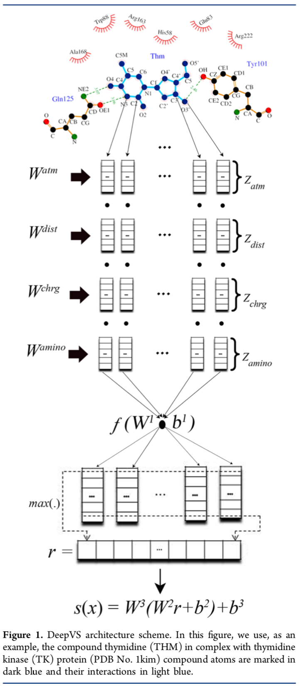

> ***Figure 1.* DeepVS architecture scheme**。 在这个图中，我们使用了一个例子，复合胸苷**the compound thymidine(THM)**与胸苷激酶**thymidine kinase(TK)**蛋白(PDB No. 1kim)的化合物原子被标记为深蓝色，它们之间的相互作用被标记为浅蓝色。

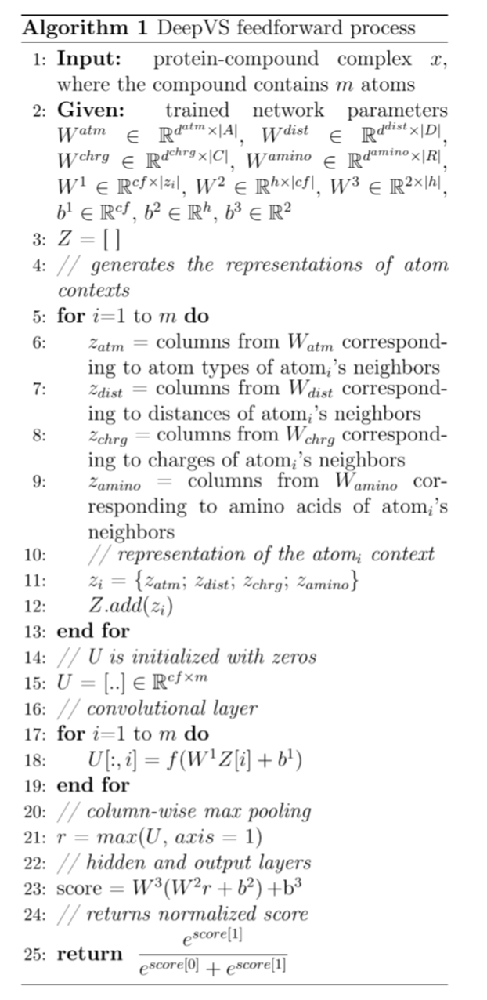

- **Atom Context.** 首先，需要对蛋白质复合物进行一些基本的处理，以提取 DeepVS 的输入数据。 输入层使用来自化合物中每个原子上下文的信息**information from the context of each atom in the compound**。 一个原子 $a$ 的上下文被定义为从它的邻域中提取的一组基本特征**a set of basic features extracted from its neighborhood**。 该邻域由化合物中最接近 $a$ 的的 $k_{\mathrm{c}}$ 个原子(包括它自己)和蛋白质中最接近 $a$ 的的 $k_{\mathrm{p}}$ 个原子组成，其中 $k_{\mathrm{c}}$ 和 $k_{\mathrm{p}}$ 是用户必须定义的超参数。 在以前的基于结构的药物设计工作中，已经成功地探索了利用来自复合体和蛋白质最近邻原子的信息的想法。

  从一个原子的上下文中提取的基本特征包括原子类型**atom types**、原子部分电荷**atomic partial charges,**、氨基酸类型**amino acid types**以及与参考原子到它邻居之间的距离**the distances from neighbors to the reference atom**。 例如(图2) ，对 THM 化合物中的氮原子(N3)来说，化合物中的 N3、 H 和 C 以 $k_{c}=3$和 $k_{\mathrm{p}}=2$相邻，TK 蛋白(PDB No. 1kim)中残基 $Gln_{125}$中的两个原子 OE 和 CD 相邻。 在这种特殊情况下，原子 N3 的上下文对每个基本特征包含了下列值:

  - Atom type=[N;H;C;OE;CD]
  - Charge = [-0.24; 0.16; 0.31; −0.61; 0.69]
  - Distance = [0.00; 1.00; 1.34; 3.06; 3.90]
  - Amino acid type = [Gln; Gln] （这俩有啥区别嘛？？）

  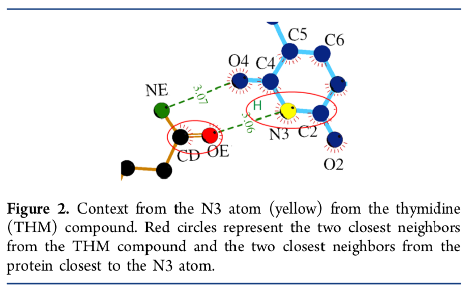

  > **Figure 2.** 胸苷(THM)化合物的 N3原子(黄色)的上下文**context**。 红圈代表 THM 化合物最近的两个邻居和最靠近 N3原子的蛋白质最近的两个邻居。

- **Representation of the Atom Context.** DeepVS 中的第一个隐藏层通过查找表操作**by a lookup table operation**，将原子上下文的每个基本特征值转换为实值向量(也称为嵌入***embeddings***)。 这些嵌入**embeddings**包含网络自动学习到的特性。 对于每种类型的基本特征，都有一个相应的嵌入矩阵**a corresponding embedding matrix** $W$，它为该基本特征的每个可能值存储一个列向量。 矩阵 $W^{\mathrm{atm}}, W^{\mathrm{dist}}, W^{\mathrm{chrg}}$ 和 $W^{\text {amino }}$分别包含原子类型、距离、原子部分电荷和氨基酸类型的基本特征的嵌入。 这些矩阵构成了第一隐藏层的权重矩阵，并在训练网络之前用随机数初始化。

  $W^{\mathrm{atm}} \in \mathbb{R}^{d^{\mathrm{atm}} \times|A|}$ 中的每一列对应一个特定类型原子的特征向量，其中 $\mathbf{A}$ 是原子类型的集合，$d^{\text {atm }}$ 是嵌入的维数**the dimensionality of the embedding** ，并构成用户定义的超参数。 给定一个原子 $\boldsymbol{a}$ 的上下文，网络将基本特征原子类型的每个值转换为其各自的特征向量，然后将这些向量连接起来，生成向量原子类型的表示$\mathcal{z}_{\mathrm{atm}}$。 如图3所示，检索从 $W^{\mathrm{atm}}$ 嵌入一个原子类型包含一个简单的查找表操作**consists of a simple lookup table operation** 。 因此，$W^{\mathrm{atm}}$ 中的原子类型嵌入(列)**atom-type embeddings (columns)** 的顺序是任意的，对结果没有影响。 然而，连接原子类型的嵌入以形成 $\mathcal{z}_{\mathrm{atm}}$ 的顺序确实很重要。 我们总是先连接配体原子类型的嵌入**concatenate first the embeddings from atom types of the ligand** ，从最近的到最远的，然后连接蛋白质原子类型的嵌入**concatenate the embeddings from atom types of the protein** ，从最近的到最远的。

  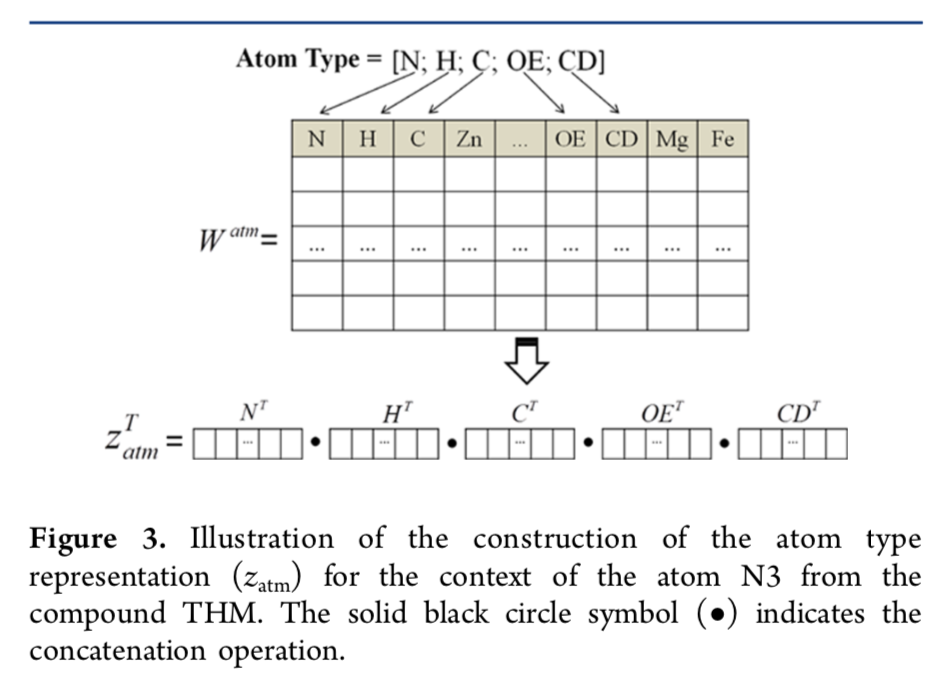

  > ***Figure 3.***  从化合物 THM 构造原子 N3上下文的原子类型表示$\left(z_{\mathrm{atm}}\right)$的示例。 实心黑色圆圈符号(•)表示串联操作**concatenation operation**。

类似地，$\mathcal{z}_{\text {dist }} \quad \mathcal{z}_{\text {chrg }},$ and $\mathcal{z}_{\text {amino }}$ 向量是根据目标原子的上下文中的距离、电荷和氨基酸类型的值创建的。 在用作网络输入之前，基本特征、电荷和距离的值必须离散化。 我们分别定义了最小值和最大值 $\mathcal{c}_{\min }$和 $c_{\max }$，以便对电荷值进行离散化**the discretization of charge values** 。 **bins**在最大值和最小值之间以0.05的相等距离被建立。 例如，对于 $\mathcal{c}_{\min } = -1$和 $c_{\max } = 1$，将有40个**bins**。 同样，为了离散化距离值，将在 $d_{\operatorname{tmin}}$ and $d_{\operatorname{tmax}}$ 之间的范围内定义以0.3 $\AA$均匀分布的**bins**。 例如，使用 $d_{\operatorname{tmin}} = 0$ and $d_{\operatorname{tmax}} = $ 5.1，将有18个**bins**。

最后，原子 $a$ 上下文的表示定义为 $z_{a}=\left\{z_{\mathrm{atm}} ; z_{\mathrm{dist}} ; z_{\mathrm{chrg}} ; z_{\mathrm{amino}}\right\}$，包括前面描述的向量的连接。 我们的假设是，从基本的语境特征中**from the basic contextual features**，网络可以学习到更多的抽象特征(嵌入) **abstract features(the embeddings)**，这些特征可以提供关于化合物**compound**和受体**decoys**的区分信息。 这种策略将基本特征(词)**basic features(words)**转化为更抽象的特征(词嵌入)**(word embeddings)** ，在自然语言处理(NLP)领域取得了巨大的成功。

- **Representation of the Protein-Compound Complex.** DeepVS 中的第二隐藏层是一个卷积层，它负责
- (1)从化合物中所有原子上下文的表示中提取更多的抽象特征，**extracting more abstract features from the representations of all atom contexts in the compound,** 
  - (2)将这些信息汇总到一个固定长度的向量 $r$ 中。 我们把这个矢量 $r$ 称为复合蛋白复合体的表示**representation of the compound-protein complex** ，它是卷积层的输出。

使用卷积层的下一个目标是它能够处理不同大小的输入**address inputs of variable sizes** 。在虚拟筛选**virtual screening** 的情况下，不同的化合物可以有不同数量的原子。 因此，对于不同的配合物，原子上下文的表示数目**the number of representations of atom contexts** 可能有所不同。 在 DeepVS 中，卷积层允许处理不同大小的复合物。

给定一个由 $m$ 个原子组成的复合物 $x$，卷积层的输入是向量列表$\left\{z_{1}, z_{2}, \dots, z_{m}\right\}$，其中$\mathcal{z}_{i}$表示化合物中第 $i$ 个原子的上下文。 在卷积层的第一阶段，从每个矢量$\mathcal{z}_{i}$生成更多的抽象特征
$$
u_{i}=f\left(W^{1} z_{i}+b^{1}\right)
$$

其中$W^{1} \in \mathbb{R}^{\mathrm{cf} \times\left|z_{i}\right|}$是这个卷积层的权重矩阵，${b}^{1}$是一个**bias term**，$f$ 是一个双曲正切函数**hyperbolic tangent function**，$u_{i} \in \mathbb{R}^{\mathrm{cf}}$是结果特征向量。卷积层(cf)中的单元数**units**(也称为过滤器**filters**)是由用户定义的一个超参数。

卷积层的第二阶段，也称为池化层**pooling layer**，它总结了各种原子上下文的特性**summarizes the features from the various atom contexts** 。 输入是由一组向量$\left\{u_{1}, u_{2}, \dots, u_{m}\right\}$组成的。 对于 DeepVS，我们使用一个最大池化层，它产生一个向量 $r \in \mathbb{R}^{\mathrm{cf}}$，其中第 j 个元素的值定义为输入向量集合中 jth 元素的最大值，即
$$
[r]_{j}=\max _{1 \leq i \leq m}\left[u_{i}\right]_{j}
$$
这个阶段的结果向量 $r$ 是复合蛋白复合物的表示**the representation of the compound-protein complex** 。 通过这种方式，网络可以学习生成一个矢量表示法，该矢量表示法总结了来自复合物的信息，这些信息与配体和受体**ligands and decoys** 之间的区别相关。

- **Scoring of Compound-Protein Complex.** 向量 $r$ 由两个常用的神经网络层处理: 第三个隐藏层提取另一个层次的表示**extracts one more level of representation** ，输出层为复合物的两种可能分类中的每一种计算得分: (0)非活性化合物和(1)活性化合物。 在形式上，给定为复合物 $x$ 生成的表示 $r$，第三个隐藏层和输出层执行以下操作:

$$
s(x)=W^{3}\left(W^{2} r+b^{2}\right)+b^{3}
$$

其中$W^{2}$是第三隐藏层$\left(W^{2} \in \mathbf{R}^{h \times | \mathrm{cf}|}\right)$的权重矩阵，$W^{2} \in \mathbf{R}^{2 \times|h|}$是输出层的权重矩阵，$b^{2} \in \mathrm{R}^{h}$ and $b^{3} \in \mathrm{R}^{2}$是**bias terms**。隐藏层中的单元数**the number of units**，$h$，是用户定义的超参数。$s(x) \in \mathbb{R}^{2}$是包含给两类得分的向量。

设 $s(x)_{0}$ and $s(x)_{1}$分别为class 0和class 1的得分。 我们使用 ***softmax*** 函数将这些分数转换为概率分布，如下所示:
$$
\begin{aligned} p(0 | x) &=\frac{\mathrm{e}^{s(x)_{0}}}{\mathrm{e}^{s(x)_{0}}+\mathrm{e}^{s(x)_{1}}} \\ p(1 | x) &=\frac{\mathrm{e}^{s(x)_{1}}}{\mathrm{e}^{s(x)_{0}}+\mathrm{e}^{s(x)_{1}}} \end{aligned}
$$
我们把$p(0 | x)$ 和 $p(1 | x)$分别解释为化合物的条件概率，分别是给定从分子对接中获得的复合蛋白数据**given the compound-protein complex data acquired from docking 的** 受体或配体**a decoy or a ligand** 的条件概率。

1类(活性配体)**class 1 (active ligand)** 的可能性**likelihood**是在虚拟筛选论文中用来对配体进行排序**rank ligands** 的评分。 得分越大，化合物成为活性配体的几率就越大。

- **Training DeepVS.** 训练神经网络的常用方法是随机梯度下降神经网络算法。在我们的例子中，SGD 被用来使包含配体和受体复合体的训练集 $D$ 上的损失函数最小化。 在每次迭代中，随机选择一个新的**complex** $(x, y) \in D$，其中如果配合物含有活性配体，则 $y=1$，否则 $y=0$。 接下来，使用参数集为的$\theta=\left\{W^{\mathrm{atm}}, W^{\mathrm{chrg}}, W^{\mathrm{dist}}, W^{\mathrm{amino}}, W^{1}, b^{1}, W^{2}, b^{2}, W^{3}, b^{3}\right\}$ DeepVS 网络来估计概率$p(y | x, \theta)$。 最后，将预测误差**prediction error**计算为负对数似然，$- \log p(y | x, \theta)$ ，并应用反向传播算法**backpropagation algorithm** 对网络参数进行更新。换句话说，网络参数的学习是通过使用 SGD 选择一组值$\theta$ 来最小化损失函数来完成的:
  $$
  \theta \longmapsto \sum_{(x, y) \in D}-\log p(y | x, \theta)
  $$

在我们的实验中，我们使用了 **SGD with minibatches**，这意味着我们不是在每次迭代中**at each iteration** 只考虑一个复合蛋白复合体**one compound-protein complex**，而是考虑一小组随机选择的 $m_{\mathrm{s}}$ 个复合体，并利用平均预测损失**average prediction loss** 进行反向传播。 我们的问题中设置$m_{\mathrm{s}} = 20$。 此外，我们使用 Theano来实现 DeepVS 并执行本文中汇报的所有实验。

- **Experimental Setup.** 

  - *Dataset.* 我们使用实用诱饵目录(DUD)作为基准来评估我们的基于深度学习的虚拟筛选学习方法。 使用这个数据集的一个主要原因是可以将我们的结果与之前提出的系统的结果进行比较，这些系统的目的是为了重新确认评分功能，并在虚拟筛选中重新分类**One of the main reasons for using this dataset was the possibility of comparing our results with those from systems previously proposed for revalidation of scoring functions and reclassification in virtual screening.** 。 在 DUD 的原始形式的部分电荷中有一个问题，使得区分配体和假配体变得微不足道。 因此，我们使用阿姆斯特朗等人提出的 DUD 版本，其中包含经过校正的原子部分电荷。

    DUD 数据集是专门开发来验证 VS 方法的严格方式。 数据集由分布在六个不同生物组的40个受体组成: 荷尔蒙核受体、激酶、丝氨酸蛋白酶、金属酶、黄素酶和其他类别的酶。 这36个假配体中的每一个都是从锌数据库中提取出来的，以模拟相关配体的某些物理性质，如分子量、 cLogP 和氢键基团的数目，尽管它们的拓扑结构不同

  - *Docking Programs.* 在这项工作中，我们使用了两个不同的计算机程序来执行分子对接: Dock 6.636和 Autodock Vina1.1.2.37都是开放存取，在学术界广泛使用来执行 vs. Dock 6.6提供了基于力场和评分函数(GRID 得分和 AMBER 得分)的基于物理的能量得分函数。 Autodock Vina1.1.2应用了一个混合评分函数，它结合了基于知识和经验的评分函数(Vina 得分)的特点

  - *Dock 6.6 Setup.* 利用计算工具从嵌合体中制备了蛋白质和化合物结构，利用 Dock 6.6中的 DockPrep 模块制备了38个受体。 配体、非结构离子、溶剂分子和辅因子被去除。 加入缺失原子，施加加斯泰格原子部分电荷。 输入文件除了用于计算分子表面的受体外，其余均为 mol2格式，其中 H 原子被去除，最后以 PDB 格式保存。38个半径在13.5-15.5之间的球体，根据受体活动位点的大小而不同。 盒子和栅格参数**Box and grid parameters** 直接取自 DUD。 对接过程是根据 Chimera 程序提供的可用脚本执行的。

  - *Autodock Vina1.1.2 Setup.* 按照默认方案制备了受体和化合物，并施加了 Gasteiger 原子部分电荷。定义了边缘尺寸为27$\AA$的立方网格。 网格盒的中心与配体的质量中心重合。 对接运行是按照 AutoDockTools 中定义的默认设置执行的。我们修改的唯一超参数是全局搜索穷尽性，我们将其设置为16，如 Arciniega 和 Lange 的工作所描述。请注意，尽管 Autodock Vina1.1.2可以输出多个姿势**poses**，在我们的实验中，我们只考虑一个姿势，对应于 Autodock Vina1.1.2输出的姿势。

  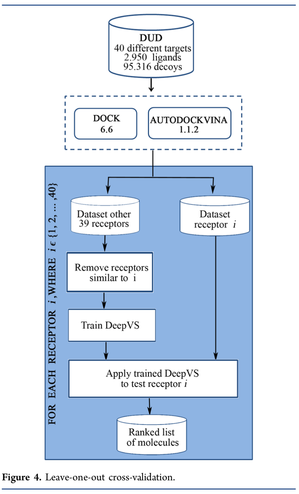

  - *Evaluation Approach.* 该方法的性能是通过使用 DUD 数据集中的40个蛋白质的省略一项的交叉验证**leave-one-out cross-validation** 来评估的。 图4说明了我们进行省略一项的交叉验证**leave-one-out cross-validation** 实验的过程。 首先，我们应用 DOCK6.6或 Autodock Vina1.1.2为每个蛋白质及其各自的配体和诱饵产生的停靠蛋白复合物。 接下来，在每次运行中，一个受体被排除在测试集之外，而其他受体被用作训练集。

    为了避免 DeepVS 性能结果的扭曲，必须从训练集中删除所有类似于在特定交叉验证迭代中用于测试的受体**it was essential to remove all receptors similar to that used as a test in a specific cross-validation iteration from the training set.** 。 继 Arciniega 和 Lange 之后，我们将那些同属一个生物类别或者那些报告阳性交叉富集的受体视为相似受体。 这样的评分被用来对固定化合物进行排名。 排名是通过表明算法性能的度量来验证的。

  - *DeepVS Hyperparameters.* 使用省略一个交叉验证**leave-one-out cross-validation** 的主要优点是可以调整神经网络的超参数，而不用担心过拟合。 事实上，当数据集很小的时候，省略一个交叉验证**leave-one-out cross-validation** 是一个合适的方法来调整机器学习算法的超参数。在我们的实验中，我们在40次省略一个交叉验证**leave-one-out cross-validation** 的迭代中使用了相同的超参数集。 这相当于使用相同配置的 DeepVS 用不同的训练 / 测试集执行40个不同的实验。 提供我们最佳结果的超参数值以及我们在 Autodock Vina1.1.2和 Dock 6.6的实验中使用的超参数值见表1。 注意，我们的评估方法比 Arciniega 和 Lange 使用的评估方法更严格，因为他们在每个 leave-one-out 迭代中使用一个 hold-out 集来调优超参数。

    在下一节中，我们将给出一些实验结果，详细说明当我们改变 DeepVS 的一些主要超参数时，性能上的差异。

  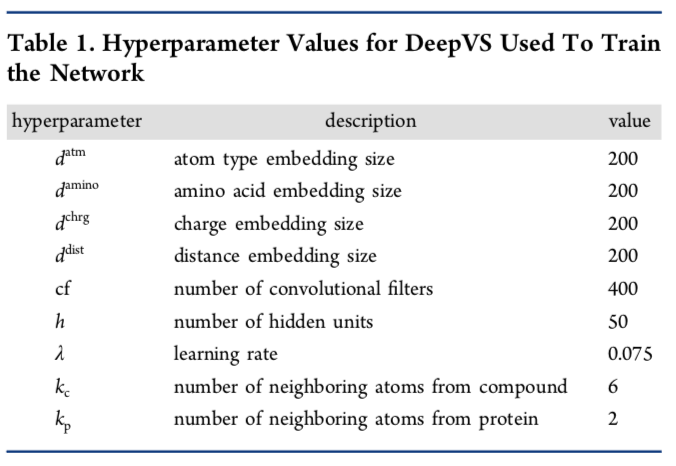

- **Evaluation Metrics.** 为了验证 DeepVS 的性能，并将其与以前发表在文献中的其他方法进行比较，我们使用了两个公认的 VS 性能指标: 浓缩因子(EF)**the enrichment factor (EF)**  和 ROC曲线(ROC)曲线下的面积**the area under the Receiver Operating Characteristic (ROC) curve** 。

  ROC 曲线是一种表示选择性**the selectivity (Se)**和特异性**specificity (Sp)**在连续值范围内(eqs 7和8)之间关系的方法。 它代表了假阳性函数中真阳性的比率**the ratio of true positives in function of the false positives** 。

$$
\mathrm{Se}=\frac{\text { true positives }}{\text { total actives }}
$$

$$
S p=\frac{\text { true negatives }}{\text { total decoys }}
$$

ROC 曲线下的面积(AUC)表示曲线的量化，便于结果的比较。 在 eq 9中给出了 AUC 的计算方法，其中 $N_{\text {actives }}$  描述了活性点的数量**the number of actives** ，$N_{\text {decoys }}$ 表示诱饵的数量**the number of decoys** ，$N_{\text {decoys_seen }}^{i}$表示比第 i 个活性结构排名更高的**decoys**数量。 表$\leq 0.50$的AUC值 表明是一次随机选择**a random selection** ，而 AUC  值为1.0表明可以完全识别活性化合物。
$$
\mathrm{AUC}=1-\frac{1}{N_{\mathrm{actives}}} \sum_{i}^{N_{\mathrm{actives}}} \frac{N_{\mathrm{decoys}{ \text {_seen }}}^{i}}{N_{\mathrm{decoys}}}
$$
鉴于这组化合物是按得分排列的，在 $x \%$ (eq 10)处的富集因子**the enrichment factor (EF)**是一个指标，它表明，与从整组化合物中随机选取的一组相同大小的化合物相比**compared to a set of an equal size selected at random from the entire set of compounds** ，由排名最高的 x% 的化合物所形成的集合有多好**how good the set formed by the top x% ranked compounds is** 
$$
\mathrm{EF}_{x \%}=\frac{\text { actives at } x \%}{\text { compounds at } x \%} \times \frac{\text { total compounds }}{\text { total actives }}
$$

# 3. Results and Discussion

## 3.1. DeepVS vs Docking Programs.

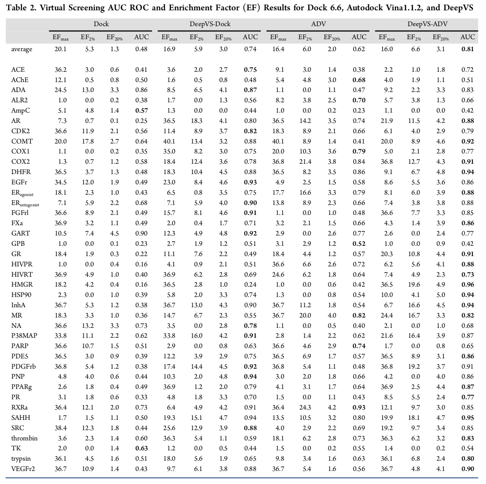

在表2中，我们报告了 DUD 中40个受体中的每一个，Dock 6.6、 Autodock Vina1.1.2(以下参考 ADV)、 DeepVS 使用 Dock  6.6输出(DeepVS-Dock)和 DeepVS 使用 AVD 输出(DeepVS-ADV)的虚拟筛选性能。 对于每个系统，我们报告 AUC ROC 和富集因子分别为2% 和20% 。 我们还报告了最大富集因子(EFmax) ，这是一个给定的化合物排序列表可以达到的最大 EF 值。  在四种系统中，DeepVS-ADV 对 AUC、 EF2% 和 EF20% 的平均效果最好。 Deepvs-adv 对40个 DUD  受体中的20个有最好的 AUC。

总体而言，对接输出的质量将影响 DeepVS 的性能，这是可以预期的。 与基于 DOCK6.6(平均 AUC 为0.48)的 DeepVS-ADV  相比，具有较好的对接输入(平均 AUC 为0.62)的 DeepVS-ADV 平均性能产生较好的 AUC、 EF2% 、 EF20% 和  EFmax 值。 另一方面，在有些情况下，对接程序的 AUC 非常差，但 DeepVS 能够显著提高 AUC 的结果。 例如，尽管  DOCK6.6为受体 AR、 COX1、 HSP90、 InhA、 PDE5、 PDGFrb 和 PR 产生0.40的  AUC，DeepVS-Dock 为这些受体产生0.70的 AUC。

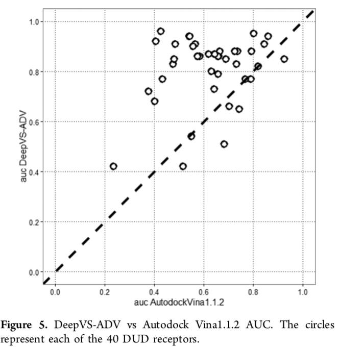

在图5中，我们比较了 DeepVS-ADV 和 ADV 对40个受体的 AUC。 Deepvs-ADV 对33个受体的 AUC 为0.70，而对 ADV 的 AUC 为13，对 DeepVS-ADV 的 AUC 为2，对 ADV 的 AUC 为9，对31个受体的 AUC 高于 ADV。 Deevs-ADV  (0.81)比 ADV (0.62)的 AUC 平均提高31% 。 此外，根据排序结果选择20% 的数据时，DeepVS-ADV (3.1)的  EF 值平均比 ADV (2.0)的 EF 值大55% 。

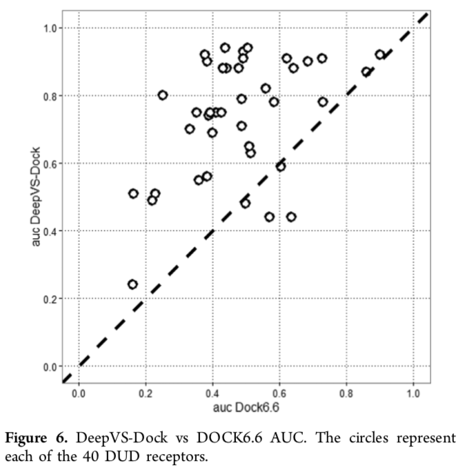

图6比较了 DeepVS-Dock 和 Dock 6.6对40个受体的 AUC。 与 Dock 6.6(0.48)相比，DeepVS-Dock 的 AUC (0.74)平均提高了54% 。 Dock 6.6仅有10% (4)受体的 AUC 达到0.70，deepvs-Dock 有68%  (27)受体的 AUC 达到0.70。 Auc 为0.50的受体数在 DeepVS-Dock 为5，在 Dock 6.6为23。  对于36种受体，DeepVS-Dock 的 AUC 高于 Dock 6.6。 最后，根据排序结果选择20% 的数据，depvs-Dock  (3.0)的 EF 值平均比 Dock 6.6(1.3)的 EF 值大2倍以上。

本节介绍的实验结果，包括来自两个不同对接程序的输出，有力地证明了 DeepVS 可以成为改进基于对接的虚拟筛选的有效方法。

## 3.2. DeepVS Sensitivity to Hyperparameters

在本节中，我们给出了关于 DeepVS 对主要超参数敏感性的实验结果。 在实验中，我们使用 ADV 输出作为 DeepVS 的输入。 因此，本节中报告的所有结果都是使用 DeepVS-ADV 生成的。 但是，我们注意到，当使用 Dock 6.6的输入时，DeepVS 的行为与此类似。  在实验中，我们改变了其中一个超参数，并将其他超参数固定为以下值: $d^{a t m / a m i n o / chrg / dist}=200, \mathrm{cf}=400, \lambda=0.075, k_{\mathrm{c}}=6,$ and $k_{\mathrm{p}}=2$。

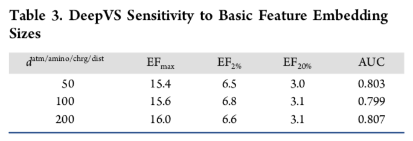

在表3中，我们给出了不同基本特征嵌入大小的实验结果。 我们可以看到嵌入大小为50主要提高了 EF。 嵌入大小为200并不能改善结果。

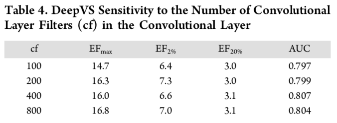

表4给出了改变卷积层滤波器数目的实验结果。 注意，AUC 通过将卷积滤波器的数量增加到400个来改进。 另一方面，使用 cf 200可以得到最佳的 EF2% 值。

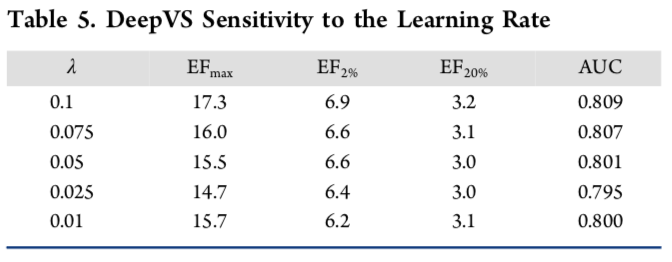

在表5中，我们给出了不同学习率训练的 DeepVS 的实验结果。 我们可以看到，对 DUD 数据集来说，更大的学习速度效果更好。 就 AUC 和 EF 而言，0.1的学习率取得了最好的结果。

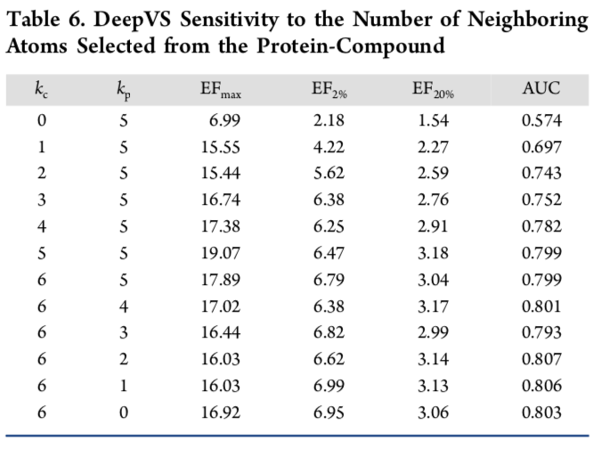

我们还研究了使用不同数量的化合物(kc)和受体(kp)相邻原子的影响。 在表6中，我们提供了一些实验结果，其中我们同时改变了 kc 和 kp。 例如，对于 kc 0和 kp  5，这意味着不使用来自化合物的信息，而使用来自受体最近的五个原子的信息。 在表的前半部分，我们将 kp 固定在5的值上，并且改变 kc。  在表的后半部分，我们将 kc 固定在6，并改变 kp。 在表6的前半部分，我们注意到，通过增加化合物中相邻原子的数量(kc) ，我们显著地增加了 EF 和 AUC。 在表的后半部分，我们注意到使用 kp 值2会降低 DeepVS-ADV 的性能。  正如我们在下一节中推测的那样，这种行为似乎与停靠程序输出的质量有关。

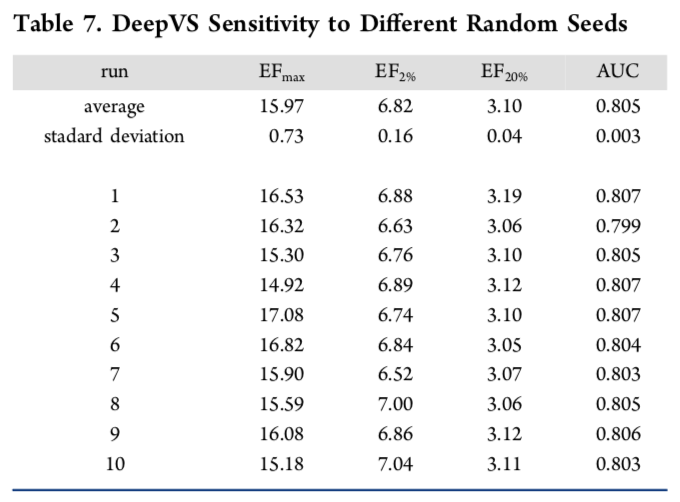

为了评估 DeepVS 的鲁棒性，对于权重矩阵(网络参数)的初始化，我们在每次运行中使用不同的随机种子对 DeepVS 进行了10次不同的运行。  在表7中，我们展示了这10次运行的实验结果。 这个表格显示了标准差对于 EF 和 AUC 都很小，这证明了 DeepVS  对于不同的随机种子的鲁棒性。

## 3.3. Docking Quality Versus DeepVS Performance 

在表6中报告的实验结果中，我们注意到，在创建原子上下文时，使用 kp 值 >2(来自蛋白质的相邻原子数)并不会导致 AUC 或 EF 值的改进。 事实上，如果我们只使用来自化合物(kp=0)的信息，这相当于执行基于配体的虚拟筛选，AUC 已经非常好(0.803)。 我们假设这种行为与分子对接输出的质量有关，40个 DUD  蛋白质的质量差异很大。 在试图检验这一假设时，我们分别分析了对 ADV 的 AUC 较好或较差的 DUD 蛋白的 DeepVS 的 AUC  (表8)。

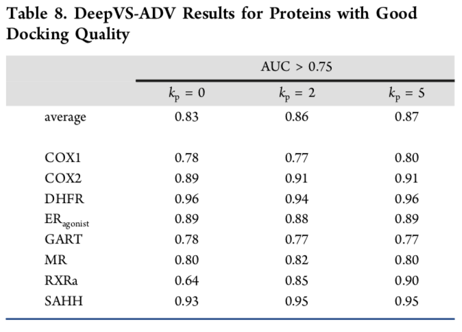

在表8中，我们给出了 ADV 的 AUC 大于0.75的蛋白质 DeepVS-ADV 的 AUC。 我们给出了 kp 的三个不同值，即 $k_{\mathrm{p}}=0,2,$ and 5的结果，在三个实验中，我们使用 $k_{c}=6$。 我们发现，对于具有良好对接质量的蛋白质(可能是具有良好结构信息的蛋白质复合体)  ，deepvs adv 的平均 AUC 随着对接质量的提高而增大。 这一结果表明，如果结构信息良好，神经网络可以从中受益。

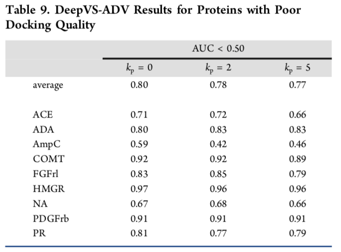

在表9中，我们给出了 ADV 的 AUC 值为0.5的蛋白质 DeepVS-ADV 的 AUC。 对于分子对接质量较差的蛋白质(可能是蛋白质复合物的结构信息较差)  ，deepvs adv 的平均 AUC 随着分子对接质量的提高而降低。  这一结果表明，如果结构信息较差，神经网络在不使用结构信息的情况下工作得更好。

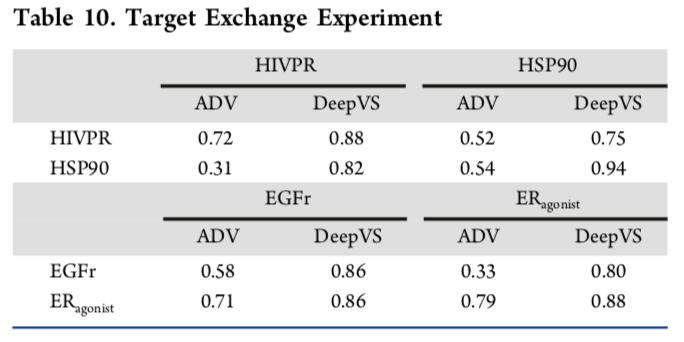

在表10中，我们提出了一个实验的结果，我们交换的目标蛋白为一组给定的配体和诱饵。 我们用两对蛋白质进行这个实验，每对蛋白质中的每个蛋白质来自不同的类别。 本实验的主要目的也是为了说明 DeepVS  利用了蛋白质化合物的结构信息。 如表10所示，当使用不同靶点的配体和诱饵时，Autodock Vina (ADV)和 DeepVS 的 AUC  值都显著降低。

## 3.4. Comparison with State-of-the-Art Systems 

在本节中，我们将 DeepVS 的结果与之前报道的同样使用 DUD 的结果进行比较。 首先，我们对 DeepVS  和对接数据特征分析系统进行了详细的比较，该系统也应用神经网络对对接程序的输出进行虚拟筛选分析。 接下来，我们将 DeepVS 的平均 AUC  与报告40个 DUD 受体结果的其他系统之一进行比较。

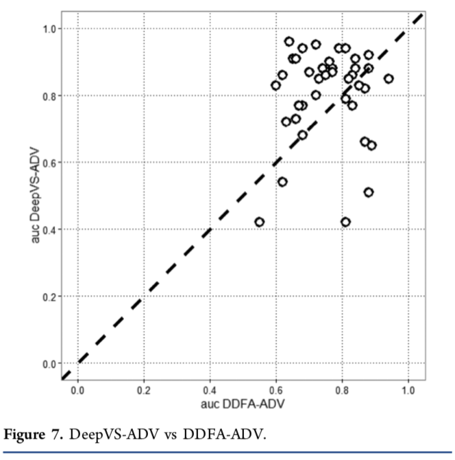

Ddfa 使用一组由人类定义的特性，这些特性来自于对接输出数据。 在 DDFA  中使用的特征包括复合效率、化合物姿态的最佳对接得分以及停靠图书馆中5种最相似化合物的最佳对接得分的加权平均数。  这些特征作为一个浅层神经网络的输入，该神经网络将输入的蛋白质-化合物复合体分类为活性或非活性配体。 Ddfa  使用对接程序输出的六个最佳姿态的数据，而在 DeepVS 中，我们只使用最佳姿态的数据。 在图7中，我们比较了 DeepVS-ADV 和  DDFA-ADV 的 AUC，后者是使用 Autodock Vina 输出的 DDFA 版本。 在这个图中，每个圆圈代表40个 DUD  受体中的一个。 对于27个受体，DeepVS-ADV 比 ddfa-ADV 产生更高的 AUC，占数据集的67.5% 。

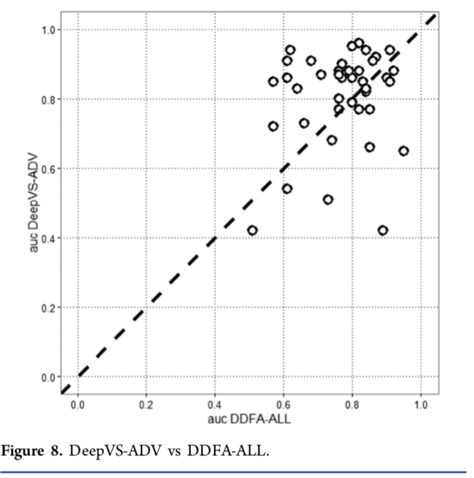

Ddfa-all 是 DDFA7的一个更健壮的版本，它同时使用三个不同的对接程序的输出: Autodock4.2(AD4)、 Autodock  Vina1.1.2(ADV)和 Rosetta Ligand 3.4(RL)。 因此，DDFA-ALL 使用的输入特性是 DDFA-ADV  的三倍。 在图8中，我们比较了 DeepVS-ADV 和 DDFA-ALL 的 AUC。 尽管只使用一个对接程序的数据，DeepVS-ADV  对25个受体产生比 DDFA-ALL 更高的 AUC，占数据集的62.5% 。 这强烈表明 DeepVS-ADV 对 DUD  数据集的结果是非常稳健的。

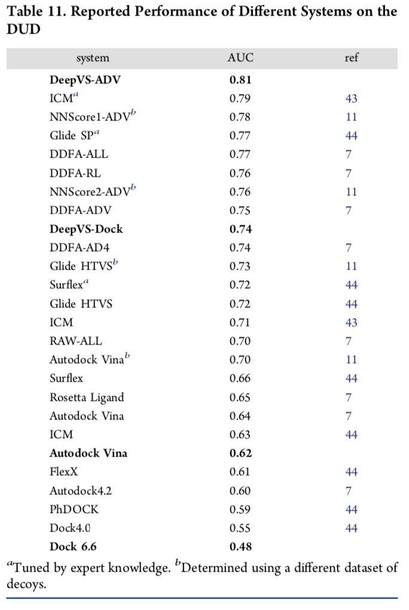

在表11中，我们比较了 DeepVS 的平均 AUC 以及与文献中报道的其他系统的对接程序。 Deepvs-adv 生产的 AUC  是所有系统中最好的，性能优于商业对接软件 ICM 和 Glide sp. 。 Nnscore1-adv 和 NNScore2-ADV  也是基于浅层神经网络的人工特征和 Autodock Vina 的输出。 值得注意的是，NNScore1-ADV 和  NNScore2-ADV11的结果基于一组不同的诱饵，这些诱饵比 DUD 中提供的诱饵更简单。 因此，这些结果与表中的其他结果不是100%  可比的。 据我们所知，DeepVS-ADV 的 AUC 是迄今为止报道的使用 DUD 的40个受体的 VS 的最佳值。

## 3.5. DeepVS for DUD-E Dataset 

我们使用 DUD-e 数据集中随机选取的8个蛋白质对 DeepVS-adv 进行训练，通过实验进一步评估 DeepVS 的稳健性。45 DUD-e 是  DUD-e 的增强版，包含102个靶点。 在 DUD-E 中，每个目标配体平均含有224个配体和50个诱导子。  为我们的实验选择的8种蛋白质中的每一种都属于不同的蛋白质类别。 此外，这8种蛋白质都不包含在 DUD 的40种蛋白质中。

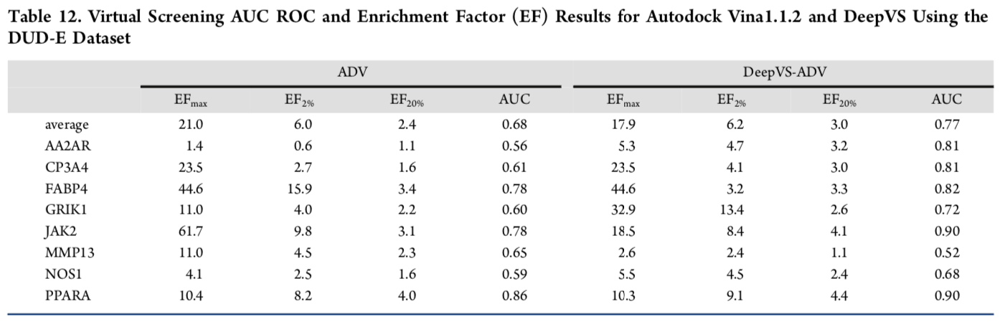

在表12中，我们总结了 DUD-E 蛋白的 DeepVS-ADV 的结果。 Deepvs-ADV 对8个蛋白中的7个进行了 ADV 的 AUC 改良，平均 AUC  提高了0.09。 与 Autodock Vina1.1.2相比，DeepVS-ADV 平均可产生较高的 EF2% 和 EF20% 。

# 4. Conclusions

在这项工作中，我们引入了 **DeepVS**，这是一种深度学习的方法来提高基于对接的虚拟筛选的性能。 在 Autodock Vina 的对接输出上使用 DeepVS，我们能够在 DUD 数据集上生成目前为止虚拟筛选报告的最佳曲线下面积(AUC)。 这个结果，再加上(1) DeepVS 不需要人工定义的特性，(2)它使用单个对接程序的输出取得了良好的效果，使 DeepVS 成为虚拟筛选的一个有吸引力的方法。 此外，与其他使用参数较少的浅层神经网络的方法不同，如果向训练集中添加更多的数据，DeepVS 具有更大的性能改进潜力。 深度学习系统通常用大量的数据进行训练。 尽管 DUD 中蛋白质复合物的数量**the number of protein-compound complexes** 相对较多(超过10万个) ，但不同蛋白质的数量**the number of different proteins** 仍然很少(只有40个)。

此外，这项工作也为蛋白质-化合物复杂原始数据的建模**how to model the protein-compound complex raw data** 提供了一些非常创新的思路，以便在深层神经网络中使用。 我们介绍了原子和氨基酸嵌入的思想 **the idea of atom and amino acid embeddings** ，它也可以用于生物信息学的其他深度学习应用。 此外，我们将化合物建模为一组原子上下文，然后通过卷积层进一步处理的想法被证明是一种学习蛋白质复合物表示的有效方法。**Moreover, our idea of modeling the compound as a set of atom contexts that is further processed by a convolution layer proved to be an effective approach to learning representations of protein-compound complexes.** 