# 0. Abstract

人体部位解析**human body part parsing**，或者说人体语义部分分割**human semantic part seg- mentation**，是许多计算机视觉任务的基础。 在传统的语义分割方法中，提供了地面真值分割**the ground truth segmentations**，并采用端到端的方式训练全卷积网络(FCN)。 虽然这些方法已经展示了令人印象深刻的结果，但是它们的性能在很大程度上取决于训练数据的数量和质量。 本文提出了一种利用易于获取的人体关键点注释**using easily-obtained human keypoint annotations**生成人体部位分割数据的新方法。 我们的关键想法是利用人类解剖学上的相似性 **the anatomical similarity among human**，将一个人的解析结果转移到另一个有着相似姿势的人身上**transfer the parsing results of a person to another person with similar pose**。 利用这些估计结果作为额外的训练数据，我们的半监督模型在 PASCAL-Person-Part 数据集[6]上的性能优于强监督模型 6 mIOU，并获得了最先进的人体分割结果。 我们的方法是通用的，并且可以很容易地扩展到其他对象 / 动物的解析任务，假设它们的解剖学相似性可以用关键点来标注的话。 我们提出的模型和随附的源代码将向公众开放。

# 1. Introduction

人体部位解析的任务是从人体图像中检索出人体部位的语义分割。 这种像素级的身体部分分割不仅对于理解活动至关重要，而且还可能促进各种视觉任务的进行，如机器人操纵**robotic manipulation**[11]、启示推理**affordances reasoning**[19]和识别人与物体之间的动作**recognizing human-object interactions**[14]。 近年来，深度学习已经成功地应用于人体部位语义分析问题[4,5,32]。

为了充分利用深度卷积神经网络的能力，大规模数据集是必不可少的[9]。 然而，身体部位的语义标注像素级是劳动密集型的。 对于人体部位解析任务，最大的数据集[6]包含的训练图像少于2000个标记图像，这比常用的图像分类、语义分割和关键点估计基准[9,25,12]中的训练数据量少了几个数量级。 少量的数据可能会导致过度拟合，并降低真实场景中的性能。

另一方面，大量的人工关键点注释**an abundance of human keypoints annotations**[1]是很容易获得的。 目前最先进的姿态估计算法[27]在自然场景中也表现良好。 人体关键点对人体结构信息进行编码，相信这种高层次的人体知识可以转化为人体部位解析的任务。

然而，尽管有关键点注释，很少有方法研究利用关键点作为人体部位解析的增强训练数据。 主要的问题是，人体关键点是一种稀疏表示**a sparse representation**，而人体部位解析需要大量带有密集像素注释的训练数据**an enormous amount of training data with dense pixel-wise annotations**。 因此，仅仅依赖关键点注释作为标签的端到端方法可能无法获得高性能。

在本文中，我们提出了一种新的方法来增加人体分割的训练样本。 由于身体结构的限制，共享相同的姿势的人将有一个相似的形态。 如**Fig. 1**所示，给定一个人，我们可以使用他 / 她的姿态标注**pose annotation**来搜索相应的具有相似姿态的解析结果**the corresponding parsing results with similar poses**。 然后对收集到的解析结果进行平均，并形成强大的局部级别的先验**form a strong part-level prior**。 通过这种方法，我们可以将稀疏关键点表示转化为稠密的身体局部的先验分割。 在强的局部级别的先验的基础上**With the strong part-level prior**，将其与输入图像结合起来，通过精化网络**refinement network**进行前向处理，得到精确的部分分割结果**an accurate part segmentation result**。 生成的部件分割**The generated part segmentation**可以作为额外的数据来训练人体解析网络**a human parsing network**。

我们在 PASCAL-Part 数据集上进行了详尽的实验[6]。 我们的半监督方法使用一个简单的基于 VGG-16[30]的网络实现了最先进的性能，超过了限定部分分割注释的基于与 ResNet-101[16]相当的性能。 当使用基于更深层次的 ResNet-101的模型时，我们提出的方法比最先进的结果优越3 mAP。

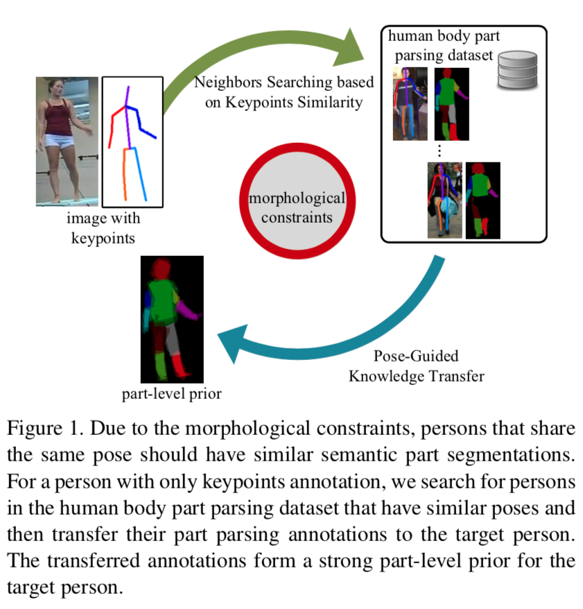

# 2. Related work

本文主要研究语义部位分割**semantic part segmentation**、关节姿态**joint pose**和身体部位估计**body part estimation**以及弱监督学习**weakly supervised learning**。

- 人体部位解析**Human body part parsing**。 在语义分割这一子任务中，全卷积网络(FCN)[26]及其变体[4,5,32]已经展示了很好的结果。 在文献[4]中，Chen 等人提出了空洞卷积**atrous convolution**来捕捉不同尺度下的物体特征**capture object features at different scales** ，他们进一步利用一个带有条件随机场**a Conditional Random Field (CRF)** 的卷积神经网络(CNN)来提高精度。 在文献[5]中，作者提出了一种注意力机制**an attention mechanism**，该机制根据上下文在不同尺度上对分词预测进行软整合。 为了解决尺度和位置变化的问题，夏等人[32]开发了一个模型，自适应地缩放输入图像到适当的尺度，以改善解析结果。

  人体分割的另一种方法是使用具有长短期记忆(LSTM)单元的循环网络[17]。 Lstm 网络可以将局部和全局的空间依赖性与特征学习结合起来。 在文献[23]中，Liang 等人提出了局部-全局 LSTM 网络**the local-global LSTM network**，在不同的距离上合并空间依赖 **incorporate spatial dependencies at different distances**，以改善特征的学习。 在[22]中，作者提出了一个图 LSTM 网络**a Graph LSTM network**，以充分利用图像的局部结构(如边界)。 它们的网络以任意形状的超像素点为输入**takes arbitrary-shaped superpixels as input**，将信息从一个超像素结点传播到所有邻近的超像素结点**propagates information from one superpixel node to all its neighboring superpixel nodes**。 为了进一步探索图像区域之间的多层次相关性，Liang 等人[21]提出了一种结构演化的 LSTM **a structure-evolving LSTM**，它可以在 LSTM 网络优化过程中学习图结构**learn graph structure**。 这些 LSTM 网络在人体部位解析方面达到了很有竞争力的性能。

- 利用姿态进行人体部位解析**Utilizing Pose for Human Parsing**。 最近的工作尝试利用人体姿态信息为人体部位解析提供高层次的结构**high-level structure**。 有前景的方法包括姿态引导的人体语义分割**pose-guided human parsing**[34]、联合姿态估计**joint pose estimation**和语义部位分割**semantic part segmentation**[10,20,33]以及自监督的结构敏感学习**self-supervised structure-sensitive learning**[15]。 这些方法主要是利用姿态信息对部位分割结果进行规范化处理**regularize part segmentation results**，它们是强监督的**lie in the area of strong supervision**。 我们的方法与他们的不同之处在于，我们的目标是基于姿态相似性将部位分割的注释转化为未标记的数据**transfer the part segmentation annotations to unlabeled data**，并生成额外的训练样本，强调半监督**semi-supervision**。

- 语义分割的弱监督**Weak Supervision for Semantic Segmentation**。在文献[29,7,28,8,24,2]中，提出了利用弱监督方法进行语义分割的思想。 特别是，Chen 等人[7]提出基于视觉子分类来学习分割先验**learn segmentation priors based on vi- sual subcategories**。 Dai 等人[8]利用容易获得的定位盒注释**bounding box annotations**来定位对象，并使用无监督的区域求解方法**using unsupervised region proposal methods**生成候选到分割掩码**generated candidate segmentation masks**。 由于定位盒标注不能很好地概括背景(如水、天空、草) ，Li 等人[24]进一步探讨了使用稀疏涂鸦**using the sparse scribbles**训练语义分割模型。 在[2]中，Bearman 等人利用每个物体的单点监督**using supervision from a single point of each object**训练了一个神经网络。 在一定的时间预算下，与其他弱监督方法相比，本文提出的监督方法可以得到更好的结果。

# 3. Our Method

## 3.1. Problem Definition

我们的目标是利用姿态信息对人体解析网络进行弱监督训练**weakly supervise the training**。 考虑一个语义部位分割问题，其中我们有一个数据集$\mathcal{D}_{s}=\left\{I_{i}, S_{i}, K_{i}\right\}_{i=1}^{N}$，其中有 $N$ 个标记的训练样本。 设$I_{i} \in \mathrm{R}^{h \times w \times 3}$表示一个输入图像，$S_{i} \in \mathrm{R}^{h \times w \times u}$ 表示其对应的部位分割标记**its corresponding part segmentation label**，$K_{i} \in \mathrm{R}^{v \times 2}$表示其关键点标注，$i$ 为训练样本索引。 每个例子包含最多 $u$ 个身体部位和 $v$ 个关键点。 在实践中，$N$ 通常很小，因为标记人的语义部分是非常劳动密集型的。

对于一个标准的语义部分分割问题，目标函数可以写成:
$$
\mathcal{E}(\Phi)=\sum_{i} \sum_{j} e\left[f_{p}^{j}\left(I_{i} ; \Phi\right), S_{i}(j)\right]
$$
其中 $j$ 为图像 $I_{i}$ 的像素索引，$S_{i}(j)$ 为像素 $j$ 处的语义标记，$f_{p}(\cdot)$为全卷积网络，$f_{p}^{j}\left(I_{i} ; \Phi\right)$为网络给定参数 $\Phi$ 产生的每个像素的标记**the per-pixel labeling**，$e[\cdot]$ 为每个像素的损失函数。

类似地，我们可以考虑另一个数据集$\mathcal{D}_{p}=\left\{I_{i}, K_{i}\right\}_{i=1}^{M}$ ，有 $M$ 个只有关键点注释的示例，其中$M \gg N$。 我们的目标是生成所有 $\mathcal{D}_{p}$ 中图像的部位分割，并利用这些作为额外的训练数据，通过最小化Eqn. 1中的目标函数来训练一个 FCN。

## 3.2. Overview

为了利用关键点注释，我们直接生成基于关键点注释的像素级部位分割**the pixel-wise part segmentations based on keypoints annotations**。 给定一个目标图像 $I_{t}$ 和关键点标注 $K_{t}$，其中$\left(I_{t}, K_{t}\right) \in \mathcal{D}_{p}$，我们首先在 $\mathcal{D}_{s}$ 中找到具有最相似关键点标注的**have the most similar keypoints annotations**图像子集(第3.3节)。 然后，对于聚类好的图像，我们应用姿态引导变形到它们的部位分割**pose-guided morphing to their part segmentations**，以使它们与目标姿态对齐**align them with the target pose**(第3.4节)。 对齐的身体部位分割被平均从而得到的局部级别的目标图像$I_{t}$的先验**the part-level prior for the target image**。 最后，利用一个精化网络**refinement network**估计图像$I_{t}$的身体部位分割(第3.5节)。 我们的精炼网络**refinement network**的训练方法将在第3.6节中详细介绍。 生成的部位分割**The generated part segmentations**可以作为额外的训练数据用于人体部位分割(第3.7节)。 图2给出了我们的方法的概述。

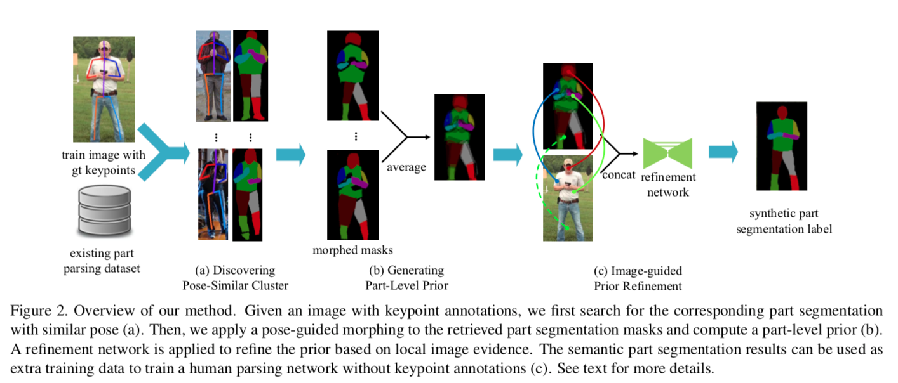

## 3.3. Discovering Pose-Similar Clusters

为了度量不同姿态之间的相似性，首先需要对所有的姿态进行规范化和对齐**normalize and align all the poses**。 我们通过将他们的躯干固定在相同的长度**by fixing their torsos to the same length**来使姿势大小规范化**normalize the pose size**。 然后，使用髋关节关键点**the hip keypoints**作为参考坐标**the reference coordinate**与原点对齐。 我们测量了 $K_{t}$ 和 $\mathcal{D}_{s}$ 中每个关键点注释之间的欧氏距离。 我们会选取$\mathcal{D}_{s}$中距离最小中的 $top-k$ 个人组成「姿势相似群组」**the pose-similar cluster** ，作为之后局部级别的先验生成步骤的基础。$k$ 大小的影响将在第4.3节进行评估。

直观地，给定一个只有关键点注释 $K_{t}$ 的图像 $I_{t}$，人们可以想到一个获得部分分割的先验**the part-parsing prior**的替代的解决方案，那就是这个人的部位分割结果仅仅映射到离最接近 $K_{t}$ 的姿势。 然而，由于人体之间的差异或可能的遮挡，一个具有不同边界的部位分割结果可能不适合另一个。 因此，我们并没有找到最相似的姿势，而是找到了几个姿势相似的人，通过平均他们变形的部分分割结果**averaging their morphed part segmentation results**，产生了局部级别的先验。 这样的平均局部水平先验可以看作是为每个身体的部分建立了一个概率映射**a probability map**。 它根据实际数据分布来表示每个像素是否属于人体部分的可能性。 在第4.3节中，我们发现使用平均先验比仅使用最近邻居的分割结果获得更好的性能。

## 3.4. Generating Part-Level Prior

我们所发现的姿态相似簇**pose-similar cluster**为产生部分级别的先验**the part-level prior**建立了坚实基础。 然而，对于每个族，都存在一些不可避免的族内的内部姿态变化**some inevitable intra-cluster pose variations**，这使得部位分割结果不一致**makes the part parsing results misaligned**。 因此，我们介绍了姿态引导变形的方法**the pose-guided morphing method**。

对于位置相似聚类中的 $n$ 个人，我们将他们的部位分割结果表示为 $\mathbb{S}=\left\{S_{1}, \dots, S_{n}\right\}$ ，关键点注释表示为 $\mathbb{K}=\left\{K_{1}, \ldots, K_{n}\right\}$，变形的部位分割结果**the morphed part parsing results**表示为 $\widetilde{\mathbb{S}}=\left\{\widetilde{S}_{1}, \ldots, \widetilde{S}_{n}\right\}$ 通过比较 $\mathbb{K}$ 中的姿势和目标姿势$K_{t}$，计算出变换参数**the transformation parameters** $\theta$，然后利用它们对 $\mathbb{S}$ 进行变换，得到变形的部位的分割结果$\widetilde{\mathbb{S}}$。这样，我们就可以通过仿射变换**the affine transformation**来改变这些部位的分割。这个程序可以表示为:
$$
\widetilde{\mathbb{S}}=\left\{T\left(S_{i} ; \theta_{i}\right) | 1 \leq i \leq n, S_{i} \in \mathbb{S}\right\}
$$
其中，
$$
\theta_{i}=g\left(K_{t}, K_{i}\right), K_{i} \in \mathbb{K}
$$
$T(\cdot)$是带参数 $\theta$ 的仿射变换，$g(\cdot)$ 根据姿态 $K_{i}$ 和目标姿态 $K_{t}$ 计算$\theta$。

对于部位分割的标注，我们将它们表示为几个二进制掩码的组合**the combination of several binary masks**。 每个编码代表相应身体部位的外观。 变形过程是在每个身体部位上独立进行。 以左上臂为例。 对于 姿势$K_{1}$的左上臂分割 $G_{1}=\vec{x}_{1}$和姿势 $K_{t}$ 的同样的分割 $G_{2}=\vec{x}_{2}$，我们有转换关系
$$
\left(\begin{array}{c}{\vec{x}_{1}} \\ {1}\end{array}\right)=\mathrm{Q}\left(\begin{array}{c}{\vec{x}_{2}} \\ {1}\end{array}\right)=\left[\begin{array}{cc}{A} & {\vec{b}} \\ {0} & {1}\end{array}\right]\left(\begin{array}{c}{\vec{x}_{2}} \\ {1}\end{array}\right)
$$
其中 $Q$ 是我们需要计算的仿射变换矩阵。 由于$\vec{x}_{1}$  和 $\vec{x}_{2}$都是已知的，因此可以很容易地计算出 $A$ and $\vec{b}$的结果，然后通过计算得到变形的部位分割编码**the morphed part segmentation mask**
$$
\left(\begin{array}{c}{x_{i}^{t}} \\ {y_{i}^{t}}\end{array}\right)=A\left(\begin{array}{l}{x_{i}^{s}} \\ {y_{i}^{s}}\end{array}\right)+\vec{b}
$$
其中，$\left\{x_{i}^{t}, y_{i}^{t}\right\}$ 和 $\left\{x_{i}^{s}, y_{i}^{s}\right\}$是转换前后的坐标。 **Fig. 3**说明了我们的姿态引导变形方法**pose-guided morphing method**。

在进行姿势引导变形后，对变换后的部位分割 $\widetilde{\mathbb{S}}$ 进行平均，得到**part-level prior**
$$
P_{t}=\frac{1}{n} \sum_{i=1}^{n} \widetilde{S}_{i}
$$
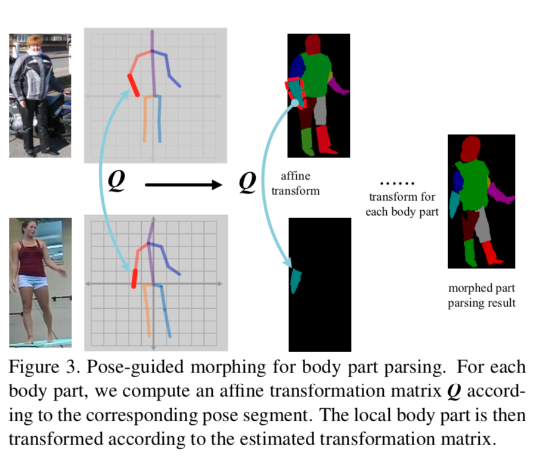

## 3.5. Prior Refinement

最后，通过精炼网络，将部分层次的先验信息与原来的图像一起前向传播**feed forward our part-level prior through a refinement network together with the original image**。

通过一个粗先验，我们的精炼网络的搜索空间将大大减少，从而可以取得优于直接从单一图像输入进行预测的结果。 利用cnn的鉴别能力，根据局部图像的证据，消除部位分割先验中部位边界的不确定性**eliminate the uncertainty at the body part boundary of the part parsing prior**，从而得到高质量的分析结果。 对于每一幅带有身体部位先验$P_{t}$的图像$I_{t}$，通过下式对图像的部位分割结果$\widehat{S}_{t}$进行估计
$$
\widehat{S}_{t}=f_{r}\left(I_{t}, P_{t} ; \Psi\right)
$$
其中 $f_r$ 是带参数$\Psi$的精炼网络。 在下一节中，我们将详细介绍$\Psi$的学习。 估计出的部位分割结果可以作为额外的训练数据用于训练 FCN。 半监督机制将在3.7节中进一步讨论。

## 3.6. Training of Refinement Network

前面的部分是在假设我们有一个训练好的的精炼网络**a well-trained refinement network**的基础上进行的。 在这一部分，我们将解释训练算法。 图4描绘了提出的训练流程的示意性概述**a schematic overview of the proposed training pipeline**。

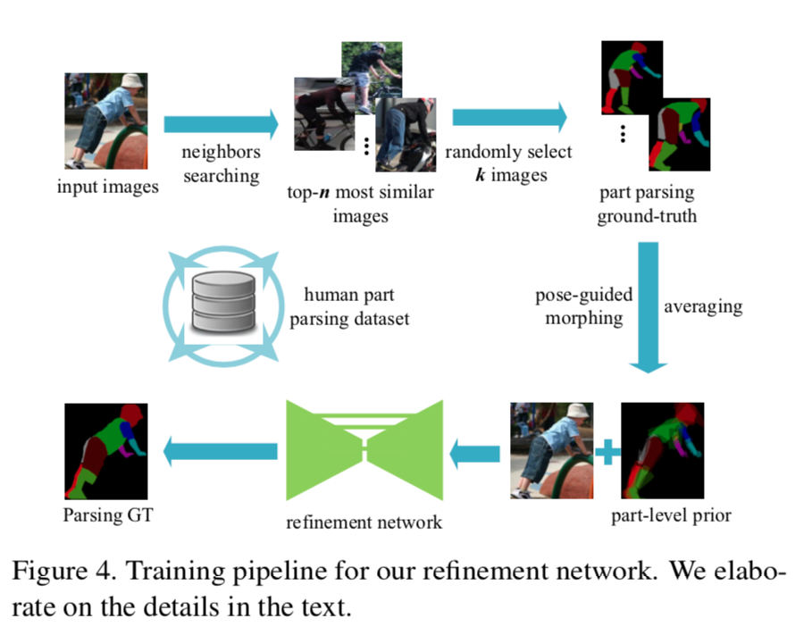

这种改进网络是文献[18]中提出的 **U-Net** 的一种变体，其形式是具有跳跃连接的自动编码器网络**an auto-encoder network with skip connections**。 对于这样的网络，输入将逐步下采样直到瓶颈层**the input will be progressively down-sampled until a bottleneck layer** ，然后逐步上采样恢复输入大小**then gradually up-sampled to restore the input size**。 为了保存局部图像证据T**o preserve the local image evidence**，假设网络总共有 n 个层，在每个层 $i$ 和层 $n-i$ 之间引入跳跃连接。 每个跳跃连接将第 $i$ 层的特征映射**feature map**与第 $n-i$ 层的特征映射**feature map**连接起来。 我们建议读者参阅[18]以了解详细的网络结构。 我们网络的输入是一个图像以及**a set of masks**。 每个**mask**都是一个范围从0到1的热力图**a heatmap ranging from 0 to 1**，它是代表特定身体部位的概率**map**。 此网络的输出也是一组具有相同表示形式的掩码**a set of masks that have the same representation**。 标签是一组二进制掩码**a set of binary masks**，它表示每个身体部位的表现**indicating the appearance of each body part**。 我们的目标函数是输出和标签之间的 L1距离。 输入和输出的大小都设置为$256 \times 256$。

为了训练精炼网络，我们利用具有语义部位分割标注和姿态标注**with both semantic part segmentation annotations and pose annotations**的 $\mathcal{D}_{s}$ 中的数据，。 给定一个图像$I_{m} \in \mathcal{D}_{s}$，利用类似于第3.4节中生成部位先验**part-level prior**的流程，我们首先生成给定 $I_{m}$ 的部位分割先验 $ P_{m}$。 唯一的区别是，在进行姿态相似聚类时，我们每次都会找到 $n$ 个最近的邻居，然后从中随机抽取 $k$ 个，生成**part-level prior**。 这可以看作是一种数据增强，提高了精炼网络的泛化能力。 $n$ 的影响将在第4.3节中讨论。 在形式上，我们利用每个图像$I_{m}$的**part-level prior** $P_m$ 和语义部位的分割真值**semantic part segmentation ground truth** $S_m$，通过最小化代价函数来训练精炼网络:
$$
\mathcal{E}(\Psi)=\sum_{j}\left\|S_{m}(j)-f_{r}^{j}\left(I_{m}, P_{m} ; \Psi\right)\right\|_{1}
$$

## 3.7. Semi-Supervised Training for Parsing Network

在前面的章节中，我们已经介绍了基于关键点注释**based on keypoints annotations**生成像素级部位分割标签**generate pixel-wise part segmentation labels**的方法。 现在，我们可以用半监督的方式对分割网络**parsing network**的部位分割**for part segmentation**进行训练**train the parsing network**。 对于我们的解析网络**parsing network**，由于其有效的性能和简单的结构，我们使用了文献[5]中提出的基于 VGG-16的模型。 在这个网络中，多尺度输入**multi-scale inputs**应用于基于共享 VGG-16的 DeepLab 模型[4]**a shared VGG-16 based DeepLab model**以进行预测。 采用软注意力机制**A soft attention mechanism**对 FCN 的输出进行尺度加权**weight the outputs of the FCN over scales**。 该网络的训练遵循优化逐像素回归问题**optimizing the per-pixel regression problem**的标准过程，该过程如**Eqn 1.**所示。对于损失函数，我们使用多项式逻辑损失**multinomial logistic loss**。 在训练期间，输入图像被调整大小和填充到$320 \times 320$。

我们通过最小化 Eqn. 1 中的目标函数来更新网络 $f_p$ 的参数$\Phi$，其中 $\mathcal{D}_s$ 中包含真值标签， $\mathcal{D}_p$  中包含生成的部位分割标签。

# 4. Experiments

在这一部分，我们首先介绍了相关的数据集和我们实验的实现细节。 然后，我们报告我们的结果，并与最先进的性能进行比较。 最后，我们进行了大量的实验来验证我们提出的半监督方法的有效性。

## 4.1. Datasets

- **Pascal-Person-Part Dataset** [6]是一个用于人类语义部位分割的数据集。 它包含1716张用于训练的图像和1817张用于测试的图像。 这个数据集包含了人体部位的详细的像素注释，包括手、耳朵等等。 这个数据集的关键点注释已经被[33]提供了。

- **MPII** [1]是一个具有挑战性的人体姿态估计的基准**a challenging benchmark**。 它包含大约25K 的图像和超过40K 的带有姿势标注的人。 训练集由超过28K 人组成，我们选择那些有全身标注的人作为额外的训练数据用于人体部位分割。 过滤之后，仍然有带有单人姿势标注的10K 张图像。

- **Horse-Cow Dataset** [31]是马和牛图像的部位分割基准。 它包含294张训练图像和227张测试图像。 此数据集的关键点标注由[3]提供。 此外，[3]提供了317个额外的关键点标注，它们没有相应的逐像素部位分割标注**no corresponding pixel-wise part parsing annotations**。 我们将这些关键点标注作为网络的额外训练数据。

## 4.2. Implementation Details

在我们的实验中，我们将[6]中的部分分割注释合并为头部、躯干、左 / 右上臂、左 / 右下臂、左 / 右上腿和左 / 右下腿**Head, Torso, Left/Right Upper Arms, Left/Right Lower Arms, Left/Right Upper Legs and Left/Right Lower Legs**，结果得到了10个身体部位。 分别在人体各部位的掩码**mask**上进行姿态引导变形**pose-guided morphing**。 为了与前面的工作保持一致，在变形之后**after the morphing**，我们通过最大池化层合并每个左 / 右对的掩码**merge the masks of each left/right pair**，得到六个身体部位分类。

对于我们的半监督设置，我们首先训练精炼网络，然后使用文献[1]中的关键点标注生成合成的部位分割数据来修复它**fix it**。 请注意，为了简单起见，我们只为单个人的情况合成部位分割标签，并且它很容易就可以扩展到多人的情况。 为了利用单人数据训练我们的精炼网络，我们在部位分割数据集[6]的训练列表中裁剪那些至少有上身关键点标注的人，得到2004个具有单人和相应部分分割标签的图像。 我们随机抽取100人作为精炼网络的验证集，以设置超参数。

为了训练精炼网络，我们应用随机抖动**random jittering**，首先调整输入图像的大小到286 $\times$ 286，然后随机裁剪到256 $\times$ 256。 batch size设置为1。 我们使用 Adam 优化器，初始学习率为 $2e-4$ ，$\beta_1$为0.5。 为了训练我们的分割网络，我们遵循与[5]相同的设置，将学习率设置为1e-3，并在2000次迭代后衰减0.1。 最后一层的学习速度是以前层的10倍。batch size设置为30。 我们使用动量为0.9，权重衰减为5e-4的 SGD 求解器。 所有的实验都是在一个 Nvidia Titan x GPU 上进行的。 我们的**refinement network**是从零开始训练200个epochs，这大约需要18个小时。 用作者提供的 COCO 数据集[25]上预先训练的模型来初始化**parsing network**。 我们对它进行15K **iterations**的训练，这需要大约30个小时的训练时间。

## 4.3. Results and Comparisons

- **Evaluation of Annotation Number.** 标注数量上的评估。 我们首先比较了在验证集上使用不同数量的标注训练的解析网络**the parsing network**的性能，结果如表1所示。 当使用所有语义部位分割的标注时，结果是基线模型[5]的原始实现，我们的复现结果略高(0.5 mIOU)。 然后，我们逐渐添加带有关键点标注的数据。 可以看出，性能随着关键点标注的数量增加而增加。 这表明我们的半监督方法是有效的和可扩展的。 图6给出了基线模型和我们的半监督模型的预测之间的一些定性比较。

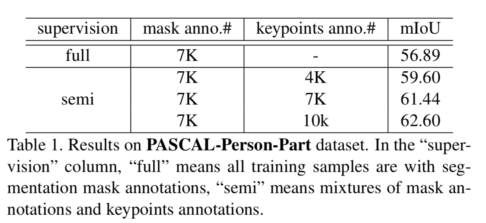

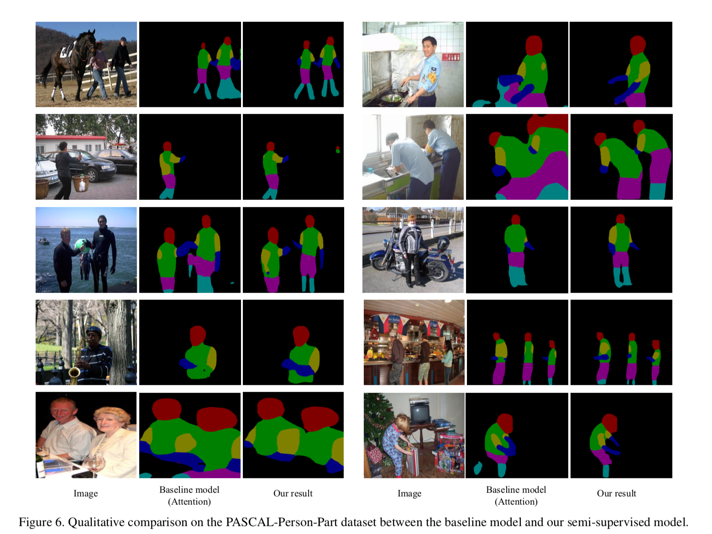

- **Significance of Part-level Prior.** 部位水平先验的重要性。 我们评估部位水平先验的重要性。 首先，我们比较了部位水平先验训练和没有部位水平先验训练的**with or without part-level prior** 精炼网络在裁剪的单人部位分割验证集上的性能。 没有先验知识，精炼网络是一个在有限的训练数据上训练的常规 FCN 网络。 两种情况的验证精度如图7所示。 可以看出，部位先验的精炼网络的精度要比没有先验的情况高得多。 在图5中，我们可视化一些来自我们的经验网络的预测，这些预测是经过部分级别的先验训练和没有先验训练的，并且相应的先验也进行了可视化。

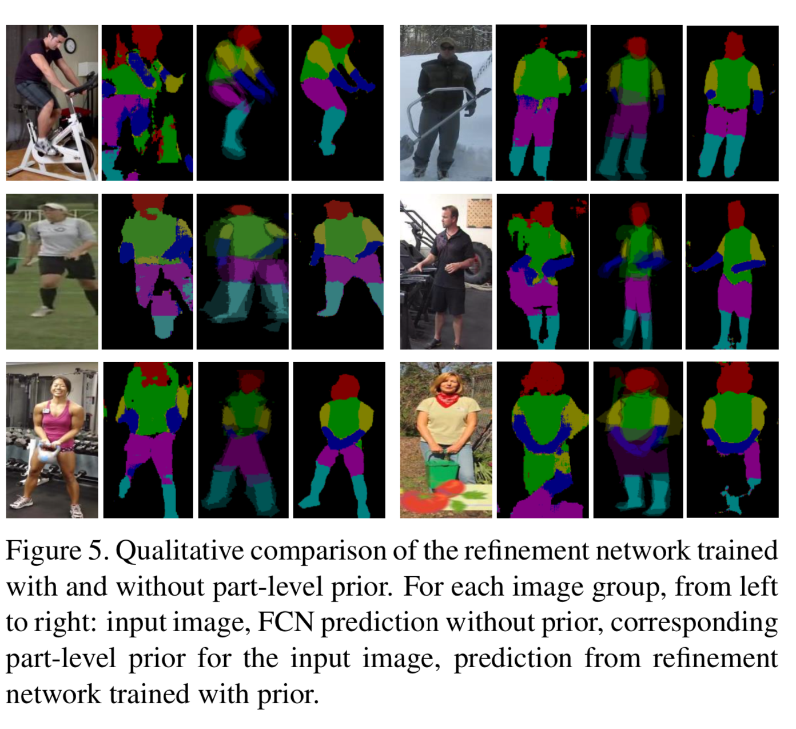

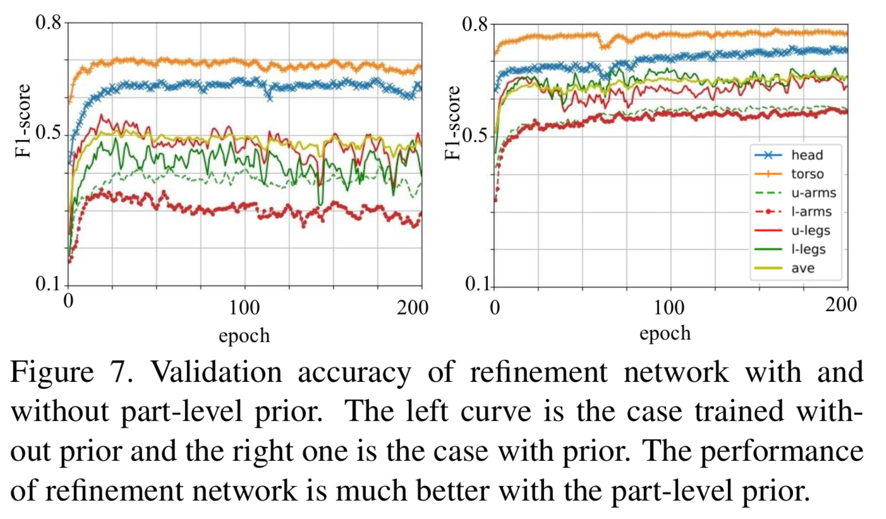

- **Prior Generation Strategy.** 先验生成策略。 在我们的训练过程中，部件水平先验**part-level prior**的质量非常重要，直接影响到精炼的部位的分割结果。 我们比较了不同的先验生成策略**prior generation strategies**，并在表2中报告了最终结果。 我们首先探索使用骨架标签地图**skeleton label map**[33]作为先验，它在相邻关节之间绘制了一个宽度为7的棍子，结果是58.26 mIOU。 与此方法相比，我们提出的部位级别的先验有一个较大的改进，这表明知识转移knowledge transfer在先验生成中的重要性。

  对于部位级别的先验，我们比较了 $k$ 个姿态相似族**pose-similar cluster**的影响。 正如前面在第3.3节中提到的，如果我们只选择最接近的姿势，并以他 / 她的变形部分解析结果作为我们的先验，性能是有限的。 但是，如果我们选择太多的人来产生我们的部位水平先验，质量的最终结果也会下降。 我们认为这是因为我们的部位分割数据集很小，而且随着集群数量的增加**cluster size increases**，组内内部部位的外观变化**the intra-cluster part appearance variance**也会增加。 然后，探讨了在精炼网络训练过程中加入数据增强对训练效果的影响。 正如我们所看到的，随机抽取3个候选样本，从一个规模为5的较大的池中生成部位级别的先验，这有利于训练，因为它增加了样本差异。 对于剩下的实验，我们将 $k$ 设为3，$n$ 设为5。

  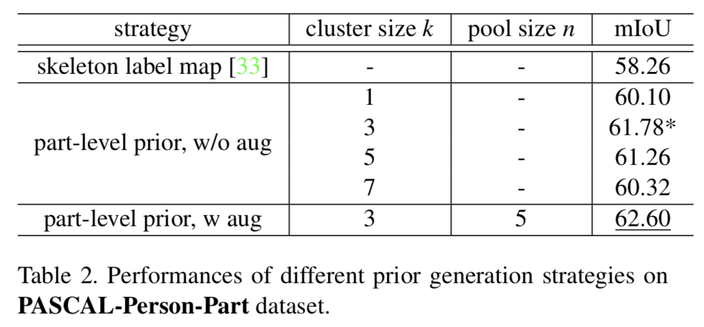

- **Comparisons with State-of-the-Art.** 与最新技术的比较。 在表3中，我们用 Pascal-Person-Part 数据集的最新结果重新进行比较[6]。 利用我们的精炼网络生成的额外的训练数据，我们的基于 VGG16的模型实现了最先进的性能。 尽管我们专注于利用人类关键点标注作为额外的监督**exploiting human keypoints annotations as extra supervision**，但我们的方法适用于其他基线模型，并且可以从其他并行改进中受益。 为了证明这一点，我们用基于 ResNet-101[16]的 DeepLabv2[4]模型替换我们的基线模型，并遵循相同的训练设置。 如果没有额外的关键点标注，这个基线可以达到59.6 mAP。 在我们的半监督训练下，该模型达到了64.28 mIOU。 注意，这个结果是通过单尺度试验**by single scale testing**得到的。 通过执行多尺度测试**By performing multi- scale testing** ($scale = 0.5,0.75,1$) ，我们可以进一步达到67.6 mIOU，比以前的最佳结果高出3 mIOU。

  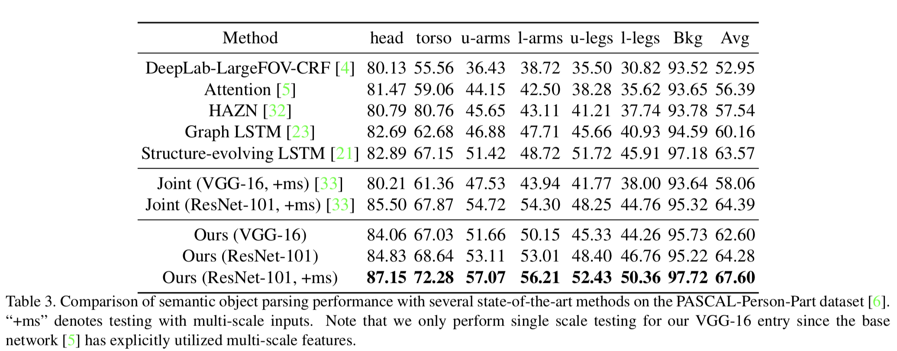

- **Comparisons between two Networks.** 两个网络之间的比较。 为了了解精炼网络是如何协助分割网络**parsing network**的训练，我们在图8中将两个网络的一些预测可视化。 在这个实验中，我们使用的解析网络已经在半监督设置下进行了训练。 如图8所示，由于强大的部位级别的先验指导**the guidance of the strong part- level prior**，精炼网络在结构预测上犯较少的错误(例如，(a)的上肢和(b)的上臂) ，并产生更紧密的**masks**(例如，(c)的腿)。 在半监督训练过程中，利用部位级别先验获得的改进信息将被转移到语义分割网络中。 另一方面，通过利用大量的训练数据，解析网络可以找出哪些是重要的或不相关的特征，并产生较少噪音的预测(例如，(b)和(d))。

  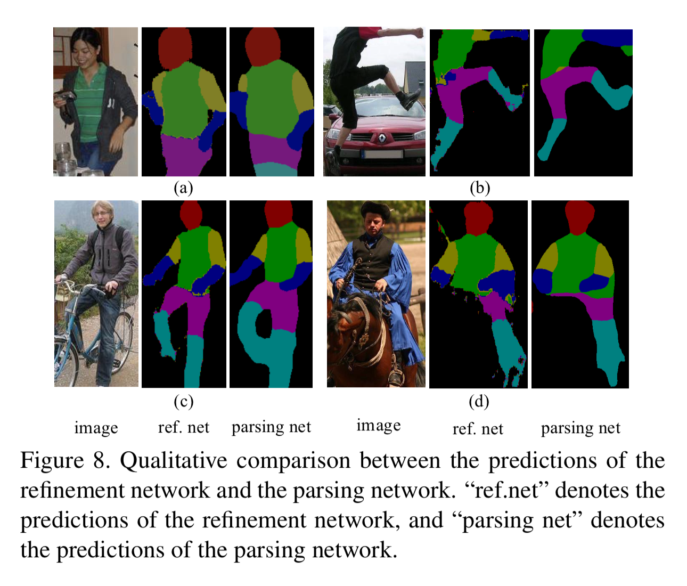

- **Training on Pose Estimation Results.** 姿态估计结果的训练。 既然单一个人姿势估计**single person pose estimation**已经足够成熟可以部署，那么如果我们用位姿估计结果替换真实关键点注释会怎样呢**replace the ground-truth keypoint annotations with pose estimation results**？ 为了回答这个问题，我们使用 MPII 数据集上训练的姿态估计[13]来估计 COCO 数据集中的人体姿态[25]。 和以前一样，我们裁剪了那些带有全身注释的人并收集了10K 图像。 半监督结果达到61.8 mIOU，与真实标注的训练结果相当。 实验结果表明，该系统对噪声具有较强的鲁棒性，并提出了一种在不增加额外开销的情况下大幅度提高人工语义部位分割性能的策略。

- **Extension to other Categories.** 扩展至其他类别。 为了展示将我们的方法扩展到其他类别的潜力，我们还在 Horse-Cow Dataset [31]上执行实验。 有关结果载于表4。 我们的基准模型是注意力模型[5] ，这个模型得到的马的 mIOU 为71.55，牛的 IOU 为68.84。 通过利用[3]提供的关键点标注，我们分别获得了针对 Horse 和 Cow 的3.14和3.39 mIOU 的改进。 不同类别之间的一致改进表明，我们的方法是通用的，并且适用于其他分割任务，在这些任务中，它们的解剖学相似性可以用关键点标注**their anatomical similarity can be annotated by keypoints**。 最后，通过使用更深层的基于 ResNet-101的模型替换我们的基线模型，我们在 Horse-Cow 数据集上获得了最先进的结果，这两个类别的最终性能分别为76.99和74.22 mIOU。

  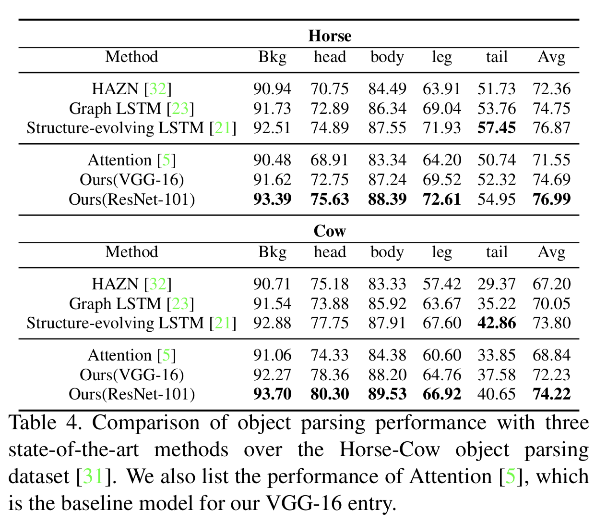

# 5. Conclusion

本文提出了一种利用关键点标注**utilize the keypoint annotations**训练深层网络，来进行人体部位分割**for human body part parsing**的新策略。 该方法利用生物形态学上的约束条件**exploits the constraints on bio- logical morphology**，在姿态相似的不同人之间传递部位解析标注**transfer the part parsing annotations among different persons with similar poses**。 实验结果表明，该方法是有效和通用的。 通过利用较多的关键点注释，我们实现了最先进的人体部位分割结果。