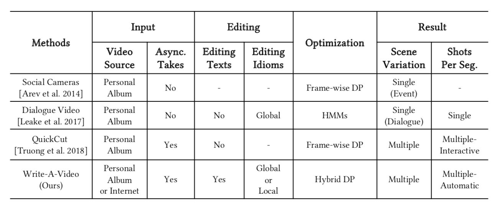
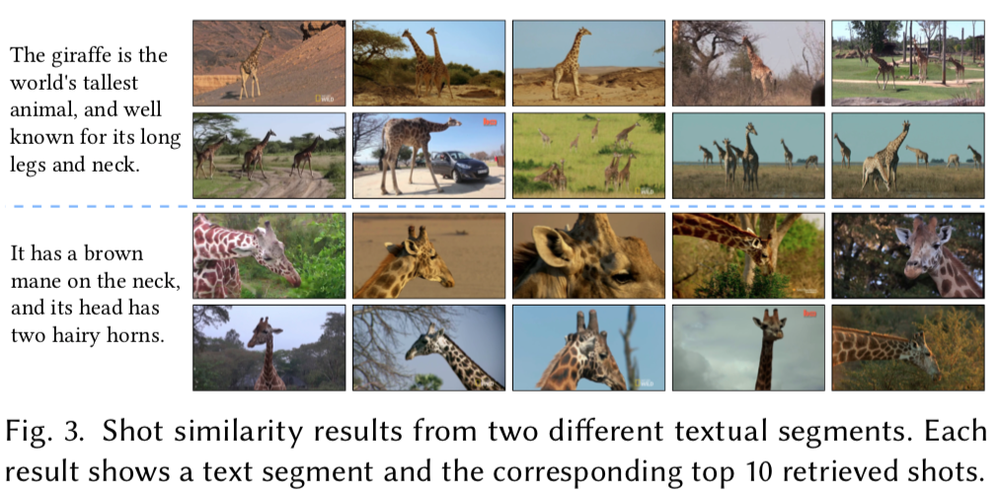
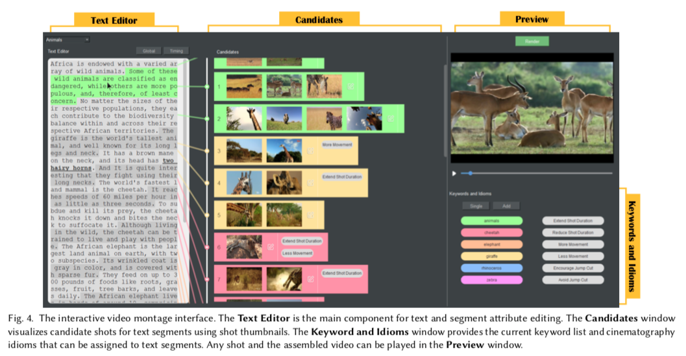
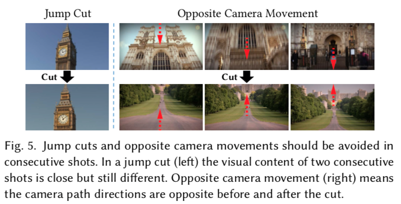
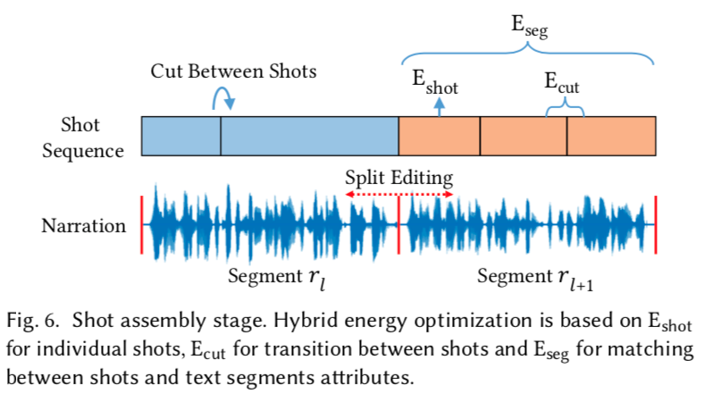
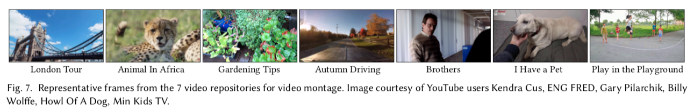
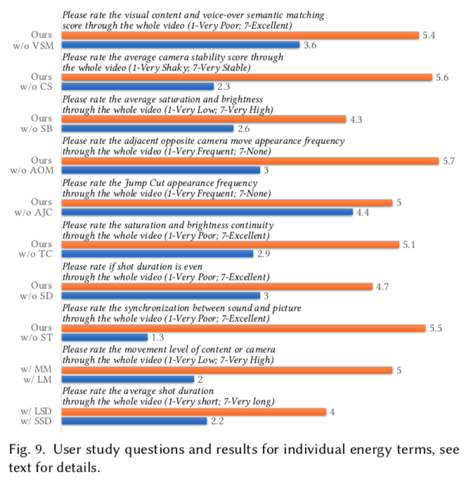
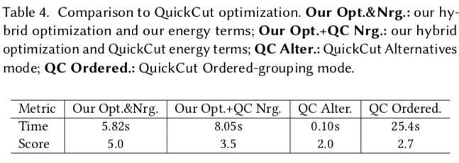
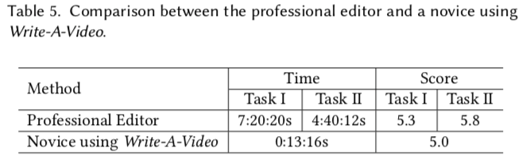
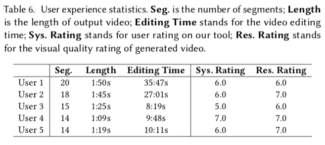

# 0. Abstract

我们提出了Write-A-Video，一个视频蒙太奇创作的工具，它主要是通过文字编辑来使用**text-editing**。 给出一个有主题的输入文本和一个相关的视频存储库，无论是从在线网站还是个人相册，该工具允许新手用户生成一个远比目前的视频编辑工具更容易的蒙太奇视频。 最终的视频能够说明给定的叙事（故事），提供多样的视觉内容，并遵循电影摄影准则。 该过程包括三个简单的步骤: (1)用户提供输入，主要是以编辑文本的形式; (2)工具自动从视频库中搜索语义匹配的候选镜头; (3)优化组合视频蒙太奇。 分段文本和镜头之间的视觉语义匹配采用**Visual-semantic matching between segmented text and shots**  级联关键词匹配和视觉语义嵌入**cascaded keyword matching and visual-semantic embedding** 的方法，比其他方法具有更高的准确性。 考虑到时间限制、摄像机运动和色调等摄影技术指标以及用户特定的摄影技术习惯，视频组合被设计成一个混合的最佳化问题。 使用我们的系统，没有视频编辑经验的用户也能够生成精彩的视频。

# 1. Introduction

智能工具，协助经验不足的用户在创造过程中越来越丰富: 图像编辑，绘图，甚至三维建模和制造。 对于初学者来说，一个仍然具有挑战性的过程是视频的创建和编辑。 专业的视频编辑使用 Adobe Premiere 或 Apple Final Cut Pro 等编辑工具来处理原始素材，并根据叙事或故事情节制作连贯的视频。 然而，非专业人士可能会发现很难处理和学习如何使用这些软件，并可能缺乏电影摄影或视频编辑的美学知识。

与视频编辑相比，使用文本讲述故事的能力更简单，也更普遍。 因此，在这项工作中，我们提出了一种弥补编辑文本和编辑视频之间的差距的方法ーー我们提出了 Write-A-Video，一种从主题文本生成视频蒙太奇的计算工具。 该工具允许用户通过编辑文本来创建视频。 我们使用“主题文本” **“themed text”** 这个术语来强调我们的方法不适用于任意文本，而是适用于主题集中、不太抽象、不太具体**the subject is focused, not too abstract, and not too specific** 的输入。 我们假设用户希望使用叙述性文本(如旅游视频，例如参观伦敦；或者说明给定歌曲的视频)来创建视频。

假定可以从在线资源或个人相册中获得与主题相关的视频库。 我们设置的主要挑战之一是**如何将文本的语义与视频拍摄的视觉内容相匹配**。 我们提出将文本分段，并对每个分段使用视觉语义匹配从存储库中检索候选镜头。 另一个关键的挑战是**如何使用文本从给定的候选镜头中来组装一个视频**。 我们把镜头的选择和组合作为一个最优化问题，这一问题需要考虑电影摄影的指导原则、时间限制和用户对电影摄影习惯的偏好。 为此，我们提出了一种新颖的方法来实施基于视频中的2D线索**based on 2D cues in video,** 的电影摄影指导，并在以往基于习语的编辑方法的基础上，有效地将基于用户为文本片段设定的高级目标的低级编辑任务自动化。

我们的智能工具如图1和图4所示。 用户可以在文本编辑器中添加文本，而工具会自动为分段文本片段找到合适的镜头。 文本编辑操作，如插入或删除，改变片段的顺序，分别转换为编辑的视频蒙太奇增加，删除或改变的顺序。 该工具允许用户使用电影习惯用法和其他高级指令探索每个片段的视觉样式。 用户可以随时渲染电影和预览视频蒙太奇结果，这些结果是通过对候选镜头进行优化组合，并配有画外音旁白得到的。 因此，我们把智能视频组装工具的能力提供给了用户，使得一个经验不足的用户可以使用文本处理创建一个视频蒙太奇，说明给定的叙事，遵循电影摄影指南，并提供多样化的视觉内容。

这种方法已经在不同主题的文本和视频资料库上进行了测试，并进行了定量评估和用户研究。 没有视频编辑经验的用户可以使用我们的工具制作令人满意的视频。 用户研究结果表明，所有的视频汇编能量项**all video assembly energy terms** 对视频蒙太奇的质量都有意义。 此外，该工具甚至可以让新手用户产生的结果显著快于使用商业基于帧的编辑软件的熟练的视频编辑者。

我们的工作通过引入一个可以从主题文本创建视频蒙太奇的工具，扩展了“基于文本的视频编辑”的概念。 我们的工具允许用户对文本进行操作，而不是手动编辑潜在的大量视频集合。 更广泛地说，这项工作展示了自动视觉语义匹配在基于习语的计算编辑中的潜力**the potential of automatic visual-semantic matching in idiom-based computational editing** ，提供了一种智能化的方式，使视频创作更容易为非专业人员所接受。

# 2. Related Work

## 2.1. Content-based Video Indexing and Retrieval

基于内容的视频索引与检索。 基于内容的视频索引和检索在计算机领域有着悠久的研究历史[ Hu 等人，2011; Smoliar 和 Zhang，1994]。 Ramesh Naphade 等[2002]提出了一种概率多媒体对象模型来表示视频的高级语义。 Videoscapes 系统[ Tompkin 等人，2012]利用3 d 重建技术，建立了一个索引非结构化视频的图表。 视频摘要系统[ Pavel 等人，2014]提供了一种浏览和浏览信息性视频的新格式。 事件素描是用来表示视频事件中语义对象动作的动态属性的。 语音已经被用来体验和导航视频[ Chang 等人2019]。 在深度学习时代，视觉语义嵌入技术[ Faghri et al. 2018; Karpathy and Fei-Fei 2015; Miech et al. 2018]被提出用于将视觉内容与其他形式的语义网络相匹配。 我们的方法使用视觉语义嵌入[ Faghri 等人2018]作为一个组件来检索语义匹配的镜头文本片段。 在实验中，我们用不同主题的文本验证了视觉语义匹配方法的有效性。 然而，任何新的视觉语义嵌入算法都可以取代当前的组件。

## 2.2. Computational Cinematography

计算电影摄影。 电影剪辑需要专业技能，以确保观众能够体验到流畅的叙述和艺术表达。 最近，计算机图形学的研究人员开始研究计算机电影模型，目的是为专业人员和非专业人员创造更好的工具。 一些工作涉及到电影摄影规则在3D 动画和虚拟现实中的应用[ Elson 和 Riedl 2007; Galvane 等人2015; Serrano 等人2017]。 通过场景的整体感，内容通过计划一个最佳的摄像机路径来呈现，由演员、动作和摄像机运动的连续性驱动。 对于现场视频，特定领域的连续镜头编辑系统已经开发，包括演讲视频[ Heck 等人2007年; Machnicki 和 Rowe 2001年; Pavel 等人2014年; Shin 等人2015年] ，社会摄像视频[ Arev 等人2014年] ，教学视频[ Chi 等人2013年; Truong 等人2016年] ，肖像视频 [ Berthouzoz et al. 2012; Huang et al. 2017] ，对话场景[ Leake et al. 2017] ，第一人称视频[ Joshi et al. 2015; Wang et al. 2018,2019]和航拍视频[ Xie et al. 2018; Yang et al. 2018]。 现场视频剪辑依赖于语义提示和计算特征，通常是从视频内容中提取预处理步骤。 在我们的应用中，输入的视频是多样的，可能有很少的重叠，所以三维场景重建或跟踪的方法并不适用。 因此，我们的方法使用基于2d 的视频线索评估计算电影摄影规则。

## 2.3. Intelligent Video Editing

智能视频编辑。 基于帧的视频编辑在商业软件很难为非专业人士使用。 最近，用户友好的编辑工具已经提出，以简化繁琐的视频编辑过程。 已经提出了一些方法来提高从电影脚本或书籍章节中校准或检索视频内容的性能[ Pavel et al. 2015]。 这种检索提供了快速跳跃和导航的视频浏览脚本或文本为基础的故事[ Hu 等人2011]。 我们的目标不同，旨在通过编辑文本编辑视频连续镜头。 在视频镜头编辑方面，希区柯克系统[ Girgensohn 等人2000]提供了一种半自动的家庭视频编辑方法，通过分析输入的视频和评级不合适的分数。 用户可以创建一个电影拖动分级视频镜头到一个故事板和手动调整镜头的长度。 Berthouzoz et al. [2012]介绍了一个基于编辑访谈脚本的视频编辑工具: 每次用户更新脚本时，重新生成一个连续的镜头以符合脚本。 Jain 等人[2015]提出了一种基于人类视线分析的视频剪切和扭曲算法。 张等人[2015; 2018]提出了通过摄像机路径优化检测和消除视觉障碍的算法。 Arev et al. [2014]提出了一种算法，可以根据同步视频之间的电影摄影规则创建转场效果，但它依赖于场景的3D 重建和摄像机视图之间的大量重叠。 廖等人[2015]合成了音乐驱动的视频，而不是文本。 视频编辑算法[ Bellini et al. 2018; Davis and Agrawala 2018]已经被提议用于将输入视频的视觉运动映射到背景音乐的节拍上。 金等人。 Al. [2014]考虑将给出的照片流作为故事情节指导的在线视频总结。 然而，输出的视频既不遵循叙事故事，也不使用电影的规则和时间限制。 Leake 等人[2017]为对话驱动的镜头编辑开发了一个习惯用法为基础的界面**an idiom-based interface** 。 用户可以全局编辑电影编辑习惯用法，然后该工具生成镜头编辑结果。 我们的工作使用了类似的方法来进行基于习惯用法的指导**idiom based guidance** ，并进一步提供了精细的段级控制。

最接近我们工作的工具是 QuickCut [ Truong et al. 2016] ，它允许交互式编辑剧本的叙述视频。 Quickcut 和我们的方法的主要区别如下。 (1)在 QuickCut 中，为固定文本**a fixed script** 收集个人捕捉的镜头。 相比之下，我们的方法处理的镜头，要么从互联网下载，或是用户提供的没有准确回复以预先确定的脚本。 (2)在 QuickCut 界面中，输入文本是固定的，而每个分段文本必须进行手动的候选镜头选择。 相比之下，我们的界面允许用户编辑文本。 更重要的是，可以自动优化组合拍摄顺序。 (3) QuickCut 优化支持替代模式和有序分组模式。 在替换模式下，一个镜头只能表示一个句子，而在有序分组模式下，候选镜头及其顺序必须手动确定。 我们的优化过程自动确定了镜头的顺序和遵循电影的规则和习惯的最佳剪辑。 表1简要比较了我们的方法和现有技术。

# 3. Overview

Write-a-video 的目标是通过从视频存储库中收集镜头，将主题文本转换为视频蒙太奇。 我们的解决方案的设计目标包括以下内容。

- 视频内容应表明叙述内容。
- 视频内容应该多样化。
- 视频蒙太奇应遵循电影规则，包括视觉连续性、色调、持续时间等。
- 用户应该能够反复编辑文本，视频蒙太奇结果应当相应更新。

前三个目标是自动化电影摄影，最后一个目标是我们系统的可用性。 为了满足最后一个目标，我们开发了一个支持基于习惯用法的文本片段编辑的智能工具，以允许迭代视频蒙太奇编辑(第5节)。 为了满足第一个目标，我们将整个文本分割成文本片段，并在文本片段和分段视频镜头之间进行视觉语义匹配(第4节)。 本质上，每个片段比整个文本提供更精确的匹配。 为了确保内容的多样性，我们允许用户合并或分割分段的文本，并通过编辑分段属性来编辑分段视觉样式。 第三个目标是通过使用动态编程的混合优化算法来实现，联合考虑镜头方向、切割方向和分段方向的电影摄影准则和用户自定义的高级习惯用法，以收集最佳匹配镜头和切割位置(第6节)。

# 4. Visual-Semantic Matching

构成给定文本的视频图像的关键是搜索匹配文本片段的候选镜头。 为此，我们使用了一种视觉语义匹配方法，包括两个级联步骤: 关键字匹配和视觉语义嵌入**keyword matching and visual-semantic embedding** 。 我们假设对于每个主题文本，一组关键字，如{ London，Tower Bridge，... }或{ zebra，giraffe，... }都是由用户提供的。 这些关键词用于标记分段文本并在存储库中对视频镜头进行索引。

对于具有一个或多个标记关键字的给定文本片段，关键字匹配步骤从视频存储库中检索所有按相同关键字索引的视频镜头。 接下来，基于视觉语义嵌入技术计算每个检索镜头的匹配得分，选择排名最高的几个镜头作为候选。 图2演示了整个视觉语义匹配过程。

## 4.1. Text Labeling and Shot Indexing Using Keywords

文本和视频都与用户指定的一组关键字相关联。 用户可以提前定义与主题文本相关的描述性关键字，或者在编辑过程中增量地向关键字集中添加新关键字。

### 4.1.1. Text Labeling

文本标签。主题文本由一系列文本片段表示。 每个片段 $r$ 是一个连续的文本间隔，从一个句子的一部分到几个句子。 最初，每个句子都是一个片段; 在编辑过程中，片段可以合并或拆分。 对于每个文本段，我们使用字符串匹配**string matching** 来搜索关键字，并使用匹配的关键字来标记文本。 如果没有找到匹配项，则当前片段的标签将跟随其上一个相邻片段的标签，但是可以在编辑过程中修改这些标签。

### 4.1.2. Shot Indexing

镜头索引。 存储库中的所有视频都被分割成镜头。 镜头提供了灵活的语义匹配，并允许在一个精细的水平上使用电影摄影指南，同时组装视频蒙太奇。 我们使用一个简单而有效的基于直方图的分割算法，类似于[ Chu 等人2015]中的算法。 如果图像在 HSV 颜色空间中的直方图差异超过80% ，并且超过80% 的跟踪 SURF 关键点未能匹配到帧之间，则在帧之间标记镜头边界。 我们丢弃非常短(2秒)和非常长(30秒)的镜头，因为短镜头会降低视觉质量，而长镜头会降低效率和可变性。

这些照片都使用上述关键词进行索引。 如果使用关键词搜索从互联网上收集视频库，那么这些视频库将用于索引镜头。 如果一个关键词是来自目标检测数据集的对象类标签，我们根据对象的存在在镜头和索引镜头上使用目标检测。 例如，我们自动添加标签的关键词，如“斑马”和“长颈鹿”的各种拍摄使用目标检测网络[[He  等人2017]预先训练的 MS-COCO 数据集[Lin 等人2014]。 我们也使用人脸识别来标记特定人物的照片，给出他们的肖像照片。 其他的目标检测或动作识别方法也可以用于索引镜头。 最后，进一步的关键词标签可以手动加给镜头。

## 4.2. Visual-Semantic Embedding

为了定量计算具有相同索引关键字的文本片段和视频镜头之间的匹配得分，我们使用了最先进的带有硬否定**hard negatives** 的视觉语义嵌入(VSE + +)方法[ Faghri 等人，2018]。 该方法利用具有**triplet loss**的神经网络，将文本 $r$ 和图像 $i$ 等交叉模型内容**cross-model content **编码到联合特征空间**a joint feature space** 。 在嵌入空间中，编码对象之间的特征相似性揭示了交叉模型内容的相似性。 设$\eta(i, r)$为图像 $i$ 和文本 $r$ 之间的视觉语义相似度。 给定正样本对**a positive pair** $(i, c)$(如，描述图像的文本) ，最难学习的负样本是由 $i^{\prime}=\arg \max _{j \neq i} \eta(j, r)$和 $r^{\prime}=\operatorname{argmax}_{u \neq r} \eta(i, u)$ 给出的。用于优化特征嵌入网络的损失函数定义为:
$$
\mathcal{L}(i, r)=\max _{r^{\prime}}\left[\tau+\eta\left(i, r^{\prime}\right)-\eta(i, r)\right]_{+}+\max _{i^{\prime}}\left[\tau+\eta\left(i^{\prime}, r\right)-\eta(i, r)\right]_{+}
$$
其中$\tau=0.2$作为边距参数，$[x]_{+} \equiv \max (x, 0)$。 使用这个丢失函数，一个 ResNet152网络[ He 等人，2016]被用 MS-COCO 字幕数据[ Lin 等人，2014] 训练出来，其中输出嵌入维数设置为2048。 更多详情，请参见[ Faghri 等人2018]。 我们阐明了视觉语义嵌入是计算机视觉研究中的一个活跃领域。 我们的系统使用 VSE + + 算法[ Faghri 等人，2018]作为模块化组件，随着领域的进展，可以用更新或更好的替代方案来替代。

文本 $r$ 和镜头 $s$ 之间的相似度被计算为 **the embedding of $r$**  和从 $s$ 中采样的一组帧的 **embedding** 之间的平均余弦距离(我们在10帧中均匀采样1帧)。 排名前10的镜头**The top $K=10$ ranked shots**作为每个查询文本段落的候选镜头返回。 图3显示了非洲动物例子中两个片段的镜头检索结果。

# 5. User interface and interaction

我们的方法提供了一个交互式的视频蒙太奇界面，使用户可以集中精力编写文本和编辑片段，而无需对视频帧进行繁琐的编辑。 图4显示了用户界面。 它包括四个主要部分: 文本编辑器、候选窗口、关键词和习惯用法窗口和预览窗口。

 

文本编辑器是用户执行大部分工作的主要工具。 它是一个增强的文本编辑器，具有额外的功能。 虽然用户可以像在普通的文本编辑器中一样编写文本，但是该界面还提供了操作文本片段的函数。 最初，每个句子都是一个文本片段。 用户可以在两个片段之间右键单击鼠标，选择“合并片段”来合并两个相邻的片段，或者选择“分割片段”来分割一个片段。 每个文本段中标记的默认关键字可以通过拖放操作从关键字集中更改或补充; 关键字集可以扩展。 用户可以很容易地编辑片段属性，包括插入本地视觉语义匹配点，执行分时编辑，以及在镜头组装中为不同风格的控制指定电影习惯用法。

局部视觉语义匹配点允许用户要求对单词或短语进行精确的视觉语义匹配，而不是对整个片段进行匹配。 局部视觉语义匹配点可以通过选择一些文本、右键单击鼠标和选择“视觉语义匹配”来设置。 选定的文本将使用带下划线的粗体字突出显示。 更好地匹配标记文本语义的镜头会自动检索，并在最终的视频中使用。

拆分时序编辑提供了一种有意取消音频或视频的开始时间的风格效果。 默认情况下，拍摄的时间与文本片段的音频的开始和结束时间相匹配。 用户可以点击“计时”按钮，然后拖动可视切割指示前后从分段边界进行切割调整。

可以为每个文本片段指定电影习惯用法，以进一步调整组合视频的视觉样式。 Leake et al. [2017]使用了电影习惯用法来快速操作风格，例如，避免跳切。 然而，我们的工具并没有为整个电影设置全局习惯用法配置，而是允许用户在本地编辑片段的习惯用法。 在我们的实现中，用户可以在文本片段中要求更多或更少的镜头，并通过将这些习惯用法拖到片段上来鼓励镜头有更多的静态或更多的动态镜头移动。

一旦编辑完成，Write-A-Video 自动运行镜头检索(Section 4)和镜头汇编优化(Section 6) ，并显示缩略图的选定镜头在候选人窗口。 每一行代表一个链接到文本段的镜头序列。 用户可以展开每一行的视图来查看最佳候选镜头，单击缩略图来观看预览窗口中的镜头，并选择或取消选择特定镜头以进行组装的详细控制。 整个视频可以渲染与画外音和显示在预览窗口按下“渲染”按钮。 为了综合语音音频，我们使用现成的文本语音合成技术 WaveNet [ Oord et al. 2016]。 没有片段属性编辑的结果提供了默认的电影风格，而用户可以反复编辑文本及其属性，以探索不同风格的结果。

# 6. Cinematography-aware shot assembly

电影摄影指南通常用于专业电影，以增强故事的流畅性[ Dmytryk 1984; Niu 和 Liu 2012]。 提出了一种基于二维运动估计和色调分析的电影摄影感知镜头组合算法，该算法能够有效地进行计算。 镜头组合是一种最佳化问题，它通过选择和剪辑一系列的镜头 s 来组成输出视频，这些镜头 s 遵循电影摄影准则、文本计时和用户指定的片段属性(见第5节) 本文的新颖之处在于: (1)基于二维线索估计电影摄影指导思想，包括摄像机运动、色调和持续时间; (2)综合考虑逐镜头、逐段和逐段能量，采用混合优化方法。

## 6.1. 2D-based Cinematographic Guidelines 

计算电影的指导方针往往是估计和使用的自动视频编辑通过重建三维场景[ Arev 等人2014年] ，或使用面部地标校准[ Leake 等人2017年]。 在我们的环境中，这样的技术并不总是适用的。 采用视觉语义匹配方法获取的镜头不能包含相同的场景或物体进行三维场景重建，人脸也不能进行对齐。 下面我们将描述如何制定这些指导方针把它们调整成我们的设置; 更多细节见附录 a。

### 6.1.1. Content Stability

内容稳定性。 在组装视频时，更稳定的镜头是我们的首选。 一个镜头 $s$ 的稳定性，用 $F_{\text {stab }}(s)$表示，依赖于视频内容的局部加速度**local acceleration** : 加速度越大，内容的稳定性越低。 稳定性项是用连续帧之间基于二维特征的帧对齐计算出来的[ Bay 等人，2006; Fischler 和 Bolles 1981] ，并表示为相邻镜头帧对齐所需的帧角偏移量的负平均值。

### 6.1.2. Saturation and Brightness 

饱和度和亮度。 2012年牛和刘已经证明，职业摄影通常是生动和明亮的。 具有高饱和度和亮度的镜头是首选。 我们使用颜色直方图计算帧的饱和度和亮度。 用高饱和度和亮度区域在镜头上的比值来测量一个镜头$s$的色调项 $F_{\text {tone }}(s)$。

### 6.1.3. Shot Duration 

镜头持续时间。 改变拍摄持续时间会影响视觉流畅度。 带有频繁剪辑的短时间镜头可能会令人不安，而没有内容多样性的长时间镜头可能会令人厌烦。 镜头持续时间$F_{\mathrm{dur}}(s)$是按照与标准持续时间的偏差计算的，设置为3.5秒，以避免不必要的长-短持续时间变化 [Niu and Liu 2012] 。 标准持续时间可以全局调整，以适应用户的偏好。

### 6.1.4. Jump Cuts

跳切。 应该避免跳转(参见图5)。 当两个连续镜头的相机位置和角度不同但是相似时，就会出现跳切，导致镜头之间有明显的“重叠”部分。 我们通过对 SURF 关键点的特征对齐检测相邻镜头$\left(s, s^{\prime}\right)$之间的跳切 $F_{\mathrm{JC}}\left(s, s^{\prime}\right)$[ Bay et al. 2006; Fischler and Bolles 1981]。

### 6.1.5. Opposite Movements

相反的运动。 应避免相邻镜头相反的移动(见图5)。 我们通过比较镜头边角的估计二维运动来检测镜头$\left(s, s^{\prime}\right)$切换前后的相反运动$F_{\mathrm{OM}}\left(s, s^{\prime}\right)$。

### 6.1.6. Tonal Continuity 

音调连续性。 饱和度和亮度的连续性对视知觉的平滑度很重要。 利用饱和度和亮度的直方图差值测量镜头对$\left(s, s^{\prime}\right)$的色调连续项$F_{\mathrm{TC}\left(s, s^{\prime}\right)}$。 见附录 a。

## 6.2. Hybrid Optimization of Video Assembly 

输入文本$\mathcal{R}=\left\langle r_{1}, r_{2}, \cdots, r_{L}\right\rangle$由具有相关段属性$\mathcal{H}=\left\langle A_{1}, A_{2}, \cdots, A_{L}\right\rangle$的 $L$ 段组成。 每个从 $t_{l}$ 开始的文本片段$r_l$都有一个相关的属性集 $A_{l}$，以及一组候选镜头$S_{l}=\left\{s_{l}^{i} | 1 \leq i \leq K\right\}$。 镜头拼接的目的是通过选择和排序候选镜头的一个子集，并在它们之间切割，生成一系列的镜头$\widehat{\mathcal{S}}=\left\langle\widehat{S}_{1}, \widehat{S}_{2}, \cdots, \widehat{S}_{L}\right\rangle$。 我们提出了一个新颖的混合的、具有电影摄影感知能力的优化目标，它考虑了镜头方向、切割方向和分段方向的能量:
$$
\mathrm{E}(\widehat{\mathcal{S}}, \mathcal{H})=\sum_{l=1}^{L}\left(\mathrm{E}_{\mathrm{shot}}\left(\widehat{S}_{l}\right)+\mathrm{E}_{\mathrm{cut}}\left(\widehat{S}_{l}\right)+\mathrm{E}_{\mathrm{seg}}\left(\widehat{S}_{l}, A_{l}\right)\right)
$$
其中**shot energy** $\mathrm{E}_{\text {shot }}\left(\widehat{S}_{l}\right)$衡量了第 $l$ 个片段中独立选择的镜头的质量，**cut energy** $\mathrm{E}_{\mathrm{cut}}\left(\widehat{S}_{l}\right)$度量了第 $l$  个片段中连续选择的镜头和边界切割，**segment energy** $\mathrm{E}_{\mathrm{seg}}\left(\widehat{S}_{l}, A_{l}\right)$根据段属性来度量组装好的镜头。 图6简要地演示了上面的能量术语。 与现有的视频编辑方法(见表1)相比，这种混合优化方法不仅保证了视觉风格的多样性，而且保持了每个片段的风格一致性。

### 6.2.1. Shot energy

镜头能量。 在考虑文本分割$r_{l}$的候选镜头序列 $\widehat{S_{l}}$ 时，将每个镜头的镜头能量项与其他镜头分开考虑，包括其视觉语义匹配得分$F_{\mathrm{vsm}}(s)$、相机稳定性$F_{\mathrm{stab}}(s)$和色调项$F_{\text {tone }}(s)$。 镜头能量术语 $E_{\mathrm{shot}}$ 的定义是:
$$
\mathrm{E}_{\text {shot }}\left(\widehat{S}_{l}\right)=\frac{1}{\left|\widehat{S}_{l}\right|} \sum_{s \in \widehat{S}_{l}} \alpha_{1} F_{\mathrm{vsm}}(s)+\alpha_{2} F_{\text {stab }}(s)+\alpha_{3} F_{\text {tone }}(s)
$$
其中 $\widehat{S_{l}}$ 是对应于组合视频中的 $r_l$的一个可能的镜头序列片段，并且$\alpha_{1}=1.0, \alpha_{2}=0.3, \alpha_{3}=0.3$是镜头能量项的权重。

### 6.2.2. Cut Energy

剪切能量。我们通过测量是否避免了相反的摄像机运动和跳跃剪辑$\left(F_{\mathrm{OM}}\left(s, s^{\prime}\right) \text { and } F_{\mathrm{JC}}\left(s, s^{\prime}\right)\right)$ ，以及是否保持了音调的连续性$\left(F_{\mathrm{TC}}\left(s, s^{\prime}\right)\right)$ ，来测量输出视频中连续两个镜头$\left\langle s, s^{\prime}\right\rangle$的视觉兼容性。 与文本段相关的所有相邻镜头的总体截断能量表达式如下:
$$
\mathrm{E}_{\mathrm{cut}}\left(\widehat{S}_{l}\right)=\frac{1}{|C|} \sum_{s \in \widehat{S}_{l}} \beta_{1} F_{\mathrm{OM}}\left(s, s^{\prime}\right)+\beta_{2} F_{\mathrm{JC}}\left(s, s^{\prime}\right)+\beta_{3} F_{\mathrm{TC}}\left(s, s^{\prime}\right)
$$
其中 $\widehat{S_{l}}$ 是与 $r_l$ 相对应的一个可能的镜头序列段，$s^{\prime}$是镜头 $s$ 之后的镜头，$|C|$ 是剪切的次数，$\beta_{\{1,2,3\}}=-1.0$是剪切能量项的统一权重。

### 6.2.3. Segment Energy

分割能量。令文本段$r_l$在视频拼接中的镜头子序列为 $\widehat{S}_{l}$， $A_{l}$为用户指定的段属性。 $A_{l}$ 包含局部视觉语义匹配点、分时编辑、持续时间和内容移动习惯用法。基于这些属性，令$F_{\text {match }}\left(\widehat{S}_{l}, A_{l}\right)$为局部视觉-语义匹配能量，$F_{\text {split }}\left(\widehat{S}_{l}, A_{l}\right)$为切割的时间编辑能量，$F_{\text {idiom }}\left(\widehat{S}_{l}, A_{l}\right)$为电影摄影俗语能量。文本$r_l$的分割能量为
$$
\mathrm{E}_{\mathrm{seg}}\left(\widehat{S}_{l}, A_{l}\right)=\gamma_{1} F_{\mathrm{idiom}}\left(\widehat{S}_{l}, A_{l}\right)+\gamma_{2} F_{\mathrm{match}}\left(\widehat{S}_{l}, A_{l}\right)+\gamma_{3} F_{\mathrm{split}}\left(\widehat{S}_{l}, A_{l}\right)
$$
其中$\gamma_{1}=-1.0, \gamma_{2}=3.0, \gamma_{3}=-3.0$是分割项的权重。所有项的权重都被固定以提供我们实验中的最好视觉质量。

## 6.3. A Dynamic Programming Solver

为了有效地优化这个目标函数，我们提出了一种动态规划方法，并使用了一些加速策略。 令$\left\langle l, \widehat{S}_{l}, t\right\rangle$表示当前选定的镜头序列的状态，with 第 $l$ 个片段在（全局）时间 $t$ 的cuts，其中$\widehat{S_{l}}$是已经对当前片段$r_{l}$选好的部分镜头序列。令$D\left(l, \widehat{S}_{l}, t\right)$表示当前状态的最优能量。当对从当前状态$\left\langle l, \widehat{S}_{l}, t\right\rangle$进行镜头组合，选择下一个镜头 $s$ 的时候，当前状态可以转变成一个仍为当前片段$r_{l}$或者在下一个片段$r_{l+1}$的状态。在前一种情况下，下一个状态会是$\left\langle l, \widehat{S}_{l}^{\prime}, t^{\prime}\right\rangle$，其中$\widehat{S}_{l}^{\prime}$是一个新的部分镜头序列，它包括已经选好的镜头$s$ 和并且在时间$t^{\prime}$结束。 在后一种情况下，下一个状态将会是$\left\langle l+1, \widehat{S}_{l+1}^{\prime}, t^{\prime}\right\rangle$，其中$\widehat{S}_{l+1}^{\prime}$是一个在片段$r_{l+1}$的新的部分镜头序列，它只有一个选中的在$t^{\prime}$结束的镜头$s$。状态转移的细节放在附录B中。

最优解可以通过求解下式得到：
$$
\widehat{S}_{L}^{*}, t^{*}=\arg \max _{\left\langle\widehat{S}_{L}, t\right\rangle} D\left(L, \widehat{S}_{L}, t\right)􏰊
$$
对于以(全局)时间 t 结尾的前一个 l 段进行剪切，其中 Sl 是已经为当前段 rl 选择的部分镜头序列。 让

D (l，Sl，t)表示该状态的最优能量

使用动态规划和回溯镜头序列，从全局结束时间$t^{*}$做切割$\widehat{S}_{L}^{*}$。 最坏情况下的优化复杂度是$O\left(L \bar{T}^{2}|\bar{S}| !\right)$，其中 $L $是分段个数，$|\bar{S}|$为文本片段视觉语义匹配检索到的候选镜头的平均数，$\bar{T}$为片段的平均时间长度。 这可能成为不可解的计算，我们依靠两个策略来加速优化。 第一种方法是只在采样帧中寻找可能的解。 在我们的实现中，我们在每十帧中采样一帧，并且只对采样帧执行切割。 第二种方法是设置最终视频中每个片段实际选择的镜头数量的上限。 我们发现，四个镜头通常足以达到不同的风格效果。 这些策略使问题在实践中易于处理。 用户可以放松这些放松策略，以时间为代价，获得更高质量的产出。 为了避免在蒙太奇中使用重复镜头，我们迭代运行优化和删除重复镜头，直到满足镜头的唯一性。

# 7. Results and evaluation

我们已经使用 Write-A-Video 生成了20个视频蒙太奇结果，涵盖了各种主题，如导游，动物入门，园艺和驾驶教程，以及个人故事。 这些文本是从公共网站、在线视频画外音、儿歌歌词和个人创作中收集的。 总共使用了7个视频资料库(720p，30 fps)(见图7) ，要么使用用户指定的关键字从 YouTube (London Tour，Animals In Africa，Gardening Tips，Au-tumn Driving，i Have a Pet，Play In the Playground)下载，要么从专辑(Brothers)中收集。 补充材料提供互动演示和全部细节，包括文本，视频蒙太奇，关键字，编辑操作和时间。 我们鼓励读者观看这些视频。

对于我们的 YouTube 视频库，我们为每个用户提供的关键词收集了约250个视频，将它们分割成镜头，并在预处理阶段用相应的查询关键词自动标记镜头。 曾经受雇为《非洲动物》和《我有一只宠物》的目标检测贴标签。 对于视频存储库兄弟，主要人物的肖像照片和他们的名字被用来自动索引照片的字符名称使用人脸识别。 另外两个关键字被交互地分配给了这个存储库中的镜头。 接下来，电影摄影感知的能量项被预先计算以支持交互式视频蒙太奇编辑。 对每个视频存储库执行一次预处理，允许它用于创建多个视频蒙太奇。

我们在一台2.6 GHz、16gb 内存的 PC 上测试了我们的工具。 预处理时间随例子的不同而变化，这取决于输入视频的长度和分段镜头的数量。 正如表2中所报道的，在一个核心上，镜头分割和特征嵌入速度分别为111 fps 和470 fps; 这可以通过并行化得到显著加快。 取回镜头只用了不到0.10秒。 考虑到效率、多样性和准确性，我们将 k 10作为所有视频蒙太奇结果的候选镜头数。 视频汇编时间从0.06秒到8.56秒不等，通常由文本长度决定。 生成输出视频的呈现过程执行255帧 / 秒的速度。

## 7.1. Video Montage Results

我们简要介绍了视频蒙太奇结果产生的各种应用。 全部结果在补充文件中提供。

在线文本视频蒙太奇。 一些伦敦之旅的视频是根据一个介绍伦敦景点的网站上的文字制作的: 伊丽莎白塔，西敏寺，海德公园，Bucking-ham Palace，伦敦塔桥和国家美术馆。 文本经过多次编辑，采用了不同的视觉样式。 非洲动物视频是为了介绍几种生活在非洲的动物而制作的，包括长颈鹿、大象、猎豹、斑马、犀牛和奶牛。 图8显示了两个具有不同风格的移动控制的代表性结果。 秋季驾驶调查结果提供了秋季驾驶教程，包括关键主题检查轮胎，落叶，黑暗的道路，冬季轮胎和结冰的道路。 园艺贴士短片提供有关园艺的贴士，包括容器园艺、园艺泥土、园艺位置、为植物浇水及修剪叶子。 为了更好地匹配动作时间，采用了5种视觉语义匹配方法。

个人故事的视频蒙太奇。 我们从一个名为兄弟的原始故事中创建了两个视频; 视频库来自一个专辑。 它以不同的视觉风格介绍了一个关于化学老师约翰的短篇故事。

人声画外音视频剪辑。 我们使用反向语音识别技术[ Chiu 等人，2018]来识别单词，并从语音中得到时间，而不是使用文本到语音的合成技术来生成文本的语音。 我们从现有的 YouTube 视频中提取了三个不同的人声，并分别使用 Lon-don Tour、非洲动物和园艺技巧库为他们生成了新的视频。

儿歌视频剪辑。 我们利用他们的歌词和节奏为儿歌《我有一只宠物和在操场上玩耍》制作了音乐视频。

最小交互模式。 我们开发了一个简单的界面，只允许用户编写和编辑文本。 其余的处理过程是完全自动的，并使用默认的电影摄影指南。 更新文本后，立即生成视频蒙太奇结果。 在补充材料中提供了演示视频。

## 7.2. Evaluation of Visual-Semantic Matching

我们通过测量查询文本中**top-ranked**的镜头的精度来评估我们的视觉语义匹配方法。 该评估是在视频仓库伦敦巡回演出，非洲动物，秋天驾驶和园艺技巧与相应的分段文本。 文本片段的基本真实视觉语义匹配镜头由人工提前标记。 注意，在我们的视频蒙太奇问题中，因为排名最高的镜头作为候选者返回，所以返回的候选者的精度值更为重要。 我们将我们的方法与没有关键字匹配、没有视觉语义嵌入或者两者都没有的方法进行了比较。 我们还比较了使用的视觉语义嵌入算法 VSE + + 和另一种文本视频嵌入算法 MEE [ Miech 等人2018]。 表3所示的总体统计数据表明，我们的视觉-语义匹配性能优于其他选项，而且每个级联阶段都扮演着重要角色。

## 7.3. Evaluation of Cinematography-Aware Shot Assembly

电影摄影感知镜头组合是我们方法的一个关键组成部分。 我们评估结果使用的所有条款对结果没有某些个别条款。 在我们的公式中，一些术语是默认使用的，如视觉-语义匹配和摄像机稳定性，而一些可以被用户通过电影习惯用法使用，如调整拍摄时间。 为了在所有评价中保持一致，为了生成视频蒙太奇，同一个伦敦旅游资料库与由5个文本片段组成的具体参考文本一起使用。 除了我们的标准结果(我们) ，我们产生了各种结果，没有一定的术语: 视觉语义匹配(w / o VSM) ，摄像机稳定性(w / o CS) ，饱和度和亮度(w / o SB) ，避免相反的运动(w / o AOM) ，避免跳跃削减(w / o AJC) ，保持音调连续性(w / o TC) ，镜头持续时间约束(w / o SD)和段时间约束(w / o ST)。 我们还制作了一些视频，在文本中加入了全局的摄影技巧，包括动作更多(w / MM)、动作更少(w / LM)、长镜头持续时间(w / LSD)和短镜头持续时间(w / SSD)。

我们进行了成对的评估测试来给视频结果打分。 有偿任务是通过一个众包平台创建的; 每个员工都被要求观看一对视频并对其进行评分。 工作人员被要求根据评估的术语，使用李克特7分量表对每个视频进行评分。 每个视频总共收集了10个分数。 在测试期间，视频以全屏模式显示; 在每一对视频中，首先播放的视频是随机选择的。 工人们可以在做出决定之前多次观看每个视频。 图9显示了评估结果。 他们证明，每一个人的术语发挥了积极的作用，在其相应的视觉风格。

## 7.4. Comparison to QuickCut 

我们比较了我们的混合优化 QuickCut 的优化过程。 Quickcut 支持两种主要模式: 可选模式和有序分组模式。 替代模式只为一个分段脚本组装一个镜头，这会限制结果的多样性。 有序分组模式为手动确定的拍摄序列优化切割位置。 相比之下，我们的优化方法自动确定拍摄顺序和拍摄位置。 此外，我们的混合优化方法比 QuickCut 的普通动态规划运行得更快。 使用锐度、稳定性和跳跃剪辑作为电影摄影的指导原则，而我们的优化进一步考虑了饱和度和亮度，相反的动作和拍摄持续时间。 我们使用了来自伦敦巡回赛的相同参考文本来生成以下评估结果: Our Optimization+Our Energy, Our Optimization+QuickCut Energy, QuickCut Alternatives, QuickCut Ordered-grouping。 因为 QuickCut 有序分组需要一个预先确定的拍摄顺序作为输入，所以我们简单地向他们的方法提供由 Our Optimization + Our Energy 确定的序列顺序。 我们邀请了10个受试者使用7分李克特量表对所有视频进行评分，考虑到电影美学、内容多样性以及叙述和视觉内容的视觉语义匹配(1分很差，7分优秀)。 在测试过程中，视频以全屏模式显示，视频按照每个受试者的随机顺序播放。 受试者在看完每一段视频后对其进行评分。 表4显示了运行时和评估结果。 我们的方法比其他优化方法更受用户的青睐，并且比 QuickCut 有序分组更快。

## 7.5. Comparison to Professional Manual Editing

我们比较了视频编辑时间使用相同的参考文本，为一个视频编辑新手使用写-一视频，和专业的视频编辑器使用商业帧编辑软件。 我们进一步进行了用户研究，以评估制作的视频质量。 这位专业编辑有8年的视频编辑经验。 她被要求使用给定的伦敦巡演视频库编辑文本的视频，并配上相应的画外音，以确保视觉语义的一致性和最大的视觉质量。 我们还要求她在镜头之间只使用简单的剪辑，没有褪色、加速或其他特殊效果。 她可以自由决定编辑风格。

在编辑任务中，我们要求专业编辑从原始视频库(Task i)和按关键字索引的分段镜头(Task II)生成视频。 任务 i 中的存储库包括所有下载的原始视频。 从这个资源库编辑视频对应于我们工具的所有处理阶段。 任务 II 中的存储库被分割成镜头，并通过关键字集进行索引。 专业编辑可以根据需要自由使用这些关键词进行语义辅助。

编辑器选择 adobepremiere 作为基于帧的编辑工具。 为了进行公平的比较，我们只计算了编辑过程中人的活动时间。 如表5所示，任务 i 花了编辑7个多小时，而任务 II 花了她4.5个多小时。 对于这两个编辑任务，人类使用我们的工具的活跃时间明显低于这些时间。 完成任务后，我们邀请编辑器观看并评论我们的工具创建的结果。 一般来说，她认为我们的视频是合理的，可信的。 她还评论说，她个人的偏好是在画外音中使用更加精确匹配的视觉内容，即使这意味着镜头之间使用更频繁的切换。

为了进一步评估生成的视频，我们邀请了10位非专家受试者观看编辑的结果和我们的结果。 他们被要求为每个视频评分7分李克特量表(1分差，7分优秀) ，考虑到一般的视觉质量和视觉一致性与叙述。 在测试过程中，视频以全屏模式显示，每对视频中使用随机顺序。 受试者可以在做出决定之前多次观看每个视频。 用户研究结果见表5。 可以看出，虽然我们的结果的视觉质量略低于专业编辑的结果，我们的结果评分平均5.0分。 更重要的是，与基于帧的操作相比，Write-A-Video 大大减少了编辑时间。

## 7.6. Inexperienced user study

因为 Write-A-Video 的主要目标是帮助缺乏经验的用户创建视频，其有效性是关键。 我们邀请了5位年龄在18岁到30岁之间没有任何视频编辑技能的用户来尝试这个工具。 他们的目标是创建一个基于参考文本和视频库的视频。 在编辑视频时，用户可以通过添加、删除、重新排序文本或修改文本，以及设置文本片段属性来反复编辑参考文本，直到视频蒙太奇符合他或她的偏好。 我们通过向参与者展示视频教程和解释提供的编辑操作开始了这项研究。 我们给每个参与者提供了预处理的伦敦旅游资料库和相应的参考文本，并允许他 / 她花15分钟研究这个工具。 经过5分钟的休息后，他们开始了正式的工作——收集《非洲动物》的资料库和参考文本。

表6报告了编辑统计信息。 补充材料中提供了完整的编辑操作。 通过对编辑过程的分析，我们发现，除了编辑文本，最常用的操作是电影习语和局部视觉匹配，以探索不同的视觉风格。 测试结束后，我们采访了这些用户，并要求他们对这个工具和生成的视频进行评分，使用的问题如下:

- Q1: How would you rate the usability of our tool (1-7)?
- Q2: How would you rate the result of the generated video (1-7)?
- Q3: Would you be willing to post the output video to Facebook, Twitter or Instagram?

对于 Q1，我们得到的平均响应为6.0; 对于 Q2，平均响应为6.6(见表6)。 所有的参与者都愿意通过社交网络与朋友分享他们的视频。 他们还证实，如果没有这个工具，他们不可能在这么短的时间内制作出这么好的视频。

 

# 8. Discussion and conclusion

非专业用户发现很难学习和使用专业的基于帧的视频编辑软件，并且缺乏电影剪辑的摄影知识。 因此，我们提出了 Write-A-Video，一种创建视频蒙太奇的方法，以说明主题文本使用大部分文本编辑。 提供了相关镜头的输入存储库，Write-A-Video 使任何用户都可以通过简单的编写和编辑文本以及使用高级电影术语来创建视觉上令人愉快的视频。 该工具提供快速反馈，因为输出视频在用户完成一次迭代编辑后的几秒钟内呈现。 有了这个工具和新颖的基于文本的视频组装概念，用户可以在几分钟内创建一个视频蒙太奇。 由于视频已经成为现代媒体的一种主要的讲故事形式，我们相信这种方法将对计算视频编辑领域产生影响。 虽然我们的方法使用户能够轻松地生成视频蒙太奇，但它也有一些局限性，这些局限性表明了未来的研究方向。

视觉-语义匹配。 我们的方法聚焦于主题文本，并依赖于视觉语义匹配。 如果输入的文本太具体，涉及到特定的人或主题或行动，那么有可能找不到好的视频匹配。 如果文本过于抽象或者结合了多个主题，也可能很难构建一个好的文本到视频的嵌入空间。 在未来，结合更先进的视觉语义匹配算法可能导致更好的性能和支持更广泛的文本范围。

艺术表现与精细控制。 一方面，我们的工具可以帮助缺乏经验的用户轻松地创建可信的视频。 另一方面，正如专业编辑指出的那样，有时候电影摄影的指导方针被刻意打破以表达艺术风格。 例如，在自拍视频中，小镜头的有意跳切有时更受青睐。 虽然我们的工具可以通过使用电影习语和参数来获得一定的特殊视觉效果，但是未来还可以开发更多的精细控制。 此外，我们的视频蒙太奇工具的输出可以导出为一个编辑决策列表(EDL)文件，进一步专业的帧为基础的调整使用商业软件。