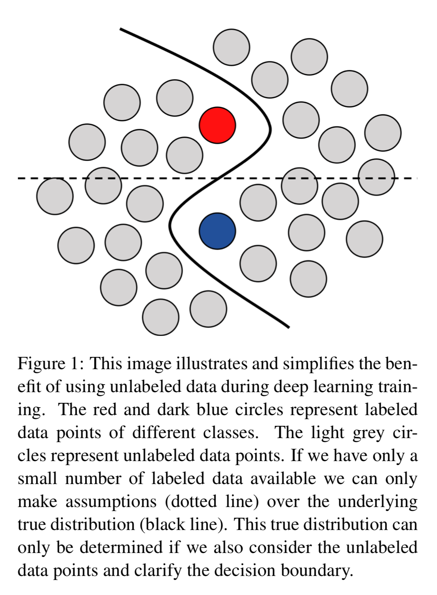
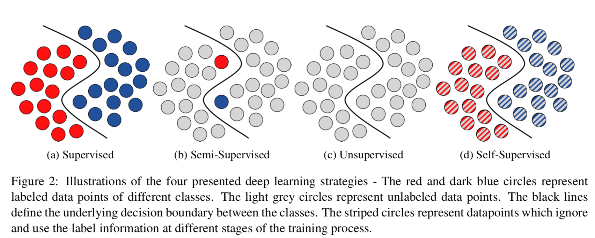
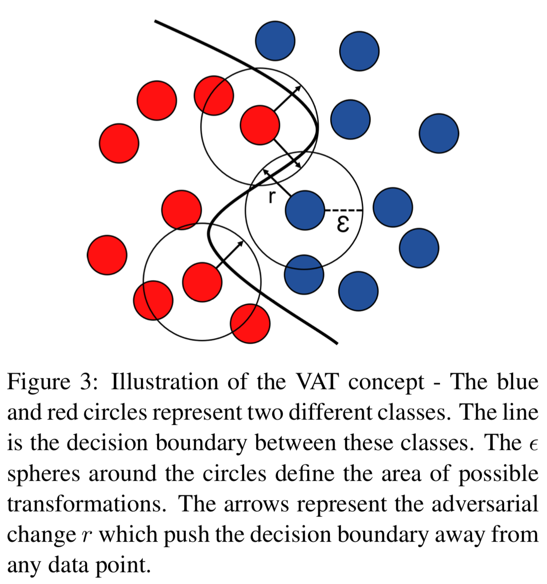
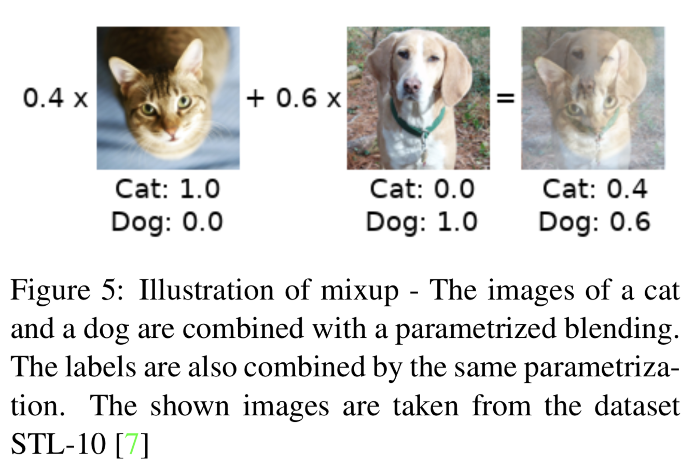
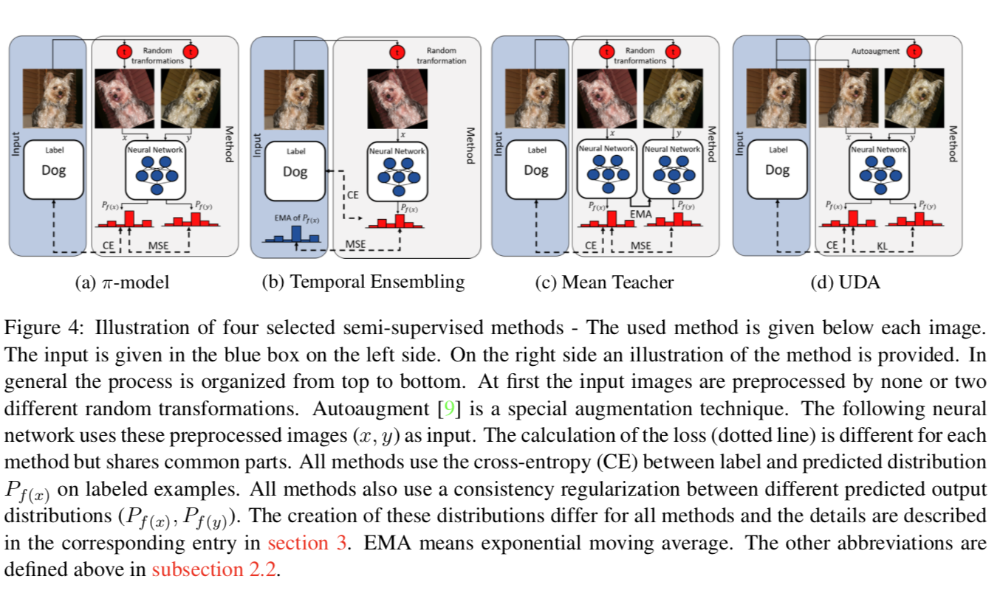
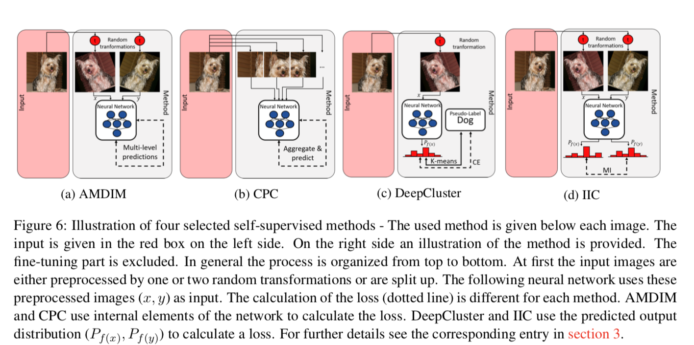
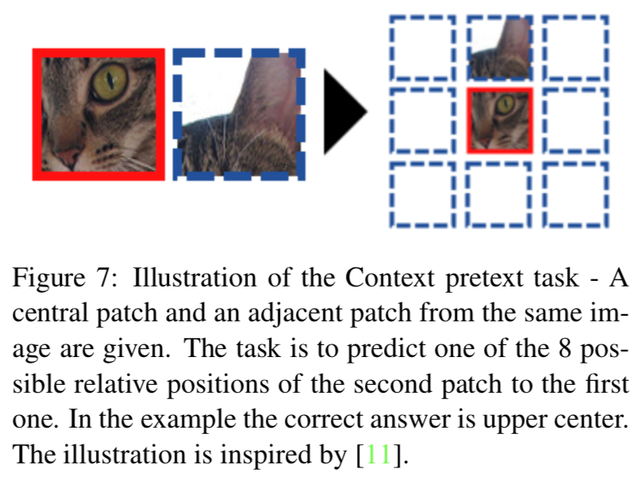
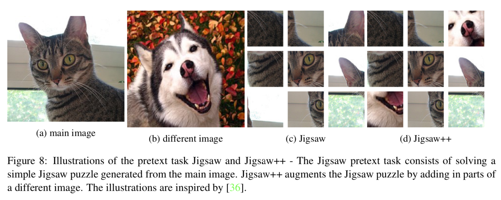
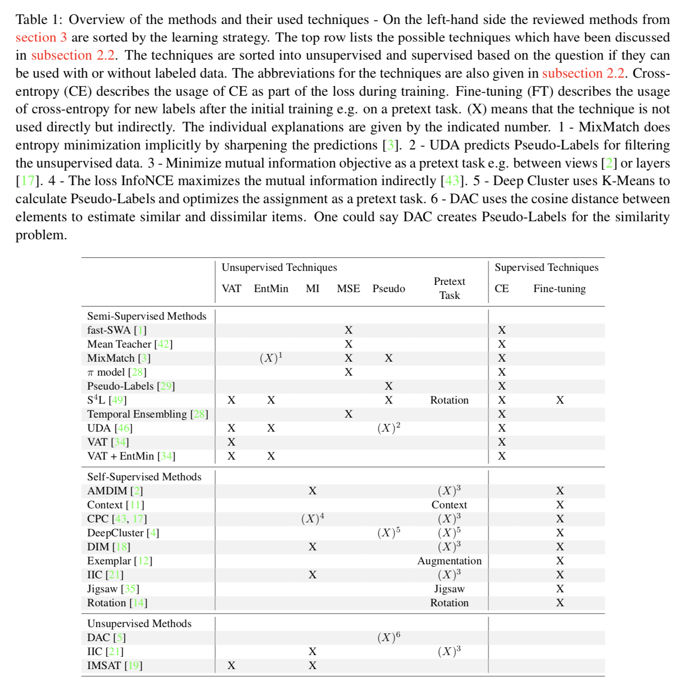
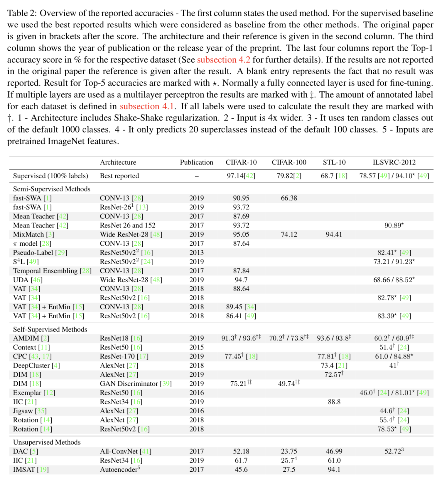

# 0. Abstract

对比了21种方法。

在我们的分析中，我们确定了三个主要趋势：

1. 基于其准确性可扩展到现实世界应用的最先进的方法。 
2. 为获得与使用所有标签可比的结果而需要的监督程度正在降低。 
3. 所有方法共享共同的技术，而只有很少的方法将这些技术结合起来以获得更好的性能。

# 1. Introduction

现实世界的应用中，很难对百万级图像做标注。一般解决这个问题的方法是迁移学习**transfer learning**。尽管这种方法可能实用，但是还存在一些核心问题**fundamental issue**：与人类不同，监督学习需要海量标注数据。

对一个给定问题，我们通常可以得到很大的无标注数据集。无标注数据在很多领域中得到研究，产生了半监督学习**semi-supervised**，自监督学习**self-supervised**，弱监督学习**weakly-supervised**和度量学习**metric learning**。Fig 1. 说明其他无标签数据也是有帮助的。

主要目标是减小semi-supervised和supervised learning之间的gap，甚至超过已有的结果。

## 1.1. Related Work

已经有关于没有deep learning的unsupervised和semi-supervised的survey了[47,51]，我们会关注使用dnn的这些技术。

# 2. Underlying Concepts

## 2.1. Learning strategies

### 2.1.1. Supervised

目标是最小化输出和标注之间的loss，一般用cross-entropy。

$$CE(f(x), z) = \sum\limits^C_{c=1}P_{f(x)}(c)log(P_z(c)) = H(P_z)+KL(P_z|P_{f(x)})$$

- **Transfer Learning**

  Supervised learning的一个限制就是label难以获得。transfer learning描述了训练一个神经网络的两阶段过程。第一阶段，在一个大的通用数据集如ImageNet上，有监督或者无监督训练；第二阶段，在训练数据集上用对训练好的权重进行finetune。

### 2.1.2. Unsupervised

unsupervised learning中有很多中loss。

### 2.1.3. Semi-supervised

unsupervised和supervised混合，因为是混合的，loss也有很多种，常规方法是把supervised和unsupervised的loss加起来。与其他learning策略不同，$X_u$和$X_l$是并行使用的。

###2.1.4. Self-supervised

Self-supervised使用借口任务a pretext task来在无标记数据上学习表示。pretext task是无监督的，但是学习到的表示the learned representations通常不能直接用于图像分类，需要进行fine-tune。因此，self-supervised learning可以被解释为，要么是unsupervised，semi-superbised或者他自己的一种策略。我们把它看成一种特殊策略，之后解释这种区别。

## 2.2. Techniques

### 2.2.1. Consistency regularization

- **Virtual Adversarial Training(VAT)**
  - VAT试图通过最小化图像和图像的变换版本之间的距离，来预测对小变换的不变量。有人用对抗的方法选择出了这种变换。
  - 
  - loss被定义为
    - $$VAT(f(x)) = D(P_{f(x)}, P_{f(x+r_{adv})})$$
    - $$r_{adv} = \arg max_{r:\|r\|\leq\epsilon} D(P_{f(x)}, P_{f(x+r)})$$
      - 两个例子是cross-entropy和KL Divergence
- **Mutual Information(MI)**
  - MI被定义为两种概率分布，即联合分布和边际分布之间的KL散度。在多种方法中，这种度量而不是CE被用作损失函数。
  - 好处是，对图像x, y，特定的神经网络输出f(x), f(y)，和相应的概率分布$P_{f(x)}, P_{f(y)}$，我们可以通过最小化下式来最大化MI
    - $$-I(P_{f(x)}, P_{f(y)}) = -KL(P_{(f(x), f(y))}|P_{f(x)}*P_{f(y)}) = -H(P_{f(x)})+H(P_{f(x)}|P_{f(y)})$$
  - Ji et al. describe the benefits of using MI over CE in unsupervised cases [21]
    - 一个主要好处是避免因熵和条件熵分离而导致退化的固有属性。 MI通过均衡Pf（x）和Pf（y）来平衡最大化熵和Pf（x）的均匀分布以及最小化条件熵的效果。 两种情况都不适合神经网络的输出。
- **Entropy Minimization (EntMin)**
  - Grandvalet and Bengio提出在semi-supervised中通过最小化熵来锐化输出预测。
- **Mean Squared Error (MSE)**
  - MSE是神经网络中常规的距离度量。不使用基于概率理论的区别度量，使用输出向量之间的欧式距离
    - $$MSE(f(x), f(y)) = \| f(x) - f(y)\|^2_2$$

### 2.2.2. Overclustering

正常情况下，如果我们在supervised learning中有k个分类，那么我们在unsupervised情况下会聚成k族。研究表明，用比真实分类k更多的族会有好处，这个idea称为overclustering。

这种分离有助于处理嘈杂的数据或将中间类别随机分类为相邻类别的情况。

### 2.2.3. Pseudo-Labels

估计未知数据的标签的简单方法是伪标签**Pseudo-Labels**[29]。 Lee建议使用神经网络预测看不见的数据的分类，**并将这些预测用作标签**。 这个最初听起来像是一个自我实现的假设，在现实世界中的图像分类任务中相当有效。 几种现代方法都基于通过自己预测来创建标签的相同核心思想[42，3]。

# 3. Methods

## 3.1. Semi-supervised

- **Fast-Stochastic Weight Averaging (fast-SWA)**
  - 与其他方法不同，没有改变loss，而是改变优化算法。
  - 他们基于SWA [20]，π-model[28]和mean teacher[42]的思想和概念分析了学习过程。 Athiwaratkun等通过稳定训练表明，平均学习率和循环学习率**averaging and cycling learning rates**对半监督学习是有益的。 由于更快的收敛速度和更低的性能方差，他们称其为fast-SWA[1]。 架构和loss可以从π-model[28]或mean teacher中[42]复制。
- **Mean Teacher**
  - 他们基于π-model和Temporal Ensembling[28]开发了他们的方法。 因此，他们还将MSE用作两个预测之间的一致性损失**a consistency loss**，但以不同的方式创建这些预测。 他们认为“Temporal Ensembling”将新信息整合到预测中太慢了。 原因是，指数移动平均（EMA）在每个epoch仅更新一次。 因此，他们建议在每个更新步骤中**in each update step**根据学生的平均权重使用老师。 对于他们的模型，Tarvainen和Valpola表明，KL散度是一个相对于MSE一致性更低的loss。
- **MixMatch**
  - supervised 和 unsupervised loss的组合。
  - 
- **π-model and Temporal Ensembling**
- 

- **Pseudo-Labels**
  - 伪标签[29]描述了深度学习中的一种常见技术及其一种学习方法。 对于一般技术，请参见上文第2.2小节。 与许多其他半监督方法相比，Pseudo-Labels不使用无监督损失和有监督损失的组合。 **伪标签方法使用神经网络的预测作为未知数据的标签**。 因此，并行使用带标签的数据和未带标签的数据以最大程度地减少CE损失。 相同损失的使用与其他半监督方法有所不同，但是对标记和未标记数据的并行利用将这种方法分类为半监督。
- **Self-Supervised Semi-Supervised Learning (S$^4$L)**
  - 顾名思义，S$^4$L [49]是自我监督和半监督方法的组合，将损失分为监督部分和非监督部分。 有监督的损失是CE，无监督的损失是基于使用旋转和示例性预测的自我监督技术[14，12]。 作者表明，他们的方法比其他自我监督和半监督技术表现更好[12，14，34，15，29]。 在他们的所有模型混合（MOAM）中，他们将self-supervised rotation prediction, VAT, entropy minimization, Pseudo-Labels和微调组合为具有多个训练步骤的单个模型。 由于这种结合，我们将S4L视为半监督方法。
- **Unsupervised Data Augmentation (UDA)**
- **Virtual Adversarial Training (VAT)**
  - VAT[34]不仅是正则化技术的名称，而且还是一种半监督学习方法。 Miyato等。 在未标记数据上使用了VAT，在标记数据上使用了CE [34]。 他们表明，与随机变换相比，对抗变换所导致的图像分类错误更低。 此外，他们证明将EntMin [15]添加到损耗中可以进一步提高精度。

## 3.2. Self-supervised

- **Augmented Multiscale Deep InfoMax (AMDIM)**
  - 最大化神经网络的输入和输出的MI
  - 它是DIM的扩展
- **Contrastive Predictive Coding (CPC)**
  - 可基于先前的图像区域来预测局部图像区域的表示形式。
- **DeepCluster**
  - 通过kmeans clustering来生成label
  - DeepCluster [4]是一种自我监督技术，通过k均值聚类生成标签。 Caron等在预测标签的聚类以生成伪标签与在这些标签上进行交叉熵训练之间进行迭代。 他们表明在借口任务**pretext task**中使用overclustering是有益的。 在执行前置任务**pretext task**之后，他们会在所有标签上微调网络。
- **Deep InfoMax (DIM)**
  - 最大化局部输入区域和输出表示的MI
- **Invariant Information Clustering (IIC)**
  - 最大化一张图片的增强的数据的MI
  - idea是这些图片是否经过数据增强都应该属于同一类
  - 数据增强的变化应该是一个神经网络不变量
- **Representation Learning - Context**
  - 对visual representation learning把context prediction作为一个a pretext task
  - 图像的中央色块**A central patch**和相邻色块**an adjacent patch**是输入。 任务是预测第二个色块与第一个色块的8个可能的相对位置之一。
  - 
- **Representation Learning - Exemplar**
  - 他们从不同的图像中随机采样色块，并大量增强这些色块。 增强可以是例如旋转，平移，颜色变化或对比度调整。
  - 分类任务是将所有增强的色块映射到正确的原始色块。
- Representation Learning - Jigsaw
  - Noroozi和Favaro提出了解决拼图难题的pretext[35]。 这个想法是网络必须理解所呈现对象的概念才能解决难题。 它们通过在拼图块之间包含小的随机余量来防止仅看边缘或角落的简单解决方案。 他们根据监督数据微调图像分类任务。 Noroozi等通过添加不同图像的图像部分扩展了拼图任务[36]。 他们称扩展为Jigsaw ++。 图8给出了Jigsaw和Jigsaw ++的示例。
  - 
- **Representation Learning - Rotation**
  - 随机旋转输入图像0，90，180，270度，让网络预测选择的旋转度数

## 3.3. Unsupervised

- **Deep Adaptive Image Clustering (DAC)**
  - DAC [5]将无监督聚类重新制定为成对分类。
  - 与Pseudo-Labels类似，Chang等人预测clusters并使用它们来重新训练网络。 不同之处在于它们计算了所有聚类预测之间的余弦距离。 该距离用于确定输入图像在给定确定性下是相似还是不相似。 然后使用二进制CE在这些某些相似和不相似的输入图像上训练网络。 
- **Invariant Information Clustering (IIC)**
  - 上面将IIC [21]描述为一种自我监督的学习方法。 与其他提出的自我监督方法相比，IIC可以创建可用的分类，而无需在标记数据上微调模型。 这样做的原因是，以可以直接从模型中提取标签预测的方式构造预置任务。
  -  因此，IIC也可以解释为无监督学习方法。
- Information Maximizing Self-Augmented Training (IMSAT)
  - IMSAT [19]使模型的输入和输出之间的MI最大化。 
  - 作为一致性正则化，胡等人在图像预测和增强图像预测之间使用CE。 他们表明，可以用VAT计算出最佳的预测增幅[34]。 
  - 直接在图像输入上最大化MI会导致问题。 对于像CIFAR-10，CIFAR-100 [25]和STL-10 [7]这样的数据集，颜色信息与实际内容或形状相比太占优势。 作为解决方法，Hu等人使用ImageNet [26]上经过预训练的CNN生成的功能作为输入。

# 4. Comparison

## 4.1. Datasets

- CIFAR-10 and CIFAR-100
- STL-10
- ILSVRC-2012

## 4.2. Evaluation metrics

unsupervised用cluster accuracy。

$$ACC(x, y) = max_{\sigma}\frac{\sum^N_{i=1}\mathbb{I}_{y_i = x_i}}{N}$$

对cluster accuracy，我们额外最大化所有可能的一对一排列**permutations**  σ。

$$ACC(x, y) = max_{\sigma}\frac{\sum^N_{i=1}\mathbb{I}_{y_i = \sigma(x_i)}}{N}$$

## 4.3. Comparison of methods

## 4.4. Discussion

1. Trend: Real World Applications
2. Trend: Needed supervision is decreasing
3. Trend: Combination of techniques