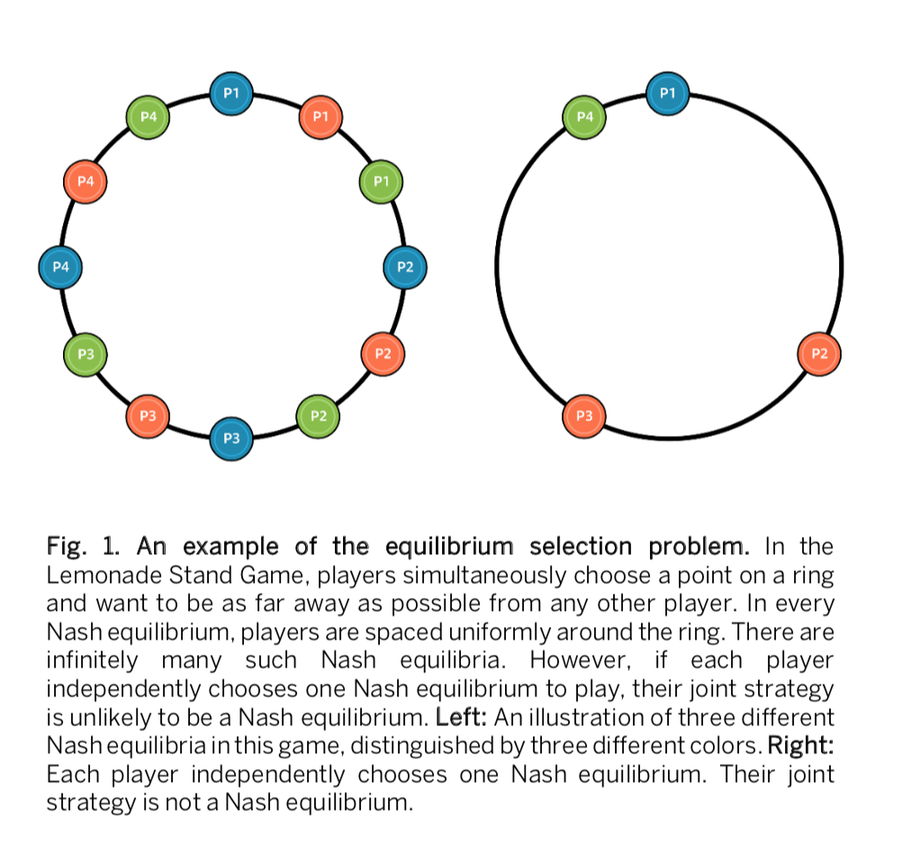
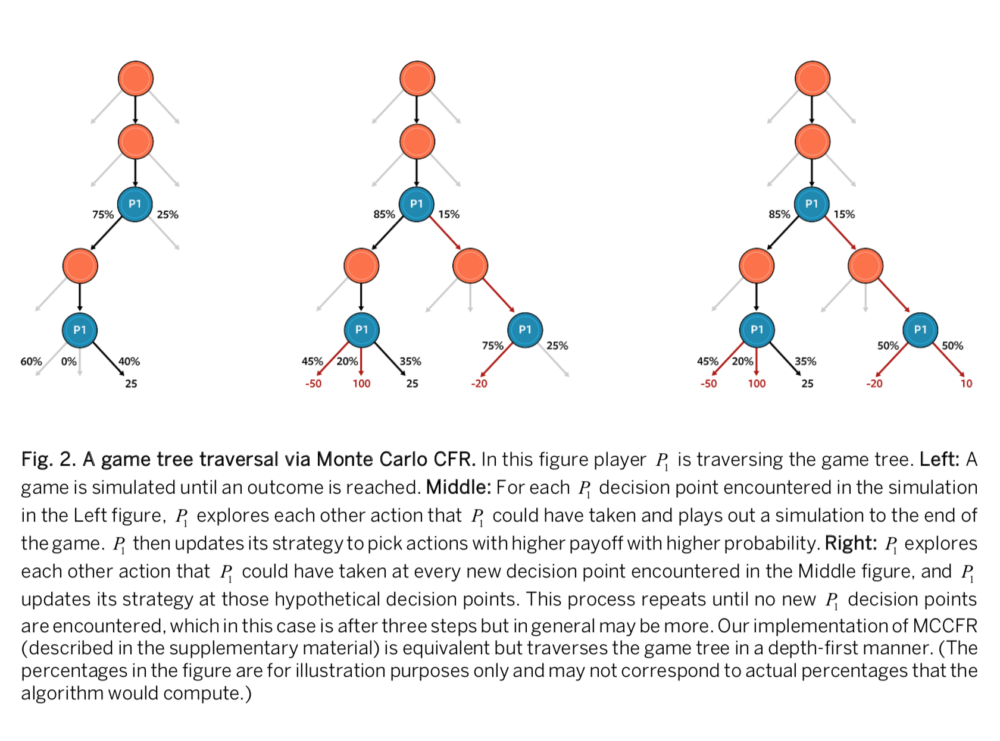
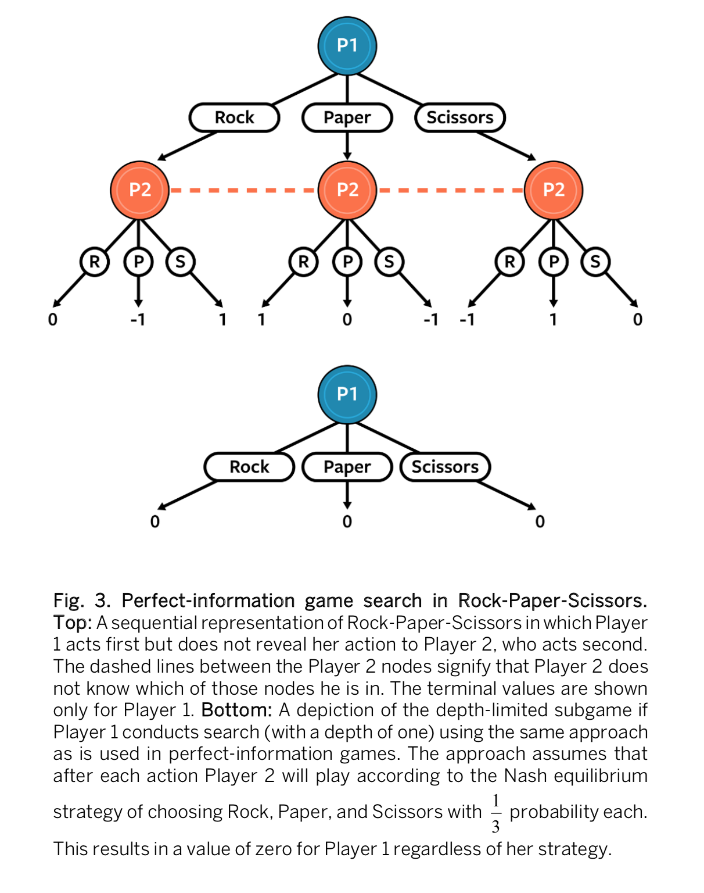
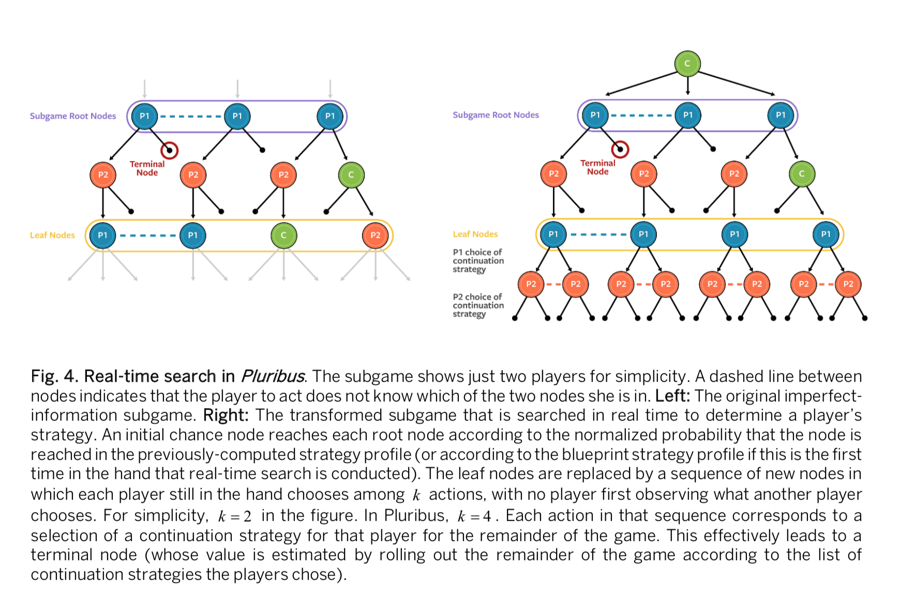
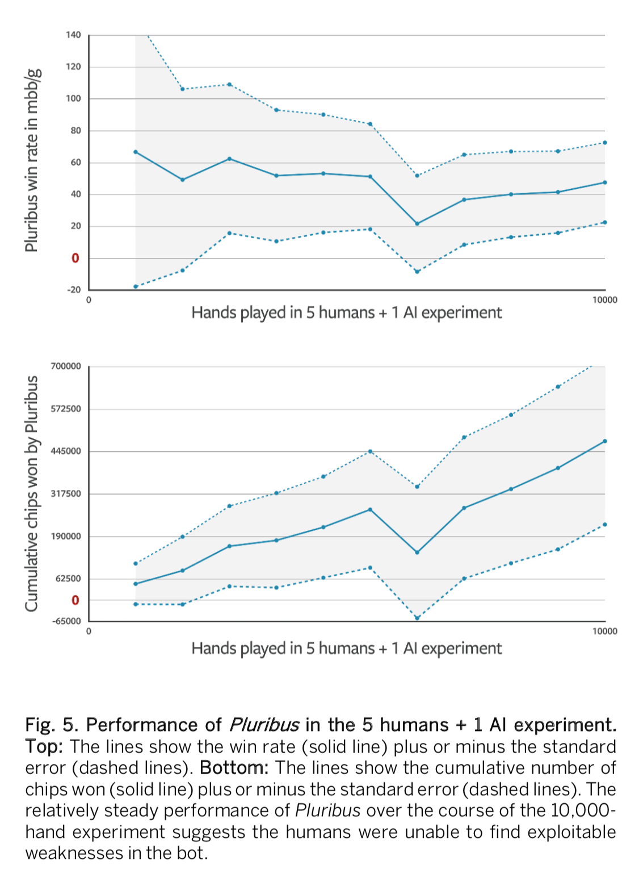

# Superhuman AI for multiplayer poker

## 0. Abstract

近年来，人工智能**AI**取得了长足的进步**great strides**，其中游戏常常成为挑战性问题**challenge problems**、基准**benchmarks**和进步的里程碑**milestones for progress**。几十年来，扑克**Poker**一直是一个挑战性问题。过去在这类**benchmarks**中的成功，仅限于两个玩家的扑克。然而，传统扑克是超过两个玩家的。多人游戏**multiplayer games**相对两人游戏而言，还存在一些基本的附加问题**fundamental additional issues**，其中多人扑克是公认的人工智能里程碑。在这篇文章中，我们展示了一种人工智能，它在最流行的扑克形式——六人无限注德州扑克（**six-player no-limit Texas Hold'em Poker**）中，强于人类职业玩家。

===================================================================

几十年来，扑克一直是人工智能（AI）和博弈论**game theory**领域的一个挑战性问题。事实上，博弈论的基础论文**foundational papers on game theory**曾用扑克来说明他们的概念。这个选择的原因很简单：没有其他流行的娱乐游戏像扑克牌一样具有有效、优雅地捕捉隐藏信息**hidden information**的挑战。虽然扑克一直是新的人工智能和博弈理论技术**game-theoretic techniques**的基准**benchmark**，但在策略环境**strategic settings**中隐藏信息的挑战并不局限于娱乐游戏。**von Neumann**和**Nash**的均衡**equilibrium**概念已被应用于许多现实世界的挑战，如拍卖、网络安全和定价**auctions, cybersecurity, and pricing**。

在过去的二十年里，人工智能系统在玩越来越复杂的扑克的能力上取得了迅速的进步。然而，所有先前的突破都被限制在只涉及两个玩家的环境中。为多人扑克开发超人的ai是公认的重要里程碑。在本文中，我们描述了一个能够在世界上最常见的扑克形式——六个玩家无限制德州扑克——中，击败精英人类专业人士的AI。

## 1. 多人游戏的理论和实践挑战 Theoretical and practical challenges of multiplayer games

在跳棋**checkers**、国际象棋**chess**、两人有限注扑克**two-player limit poker**、围棋**Go**和两人无限注扑克**two-player no-limit poker**等游戏中，人工智能系统已经达到了超人的性能。所有这些只涉及两个玩家，是零和博弈**zero-sum games**（意味着无论哪个玩家赢了，另一个玩家都输了）。每一个超人的人工智能系统都是通过尝试接近纳什均衡策略而得到的，而不是通过其他方法，例如，尝试检测和利用对手的弱点。纳什均衡是一个策略列表，每个参与者一列，其中没有参与者可以通过偏离到其他策略**deviating to a different strategy**来改善。人们已经证明了，尽管找到这样一个均衡可能是困难的，但纳什均衡**Nash equilibria**存在于所有有限博弈和许多无限博弈中。

两人零和博弈**two-player zero-sum games**是一类特殊的博弈，其中纳什均衡也有一个非常有用的附加性质：任何选择使用纳什均衡的玩家，无论预期对手做什么，都可以保证不会失败（只要一方在游戏规则下没有内在优势**intrinsic advantage**，或玩家交替换边）。换句话说，纳什均衡策略在满足上述条件的两人零和博弈中是无法被击败的**unbeatable**。因此，“解”一个两人零和博弈意味着找到一个精确的纳什均衡**an exact Nash equilibrium**。例如，剪刀石头布**Rock-Paper-Scissors**的纳什均衡策略是等概率随机出剪刀、石头或者布。如果违背这种策略，对手能做到的最好的预期就是平局**tie**。在这个简单的例子中，玩纳什均衡也保证了该玩家预期是不会获胜的。然而，在更复杂的游戏中，甚至决定如何与纳什均衡相抗衡**tie against**可能是困难的；如果对手真的选择了次优**suboptional**的行动，那么玩纳什均衡确实会取得预期的胜利。

原则上，玩纳什均衡可以与利用对手 **opponent exploitation** 相结合，首先采取均衡策略**equilibrium strategy**，然后随着时间的推移，转移到可以利用观察到的对手的弱点的策略（例如，对总出石头的对手出布）。然而，除了某些限制性的方式，转向利用性的非平衡策略会使自己暴露在可能被别人利用的环境中，因为对手也可以随时改变策略。此外，现有的利用对手的技术需要太多的样本，来与小博弈（这里的理解是与其他人）之外的人类相竞争。**Pluribus**采取的是不适应（因…而改变）观察到的对手倾向的固定策略**fixed strategy**。

虽然在任何有限博弈中都保证存在纳什均衡策略，但人们已经证明了只有在特殊的博弈类中才有寻找纳什均衡策略的有效算法，其中最突出的是二人零和博弈**two-player zero-sum games**。目前还没有一种多项式时间算法**polynomial-time algorithm**能够在两人非零和博弈**two-player non-zero-sum games**中找到纳什均衡，而其中一人的存在将在计算复杂性理论中产生惊人的影响。在有三个或更多玩家的零和游戏中找到纳什均衡至少同样困难（因为可以将虚拟玩家添加到两个玩家的游戏中，使其成为三个玩家的零和游戏）。在理论和有两个以上玩家的博弈中，即使是近似纳什均衡也很难（特殊情况除外），即使是最好的完全算法**complete algorithm**也只能用每个玩家可能使用的少量**a handful of**策略来处理博弈。此外，即使在有两个以上玩家的博弈中可以有效地计算纳什均衡，我们也不能确认使用这种均衡策略是否明智。如果这样一个博弈中的每个玩家都独立计算和玩纳什均衡，那么他们玩的策略列表（每个玩家一个策略）可能不是纳什均衡，玩家可能有不同的偏离策略的动机。其中一个例子是柠檬水看台游戏**Lemonade Stand Game**，如 **Fig 1** 所示，其中每个玩家同时在一个环上选择一个点，并希望尽可能远离其他玩家。纳什均衡是指所有的参与者都沿环均匀分布，但是有无限多的方法可以实现这一点，因此也有无限多的纳什均衡。如果每个玩家独立计算其中一个平衡点，联合策略不太可能导致所有玩家沿环均匀分布。两人零和博弈是一种特殊情况，**即使玩家独立计算和选择纳什均衡，策略列表仍然是纳什均衡。**

> ***Fig 1. 一个均衡选择问题的例子***
>
> 在Lemonade Stand Game中，玩家同时**simultaneously**选择环**ring**上的一个点，并希望尽可能远离其他玩家。在每一个纳什均衡中，玩家在环上均匀分布。这样的纳什均衡是无限多的。然而，如果每个玩家独立选择一个纳什均衡进行游戏，他们的联合策略就不太可能是纳什均衡。
>
> **左图：**这场游戏中三种不同的纳什平衡的图示，用三种不同的颜色区分。
>
> **右图：**每个玩家独立选择一个纳什均衡。他们的联合策略不是纳什均衡。

两人零和博弈之外的纳什均衡存在的不足，以及其他博弈理论解决方案未能令人信服地克服这些不足，它们让我们提出了在这种博弈中什么样的目标才是正确的问题。在六人扑克的情况下，我们认为我们的目标不应该是一个特定的游戏理论解决方案的概念，而是创建一个人工智能，经验上不断击败人类对手**empirically consistently defears human opponents**，包括精英人类专业人士。

在接下来的两节中，我们讨论的用于构造***Pluribus***的算法不能保证收敛到两个玩家零和游戏之外的纳什均衡。然而，我们观察到，***Pluribus***在多人扑克中起着强大的策略作用，能够持续击败精英人类专业人士。这表明，即使这些技术在两人零和设置之外对性能还没有很强的理论保证**strong theoretical guarantees**，它们仍然能够在更广泛的策略设置中产生超人策略**superhuman strategy**。

## 2. Description of Pluribus

***Pluribus***策略的核心是通过**self-play**来计算的，在这个过程中，人工智能与自己的**copies**对弈，而不使用任何人或以前的ai博弈的数据作为输入。人工智能从零随机开始，并随着它确定采取哪些行为以及确定这些行为的概率分布，而逐步提高，从而在其策略的早期版本中产生更好的结果。以前，**self-play**的形式被用于在双人零和游戏中生成强大的人工智能，如双陆棋**backgammon** 、围棋 **Go**、**Dota 2**、**StarCraft 2**和双玩家扑克**two-player poker**，尽管所具体使用的算法有着广泛的变化。虽然很容易构建有两个以上玩家的博弈游戏，但其中常用的**self-play**算法无法收敛到一个有意义的解决方案，并且在实践中，**self-play**从未被证明在某些有两个以上玩家的游戏中做得相当好。

Pluribus的**self-play**为整个离线博弈**entire game offline**生成了一个策略，我们称之为蓝图策略**the blueprint strategy**。然后在与对手的实际比赛中，Pluribus通过实时寻找一个更好的策略来改进蓝图策略**the blueprint strategy**，以适应在比赛中遇到的情况。我们将在下面的小节中具体地讨论这两个阶段，但首先我们将讨论**abstraction**，它的形式将在两个阶段中使用，以使这些形式具有可伸缩性**scalable**。

### 2.1. Abstraction for large imperfect-information games

无限注的德州扑克决策点太多了，不能单独考虑。为了降低博弈的复杂性，我们从考虑中消除了一些动作，并且在一个称为抽象**abstraction**的过程中将相似的决策点**decision points**放在一起。在**abstraction**之后，合并的决策点**bucketed decision**被视为同一个。我们在Pluribus中使用两种抽象：行为抽象**action abstraction**和信息抽象 **information abstraction**。

行为抽象**action abstraction**减少了人工智能需要考虑的不同动作的数量。德州扑克通常允许任何100到10000美元的赌注。然而，在实践中，下注200美元和下注201美元几乎没有区别。为了降低形成策略的复杂性，***Pluribus***在任何给定的决策点只考虑几个不同的赌注大小。它所考虑的确切下注数量根据情况在**1到14**之间变化。虽然***Pluribus***可以限制自己只下注在100美元和10000美元之间的几个不同的大小之一，当实际玩无限注扑克时，对手并不局限于这些选项。如果一个对手下注150美元，而***Pluribus***只接受过100美元或200美元下注的训练，会发生什么？一般来说，Pluribus将依赖其搜索算法**search algorithm**（在后面的章节中描述）来实时计算对这种“树外”操作**off-tree actions**的响应。

我们在***Pluribus***中使用的另一种抽象形式是信息抽象 **information abstraction**，在这种抽象形式中，在所显示的信息（在扑克中，玩家的牌**player’s cards**和显示在桌面上的牌**revealed board cards**）方面类似的决策点被放在一起，并以相同的方式处理。例如，一个**a ten-high straight（应该是到10的顺子的意思，i.e.，6 7 8 9 10）**和一个 **a nine-high straight** 是不同手牌**distinct hands**，但在战略上是相似的。***Pluribus***可能将这些种牌放在一起，并以相同的方式对待它们，从而减少需要确定策略的不同情况的数量。信息抽象极大地降低了游戏的复杂性，但可能会冲掉达到**superhuman效果的**至关重要的细微差异**subtle differences**。**因此，在对抗人类的实际游戏中，*Pluribus*只使用信息抽象来解释未来赌局中的情况，而不是它实际所在的赌局。**信息抽象也适用于离线自玩**offline self-play**。

### 2.2. 通过提升蒙特卡洛虚拟遗憾最小化的自博弈方法 Self-play via improved Monte Carlo counterfactual regret minimization

***Pluribus***中的蓝图策略是通过使用反事实后悔最小化（CFR）的变体计算得到的。 CFR是一种迭代的自博弈算法**iterative self-play algorithm**，其中AI通过完全随机**play**开始，但通过学习击败其早期版本而逐渐改进。 至少在过去的六年里，每一个有竞争力的德州扑克AI都使用CFR的一些变体来计算其战略。 我们使用**Monte Carlo CFR（MCCFR）**的形式来对博弈树**game tree**中的动作进行采样**sample**，而不是在每次迭代时遍历**traverse**整个博弈树。

在算法的每次迭代中，**MCCFR**将一个玩家指定为**traverser（否认者？横过物？转盘？）**，其当前策略在迭代时更新。在迭代开始时，**MCCFR**根据所有玩家的当前策略模拟 **a hand of poker**（最初是完全随机的）。一旦模拟完成**the simulated hand is completed**，AI就会 **review** **traverser**做出的每个决定，并通过选择其他可用操作来调查它可以做得有多更好或更糟。接下来，AI会**review**在其他可用操作之后可能做出的每个假设决策**hypothetical decision**，并通过选择其他可用操作来调查它本可以做得多好**it would have done**，等等。博弈树的遍历如 **Fig 2** 所示。探索其他假设的结果是可以进行的**Exploring other hypothetical outcomes is possible**，因为AI知道每个玩家的迭代策略，因此可以模拟在选择了其他动作时会发生什么。这种反事实推理**counterfactual reasoning**是将**CFR**与**Go**，**Dota 2**和**星际争霸2**等领域中部署的其他**self-play**算法区分开来的功能之一。

**traverser**选择动作时本可以得到的**would have achieved**结果与**traverser**在迭代中实际（预期）获得的信息之间的差异，将被添加到对该动作的反事实遗憾**counterfactual regret for the action**中。反事实遗憾表示**traverser**对于在前面的迭代中没有选择该操作感到遗憾的程度。在迭代结束时，对**traverser**的策略进行了更新，从而以更高的概率选择具有更高反事实遗憾的行为。

> （这个地方为什么是遗憾越大越容易选择啊？？？）

对于两人零和博弈，**CFR**保证在所有迭代过程中的平均策略收敛到纳什均衡，但在两人零和博弈之外，不保证收敛到纳什均衡。然而，在所有有限博弈中，CFR保证所有反事实遗憾都会在迭代次数中以次线性**sublinearly**的方式增长。这反过来又保证了在每次迭代中**play**的**CFR**的平均性能与事后最佳单固定策略**single fixed strategy**的平均性能相匹配的限制**in hindsight**。在所有有限博弈中也证明了，CFR可以消除迭代的严格控制的行动**strictly dominated actions**的作用。

> 这个什么意思？看参考文献
>
> R. Gibson, Regret minimization in games and the development of champion multiplayer computer poker-playing agents, Ph.D. thesis, University of Alberta  (2014).

由于反事实价值**counterfactual value**和期望价值**expected value**的差异是被加到反事实遗憾**counterfactual regret**中而不是取代它，**agent**完全随机的第一次迭代（通常是一个非常糟糕的策略）仍然影响反事实遗憾，因此策略是为远期未来的迭代而玩。在普通的CFR形式中，第一次迭代的影响以$\frac{1}{T}$的速率衰减，其中$T$是迭代次数。为了更快地衰减这些早期“坏”迭代的影响，在早期迭代中，***Pluribus***使用了一种称为***Linear CFR***的最新形式的CFR。（在此之后，我们停止贴现**discount**，因为用贴现系数进行乘法的时间成本不值得随后的收益）***Linear CFR***将一个关于$T$的权重赋予第$T$次迭代的后悔值贡献**regret contributions**。因此，第一次迭代的影响以$\frac{1}{\sum_{t=1}^{T} t}=\frac{2}{T(T+1)}$的速率衰减。这使得策略在实践中得到了更快的改进，同时仍然保持着对总遗憾的近似相同的最坏情况界限**a near-identical worst-case bound**。为了进一步加速蓝图策略的计算，95%的迭代中没有探索到具有极端负面遗憾**extremely negative regret**的行为。

***Pluribus***的蓝图策略在 **64-core server** 上计算8天，共计12,400个**CPU core hours**。 它需要小于512 GB的内存**memory**。 在目前的云计算的实际费用率下，生产成本约为144美元。 这与所有其他最近的超人类AI游戏里程碑形成鲜明对比，后者使用大量服务器和/或很多的GPU。 更多的内存和计算可以实现更精细的蓝图，从而提高性能，但也会导致***Pluribus***在实时搜索中使用更多内存或速度更慢。 我们设定蓝图策略中抽象的大小，以允许***Pluribus***在不超过128 GB内存的机器上进行实时**play**，同时将压缩形式的蓝图策略存储在内存中。

### 2.3. 不完全信息博弈中的深度限制搜索 Depth-limited search in imperfect-information games

由于无限注德州扑克的规模和复杂性，整个游戏的蓝图策略必然是粗粒度的**coarse-grained**。 ***Pluribus***只在第一轮下注（**of four（是不是因为最多四轮？）**）中根据这个蓝图策略进行游戏，其中决策点的数量足够小，蓝图策略可以承受不使用信息抽象并且在动作抽象中有很多动作。 在第一轮之后（甚至在第一轮中，如果对手选择的赌注大小与蓝图动作抽象中的大小完全不同），***Pluribus***会进行实时搜索**Real-time search**，以确定更好，更细粒度的策略。 对于第一轮中略微偏离树的对手的投注，***Pluribus***将赌注舍入到附近的树上大小（使用伪和谐映射**pseudoharmonic mapping**（39））并根据蓝图进行**play**，好像对手已经使用了后者的赌注大小。（相当于认为对手的bet是对应的树上的那个点）

> **pseudoharmonic mapping**参考文献
>
> S. Ganzfried, T. Sandholm, in *International Joint Conference on Artificial Intelligence (IJCAI)* (2013), pp. 120–128. 

实时搜索对于在许多完美信息游戏中实现超人类表现是必要的，包括双陆棋**backgammon**，**chess**，和 **Go**。例如，决定他们的下一步行动时，**chess AIs**通常会前瞻一些步**moves**，直到在算法的前瞻深度限制**the depth limit of the algorithm’s lookahead**处到达叶子节点。 然后评估函数**evaluation function**估计**estimates**叶节点处的***board configuration***的值，如果两个玩家都从该点向前发挥纳什均衡。 原则上，如果AI可以准确地计算每个叶节点的值（例如，获胜，平或输），则该算法将选择最佳的下一步。

> board configuration具体是？？
>
> 但大概意思就是叶子处是可以有一个value的

然而，在完美信息博弈中进行的搜索在应用于不完美信息博弈时从根本上被打破。 例如，考虑一种顺序形式的Rock-Paper-Scissors，如 **Fig 3** 所示，其中**Player 1**首先行动，但不向**Player 2**显示她的动作，然后**Player 2**再行动。 如果**Player 1**进行的搜索看起来只是前进一步，那么她的每一个动作都会导致叶子节点的值为零。 毕竟，如果**Player 2**发挥选择每个的纳什均衡策略都是概率为$\frac{1}{3}$的动作，**Player 1**选择石头的价值是零，选择剪刀的价值也是如此。 因此，**Player 1**的搜索算法可以选择始终玩石头，因为考虑到叶节点的值，这似乎与任何其他策略一样好。

事实上，如果**Player 2**的策略被固定为始终在玩纳什均衡，那么总是出石头将是一个最佳的**Player 1**战略。 然而，实际上**Player 2**可以适应总出布的策略。 在这种情况下，总是出石头的值实际上是-1。

这个例子说明了在不完美信息子博弈（正在进行搜索的游戏部分）中，叶节点没有固定值。相反，它们的值取决于搜索者在子博弈中选择的策略（即，搜索者在子博弈中分配给他的行为的概率）。原则上，这可以通过使子游戏叶子节点的值成为搜索者在子游戏中的策略的函数来解决，但是这在大型游戏中是不切实际的。一种替代方案是使叶节点的值仅取决于游戏中该点处两个玩家的信念分布 **the belief distribution**。这用于生成双人扑克**AI DeepStack**。但是，这个选项非常昂贵，因为它需要一个能够解决大量的**conditional on beliefs**的子博弈。随着隐藏信息量或玩家数量的增长，它变得更加昂贵。双人扑克***AI Libratus***，当剩下的博弈足够短以至于深度限制将延伸到游戏结束时，通过仅进行实时搜索来回避**sidestep**这个问题。然而，随着玩家数量的增长，总是在游戏结束时解决也会在计算上受到限制。

***Pluribus***使用我们最近设计的一种修改形式的方法——以前仅用于双人游戏的零和游戏——其中搜索者明确认为任何或所有玩家都可能转移到一个子博弈的叶子节点之外的不同策略。具体而言，我们不是假设所有玩家都根据叶节点之外的单个固定策略进行游戏（这导致叶节点具有单个固定值），而是专门针对每个玩家，假设每个玩家可以选择$k$个不同的策略，到达叶子节点时play游戏的**remainder**。在本文的实验中，$k = 4$。我们在实验中使用的四种延续策略**continuation strategies** 之一是预先计算的蓝图策略**precomputed blueprint strategy**，另一种是蓝图策略的修改形式**a modified form of the blueprint strategy**，其中策略偏向**folding**，另一种是偏向于**calling**的蓝图策略，最后一种是蓝图策略偏向于**raising**。这种技术导致搜索者找到一种更加平衡的策略，因为选择不平衡的策略（例如，总是在Rock-Paper-Scissors中玩Rock）会受到对手转移到其他延续策略之一的惩罚（例如，总是在出布）。

在不完全信息博弈中搜索的另一个主要挑战是，玩家针对特定情况的最佳策略取决于，从对家的角度来看玩家不同策略代表其可能处于什么状态。 例如，假设玩家握着最好的牌。 投注这种情况可能是一个很好的行动。 但是如果玩家只有握住最好的牌就会在这种情况下下注，那么对手就会知道总是弃牌。

为了解决这个问题，***Pluribus***根据其策略跟踪**keeps track of**对每种可能的牌**with each possible hand**可能达到当前状况的概率。 无论***Pluribus***实际持有哪只牌，它都会先计算出每一手牌的动作方式，小心平衡所有牌局的策略，以保持对手的不可预测性。 一旦计算出所有人的平衡策略，***Pluribus***就会为它实际持有的牌执行一个动作。 在***Pluribus***中使用的深度限制的不完全信息子博弈的结构如 **Fig 4** 所示。

***Pluribus***使用两种不同形式的**CFR**中的一种来计算子博弈中的策略，具体取决于子博弈的大小和在游戏的什么阶段**the part of the game**。 如果子博弈相对较大或者在游戏初期，则使用**Monte Carlo Linear CFR**，就像它用于蓝图策略计算一样。 否则（也就是子博弈不那么大 && 非游戏前期），***Pluribus***使用优化的基于vector的**Linear CFR**形式，仅对机会事件**chance events**（例如**board cards**）进行采样。

在**play**时，***Pluribus***运行在两个Intel Haswell E5-2695 v3 CPU上，使用的内存不到128 GB。 相比之下，**AlphaGo**在2016年与顶级Go专业人士Lee Sedol的比赛中使用了1,920个CPU和280个GPU用于实时搜索，**Deep Blue**在其1997年与顶级国际象棋专业人士Garry Kasparov的比赛中使用了480个定制的芯片**custom-designed chips**，**Libratus**在2017年与双人扑克中的顶级专业人士的比赛中使用了100个CPU。 **Pluribus**在单个子博弈上进行搜索所花费的时间在1秒到33秒之间，具体取决于具体情况。 平均而言，**Pluribus**在六人扑克中与自己的**copies**进行比赛时每手牌的速度为20秒。这大概是专业选手打牌时一速度的两倍。

## 3. 实验评估 Experimental evaluation

我们以两种形式评估了***Pluribus***对抗精英人类专业人士：五名人类专业人员和一个***Pluribus***玩***（5H + 1AI）***，一名人类专业人员和五个***Pluribus***玩***（1H + 5AI）***。 每个人类参与者都曾在专业的扑克比赛中赢得了超过100万美元。 使用AI领域中的标准度量来衡量其表现，mbb/g 即 milli-big blinds per game，代表玩家在每一手牌中平均能赢多少个大盲注（玩家在开始时必须承诺的赌注）的千分之一。 这可以衡量每一千手扑克平均赢得多少大盲注（第二名玩家必须投入底池的初始金额）。 在所有实验中，我们使用变异减少技术**variance-reduction technique** AIVAT来减少游戏中的运气因素，并使用one-tailed $t$ test在95％置信水平下测量统计显着性，以确定***Pluribus***是否为有利可图**profitable**。

5H + 1AI实验中的人类参与者是Jimmy Chou，Seth Davies，Michael Gagliano，Anthony Gregg，Dong Kim，Jason Les，Linus Loeliger，Daniel McAulay，Greg Merson，Nicholas Petrangelo，Sean Ruane，Trevor Savage和Jacob Toole。在这个实验中，在12天内玩了10,000手牌。每天，based on availability，选择五名来自专业人员的志愿者参加。参与者没有被告知还有谁参加了实验。相反，每个参与者都被分配了一个在整个实验过程中保持不变的别名**alias**。每个游戏中每个玩家的别名都是已知的，因此玩家可以在整个实验过程中跟踪每个玩家的倾向。根据他们的表现，人类参与者分配了50,000美元，以激励他们发挥最大作用。每位参赛者保证参赛者每手最低0.40美元，但根据表现，这可能会增加到每手1.60美元。应用AIVAT后，***Pluribus***平均每场赢得48 mbb（标准误**standard error**为25 mbb / game）。这被认为是六人无限制德州扑克中的一个非常高的赢率，特别是对一群精英专业人士，并暗示***Pluribus***比人类对手强。确定Pluribus有利可图假设的p值为0.028。 Pluribus在实验过程中的表现如 **Fig 5** 所示。由于无限制扑克的极端差异以及将AIVAT应用于人类运动员的不可能性，个人参与者的获胜率无法确定统计学意义。

> ***Fig. 5.  Performance of Pluribus in the 5 humans + 1 AI experiment.***
>
> **Top：**线条显示赢率（实线）加上或减去标准误差（虚线）。 
>
> **Bottom：**线条显示赢得的筹码累积数量（实线）加上或减去标准误差（虚线）。 在10,000手实验过程中，***Pluribus***相对稳定的表现表明人类无法在机器人中找到可利用的弱点。

1H + 5AI实验中的人类参与者是Chris “Jesus” Ferguson和Darren Elias。两个人中的每一人对抗五个***Pluribus***分别玩了5000手扑克。 ***Pluribus***并没有让它的战略适应对手，也不知道对手的身份，所以Pluribus的**copies**不能故意与人类玩家勾结**collude**。为了激励更强的博弈，我们为每个人提供2000美元的参与费用，如果他对ai的表现要比其他人类玩家做得更好，则额外增加2000美元。参赛者不知道其他参赛者是谁，也没有告诉其他人在实验期间的表现如何。对于10,000手牌，***Pluribus***平均per game胜过人类32 mbb（标准误为15 mbb /game）。确定***Pluribus***有利可图假设的p值为0.014。 （Darren Elias落后于Pluribus 40mbb /game，标准误为22 mbb /game，p值为0.033，而Chris Ferguson落后于***Pluribus*** 25 mbb /game，标准误为20 mbb /game，Ferguson较低的损失率可能是方差，技能和/或他使用更为保守的策略的结果，这种策略偏向于在不熟悉的困难情况下**fold**（直接扣牌避免损失）。）

因为***Pluribus***的策略完全取决于没有任何人类数据的**self-play**，所以它还提供了一个外部视角，了解多人无限注德州扑克中最佳游戏应该是什么样子。 ***Pluribus***证实了传统的人类智慧，**limping**（称之为“大盲注” **“big blind”** 而不是折叠**folding**或提升**raising**）对于除了“小盲注” **“small blind”** 玩家之外的任何玩家来说都不是最理想的，因为规则中已经拥有大盲注一半的“小盲注”玩家 投资的比例只有其他玩家的一半。 虽然***Pluribus***最初在通过自我游戏离线计算其蓝图战略时试图**limping**，但随着**self-play**的继续，它逐渐放弃了这一行动。 然而，***Pluribus***不同意民间的智慧——即**“donk betting”**（通过在一个人通过call结束前一轮时下注，开始一轮投注）是一个错误；***Pluribus***比专业人类做得更频繁（也就是它认为这是个不错的choice）。

## 4. 结论

**Self-play**与搜索**search**相结合的形式，在完美信息二人零和博弈**perfect-information two-player zero-sum games**中取得了一些引人注目的成功。然而，大多数现实世界的策略互动都涉及到隐藏信息**hidden information**和两个以上的参与者。这使得这个问题在理论上和实践上都变得非常不同，而且明显更困难。为多人扑克开发一个超人人工智能是这一领域公认的里程碑，也是计算机扑克的主要里程碑。在本文中，我们描述了***Pluribus***，一种能够在六人无限注德州扑克（世界上最常见的扑克形式）中击败精英人类专业人士的人工智能。***Pluribus***的成功表明，尽管在多人游戏的性能上缺乏已知的强有力的理论保证，但在大规模、复杂的、多人、不完全信息的环境中，精心构建的 **self-play-with-search algorithm** 可以产生超出人类水平的策略。