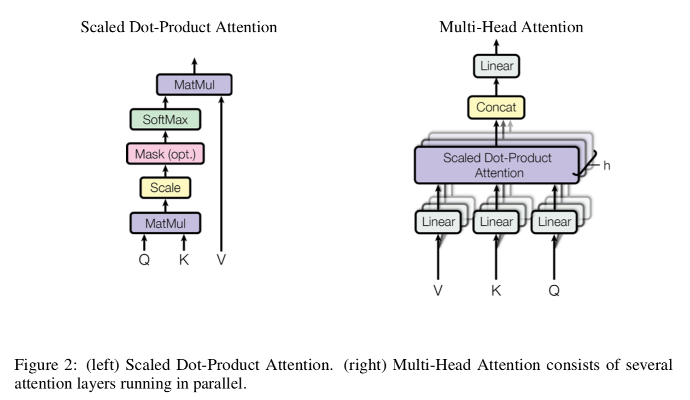
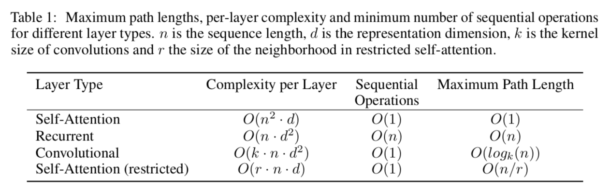
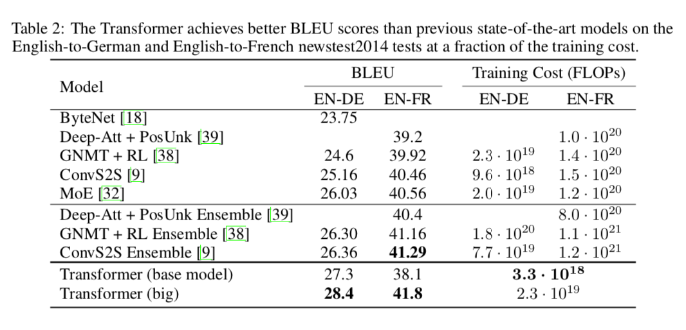
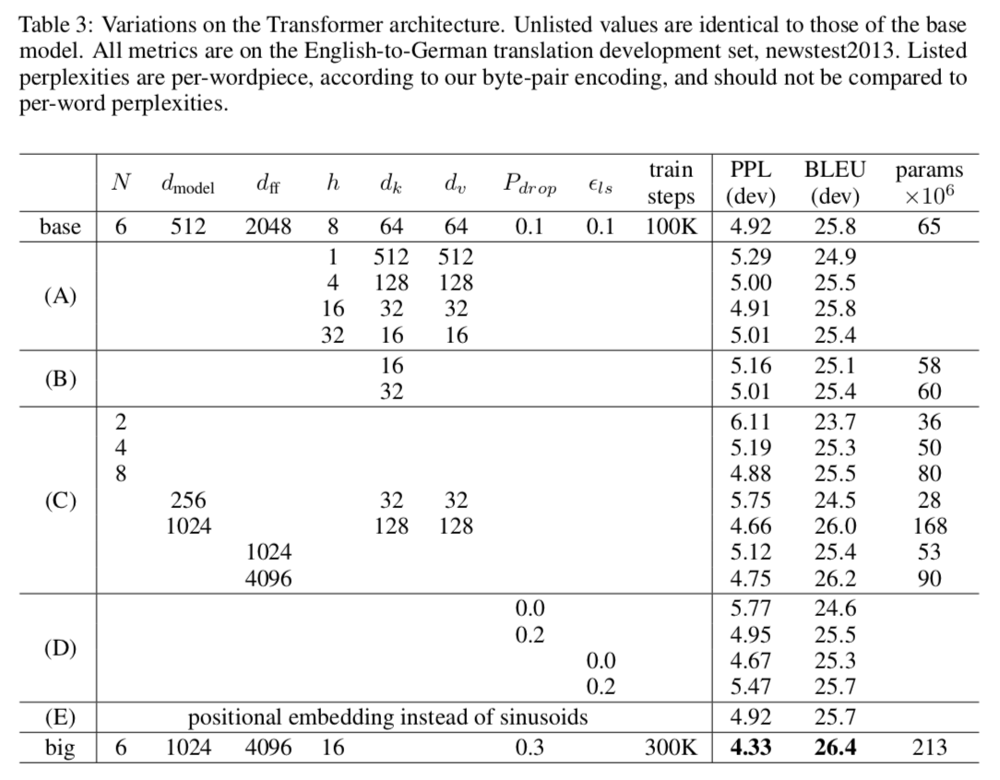
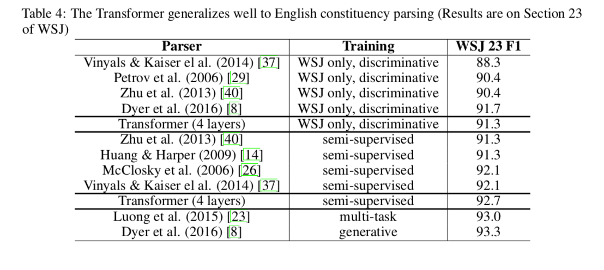
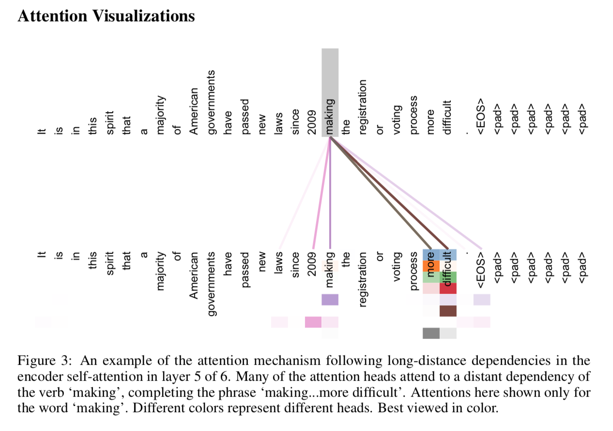
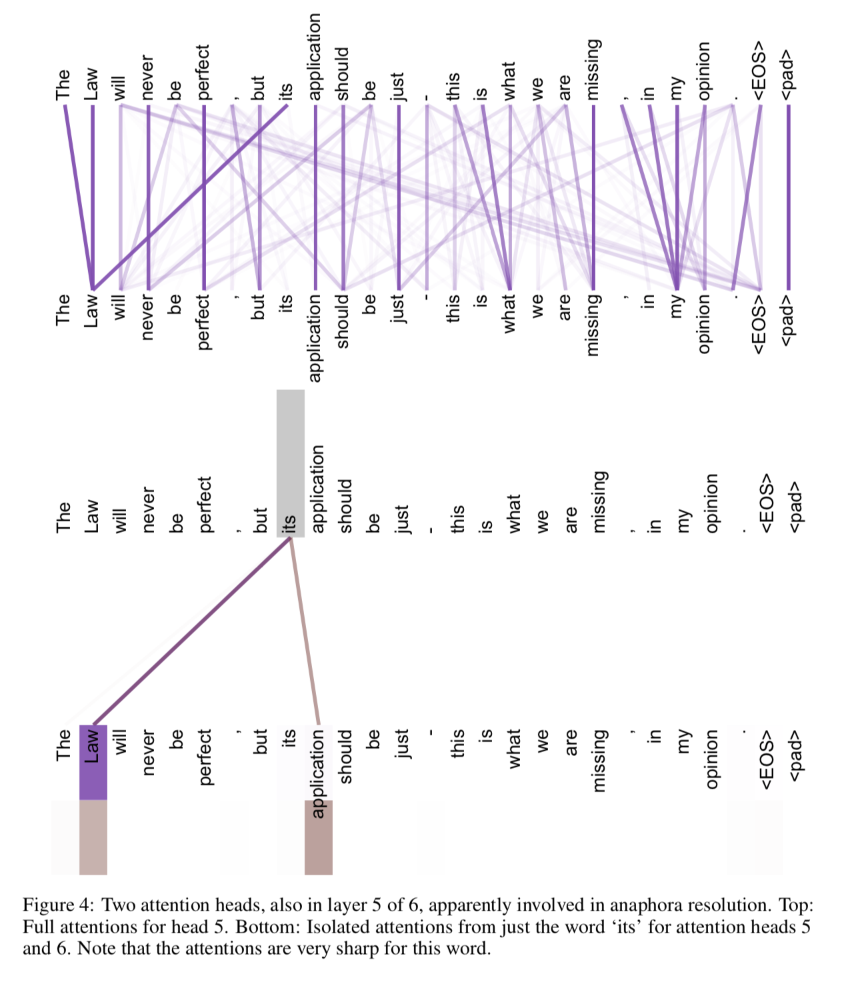
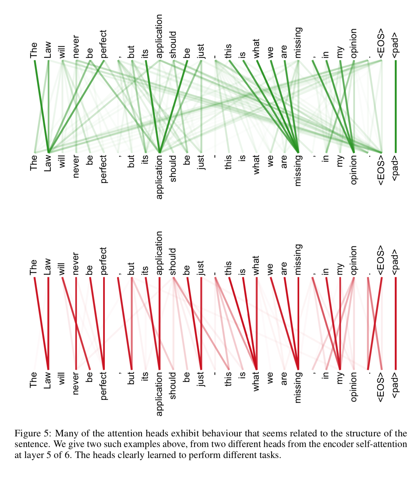

# Attention Is All You Need

## 0. Abstract

在编码器-解码器配置中**include an encoder and a decoder**，显性序列显性转录模型**dominant sequence transduction models**是基于复杂的 RNN **recurrent neural networks**或 CNN **convolutional neural networks**的。表现最佳的模型也需通过注意力机制**attention mechanism**连接编码器和解码器。我们提出了一种新型的简单网络架构——**Transformer**，它完全基于注意力机制**attention mechanism**，彻底放弃了循环**recurrence**和卷积**convolutions**。两项机器翻译任务的实验表明，这些模型的翻译质量更优，同时更并行，所需训练时间也大大减少。我们的模型在**WMT 2014 English-to-German translation task**中取得了 **BLEU** 得分 28.4 的成绩，领先当前现有的最佳结果（包括集成模型）超过 2 个 BLEU 分值。在**WMT 2014 English-to-French translation task,**上，在 8 块 GPU 上训练了 3.5 天之后，我们的模型获得了新的单模型顶级 BLEU 得分 41.0，只是目前文献中最佳模型训练成本的一小部分。我们表明 Transformer 在其他任务上也泛化很好，把它成功应用到了有大量训练数据和有限训练数据的英语组别分析(句法结构分析、成分句法分析) **English constituency parsing**上。

> **BLEU**，全称为**Bilingual Evaluation Understudy**（双语评估替换），是一个比较候选文本翻译与其他一个或多个参考翻译的评价分数。
>
> https://cloud.tencent.com/developer/article/1042161
>
> + 实质是对两个句子的**共现词频率**计算，但计算过程中使用好些技巧，追求计算的数值可以衡量这两句话的一致程度。 
> + BLEU容易陷入**常用词**和**短译句**的陷阱中，而给出较高的评分值。本文主要是对解决BLEU的这两个弊端的优化方法介绍。

## 1. Introduction

循环神经网络**RNN**，尤其是长短时记忆**LSTM**[13]和门控递归**GRU**[7]神经网络，作为语言建模和机器翻译等序列建模**sequence modeling**和转换问题**transduction problem**的最新方法，已经得到了坚实的基础[35,2,5]。此后，很多人正在努力继续推动着循环语言模型 **recurrent language models**和编解码器架构**encoder-decoder architecture**的边界[38,24,15]。

循环模型**recurrent models**通常沿着输入和输出序列的符号位置进行因子计算**factor computation**。在计算时间内将位置对应到步骤上**aligning the positions to steps**，他们生成一个隐藏状态**hidden state**的序列$h_{t}$，它是一个关于之前的函数隐藏状态$h_{t-1}$和位置$t$的输入的函数。这个固有的顺序在训练样例中，自然排除了并行化**precludes parallelization**，这使得序列的长度变得非常关键，因为内存的约束限制了**batching**的例子。最近的工作通过因子分解技巧**factorization tricks**[21]和条件计算**conditional computation**[32]在计算效率上取得了显著的提高，同时在条件计算**conditional computation**[32]的情况下也提高了模型性能。然而，顺序计算**sequential computation**的基本约束**fundamental constraint**仍然存在。

在各种任务中，注意力机制**Attention mechanisms**已经成为引人注目的序列建模和转换模型的一个组成部分，它允许对依赖项**dependencies**进行建模，而不用考虑它们在输入或输出序列中的距离**their distance in the input or output sequences**[2,19]。然而，除了少数情况外，这种注意里机制都是与循环网络一起使用的。

在这项工作中，我们提出了转换器**Transformer**，这是一个模型架构，它避免了循环网络**recurrence**，而是完全依赖于一种注意机制来绘制输入和输出之间的全局依赖关系**draw global dependencies between input and output**。转换器**Transformer**允许更多的并行化**parallelization**，并且在8个P100 GPU上进行只不过12小时的训练后，可以在翻译质量方面达到一个新的水平。

## 2. Background

减少序列计算**reducing sequential computation**的目标也构成了**the Extended Neural GPU**[16]、**ByteNet**[18]和**ConvS2S**[9]的基础，它们都使用卷积神经网络**CNN**作为基本构建块**basic building block**，对所有输入和输出位置并行计算隐藏表示**computing hidden representations in parallel**。在这些模型中，将两个任意输入或输出位置的信号关联起来所需的操作数量随位置之间距离的增加而增加，**ConvS2S**是线性的，**ByteNet**是对数的。这使得学习远距离位置[12]之间的依赖关系**learn dependencies between distant positions**变得更加困难。在**Transformer**中，这被减少到一个常数的操作数**a constant number of operations**，尽管**albeit**由于平均注意力加权位置**averaging attention-weighted positions**而降低了有效分辨率**effective resolution**，我们用**Section 3.2**中描述的多头注意力**Multi-Head Attention**抵消了这一影响。

自我注意**Self-attention**，有时也称为内注意**intra-attention**，是一种将一个序列的不同位置联系起来用来计算序列的表示**compute a representation of the sequence**的注意机制。自我注意**Self-attention**已成功地应用于各种任务中，包括阅读理解**reading comprehension**、抽象概括**abstractive summarization**、文本蕴涵**textual entailment**和学习任务无关的句子表示**learning task-independent sentence representations**[4,27,28,22]。

端到端记忆网络**End-to-end memory networks**基于循环注意力机制**a recurrent attention mechanism**，而不是序列对齐循环**sequence-aligned recurrence**，且它在简单语言问题回答和语言建模任务[34]中表现良好。

然而，就我们所知，**Transformer**是第一个不使用序列对齐的RNNs **sequence-aligned RNNs**或卷积**convolution**，而是完全依赖于自我注意**relying entirely on self-attention**来计算其输入和输出的表示的**compute representations of its input and output**转换模型**transduction model**。在接下来的部分中，我们将描述**Transformer**，激发自我注意**motivate self-attention**，并讨论它相对于[17,18]和[9]等模型的优点。

## 3. Model Architecture

大多数竞争性神经序列转换模型**competitive neural sequence transduction models**都具有**encoder-decoder**结构[5,2,35]。这里，编码器**encoder**将一个符号表示**symbol representations**的输入序列$\left(x_{1}, \ldots, x_{n}\right)$映射到一个连续表示序列**a sequence of continuous representations**$\mathbf{z}=\left(z_{1}, \ldots, z_{n}\right)$。给定$\mathbf{z}$，解码器**decoder**生成一个输出序列$\left(y_{1}, \ldots, y_{m}\right)$的符号，每次生成一个元素**element**。在每个步骤中，模型都是自动回归的 **auto-regressive**[10]，在生成下一个步骤时，使用前面生成的符号作为额外的输入。

**Transformer**遵循这一总体架构，使用**stacked self-attention and point-wise**，编码器**encoder**和解码器**decoder**都使用全连接层**fully connected layers**，分别放在**Fig. 1**的左边和右边。

> pointwise 是不是指一种卷积？

### 3.1. Encoder and Decoder Stacks

- **Encoder**：编码器由$N = 6$个相同的层**identical layers**堆成**stack**。每一层有两个子层**sub-layer**。第一个是一个多头的自我注意机制**multi-head self-attention mechanism**，第二个是一个简单的**position-wise**的全连接的前馈网络**fully connected feed-forward network**。我们在每个子层周围使用一个残差连接**employ a residual connection**[11]，然后对[1]进行层标准化**layer normalization**。也就是说，每个子层的输出是$\text{LayerNorm} (x+\text { Sublayer }(x))$，其中$\text{Sublayer} (x)$是子层本身实现的函数 **implemented by the sub-layer itself**。为了方便这些残差连接，模型中的所有子层**sub-layers**以及嵌入层**embedding layers**都产生维数为$d_{\text { model }}=512$的输出。
- **Decoder**：解码器也由$N = 6$个相同的层组成。除每个编码器层**encoder**中的两个子层外，解码器**decoder**还插入第三个子层**a third sub-layer**，该子层对编码器堆栈的输出**the output of the encoder stack**执行多头注意**multi-head attention**。与编码器**encoder**类似，我们在每个子层周围使用残差连接**employ residual connections**，然后进行层标准化**layer normalization**。我们还修改了解码器堆栈**the decoder stack**中的self-attention子层，以防止位置注意到后续位置**to prevent positions from attending to subsequent positions**。这种屏蔽**masking**，加上输出嵌入**the output embeddings**被偏移了一个位置**offset by one position**的事实，确保了对位置$i$的预测只能依赖于位置在$i$之前的**at positions less than $i$**已知输出。

## 3.2. Attention

**Attention**函数可以描述为将一次查询**a query**和一组键-值对**a set of key-value pairs**映射**map to**到输出**an output**，其中查询、键、值和输出**the query, keys, values, and output**都是向量。输出计算为值的加权和**a weighted sum of the values**，其中分配给每个值的权重**the weight assigned to each value**是由查询和对应的键**the query with the corresponding key**的兼容性函数**a compatibility function**计算得到的。

### 3.2.1 Scaled Dot-Product Attention 按比例缩放的点积Attention

我们将我们的特殊**attention**机制称为**“Scaled Dot-Product Attention” (Fig. 2)**。输入由维数为$d_{k}$的查询**queries**和键**keys**以及维度为$d_{v}$的值**values**组成。我们计算使用所有键**all keys**进行查询**query**的点积，每个都除以$\sqrt{d_{k}}$，并应用softmax函数获得这些值的权重。

在实践中，我们同时**simultaneously**计算一组查询**a set of queries**上的**attention**函数，并将其打包成矩阵**packed into matrices** $Q$。键和值也一起打包成矩阵$K$和$V$。我们计算输出矩阵**the matrix of outputs**为:
$$
\text { Attention }(Q, K, V)=\operatorname{softmax}\left(\frac{Q K^{T}}{\sqrt{d_{k}}}\right) V
$$
两个最常用的**attention**函数是**additive attention**[2]和**dot-product (multiplicative) attention**。**Dot-product attention**和我们的算法是一样的**identical**，除了比例（缩放）因子**scaling factor**$\frac{1}{\sqrt{d_{k}}}$。**Additive attention**使用带一个单独隐藏层**a single hidden layer**的前馈网络**feed-forward network**来计算兼容性函数**the compatibility function**。虽然这两种方法在理论上的复杂度相似，但由于可以使用高度优化的矩阵乘法代码**highly optimized matrix multiplication code**来实现，因此**dot-product attention**在实践中更快、更节省空间**more space-efficient**。

对于较小的$d_{k}$值，这两种机制的性能相似，对于较大的$d_{k}$[3]值，在不缩放的情况下**without scaling**，**additive attention**优于**dot-product attention**。我们怀疑，对于较大的$d_{k}$值，**dot products**的大小会变大，从而将softmax函数推入它的梯度非常小的区域。为了抵消这种影响，我们将点积缩放$\frac{1}{\sqrt{d_{k}}}$。

### 3.2.2. Multi-Head Attention

我们发现，用h个**h-times**不同的、学习过的线性投影**different, learned linear projection**把queries，keys，和values投影到到$d_{k}, d_{k}$ 和 $d_{v}$维度上，而不是用单一的对$d_{\text { model }}$ - dimensional keys, values and queries的attention函数，是更有益的。对于这些查询、键和值的投影版本，我们将并行执行注意函数，生成$d_{v}$ -dimensional的输出值**output values**。这些值被连接起来**concatenated**并再次投影，得到最终的值**final values**，如**Fig. 2**所示。

多头注意**Multi-head attention**允许模型在不同的位置共同关注来自不同表示子空间**representation subspaces**的信息。用一个单一的注意力头，平均**averaging**可以抑制**inhibits**这种情况。
$$
\begin{aligned} \operatorname{MultiHead}(Q, K, V) &=\operatorname{Concat}\left(\text { head }_{1}, \ldots, \operatorname{head}_{\mathrm{h}}\right) W^{O} \\ \text { where head }_{\mathrm{i}} &=\operatorname{Attention}\left(Q W_{i}^{Q}, K W_{i}^{K}, V W_{i}^{V}\right) \end{aligned}
$$
这里的投影是参数矩阵$W_{i}^{Q} \in \mathbb{R}^{d_{\text { model }} \times d_{k}}, W_{i}^{K} \in \mathbb{R}^{d_{\text { model }} \times d_{k}}, W_{i}^{V} \in \mathbb{R}^{d_{\text { model }} \times d_{v}}\ and \ W^{O} \in \mathbb{R}^{h d_{v} \times d_{\mathrm{model}}}$

在这项工作中，我们使用了$h = 8$个平行的注意力层**parallel attention layers**，或者说头部**heads**。对于每一个注意力头，我们使用$d_{k}=d_{v}=d_{\text { model }} / h=64$。由于每个头的维数减小，总计算成本与全维度的单头注意 **single-head attention with full dimensionality**的成本相近。

### 3.2.3. Applications of Attention in our Model

**Transformer**在三个不同的方面使用了多头注意**multi-head attention**：

- 在“编码器-解码器注意力”层**"encoder-decoder attention" layers**中，查询**queries**来自于前一个解码器层，存储键和值**the memory keys and values**来自于编码器的输出。这使得解码器中的每个位置都可以参与输入序列中的所有位置。这模拟了**sequence-to-sequence**模型中典型的编码器-解码器注意力机制**encoder-decoder attention mechanism**。
- 编码器包含自我注意层**self-attention layers**。在一个self-attention层中，所有的键、值和查询都来自同一个位置，在本例中，是编码器中上一层的输出。**encoder**中的每个位置都可以关注**attend to**解码器上一层中的所有位置。
- 类似地，**decoder**中的自我注意层允许**decoder**中的每个位置关注**attend to**解码器中的所有位置，直到该位置并包括该位置**up to and including that position**。为了保持解码器的自动回归特性**auto-regressive property**，需要防止解码器中的左向信息流**leftward information flow**。我们通过屏蔽**masking out**(设置为负无穷)**softmax**输入中对应于非法连接的所有值，实现了缩放的点积注意力的这种方法。参见**Fig. 2**。

> 最后一句不知道怎么翻译。。。?

## 3.3. Position-wise Feed-Forward Networks

除了注意子层**attention sub-layers**，我们的编码器和解码器中的每一层都包含一个全连接的前馈网络**fully connected feed-forward network**，它分别、同样地应用于每个位置。它由两个中间由一个ReLU激活的线性变换组成。
$$
\mathrm{FFN}(x)=\max \left(0, x W_{1}+b_{1}\right) W_{2}+b_{2}
$$
虽然不同位置上的线性变换是相同的，但是它们在不同的层之间使用不同的参数。另一种描述方法是用内核大小为1的两个卷积**2 convolutions with kernel size 1**。输入输出的维度为$d_{\text { model }}=512$，内层维度为$d_{f f}=2048$。

## 3.4. 词嵌入和softmax Embeddings and Softmax

与其他序列转换模型**sequence transduction model**类似，我们使用习得的嵌入**learned embeddings**将输入令牌**input tokebs**和输出令牌**output tokens**转换为维度$d_{\text { model }}$的向量。我们也使用通常的习得的线性变换**learned linear transformation**和**softmax**函数将解码器输出转换为预测的下一个令牌概率**predicted next-token probabilities**。在我们的模型中，我们在两个嵌入层**embedding layers**和**pre-softmax**线性变换之间共享相同的权值矩阵**weight matrix**，类似于[30]。在嵌入层**embedding layers**中，我们将这些权重乘以$\sqrt{d_{\text { model }}}$

## 3.5. 位置编码 Position Encoding

由于我们的模型不包含递归**recurrence**和卷积**convolution**，为了让模型可以利用序列的顺序，我们必须注入一些关于序列中令牌**tokens**的相对或绝对位置的信息。为此，我们将“位置编码**position encodings**”添加到编码器和解码器堆栈底部**the bottoms of the encoder and decoder stacks**的输入嵌入**input embeddings**中。位置编码**positional encodings**与嵌入编码**embeddings**具有相同的维度$d_{\text { model }}$，因此可以对二者进行求和。位置编码**positional encodings**的选择有很多，学习和固定的**learned and fixed**也是[9]。

> ***Table 1***
>
> 对不同层类型的 最大路径长度、每层复杂度和最小顺序操作数。$n$为序列长度，$d$为表示维数，$k$为卷积的核大小，$r$为受限的self-attention中邻域的大小。

在这项工作中，我们使用不同频率的正弦和余弦函数:
$$
\begin{aligned} P E_{(\text { pos }, 2 i)} &=\sin \left(\text { pos } / 10000^{2 i / d_{\text { model }}}\right) \\ P E_{(\text { pos }, 2 i+1)} &=\cos \left(\text {pos} / 10000^{2 i / d_{\text { model }}}\right) \end{aligned}
$$
其中$pos$为位置，$i$为维度。也就是说，位置编码**positional encoding**的每个维度对应于一个正弦曲线**sinusoid**。波长组成了一个从2$\pi$ 到 $10000\cdot 2 \pi$的几何级数。我们选择这个函数是因为我们假设它可以让模型很容易地学习相对位置**learn to attend by relative positions**，因为对于任何固定偏移量**fixed offset** $k, PE_{pos +k}$都可以表示为$PE_{pos}$的线性函数。

我们还使用了**learning position embeddings**[9]进行了实验，发现这两个版本的结果几乎相同 (见**Table 3 row (E)**)。我们选择正弦版本，因为它可能允许模型推断出**extrapolate**比训练中遇到的更长的序列长度**sequence lengths**。

# 4. Why Self-Attention

在本节中，我们从各个方面将自我注意层**self-attention layers**与通常用于将一个变长符号表示序列$\left(x_{1}, \dots, x_{n}\right)$映射到另一个长度相等的序列$\left(z_{1}, \ldots, z_{n}\right)$，$x_{i}, z_{i} \in \mathbb{R}^{d}$的循环和卷积层**recurrent and convolutional layers**做对比，如典型的序列转换编码器或解码器**sequence transduction encoder or decoder**中的一个隐藏层**a hidden layer**。激励我们使用自我关注**self-attention**，我们考虑三个愿景**desiderata**。

第一个是每层的总计算复杂度**the total computational complexity per layer**。另一个是可以并行化的计算量**the amount of computation that can be parallelized**，可由所需的最小顺序操作数**minimum number of sequential operations required**来衡量。

第三个是网络中远程依赖项**long-range dependencies**之间的路径长度**path length**。在许多序列转换任务**sequence transduction tasks**中，学习长期依赖关系是一个关键的挑战。影响学习这种依赖关系能力的一个关键因素是在网络中前进和后退信号必须经过的路径的长度**the length of the paths forward and backward signals have to traverse in the network**。输入和输出序列中任意位置组合之间的路径越短，就越容易学习长期依赖关系[12]。因此，我们还比较了由不同层类型组成的网络中任意两个输入和输出位置之间的最大路径长度**maximum path length**。

如**Tab. 1**所示，一个自注意力层**self-attention layer**将所有位置连接到一常数序列执行的操作**a constant number of sequentially executed operations**，而一个循环层**recurrent layer**需要$O(n)$个序列操作**sequential operations**。在计算复杂度方面，当序列长度$n$小于表示维数**representation dimensionality** $d$时，**self-attention**层速度比循环层**recurrent layers**更快，这是最常见使用的最先进的机器翻译模型的情况，如**word-piece[38]和byte-pair[31] representations**。为了提高涉及非常长的序列的任务的计算性能，可以将注意力限制在只考虑输入序列中以各自的输出位置为中心的一个大小为$r$的邻域。这将把最大路径长度增加到$O(n/r)$。我们计划在未来的工作中进一步研究这种方法。

一个内核宽度**kernel width**为$k < n$的单一卷积层**single convolutional layer**不能连接所有对的输入、输出位置**all pairs of input and output**。这样做需要在$O(n/k)$卷积层的堆栈**a stack of $O(n/k)$ convolutional layers** (相邻内核**contiguous kernels**) 的情况下，或者$O(logk(n))$在扩展卷积**dilated convolutions**[18]的情况下，增加网络中任意两个位置之间最长路径的长度。卷积层通常比循环层昂贵$k$倍。然而，可分离卷积**separable convoluyions**[6]可将复杂度**complexity**大大降低到$O(k·n·d + n·d^2)$。但是，即使$k = n$，可分离卷积的复杂度也等于一个自我注意层和一个点向前馈层**a self-attention layer and a point-wise feed-forward layer**的组合，这也就是我们在模型中采用的方法。

作为附带的优点，自注意力**self-attention**可以产生更多可解释的**interpretable**模型。我们从模型中审查**inspect**注意力的分布**attention distribution**，并在附录中给出和讨论示例。不仅单个个体的注意力头**individual heads**清楚地学会了执行不同的任务，许多注意力头**many**还表现出与句子的句法和语义结构**syntactic and semantic structure of the sentences**相关的行为。

# 5. Training

本节描述模型的训练机制**the training regime**。

## 5.1. Training Data and Batching

我们在标准的WMT 2014英德数据集上进行培训，该数据集包含大约450万对句子。句子使用字节对编码**byte-pair encoding**[3]进行编码，[3]具有大约37000个标记**tokens**的源目标共享词汇表**a shared source-target vocabulary**。对于英法翻译，我们使用了更大的WMT 2014英法双语数据集，其中包含3600万个句子，并将标记**tokens**拆分为32000个单词组成的词汇**word-piece vocabulary**[38]。句子对**sentence pair**以近似的序列长度**approximate sequence length**拼凑在一起**were batched together**。（应该是长度相近的句子放在一个batch中的意思）每个训练**batch**包含包含大约25000个源标记**source tokens**和25000个目标标记**target tokens**的句子对**sentence pairs**。

## 5.2. Hardware and Schedule

我们在一台装有8台***NVIDIA P100 GPUs***的机器上训练我们的模型。对于使用本文中描述的超参数的基础模型，每个训练步骤**training step**大约花费0.4秒。我们总共训练了10万步或12小时的基础模型。对于我们的大型模型(见**Tab. 3**的最底下的一行)，**step time**为1.0秒。这个大型模型经过了30万步(3.5天)的训练。

## 5.3. Optimizer

我们使用了**Adam**优化器，参数设为$\beta_{1}=0.9, \beta_{2}=0.98$ 和 $\epsilon=10^{-9}$。我们在训练过程中根据公式改变学习率:
$$
lrate=d_{\text { model }}^{-0.5} \cdot \min \left(step\_ num^{-0.5},step\_num\cdot warmup\_steps^{-1.5}\right)
$$
这对应于学习率对第一个$warmup\_steps$的训练步长**training steps**线性增加，且对步骤数**the step number**的平方根的倒数按比例减少。我们使用的是$warmup\_steps = 4000$。

## 5.4. Regularization

我们在训练中采用了三种类型的**Regularization**:

- **Residual Dropout.** 我们将**dropout**[33]应用于每个子层**sub-layer**的输出，然后将其添加到子层输入并进行规范化**normalized**。此外，我们将**dropout**应用于编码器和解码器堆栈**encoder and decoder stacks**中的嵌入和位置编码**embeddings and positional encodings**。对于基础模型，我们使用$P_{d r o p}=0.1$的速率。
- **Label Smoothing.** 训练中，我们使用标签的平滑值$\epsilon_{l s}=0.1$ [36]。这伤害了困惑度**perplexity**，因为模型学会了更加不确定**to be unsure**，但提高了准确性**accuracy**和BLEU评分。

> **困惑度Perplexity**：
>
> 信息熵的对数，越小越好
>
> https://blog.csdn.net/index20001/article/details/78884646
>
> https://segmentfault.com/a/1190000010095479

# 6. Result

## 6.1. Machine Translation

> ***Table 2***
>
> **Transformer**在2014年的英德和英法 newstest2014 测试中，以之前最先进模型训练成本的一小部分获得了更好的BLEU分数。

在2014年WMT英德翻译任务中，**big transformer model**(见**Tab. 2**中的**Transformer (big)**)的比之前报道的最佳模型(**including ensembles**)高出2.0 BLEU以上，建立了一个新的最先进的BLEU评分28.4。**Tab. 3**的底部列出了该模型的配置**configuration**。在8个 P100 GPUs上训练了3.5天。甚至我们的基础模型也超过了所有以前发布的模型和它们的集成，而训练成本只是任何竞争模型的一小部分。

在2014年WMT英法翻译任务中，我们的大模型获得了41.0的BLEU评分，以不到之前最先进模型的训练成本的1/4，超过了之前发布的所有单个模型。为英法任务，**Transformer(big)**模型使用了**dropout rate**$P_{d r o p}=0.1$，而不是$0.3$。

对于基础模型，我们使用了一个通过对最后5个**checkpoints**进行平均而得到的模型，这些检查点每隔10分钟写入一次。对于**big models**，我们使用最后20个**checkpoints**的平均。我们使用**beam size**为4和长度惩罚项**length penalty**为$\alpha=0.6$的集束搜索**beam search**[38]。这些超参数是在开发集**development set**上进行实验后选择的。我们在推断时将最大输出长度设置为**input length + 50**，但在可能的情况下提前终止[38]。

> - **Beam Search（集束搜索）**是一种启发式图搜索算法，通常用在图的解空间比较大的情况下，为了减少搜索所占用的空间和时间，在每一步深度扩展的时候，剪掉一些质量比较差的结点，保留下一些质量较高的结点。这样减少了空间消耗，并提高了时间效率，但缺点就是有可能存在潜在的最佳方案被丢弃，因此，Beam Search算法是不完全的，一般用于解空间较大的系统中。
>
> 该算法常用的场景如：机器翻译，语音识别，当系统的数据集比较大，计算资源受限，而且没有唯一最优解时，该算法能够较快的找到接近最正确的解。
>
> https://www.jianshu.com/p/22e10e1728d2

**Tab. 2**总结了我们的结果，并将我们的翻译质量和训练成本与文献中的其他模型架构进行了比较。我们通过乘以训练时间**the training time**、使用的GPU数量**the number of GPUs used**和对每个GPU持续单精度浮点容量的估计**an estimate of the sustained single-precision floating-point capacity of each GPU**，来估计用于训练一个模型的浮点运算的数量 **the number of floating point operations**。

## 6.2. Model Variations

> ***Table 3: Transformer 架构上的变化***
>
> 未列出的值与基本模型的值相同**identical**。所有指标都在英德翻译的开发集newstest2013上。根据我们的字节对编码**byte-pair encoding**，列出的**perplexities**是**per-wordpiece**的，不应该与**per-word perplexities**进行比较。

为了评估**Transformer**不同组件**different components**的重要性，我们以不同的方式改变了我们的基本模型，在开发集newstest2013上测量了英德翻译的性能变化。我们使用前一节描述的集束搜索**beam search**，但是没使用检查点平均**checkpoint averaging**。我们在**Tab. 3**中给出了这些结果。

在**Tab. 3 行rows(A)**中，保持计算量不变**keeping the amount of computation constant**，我们改变了注意力头的数量**the number of attention heads**、注意力键和值的维度**the attention key and value dimensions**，如**Section 3.2.2**所述。虽然单头注意力**single-head attention**比最佳设置差0.9个BLEU，但过多的头也会降低质量**quality also drops off with too many head**。

在**Tab. 3 行rows(B)**中，我们观察到降低注意力键的**size **$d_{k}$会影响模型质量。这表明确定兼容性**determining compatibility**并不容易，一个比点积更复杂的兼容性函数**a more sophisticated compatibility function**可能是有益的。我们在(C)和(D)行中进一步观察到，正如预期的那样，越大的模型越好，并且**dropout**对于避免过拟合非常有帮助。在第(E)行中，我们用习得的位置嵌入**learned positional embeddings**[9]替换正弦位置编码**sinusoidal positional encoding**，并观察到与基础模型几乎相同的结果。

## 6.3. 英语成分句法分析 English Constituency Parsing

> - **constituent parsing & dependency parsing**
>
> https://zhuanlan.zhihu.com/p/31766972

为了评估**Transformer**是否可以推广到其他任务，我们对英语成分句法分析**English Constituency Parsing**进行了实验。这一任务提出了具体的挑战：输出受到强大的结构约束**is subject to strong structural constraints**，并且比输入长得多。此外，**RNN sequence-to-sequence models**还不能在小数据[37]中获得最先进的结果。

我们在Penn Treebank[25]的WSJ(Wall Street Journal)部分对一个**4-layer Transformer**进行了$d_{model} = 1024$的训练，训练语句约为40K。我们还在半监督的环境中**in a semi-supervised setting**对其进行了训练，使用了更大的高置信度**the larger high-confidence**和BerkleyParser语料库**corpora**，这语料库由大约1700万句[37]组成。我们在华尔街日报**WSJ**的**only setting**中使用了16K个令牌词汇**tokens**，在半监督设置中使用了32K个令牌词汇**tokens**。

我们在Section 22 development set上只进行了少量的实验来在英德的base translation model中选择**dropout**、**attention**和**residual** (**Section 5.4**)、学习率**learning rates**和集束大小**beam size**，其他所有参数都保持不变。在推理过程中**during inference**，我们将最大输出长度**the maximum output length**增加到**input length + 300**。我们在WSJ和semi-supervised setting中，设置beam size为21和$\alpha = 0.3$。

我们在**Tab. 4**中的结果表明，尽管缺乏特定于任务的调优**despite the lack of task-specific tuning our model**，我们的模型执行得非常好，除了递归神经网络语法**Recurrent Neural Network Grammar**[8]之外，它比所有之前报告的模型都有更好的结果。

与**RNN sequence-to-sequence models**[37]相比，即使只在华尔街日报的40K句训练集上进行训练**the WSJ training set of 40K sentences**，**Transformer**的性能也优于**Berkeley-Parser**[29]。

# 7. Conclusion

在这项工作中，我们提出了**Transformer**，第一个完全基于注意力机制的**based entirely on attention**序列转换模型**sequence transduction model**，取代了有多头自注意力的**with multi-headed self-attention**编码器和解码器架构**encoder-decoder architectures**中最常用的循环层**recurrence layers**。

对于翻译任务**translation tasks**，**Tranformer**可以比基于循环层或卷积层**recurrent or convolutional layers**的架构训练得快得多。在2014年WMT英德和英法翻译任务中，我们都达到了一个新的水平**achieve a new state of art**。在前一个任务中，我们的最佳模型甚至优于之前所有模型的集成**ensembles**。

我们对基于注意力的模型的未来感到兴奋，并计划将其应用于其他任务。我们计划将**Transformer**扩展到涉及文本以外**other than text**的输入和输出模式**input and output modalities**的问题，并研究局部的、受限的注意机制**local, restricted attention mechanisms**，以便有效地处理大量输入和输出，如图像、音频和视频。减少生成的连续性**Making generation less sequential**是我们的另一个研究目标。

> - generation指代什么？？是生成么= =

我们用来训练和评估模型的代码可以在https://github.com/tensorflow/tensor2tensor中找到。

# 8. Attention Visualization

> Figure 3.
>
> 

