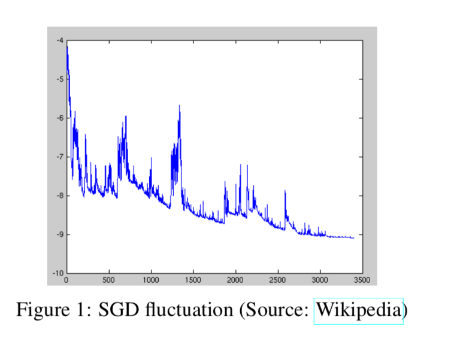
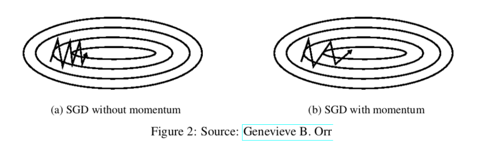
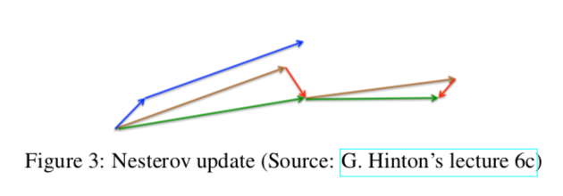
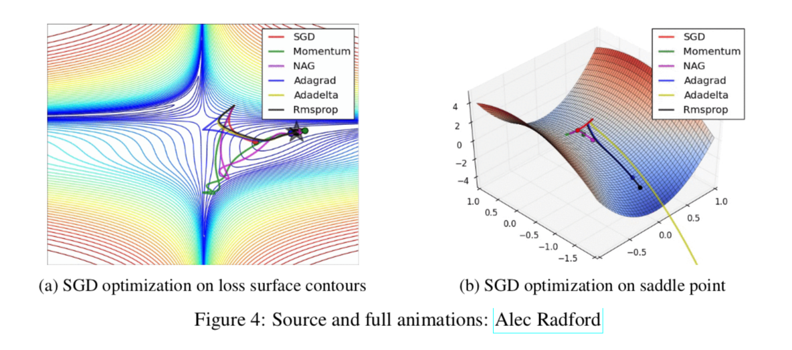

# 梯度下降优化算法概览/综述

## 0. 摘要

梯度下降优化算法虽然越来越流行，但因为其在实践中体现的优缺点很难得到解释**practical explanations of their strengths and weaknesses are hard to come by**，所以经常被用作黑盒**black-box**优化算法。本文旨在为读者提供有关不同算法行为的直觉，使她能够使用这些算法。在这个概述的过程中，我们观察了梯度下降的不同变体，总结了面临的挑战，介绍了最常见的优化算法，回顾了并行和分布式设置中的架构，并研究了优化梯度下降的其他策略。

## 1. 介绍

梯度下降**Gradient descent**法是目前最常用的优化算法之一，也是目前最常用的神经网络优化方法。同时，每一个最先进**state-of-the-art**的深度学习库**Deep Learning library**都包含各种算法来实现梯度下降的优化（例如[lasagne's](http://lasagne.readthedocs.org/en/latest/modules/updates.html)、[caffe's](http://caffe.berkeleyvision.org/tutorial/solver.html)和[keras'](http://keras.io/optimizers/)文档）。然而，这些算法通常被用作黑盒优化器，因为它们的优缺点很难得到实际解释。

本文旨在为读者提供不同梯度下降优化算法行为的直觉，以这将有助于应用它们。在**Section 2**中，我们将首先介绍梯度下降的不同变体。然后，我们将在**Section 3**中简要总结训练过程中遇到的挑战。随后，在**Section 4**中，我们将介绍最常见的优化算法，通过展示它们解决这些挑战的动机，以及这如何引出它们的更新规则**update rules**的推导**derivation**。然后，在**Section 5**中，我们将简要介绍在并行和分布式设置中优化梯度下降的算法和架构。最后，我们将在**Section 6**中考虑有助于优化梯度下降的其他策略。

梯度下降是通过在目标函数*w.r.t.(with respect to)*对于参数的梯度$\nabla_{\theta} J(\theta)$的相反方向上，更新模型参数$\theta \in \mathbb{R}^{d}$来最小化目标函数$J(\theta)$的一种方法。学习率$\eta$决定了我们达到（局部）最小值**a (local) minimum**的步长。换句话说，我们沿着目标函数产生的地面坡度的方向下坡，直到我们到达山谷。

## 2. 梯度下降的变体 Gradient descent variants

梯度下降有三种变体，它们在计算目标函数梯度时使用的数据量不同。根据使用的数据量的不同，我们在参数更新的准确性**accuracy**和执行更新所需的时间**time**之间进行权衡**trade-off**。

### 2.1. 批处理梯度下降 Batch gradient descent

一般的梯度下降法**vanilla gradient descent**，也就是**(aka，又称)**批处理梯度下降法，对于整个训练数据集，计算*w.r.t.*参数$\theta$的损失函数**cost function**的梯度:

$$
\theta=\theta-\eta \cdot \nabla_{\theta} J(\theta)\quad\quad\quad\quad (1)
$$
由于我们需要计算整个数据集**the whole dataset**的梯度来执行一次更新，因此批处理梯度下降可能非常慢，而且对于内存大小不合适的数据集是难以处理的 **(intractable, 棘手的)**。批量梯度下降也不允许我们在线**online**更新我们的模型，即用新的例子**on-the-fly**。（应该表示的是结果是动态变化的，而不是预定义**predefined**的）

在代码中，批量梯度下降看起来是这样的：

```python
for i in range(nb_epochs):
		params_grad = evaluate_gradient(loss_function, data, params)
  	params = params - learning_rate * params_grad
```

对于预定义**pre-defined**的**epoch**数量，我们首先计算整个数据集的损失函数的梯度向量**params_grad**。请注意，最先进的深度学习库提供自动微分，可以有效地计算w.r.t.一些参数的梯度。如果你自己推导梯度，那么梯度检查**gradient checking**是个好主意。

```python
"""
就是正向求导和反向求导对比检查是不是一样的……
"""
def gradient_check(x, theta, epsilon = 1e-7):
 
    thetaplus = theta + epsilon
    thetaminus = theta - epsilon
 
    J_plus = forward_propagation(x, thetaplus)
    J_minus = forward_propagation(x, thetaminus)
 
    gradapprox = (J_plus - J_minus) / (2 * epsilon)
 
    grad = backward_propagation(x, theta)
 
    numerator = np.linalg.norm(grad - gradapprox)
    denumerator = np.linalg.norm(grad) + np.linalg.norm(gradapprox)
    difference = numerator / denumerator
 
    if difference < epsilon:
        print("The gradient is correct!")
 
    else:
        print("The gradient is wrong!")
 
    return difference


x, theta = 2, 4
difference = gradient_check(x, theta)
print("difference = " + str(difference))
```

然后我们沿着梯度的方向更新参数，学习率决定了我们执行的更新的步长。批量梯度下降是可以保证收敛于凸误差曲面**convex error surfaces**的全局最小值**global minimum**和非凸曲面**non-convex surface**的局部最小值**local minimum**。

### 2.2. 随机梯度下降 Stochastic gradient descent

与之不同的是，随机梯度下降(SGD)对每个训练实例$x^{(i)}$和标签$y^{(i)}$进行参数更新：
$$
\theta=\theta-\eta \cdot \nabla_{\theta} J\left(\theta ; x^{(i)} ; y^{(i)}\right) \quad\quad\quad\quad(2)
$$
批量梯度下降对大型数据集执行冗余计算**redundant computations**，因为它在每次更新参数之前都要为相似的例子重新计算梯度。SGD通过一次执行一个更新来消除这种冗余**redundancy**。因此，它通常更快，也可以用于在线学习**learn online**。SGD执行频繁的更新，其方差很大**high variance**，导致目标函数剧烈波动**fluctuate heavily**，如**Fig 1**所示。



虽然批量梯度下降收敛到参数所在盆地**basin**的最小值（这个意思应该是局部的极小值，但是是basin的最小值），但SGD的波动一方面使其能够跳到新的、可能更好的局部极小值。另一方面，这最终会使收敛变得非常复杂，因为SGD将继续超调**overshooting**（应该就是过度调整，或者不会在min stop）。然而，已有研究表明，当我们缓慢降低学习速度时，SGD表现出与批量梯度下降相同的收敛行为，对于非凸优化和凸优化，SGD几乎肯定会收敛到局部或全局最小值。它的代码片段只是在训练示例上添加一个循环，并计算w.r.t.每个示例的梯度。请注意，如**Section 6.1**所述，我们在**每个epoch中**重新排列**shuffle**（shuffle函数在python里是随机排列数据）训练数据。

```python
for i in range(nb_epochs):
  	np.random.shuffle(data)
    for example in data:
      	params_grad = evaluate_gradient(loss_function , example , params)
        params = params - learning_rate * params_grad
```

### 2.3. Mini-batch gradient descent

**Mini-batch gradient descent**最终取两者之精华，对每一个小批量**mini-batch** 的n个训练实例进行更新:
$$
\theta=\theta-\eta \cdot \nabla_{\theta} J\left(\theta ; x^{(i : i+n)} ; y^{(i : i+n)}\right)\quad\quad\quad\quad(3)
$$
这样，

a) 减小了参数更新的方差，使收敛更加稳定;

b) 可以利用最先进的深度学习库中常见的高度优化的矩阵优化，使梯度w.r.t.的计算非常高效。

常见的**mini-batch**大小范围在50到256之间，但可以根据不同的应用而有所不同。**Mini-batch gradient descent**是神经网络训练中常用的算法，小批量梯度下降法也常被称为SGD。注:在本文其余部分对SGD的修改中，我们为简便省略了参数$x^{(i : i+n)} ; y^{(i : i+n)}$。

在代码中，我们不再遍历每个例子**iterating over examples**，而是遍历大小为50的**mini-batch**：

```python
for i in range(nb_epochs):
  	np.random.shuffle(data)
    for batch in get_batches(data, batch_size=50):
      	params_grad = evaluate_gradient(loss_function, batch, params)
        params = params - learning_rate * params_grad
```

# 3. Challenges

然而，一般的小批量梯度下降**vanilla mini-batch gradient descent**并不能保证良好的收敛性，我们还面临着一些需要解决的挑战:

+ 选择合适的学习速度可能很难。学习速率过小会导致收敛异常缓慢，而学习速率过大则会阻碍收敛，导致损失函数在最小值附近波动，甚至出现发散。
+ 学习率计划**learning rate schedules**[18]试图在训练过程中调整学习率，例如退火**annealing**，即根据预定义的时间表**pre-defined schedule**或当目标的变化在两个**epoch**之间低于阈值**threshold**时降低学习率。然而，这些调度**schedules**和阈值**thresholds**必须预定义，因此无法适应数据集的特性[4]。**（这里应该是说要根据dataset的不同而改变吧）**
+ 此外，相同的学习率是用于所有参数更新的。如果我们的数据是稀疏的，并且我们的特性具有非常不同的频率**have very different frequencies**，那么我们可能不希望将所有特性更新到相同的程度，而是想对很少出现的特性**rarely occurring features**执行更大的更新。
+ 最小化神经网络常见的高度非凸误差函数的另一个关键挑战是避免陷入大量次优局部极小值。Dauphin等人[5]认为，困难实际上不是来自局部极小值，而是来自鞍点**saddle**，即一个维度向上倾斜，另一个维度向下倾斜的点。这些鞍点通常被一个相同误差的平面所包围，这使得SGD难以逃脱，因为梯度在所有维度上都接近于零。

## 4. 梯度下降优化算法

接下来，我们将概述一些被深度学习社区**Deep Learning community**广泛使用的算法来处理上述**aforementioned**挑战。我们不会讨论在高维数据集的实际计算中不可行的算法，例如二阶方法，如牛顿法[7]。

### 4.1. 动量

SGD很难在沟壑**ravines**中导航，也就是说，一个维度表面的曲线比另一个维度上的[20]曲线要陡峭得多，这在局部最优值附近很常见。在这些情况下，SGD在沟谷的斜坡上振荡，而只在底部朝着局部最优方向缓慢前进，如**Fig 2a**所示。



动量**momentum**[17]是一种在相关方向上加速SGD并抑制振荡的方法，如**Fig 2b**所示。它通过给当前更新向量添加一个过去更新向量的$\gamma$份数。

$$
\begin{aligned} v_{t} &=\gamma v_{t-1}+\eta \nabla_{\theta} J(\theta) \\ \theta &=\theta-v_{t} \quad\quad\quad\quad\quad\quad\quad\quad(4)\end{aligned}
$$
动量项$\gamma$通常设置为0.9或相似的值。

本质上，当使用动量时，我们把球推下山。球在滚下坡时积累的动力，变得越来越快的路上(直到它达到终端速度,如果有空气阻力,即γ< 1)。同样的事情发生在我们的参数更新上：动量项增加对指向同一个方向维数的更新，减少对梯度变化方向维数的更新。因此，我们获得更快的收敛速度和减少振荡。

### 4.2. Nesterov accelerated gradient

然而，一个从山上滚下来的球，盲目地跟着斜坡走，是非常令人不满意的。我们想要一个更聪明的球，一个知道它要去哪里的球，这样它就知道在山再次倾斜之前减速。

**Nesterov accelerated gradient(NAG)**[14]是一种给动量项赋予这种预见性**prescience**的方法。我们知道，我们将使用我们的动量项$\gamma v_{t-1}$来改变参数$\theta$。计算$\theta-\gamma v_{t-1}$，因此给了我们一个下一个参数未知的近似估计(对于整体更新，是没有使用梯度信息的**the gradient is missing for the full update**)，也给了我们一个对未来参数变化粗略的想法。我们现在可以有效地展望未来，不是通过计算对于我们当前的参数$\theta$，而是在我们参数未来近似的位置上，来计算梯度。
$$
\begin{aligned} v_{t} &=\gamma v_{t-1}+\eta \nabla_{\theta} J\left(\theta-\gamma v_{t-1}\right) \\ \theta &=\theta-v_{t} \quad\quad\quad\quad\quad\quad\quad\quad\quad\quad\quad\quad\quad(5)\end{aligned}
$$
再一次，我们设置动量项$\gamma$的值约为0.9。而动量首先计算当前梯度**(Fig 3** 中的小的蓝色向量)，然后需要更新的积累梯度方向(大的蓝色向量)上大跳；**NAG**首先在过去积累的梯度方向(棕色向量)上大跳，度量梯度，然后采取校正措施(绿色向量)。这种预期的更新可以防止我们进行得太快，并提高响应能力，这显著地提高了RNNs在许多任务上的性能[2].



现在，我们能够根据误差函数的斜率调整更新并相应地加快SGD的速度，我们还希望根据每个单独的参数调整更新，根据它们的重要性执行更大或更小的更新。

### 4.3. Adagrad

**Adagrad**[8]是一种基于梯度的优化算法，它使学习率适应于参数，对不频繁的参数执行较大的更新，对频繁的参数执行较小的更新。因此，它非常适合处理稀疏数据。Dean等人[6]发现，Adagrad大大提高了SGD的鲁棒性，并将其用于在谷歌上训练大规模的神经网络。此外，Pennington等人[16]使用Adagrad训练**GloVe word embedding**，因为其中不频繁的词比频繁的词需要更大的更新。

以前，我们执行一个更新所有参数$\theta$，为每个参数$\theta_i$使用相同的学习速率$\eta$。而Adagrad在每一个时间步$t$为每一个参数$\theta_i$使用不同的学习速率，我们先看Adagrad对每个参数的更新，之后将他们向量化。为简便起见，我们设$g_{t, i}$是目标函数在时间$t$对参数$\theta_i$的梯度：
$$
g_{t, i}=\nabla_{\theta_{t}} J\left(\theta_{t, i}\right)\quad\quad\quad\quad\quad\quad(6)
$$
在每个时间$t$对每个参数$\theta_i$的SGD更新变为：
$$
\theta_{t+1, i}=\theta_{t, i}-\eta \cdot g_{t, i}\quad\quad\quad\quad\quad\quad(7)
$$
在Adagrad的更新规则中，它修改了在每个时间步$t$基于对每个参数$\theta_i$计算的过去的梯度的通用的学习率$\eta$：
$$
\theta_{t+1, i}=\theta_{t, i}-\frac{\eta}{\sqrt{G_{t, i i}+\epsilon}} \cdot g_{t, i}\quad\quad\quad(8)
$$
这里的$G_{t} \in \mathbb{R}^{d \times d}$是一个对角矩阵，它的每个对角元素$i,i$是时间步t对$θ_i$梯度的平方和，而$\epsilon$是一个平滑项，以避免除零的情况出现(通常取1e−8)。有趣的是，如果没有开方，算法表现更差。

因为$G_{t}$的对角元素包含的对所有参数的梯度的平方和，我们现在可以，通过对$G_{t}$和$g_{t}$执行矩阵和向量**matrix-vector**的点乘**element-wise**$\odot$，来将我们的应用向量化：
$$
\theta_{t+1}=\theta_{t}-\frac{\eta}{\sqrt{G_{t}+\epsilon}} \odot g_{t}\quad\quad\quad(9)
$$

### 4.4. Adadelta

**Adadelta**[22]是**Adagrad**的一个扩展，它试图降低其侵略性——单调下降的学习速度。**Adadelta**没有将所有过去的梯度的平方累加起来，而是将过去梯度累积的**window**限制为某个固定大小的$w$。

梯度的总和被递归地定义为所有过去的梯度平方的衰减平均值**decaying average**，而不是低效地存储$w$个以前的平方梯度。那么时间步$t$的平均$E\left[g^{2}\right]_{t}$就只取决于过去的平均和现在的梯度（与动量项占$\gamma$比例类似）：
$$
E\left[g^{2}\right]_{t}=\gamma E\left[g^{2}\right]_{t-1}+(1-\gamma) g_{t}^{2}\quad\quad\quad(10)
$$
与**momentum项**类似地，我们设置$\gamma$约为0.9。为了清楚起见，我们现在用参数更新向量$\Delta \theta_{t}$重写**vanilla SGD**的更新：
$$
\begin{aligned} \Delta \theta_{t} &=-\eta \cdot g_{t, i} \\ \theta_{t+1} &=\theta_{t}+\Delta \theta_{t}\quad\quad\quad\quad\quad\quad(11) \end{aligned}
$$
我们之前推导出的**Adagrad**参数更新向量的形式为：
$$
\Delta \theta_{t}=-\frac{\eta}{\sqrt{G_{t}+\epsilon}} \odot g_{t}\quad\quad\quad(12)
$$
我们现在简单地用过去梯度平方的衰减平均$E\left[g^{2}\right]_{t}$来代替对角矩阵$G_{t}$：
$$
\Delta \theta_{t}=-\frac{\eta}{\sqrt{E\left[g^{2}\right]_{t}+\epsilon}} g_{t}\quad\quad\quad(13)
$$
由于分母只是梯度的均方根误差准则**the root mean squared(RMS) error criterion**，我们可以用简写准则**criterion short-hand**代替：
$$
\Delta \theta_{t}=-\frac{\eta}{R M S[g]_{t}} g_{t}\quad\quad\quad\quad\quad(14)
$$
作者注意到这次更新中的单位(以及SGD、Momentum或Adagrad中的单位)不匹配，即更新的假设单位应该与参数相同。为了实现这一点，他们首先定义了另一个指数衰减平均值**exponentially decaying average**，这次不是平方梯度**squared gradients**，而是平方参数**squared parameter**更新:
$$
E\left[\Delta \theta^{2}\right]_{t}=\gamma E\left[\Delta \theta^{2}\right]_{t-1}+(1-\gamma) \Delta \theta_{t}^{2}\quad(15)
$$
因此，参数更新的均方根误差为：
$$
R M S[\Delta \theta]_{t}=\sqrt{E\left[\Delta \theta^{2}\right]_{t}+\epsilon}\quad\quad\quad\quad\quad(16)
$$
因为$R M S[\Delta \theta]_{t}$是未知的，我们用参数更新的RMS来近似它，直到前一个时间步。在之前的更新规则中用$R M S[\Delta \theta]_{t-1}$替代学习率$\eta$，最后得到了**Adadelta**的更新规则：
$$
\begin{aligned} \Delta \theta_{t} &=-\frac{R M S[\Delta \theta]_{t-1}}{R M S[g]_{t}} g_{t} \\ \theta_{t+1} &=\theta_{t}+\Delta \theta_{t}\quad\quad\quad\quad\quad\quad\quad\quad\quad(17) \end{aligned}
$$
有了**Adadelta**，我们甚至不再需要设定一个默认的学习率**default learning rate**，因为它已经从更新规则中被除去了**it has been eliminated from the update rule**。

### 4.5. RMSprop

**RMSprop**是Geoff Hinton在Coursera Class12第6e课上提出的一种未发表的自适应学习速率方法**adaptive learning rate method**。

**RMSprop**和**Adadelta**都是大约在同一时间独立开发的，它们都是为了解决**Adagrad**学习率急剧下降的问题。**RMSprop**实际上与我们在上面推导出的**Adadelta**的第一个更新向量**the first update vector**相同：
$$
\begin{aligned} E\left[g^{2}\right]_{t} &=0.9 E\left[g^{2}\right]_{t-1}+0.1 g_{t}^{2} \\ \theta_{t+1} &=\theta_{t}-\frac{\eta}{\sqrt{E\left[g^{2}\right]_{t}+\epsilon}} g_{t} \quad\quad\quad\quad(18) \end{aligned}
$$
**RMSprop**也将学习率除以一个指数衰减的平均梯度平方**exponentially decaying average of squared gradients**。Hinton建议$\gamma$设为0.9，而良好的学习率$\eta$的默认值是0.001。

### 4.6. Adam

自适应矩估计**Adaptive Moment Estimation(Adam)**[10]是另一种计算每个参数自适应学习率的方法。除了像**Adadelta**和**RMSprop**这样存储过去梯度平方的指数衰减平均值$v_t$外，类似于momentum法，**Adam**还保存了过去梯度$m_t$的指数衰减平均值:
$$
\begin{aligned} m_{t} &=\beta_{1} m_{t-1}+\left(1-\beta_{1}\right) g_{t} \\ v_{t} &=\beta_{2} v_{t-1}+\left(1-\beta_{2}\right) g_{t}^{2} \quad\quad\quad\quad\quad\quad(19) \end{aligned}
$$
$m_t$和$v_t$分别是梯度的一阶矩(均值**mean**)和二阶矩(非中心方差**uncentered variance**)的估计值，因此得名。因为$m_t$和$v_t$初始化为零向量，**Adam**的作者观察到它们在刚开始的时候偏向零**biased towards zero**，特别是当衰变速率**decay rates**很小的时候(即，$\beta_1$和$\beta_2$接近1)。

他们通过计算经过修正的一阶矩和二阶矩估计值来抵消这些偏差:
$$
\begin{aligned} \hat{m}_{t} &=\frac{m_{t}}{1-\beta_{1}^{t}} \\ \hat{v}_{t} &=\frac{v_{t}}{1-\beta_{2}^{t}}\quad\quad\quad\quad\quad(20)  \end{aligned}
$$
然后他们使用这些来更新参数，就像我们在**Adadelta**和**RMSprop**中看到的那样，这就产生了**Adam**更新规则:
$$
\theta_{t+1}=\theta_{t}-\frac{\eta}{\sqrt{\hat{v}_{t}}+\epsilon} \hat{m}_{t}\quad\quad\quad\quad\quad\quad\quad\quad(21)
$$
作者提出对$\beta_1$默认值为0.9，$\beta_2$设为0.999，$\epsilon$设为$10^{-8}$。他们（Adam的作者）从经验上表明，**Adam**算法在实践中运行良好，并与其他自适应学习方法算法进行了比较。

### 4.7. AdaMax

Adam更新规则中的$v_t$因子与过去梯度(通过$v_{t-1}$项)和当前梯度$\left|g_{t}\right|^{2}$的$\ell_{2}$范数成反比**inversely**缩放梯度:
$$
v_{t}=\beta_{2} v_{t-1}+\left(1-\beta_{2}\right)\left|g_{t}\right|^{2}\quad\quad(22)
$$
我们可以将此更新推广到$\ell_{p}$范数。注意，**Kingma**和**Ba**也把$\beta_{2}$ 参数化为 $\beta_{2}^{p}$：
$$
v_{t}=\beta_{2}^{p} v_{t-1}+\left(1-\beta_{2}^{p}\right)\left|g_{t}\right|^{p}\quad\quad(23)
$$
p值大的范数通常在数值上变得不稳定，这就是$\ell_1$和$\ell_2$范数在实践中最常见的原因。然而，$\ell_{\infty}$一般也表现出稳定的行为。为此，作者提出了AdaMax[10]，并证明了具有$\ell_{\infty}$的$v_t$收敛于下述更稳定的值。为了避免与Adam混淆，我们用$u_{t}$来表示无穷范数约束**infinity norm-constrained**的$v_{t}$:
$$
\begin{aligned} u_{t} &=\beta_{2}^{\infty} v_{t-1}+\left(1-\beta_{2}^{\infty}\right)\left|g_{t}\right|^{\infty} \\ &=\max \left(\beta_{2} \cdot v_{t-1},\left|g_{t}\right|\right)\quad\quad\quad(24) \end{aligned}
$$
我们现在可以通过将$\sqrt{\hat{v}_{t}}+\epsilon$替换为$u_{t}$，代入Adam更新方程，得到AdaMax的更新规则:
$$
\theta_{t+1}=\theta_{t}-\frac{\eta}{u_{t}} \hat{m}_{t}\quad\quad\quad\quad\quad\quad(25)
$$
注意，由于$u_t$依赖于`max`运算，所以它不像Adam中的$m_t$和$v_t$那么容易偏向于零**bias towards zero**，这就是为什么我们不需要对$u_t$进行偏向校正。较好的默认值为$\eta=0.002, \beta_{1}=0.9,$ and $\beta_{2}=0.999$。

### 4.8. Nadam

正如我们之前看到的，**Adam**可以视为**RMSprop**和**momentum**的组合：**RMSprop**提供了过去梯度平方$v_t$的指数衰减平均，而**momentum**提供的是过去梯度$m_t$的指数衰减平均。我们也看到**Nesterov accelerated gradient(NAG)**优于**vanilla momentum**的情况。

因此，**Nadam (Nesterov-accelerated Adaptive Moment Estimation)**[7]结合了**Adam**和**NAG**。为了把**NAG**并入**Adam**，我们需要修改它的动量项$m_t$。

首先，用现在的notation，让我们回忆一下**momentum**的更新规则：
$$
\begin{aligned} g_{t} &=\nabla_{\theta_{t}} J\left(\theta_{t}\right) \\ m_{t} &=\gamma m_{t-1}+\eta g_{t} \quad\quad\quad\quad\quad\quad(26)\\ \theta_{t+1} &=\theta_{t}-m_{t} \end{aligned}
$$
其中，$J$是我们的目标函数，$\gamma$是动量衰减项，$\eta$是步长。展开第三个等式，可以得到：
$$
\theta_{t+1}=\theta_{t}-\left(\gamma m_{t-1}+\eta g_{t}\right)\quad\quad\quad\quad(27)
$$
这再次证明**momentum**包括沿前一个动量的矢量方向和当前梯度的方向迈出一步。

然后**NAG**允许我们在计算梯度***之前***用动量步长**momentum step**更新参数，从而在梯度方向上执行更精确的步伐。因此我们只需要修改梯度$g_t$就可以得到**NAG**:
$$
\begin{aligned} g_{t} &=\nabla_{\theta_{t}} J\left(\theta_{t}-\gamma m_{t-1}\right) \\ m_{t} &=\gamma m_{t-1}+\eta g_{t}  \quad\quad\quad\quad\quad\quad(28)\\ \theta_{t+1} &=\theta_{t}-m_{t} \end{aligned}
$$
**Dozat**用以下方法修改**NAG**：不再用两次动量步长——一次用来更新梯度$g_t$，第二次用来更新参数$\theta_{t+1}$——我们现在直接用前瞻性的动量向量**the look-ahead momentum vector**来更新当前的参数：
$$
\begin{aligned} g_{t} &=\nabla_{\theta_{t}} J\left(\theta_{t}\right) \\ m_{t} &=\gamma m_{t-1}+\eta g_{t} \quad\quad\quad\quad\quad\quad(29)\\\ \theta_{t+1} &=\theta_{t}-\left(\gamma m_{t}+\eta g_{t}\right) \end{aligned}
$$
请注意，我们现在使用当前动量向量$m_t$来向前推**look ahead**，而不是像方程27那样使用以前的动量向量$m_{t - 1}$。为了给A**dam**加上**Nesterov momentum**，我们可以用现在的动量向量替换之前的动量向量。首先，记得**Adam**的更新规则如下(注意,我们不需要修改$\hat{v}_{t}$)：
$$
\begin{aligned} m_{t} &=\beta_{1} m_{t-1}+\left(1-\beta_{1}\right) g_{t} \\ \hat{m}_{t} &=\frac{m_{t}}{1-\beta_{1}^{t}}\quad\quad\quad\quad\quad\quad\quad\quad\quad\quad\quad(30) \\ \theta_{t+1} &=\theta_{t}-\frac{\eta}{\sqrt{\hat{v}_{t}}+\epsilon} \hat{m}_{t} \end{aligned}
$$
将$\hat{m}_t$和$m_t$代入，我们可以得到：
$$
\theta_{t+1}=\theta_{t}-\frac{\eta}{\sqrt{\hat{v}_{t}}+\epsilon}\left(\frac{\beta_{1} m_{t-1}}{1-\beta_{1}^{t}}+\frac{\left(1-\beta_{1}\right) g_{t}}{1-\beta_{1}^{t}}\right)\quad\quad\quad(31)
$$
注意到$\frac{\beta_{1} m_{t}-1}{1-\beta_{1}^{t}}$只是对上一个时间步的动量向量的矫正估计**bias-corrected estimate**。因此，我们可以用$\hat{m}_{t-1}$替换得到：
$$
\theta_{t+1}=\theta_{t}-\frac{\eta}{\sqrt{\hat{v}_{t}}+\epsilon}\left(\beta_{1} \hat{m}_{t-1}+\frac{\left(1-\beta_{1}\right) g_{t}}{1-\beta_{1}^{t}}\right)\quad\quad\quad(32)
$$
这个方程看起来很像方程27中展开的动量项。我们现在可以添加**Nesterov momentum**就像我们在方程29中通过简单地用现在的动量向量的修正估计$\hat{m_t}$，来代替前一个时间步修正估计的动量向量$\hat{m}_{t-1}$，因此我们得到了**Nadam**的更新规则：
$$
\theta_{t+1}=\theta_{t}-\frac{\eta}{\sqrt{\hat{v}_{t}}+\epsilon}\left(\beta_{1} \hat{m}_{t}+\frac{\left(1-\beta_{1}\right) g_{t}}{1-\beta_{1}^{t}}\right)\quad\quad\quad(33)
$$

### 4.9. 算法的可视化

以下两幅图对我们提出的优化算法的优化行为提供了一些直观的认识。

在**Fig 4 (a)**中，我们可以看到他们在损失曲面**loss surface**(the Beale function)的表面**contours**上所采用的路径。它们都从同一点出发，并通过不同的路径到达最小值。注意，**Adagrad**、**Adadelta**和**RMSprop**立即朝着正确的方向出发，并以相似的速度收敛，而**Momentum**和**NAG**被引导偏离轨道**off-track**，这让人想起一个球滚下山的画面。然而，**NAG**能够更快地纠正它的方向，因为它通过展望未来**looking ahead**和**headed to the minima**，从而提高了响应能力**responsiveness**。

**Fig 4 (b)**显示了算法在鞍点的行为，即一个维度斜率为正，而另一个维度斜率为负的点，这给我们之前提到的**SGD**带来了困难。请注意，**SGD**、**Momentum**和**NAG**很难打破对称性**symmetry**（他们会在saddle上晃很久），尽管后两者最终设法逃离鞍点，而**Adagrad**、**RMSprop**和**Adadelta**在**Adadelta**的带领下迅速沿着负斜率下降。

> 1. Beale 函数是评价优化有效性的众多测试函数之一
> 2. 那个动图太形象了，谁快谁慢，谁正谁歪
> 3. 注意到momentum后期加速够快，while前期得晃一会



我们可以看到，自适应学习率方法**the adaptive learning-rate methods**，即**Adagrad**、**Adadelta**、**RMSprop**和**Adam**是最合适的，并且为这些场景提供了最佳的收敛性。

### 4.10. Which optimizer to use?

那么，应该使用哪个优化器呢？如果输入数据是稀疏的**sparse**，那么可能使用自适应学习率方法之一获得最佳结果。另一个好处是，不需要调优学习率，但是可以使用缺省值**default**获得最佳结果。

总之，**RMSprop**是**Adagrad**的一个扩展，它处理的是学习速度的急剧下降**radically diminishing learning rates**。它与**Adadelta**相同，只是**Adadelta**在分子更新规则中**in the numerator update rule**使用参数更新的**RMS**。最后，**Adam**为**RMSprop**添加了偏差修正**bias-correction**和动量**momentum**。到目前为止，**RMSprop、Adadelta**和**Adam**都是非常相似的算法，它们在相似的环境中都表现得很好。**Kingma**等人的[10]表明，当梯度变得更稀疏时，它的偏置校正**bias-correction**帮助**Adam**在优化的最后略微优于**RMSprop**。到目前为止，**Adam**可能是最好的选择。

有趣的是，许多最近的论文使用没有动量的**vanilla SGD**和一个简单的学习率的退火时间表**learning rate annealing schedule**。正如所示，**SGD**通常能够找到最小值，但是它可能比一些优化器花费的时间要长得多，更依赖于健壮的初始化和退火调度**much more reliant on a robust initialization and annealing schedule**，并且可能会陷入鞍点**saddle**而不是局部极小值**local minima**。因此，如果你关心快速收敛和训练一个深度或复杂**deep or complex**的神经网络，你应该选择一种自适应学习速率方法。

## 5. Parallelizing and distributing SGD

考虑到大规模**large-scale**数据解决方案的普遍性**ubiquity**和低商品集群**low-commodity clusters**的可用性**availability**，分布式进行**SGD**以进一步加快它是一个显而易见的选择。SGD本身具有内在的顺序性**inherently sequential**：一步一步地，我们向着最小值更进一步。运行它提供了很好的收敛性，但在大型数据集上可能会很慢。相比之下，异步**asynchronously**运行**SGD**更快，但是**workers**之间的非最优通信**suboptimal**可能导致较差的收敛。此外，我们还可以在一台机器上并行化SGD，而不需要大型计算集群**a large computing cluster**。以下是为优化并行化和分布式**parallelized and distributed SGD**而提出的算法和体系结构。

### 5.1. Hogwild!

**Niu**等人介绍了一种名为**Hogwild!**的更新方案，它允许在cpu上并行执行SGD更新。处理器**Processor**可以在不锁定参数的情况下**without locking the parameters**访问共享内存**access shared memory**。这只适用于输入数据稀疏的情况，因为每次更新只修改所有参数的一小部分。它们表明，在这种情况下，更新方案**the update scheme**几乎达到了最优的收敛速度，因为处理器不太可能覆盖有用的信息 **it is unlikely that processors will overwrite useful information**。

### 5.2. Downpour SGD

**Downpour SGD**是SGD的异步变体**asynchronous variant**，**Dean**等人在谷歌的**DistBelief**框架(TensorFlow的前身)中使用了它。它在训练数据的子集上并行运行一个模型的多个副本**replicas**。这些模型将它们的更新发送到一个参数服务器，该服务器由许多机器分割。每台机器负责存储和更新模型参数的一部分。然而，由于副本彼此之间没有通信，例如通过共享权重或更新，它们的参数不断面临发散的风险**at the risk of diverging**，阻碍了收敛**hinder convergence**。

### 5.3. Delay-tolerant Algorithms for SGD

**McMahan**和**Streeter**[12]通过开发容错算法**delay-tolerant algorithms**将**AdaGrad**扩展到并行设置**parallel setting**，这些算法不仅适应过去的梯度，而且适应更新延迟**the update delays**。实践证明，这是行之有效的。

### 5.4. TensorFlow

**TensorFlow**[1]是谷歌最近开发的用于实现和部署大型机器学习模型的开源框架。它是基于他们对**DistBelief**的经验，并且已经在内部用于在大范围的移动设备以及大型分布式系统上执行计算。发布于2016年4月15日的分布式版本依赖于一个计算图**computation graph**，该计算图被分解为每个设备的子图，而通信则使用**Send/Receive node pairs**进行。

### 5.5. Elastic Averaging SGD

**Zhang**等人[23]提出了**Elastic Averaging SGD (EASGD)**，将异步**asynchronous SGD**的**workers**的参数与弹性力**elastic force**联系起来，即参数服务器存储的中心变量。这允许局部变量**local variables**从中心变量**center variable**进一步波动**fluctuate**，这在理论上允许更多地探索参数空间。他们的经验表明，这种探索能力的增强通过发现新的局部最优值来提高性能。

> 中心变量的定义是？

## 6. Additional strategies for optimizing SGD

最后，我们介绍了可以与前面提到的算法一起使用的附加策略**additional strategies**，以进一步提高SGD的性能。有关其他一些常见技巧的详细介绍，请参考[11]。

### 6.1. Shuffling and Curriculum Learning 训练集随机洗牌与课程学习

通常，我们希望避免以有意义的顺序**in meaningful order**为模型提供训练示例**training examples**，因为这可能会影响优化算法。因此，在每个epoch之后重新整理（打乱）**shuffle**训练数据通常是一个好主意。

另一方面，在某些情况下，我们的目标是逐步解决更难的问题，按有意义的顺序提供训练示例实际上可能会提高性能和更好的收敛性。建立这种有意义顺序的方法称为课程学习**Curriculum Learning** [3]。

**Zaremba**和**Sutskever**[21]只能训练**LSTMs**来评估简单的使用课程学习的程序，并表明组合或混合策略**combined or mixed strategy**比单纯策略**the naive one**更好，后者通过增加难度来分类**sort**示例。

> Zaremba and Sutskever [21] were only able to train LSTMs to evaluate simple programs using Curriculum Learning. ???

### 6.2. Batch normalization 批归一化

为了便于学习**facilitate learning**，我们通常用零均值**zero mean**和单位方差**unit variance**初始化参数的初始值，从而对参数的初始值进行标准化。随着训练的进展，我们在不同程度上更新参数，我们失去了这种标准化**lose this normalization**，这减慢了训练的速度，并随着网络变得更深而放大了变化。

**Batch normalization**[9]为每个**mini-batch**重新进行这些规范化**normalization**，这种改变**changes**也通过操作进行反向传播。通过将标准化作为模型体系结构的一部分，我们可以使用更高的学习率，而不太关注初始化参数**initialization parameters**。批处理规范化还可以作为一个正则化器**regularization**，减少**reducing**(有时甚至消除**eliminating**)使用`Dropout`的需要。

### 6.3. Early stopping

**Geoff Hinton**说：”**Early stopping (is) beautiful free lunch**”。因此，在训练期间**during training**，您应该始终监视**monitor**验证集上的错误**error on a validation set**，如果验证错误**validation error**没有得到足够的改进，则应该(有点耐心～)停止。

### 6.4. Gradient noise

Neelakantan等人在[13]中，为每个梯度更新添加服从高斯分布$N\left(0, \sigma_{t}^{2}\right)$的噪音：
$$
g_{t, i}=g_{t, i}+N\left(0, \sigma_{t}^{2}\right)\quad\quad\quad\quad\quad(34)
$$
他们按照下面的**schedule**对方差进行了退火**anneal**:
$$
\sigma_{t}^{2}=\frac{\eta}{(1+t)^{\gamma}}\quad\quad\quad\quad\quad\quad\quad\quad(35)
$$
他们表明，添加这种噪声会使网络对较差的初始化更加健壮**robust**，并有助于训练特别深的和复杂的网络。他们怀疑，增加的噪声使模型有更多的机会逃脱**escape**，并找到新的局部极小值，这对于更深层次的模型来说更常见。

## 7. Conclusion

在本文中，我们初步研究了梯度下降的三种变体，其中最流行的是**mini-batch gradient descent**。然后我们研究了最常用的SGD优化算法：**Momentum、Nesterov accelerated、Adagrad、Adadelta、RMSprop、Adam、AdaMax、Nadam**，以及优化**asynchronous SGD**的不同算法。最后，我们考虑了其他的策略来改进SGD，如**shuffling**和**curriculum learning**、**batch normalization**和**early stopping**。

