# 前瞻优化器：k步向前，1步向后

- 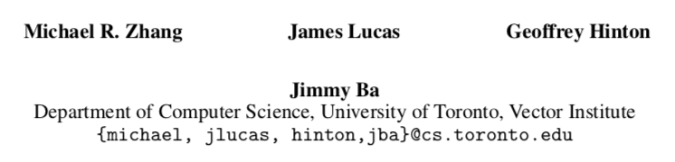
- 2019.07.19 preprint

## 0. Abstract

绝大多数成功的深度神经网络都是使用随机梯度下降(**SGD**)算法的变体进行训练的。最近改进**SGD**的尝试大致可以分为两种方法:(1)自适应学习速率方案**adaptive learning rate schemes**，如**AdaGrad**和**Adam**；(2)加速方案，如**heavy-ball**和**Nesterov momentum**。在本文中，我们提出了一种新的优化算法**Lookahead**，它与上述方法正交**orthogonal**，迭代地**iteratively**更新两组权值。直观地说**Intuitively**，该算法通过 ***looking ahead*** 由另一个优化器生成的“快速权重”序列 **sequence of “fast weights"** 来选择搜索方向。研究结果表明，**Lookahead**在几乎不增加计算量和内存开销的情况下**with negligible computation and memory cost**，提高了学习稳定性，降低了内部优化器的方差。我们通过经验证明，即使在ImageNet、CIFAR- 10/100、neural machine translation和Penn Treebank上使用缺省超参数设置，**Lookahead**也可以显著提高**SGD**和**Adam**的性能。

## 1. Introduction

类sgd算法**SGD-like algorithms**虽然简单，但相对于先进的二阶优化方法**advanced second-order optimization methods**，在神经网络训练方面仍然具有竞争力。大规模分布式优化算法[9,44]与改进的学习率调度方案相结合，表现出令人印象深刻的性能[41,34]，而**SGD**的变体仍然是分布式系统中的核心算法。最近对**SGD**的改进大致可以分为两种方法:(1)自适应学习速率方案**adaptive learning rate schemes**，如**AdaGrad**[6]和**Adam**[17]；(2)加速方案**accelerated schemes**，如**Polyak heavy-ball**[32]和**Nesterov momentum**[28]。这两种方法都是利用累积的梯度信息**accumulated past gradient information**来达到更快的收敛速度**faster convergence**。然而，为了在神经网络中获得更好的性能，通常需要昂贵的超参数调优**costly hyperparameter tuning**[27]。

在这项工作中，我们提出了一种新的优化方法**Lookahead**，它正交**orthogonal**于上述方法。**Lookahead**首先使用内部循环中**in its inner loop**的任何标准优化器更新“快速权重”**“fast weights”**[11]k次，然后按照最终快速权重的方向更新一次“慢速权重”**“slow weights”**。我们证明这个更新减少了方差。我们发现**Lookahead**对次优超参数**suboptimal hyperparameters**不太敏感，因此不需要进行大量的超参数调优。通过使用**Lookahead**和内部优化器**inner optimizers**(如**SGD**或**Adam**)，我们可以用最小的计算开销在不同的深度学习任务之间实现更快的收敛。

通过在**CIFAR**[18]和**ImageNet**数据集[5]上训练分类器**classifiers**，在**ResNet-50**和**ResNet-152**结构[10]上观察到更快的收敛速度，从而对**Lookahead**进行了经验评估。我们还在Penn Treebank数据集[23]上训练了**LSTM**语言模型，在WMT 2014英德数据集上训练了**Transformer-based [41] neural machine translation models**。对于所有任务，使用**Lookahead**可以提高内部优化器的收敛性，并且通常可以提高泛化性能，同时对超参数更改保持健壮性。我们的实验证明**Lookahead**对内部循环优化器中的更改**changes in the inner loop optimizer**、快速权重更新的数量**the number of fast weight updates**和缓慢的权重学习率**the slow weights learning rate**都很健壮。

## 2. Method

在本节中，我们将描述**Lookahead**算法并讨论其性质。**Lookahead**维护一组慢权重和快速权重$\text { slow weights } \phi \text { and fast weights } \theta$，而得到的快速同步权重每个k更新。通过应用快速更新权重，任何标准的优化算法,批培训例子采样的数据集d k内更新优化器使用后,缓慢的权重对快速更新权重的线性插值重空间,θ−φ。我们作为α表示权重学习速率过慢的问题。每次慢权值更新后，快速权值将重置为当前慢权值。Psuedocode在算法1中提供。

标准优化方法通常需要仔细调整学习速率，以防止振荡**oscillation**和收敛缓慢**slow convergence**。这在随机环境**stochastic setting**中更为重要[24,42]。然而，**Lookahead**在内部循环中用更大的学习率获益。在高曲率方向**high curvature direction**振荡时，快速权值的更新沿低曲率方向 **the low curvature direction** 快速进行。慢速权值有助于通过参数插值**parameter interpolation**来平滑振荡**smooth out the oscillation**。快速权值和慢速权值的组合提高了在高曲率方向的学习，减少了方差，并使**Lookahead**在实践中能够快速收敛。

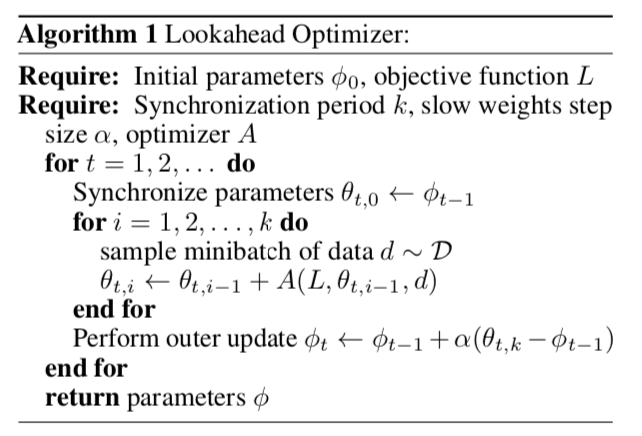

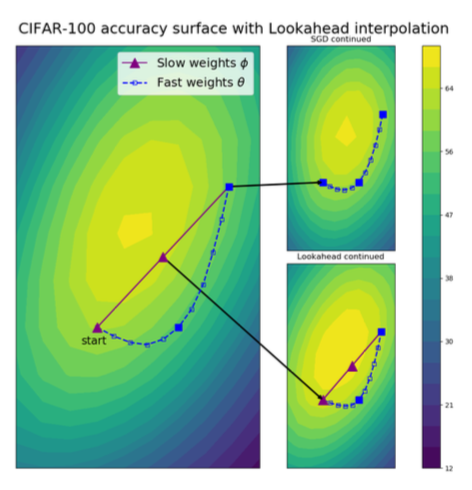

>  ***Figure 1:(Left)***
>
> 在cifar-100上的epoch 100处，通过resnet-32测试精度表面可视化**Lookahead**。我们将权重投影到由第一个、中间的和最后一个快速（内部循环**inner-loop**）权重定义的平面上。快速权重沿着蓝色虚线路径。位于平面上的所有点都表示为实体**solid**，包括整个**Lookahead**的慢速权重路径（紫色）。**Lookahead**（中间的右下）比**SGD**（中间的右上）能够快速接近最小值。

**Fig. 1**显示了在**CIFAR-100**上对**ResNet-32**模型进行优化时，快速权值和慢速权值的轨迹。当快速权重在最小值附近探索时，慢速权重的更新将积极地向前推进**SGD**在20次更新之后仍未探索的区域，以提高测试精度。

- **慢速权重轨迹Slow weights trajectory**。我们可以将慢速权重轨迹描述为每个内循环中最终快速权重**the *final* fast weights**的指数移动平均**(EMA)**，而不考虑内部优化器。在k个内循环步骤后，我们有:

$$
\begin{aligned} \phi_{t+1} &=\phi_{t}+\alpha\left(\theta_{t, k}-\phi_{t}\right) \\ &=\alpha\left[\theta_{t, k}+(1-\alpha) \theta_{t-1, k}+\ldots+(1-\alpha)^{t-1} \theta_{0, k}\right]+(1-\alpha)^{t} \phi_{0} \end{aligned}
$$

直观地说，慢速权值很大程度上利用了快速权值优化的最新建议**proposals**，但保留了以前快速权值的一些影响。我们在**Section 3.1**中说明了这一方法具有减小方差的效果。虽然多边形风格的平均线**Polyak-style average**有进一步的理论保证，但我们的结果与“指数衰减的移动平均线在实践中通常工作得更好”**“an exponentially-decayed moving average typically works much better in**
**practice"**的论断相吻合。

- **快速权重轨迹Fast weights trajectory**。 在每个内部循环中**inner-loop**，快速权值的轨迹取决于底层优化器**underlying optimizer**的选择。给定一个对目标函数$L$的优化算法$A$和当前的小批量训练实例**mini-batch training examples** $d$，我们有快速权值的更新规则:

$$
\theta_{t, i+1}=\theta_{t, i}+A\left(L, \theta_{t, i-1}, d\right)
$$

我们可以选择维护、插值或重置**maintaining, interpolating, or resetting**内部优化器的内部状态**the internal state**(例如**momentum**)。每个选择都提高了内部优化器**inner optimizer**的收敛性。我们在附录C.5中描述了对CIFAR数据集的这种权衡**tradeoff**，并为其他实验维护了内部状态**maintain internal state**。

- **计算复杂性Computational complexity**。 由于参数复制**parameter copying**和基本的算术操作(在$k$个内部循环的更新中进行摊销**amortized**)，**Lookahead**有一个恒定的计算开销。操作数是内部优化器的操作数的$\mathcal{O}\left(\frac{k+1}{k}\right)$倍。**Lookahead**维护模型中可学习参数**learnable parameters**数量的一个额外的副本**a single additional copy**。

### 2.1. Selecting the Slow Weights Step Size 选择慢速权重的步长

在$\left(\theta_{t, k}-\theta_{t, 0}\right)$方向上的步长是由$\alpha$控制的。通过对**loss**的二次近似**quadratic approximation**，我们提出了选择$\alpha$的基本方法**a principled way**。

> ***Proposition 1 (Optimal slow weights step size).*** 
>
> 对一个二次损失函数$L(x)=\frac{1}{2} x^{T} A x-b^{T} x$，在两点$\theta_{t, 0}$ 和 $\theta_{t, k}$ 之间最小化**loss**的步长$\alpha^{*}$可由下式给出：
> $$
> \alpha^{*}=\arg \min _{\alpha} L\left(\theta_{t, 0}+\alpha\left(\theta_{t, k}-\theta_{t, 0}\right)\right)=\frac{\left(\theta_{t, 0}-\theta^{*}\right)^{T} A\left(\theta_{t, 0}-\theta_{t, k}\right)}{\left(\theta_{t, 0}-\theta_{t, k}\right)^{T} A\left(\theta_{t, 0}-\theta_{t, k}\right)}
> $$
> 其中，$\theta^{*}=A^{-1} b$最小化损失**loss**。

证据放在附录里。

使用曲率的二阶近似**quadratic approximations for the curvature**，这是典型的二阶优化**second order optimization** [6,17,25]，我们可以得到一个更一般化的对最优$\alpha$的估计。完整的Hessian **full Hessian**通常是难以处理的**intractable**，因此我们使用前面提到的近似，比如**Adam**优化器[17]中使用的对角近似经验Fisher **diagonal approximate empirical Fisher** 。这个近似在我们的数值实验中工作得很好，如果我们剪切**clip**掉步长的极端部分**magnitude**。在每次慢速权值更新时，我们计算:
$$
\hat{\alpha}^{*}=\operatorname{clip}\left(\frac{\left(\theta_{t, 0}-\left(\theta_{t, k}-\hat{A}^{-1} \nabla L\left(\theta_{t, k}\right)\right)^{T} \hat{A}\left(\theta_{t, 0}-\theta_{t, k}\right)\right.}{\left(\theta_{t, 0}-\theta_{t, k}\right)^{T} \hat{A}\left(\theta_{t, 0}-\theta_{t, k}\right)}, \alpha_{\operatorname{low}}, 1\right)
$$
设置$\alpha_{\mathrm{low}}>0$来提高算法的稳定性。我们评估了该自适应方案**adaptive scheme**与固定方案**a fixed scheme**和**standard Adam**用两种的不同学习率在**CIFAR-10**上训练的**ResNet-18**的性能，结果如**Fig. 2**所示。附加的超参数细节在**附录c**中给出。固定的和自适应的**Lookahead**都提供了提高了的收敛性**improved convergence**。

在实践中，固定的$\alpha$可以提供相似的收敛性，且往往可以更好地泛化。固定的$\alpha$避免了对经验Fisher估计值**an estimate of the empirical Fisher**维护的需要，这会产生一个内存和计算成本 **a memory and computational cost**时，而像**SGD**这样的内部优化器不会维护这样的估计值**maintain such an estimate**。因此，我们在我们深度学习的其他实验中使用固定的$\alpha$。

## 3. 收敛性分析

### 3.1. Noisy quadratic analysis

通过对含噪二次模型**noisy quadratic model**的分析，揭示了其收敛性的保证。虽然该模型简单，但它是神经网络优化的一个**proxy**，有效地优化它仍然是一个具有挑战性的开放问题**a challenging open problem** [36,25,42,46]。

- **模型定义Model definition**：我们使用与Schaul等人的[36]和Wu等人的[42]相同的模型。

$$
\hat{\mathcal{L}}(\mathbf{x})=\frac{1}{2}(\mathbf{x}-\mathbf{c})^{T} \mathbf{A}(\mathbf{x}-\mathbf{c})
$$

其中，$\mathbf{c} \sim \mathcal{N}\left(\mathbf{x}^{*}, \Sigma\right)$。我们假设$\mathbf{A}$ 和 $\Sigma$ 都是对角阵且 $\mathbf{x}^{*}=0$。我们用$a_{i}$ 和 $\sigma_{i}^{2}$ 来分别表示$\mathbf{A}$ 和 $\Sigma$ 的对角元。取$\mathbf{c}$的期望值 **taking the expectation over c**，迭代到$\theta^{(t)}$的期望损失为，
$$
\mathcal{L}\left(\theta^{(t)}\right)=\mathbb{E}\left[\hat{\mathcal{L}}\left(\theta^{(t)}\right)\right]=\frac{1}{2} \mathbb{E}\left[\sum_{i} a_{i}\left(\theta_{i}^{(t)^{2}}+\sigma_{i}^{2}\right)\right]=\frac{1}{2} \sum_{i} a_{i}\left(\mathbb{E}\left[\theta_{i}^{(t)}\right]^{2}+\mathbb{V}\left[\theta_{i}^{(t)}\right]+\sigma_{i}^{2}\right)
$$
对SGD迭代**iterates**和慢速权重的预期进行动态分析，可以得到以下结果。

> ***Proposition 2 (Lookahead variance reduction).*** 
>
> 设$0<\gamma<2 / L$为**SGD**和**Lookahead**的学习率，其中$L=\max _{i} a_{i}$。在含噪二次模型中，**SGD**和以**SGD**为内部优化器的**Lookahead**迭代收敛到期望为0时，方差收敛到以下不动点**fixed points**：
> $$
> \begin{aligned} V_{S G D}^{*} &=\frac{\gamma^{2} \mathbf{A}^{2} \Sigma^{2}}{\mathbf{I}-(\mathbf{I}-\gamma \mathbf{A})^{2}} \\ V_{L A}^{*} &=\frac{\alpha^{2}\left(\mathbf{I}-(\mathbf{I}-\gamma \mathbf{A})^{2 k}\right)}{\alpha^{2}\left(\mathbf{I}-(\mathbf{I}-\gamma \mathbf{A})^{2 k}\right)+2 \alpha(1-\alpha)\left(\mathbf{I}-(\mathbf{I}-\gamma \mathbf{A})^{k}\right)} V_{S G D}^{*} \end{aligned}
> $$

***Remarks***

对于**Lookahead**方差不动点，因为$\alpha \in(0,1)$，那它的第一个乘积项总是小于1，因此**Lookahead**方差不动点严格小于**SGD**内部优化器的方差不动点。这种现象的证据如**Fig. 10**所示。

在**Proposition 2**中，我们使用相同的学习率。为了比较这两种方法的收敛性，我们应该选择使方差不动点相等的超参数。在**Fig 3**中，我们显示了**Lookahead**和**SGD**在1000次更新（分析计算**computed analytically**）后的期望损失**expected loss**。在优化阶段（及以后），**Lookahead**在$\alpha$值的广谱范围**the broad spectrum**内优于**SGD**。详情和其他讨论见附录B。

> the broad spectrum 指什么？？？

### 3.2. 确定性的二次收敛性 Deterministic quadratic convergence

在前面的部分中，我们展示了在含噪二次模型上，**Lookahead**能够减少**SGD**优化器的方差。本文利用动量梯度下降法**gradient descent with momentum**[32，8]对无噪声二次模型**the quadratic model without noise**进行了分析，结果表明，当系统处于阻尼状态**under-damped**时，**Lookahead**算法能够提高收敛速度。

和以前一样，我们把注意力限制在原点有极小值的对角二次函数上**diagonal quadratic functions with minima at the origin**。给定初始点$\boldsymbol{\theta}_{0}$，我们希望测量收缩**contraction**$1.0-\left\|\boldsymbol{\theta}_{t}\right\| /\left\|\boldsymbol{\theta}_{t-1}\right\|$的收敛率。我们采用[30]的方法，将该函数的优化建模为线性动力系统**a linear dynamical system**。详情见附录B。

正如Lucas等人的工作[22]，为了更好地理解**Lookahead**对条件误设**misspecified conditioning**的敏感性，我们固定了经典动量的动量系数**momentum coefficient**，并在最优学习速率下探索了变条件数**varying condition number**下的收敛速度。正如预期的那样，在动量设置得太低**momentum is set too low**、CM缓慢、单调地收敛到最优值的阻尼状态**under-damped**下，**Lookahead**的收敛性稍差。然而，当系统处于阻尼状态**under-damped**（并且发生振荡）时，通过在振荡过程中跳到一个更好的参数设置，**Lookahead**可以显著提高收敛速度。

> cm是什么？

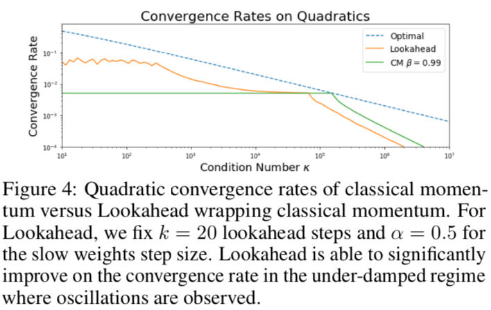

> **Fig. 4** 经典动量方法与使用**Lookahead**的经典动量方法的二次收敛速度。
>
> 对**Lookahead**而言，我们固定使用$k = 20$次**Lookahead**和$\alpha= 0.5$作为慢速权重的步长。在可以观察到震荡的阻尼**under-damped**情况下，**Lookahead**能够显著提高收敛速度。

## 4. Related work

我们的工作受到了最近在理解深层神经网络损失表面**the loss surface of deep neural networks**方面的进展的启发。虽然跟踪权值轨迹**following the trajectory of weights**的想法可以追溯到Ruppert[35]、Polyak和Juditsky[33]，但是直到最近才对神经网络中的平均权值**averaging weights in neural networks**进行了仔细的研究。Garipov等人[7]观察到两个独立训练的神经网络的最终权值可以通过一条低损耗的曲线**a curve with low loss**连接起来。Izmailov等人[13]提出了随机加权平均**Stochastic Weight Averaging(SWA)**，即对训练过程中得到的不同神经网络的权值进行平均。在自然语言处理任务[14,26]和生成对抗网络[43]的训练中，参数平均方案**Parameter averaging schemes**用于创建集成**create ensembles**。与以往的方法(通常在训练结束时**at the *end* of training**生成一组参数)相比，**Lookahead**算法是一种优化算法，在训练过程中***during* the training procedure**对参数进行平均，以达到更快的收敛速度。

由Nichol等人提出的爬行动物算法**Reptile algorithm**[29]对其外循环**outer loop**中的任务进行采样，并对内循环中的每个任务运行优化算法。然后，按照新权重的方向更新初始权重。虽然功能相似，但是**application**和设置完全不同。**Reptile algorithm**对不同的任务进行采样，目的是寻找在测试时对采样的新任务具有良好初始值的参数。**Lookahead**不为每个外环采样新任务，其目的是利用损失曲面的几何性质来提高收敛性。

**Katyusha**[1]是**SVRG**[16]的一种加速形式，在优化过程中也使用了外部和内部循环。**Katyusha**检查点参数**checkpoints parameters**在优化过程中，在每个内部循环步骤中，参数被拉回**pulled back towards**最新检查点**the latest checkpoint**。**Lookahead**只在内部循环的末尾计算回拉**pullback**，而梯度更新不使用**SVRG**校正(尽管这是可以的)。虽然**Katyusha**在凸优化设置中有理论保证，但是基于**SVRG**的更新算法在神经网络[4]中并不适用。

安德森加速**Anderson acceleration**[2]和其他相关的外推**extrapolation**技术[3]也有类似的味道。这些方法跟踪一个内循环中的所有迭代，然后计算一些线性组合，这些线性组合将迭代外推**extrapolates**到它们的不动点。这带来了额外的挑战，首先是随着内循环步骤数量的增加而增加的内存开销，其次是在寻找最佳线性组合**the best linear combination**方面。Scieur等[37,38]提出了一种寻找良好线性组合并将其应用于深度学习问题的方法，并报告了改进的收敛性和泛化性能。然而，他们的方法需要的内存是**Lookahead**的$k$倍。**Lookahead**可以看作是**Anderson acceleration**的一个简单版本，其中只使用第一次迭代和最后一次迭代。

## 5. Experiments

在一系列基于校准良好的基线的深度学习任务中**a range of deep learning tasks against well-calibrated baselines**，我们完成了对优化器**Lookahead**的全面评估。我们探索了**CIFAR-10/CIFAR-100**[18]和**ImageNet**[5]上的图像分类。我们还在Penn Treebank数据集[23]上训练了**LSTM language model**，在WMT 2014英德数据集上训练了**Transformer-based [41] neural machine translation models**。在我们所有的实验中，每种算法都消耗了相同数量的训练数据**consumed the same amount of training data.**。

### 5.1. CIFAR-10 and CIFAR-100

**CIFAR-10**和**CIFAR-100**分类数据集由32×32张彩色图像组成，分为10个类和100个类**classes**，分为5万张图像的训练集和1万张图像的测试集。我们用**3  seeds**进行了所有**CIFAR**实验，并在ResNet-18[10]上训练了200个**epoch**，**batches**为128幅图像，在第60、120和160**epoch**，学习率降低了5倍。其他细节见附录C。

我们在**Figure 5**中总结了我们的结果。注意到，在整个训练过程中，即使学习率计划**learning rate schedule**是为内部优化器而优化的，**Lookahead**也能取得显著的更快的收敛速度——未来的工作可能包括为**Lookahead**建立一个**learning rate schedule**。

> 他自己提出的改进点

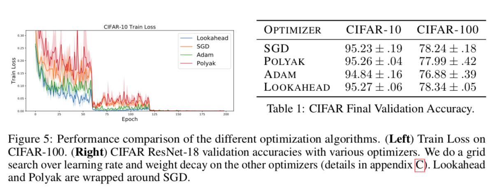

### 5.2. ImageNet

**1000-way ImageNet**任务[5]是一个分类任务，包含大约128万幅训练图像和5万幅验证图像。我们使用官方的PyTorch实现和**ResNet- 50**和**ResNet-152**[10]体系结构。我们的**baseline**算法是**SGD**，初始学习率为0.1，动量值为0.9。我们训练了90个**epoch**，在第30和60个**epoch**，我们的学习率下降了10倍。对于**Lookahead**，我们设定$k = 5$和慢速权重步长$\alpha= 0.5$。

在我们最初的实验中观察到收敛性的改善，促使我们尝试了一个更积极的学习率随时间衰减的计划**learning rate decay schedule**，在第30、48和58个**epoch**，我们将学习率衰减了10倍。使用这样的**schedule**，我们只需要50个**epoch**就能在ImageNet上达到75%的**single crop top-1 accuracy**，在60个**epoch**达到75.5%的**top-1 accuracy**。结果如**Fig. 6**所示。

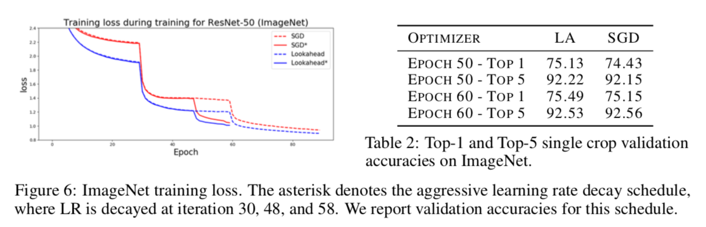

为了测试我们方法的可伸缩性**scalability**，我们在**ResNet-152**上运行了激进的学习率衰减**aggressive learning rate decay**。在49个**epochs**中，我们达到了77%的**single crop top-1 accuracy**(与He等人的[10]报告的结果相匹配)，在60个**epochs**中达到了77.96%的**top-1 accuracy**。提高ImageNet收敛性的其他方法可能需要数百个GPU，或者一些技巧，比如提高学习速度**ramping up the learning rate**和自适应批处理大小**adaptive batch-sizes**[9,15]。我们所知道的最快的收敛速度是使用近似二阶方法**an approximate second-order method**，在1024个GPU[31]的35个**epochs**内训练ResNet-50到75%的**top-1 accuracy**。相反，**Lookahead**需要更改一行代码，并且可以很容易地扩展**scale**到ResNet-152。

### 5.3. 语言模型Language modeling

我们在Penn Treebank数据集上训练LSTMs[12]进行语言建模。我们遵循Merity等人的模型设置，并在实验中使用了他们的公开可用代码。我们没有包括微调阶段 **the fine-tuning stages**。我们搜索了**Adam**和**SGD**(没有动量)的超参数，以找到具有最佳验证性能的模型。然后，我们使用**Lookahead**对这些方法中的每个方法执行额外的小网格搜索。每个模型都经过750个**epoch**的训练。我们将每个模型的训练曲线如图7a所示。

使用**Lookahead**与**Adam**，我们能够实现最快的收敛和最好的训练，验证**validation**和测试困惑度**test perplexity**。用SGD训练的模型花了更长的时间来收敛(大约700个epochs)，无法达到Adam的最终性能。使用Polyak加权平均[33]和SGD，正如Merity等人提出的[26]和ASGD，我们能够提高Adam的性能，但无法匹配**Lookahead**的性能**unable to match the performance of Lookahead**。完整的结果见表3，其他细节见附录C。

> 在信息论中，perplexity(困惑度)用来度量一个概率分布或概率模型预测样本的好坏程度。它也可以用来比较两个概率分布或概率模型。（译者：应该是比较两者在预测样本上的优劣）低困惑度的概率分布模型或概率模型能更好地预测样本。
>
> 用在自然语言中，可以作为一个像bleu的评价指标。

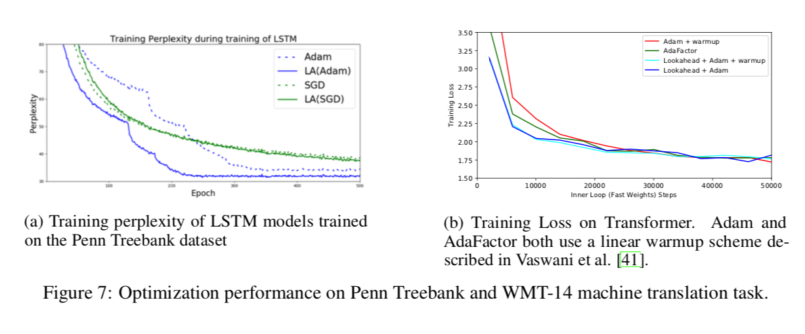

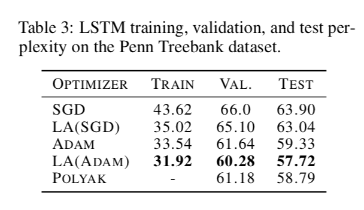

### 5.4. 神经机器翻译Neural machine translation

我们在单个张量处理单元(TPU)节点上，针对WMT2014英德翻译任务，训练了一个基于**Transformer**的模型[41]。我们从Vaswani等人的[41]中提取基本模型，并使用所提出的**预热-然后-衰减**学习速率调度方案**warmup-then-decay learning rate scheduling scheme**对其进行训练，此外，还使用了包含**Lookahead**的相同方案。我们发现，**Lookahead**比**Adam**和后来提出的**AdaFactor**[39]优化器加快了训练的早期阶段。所有方法最终收敛到相似的训练损失和BLEU评分，见Fig. 7b和Tab. 4。

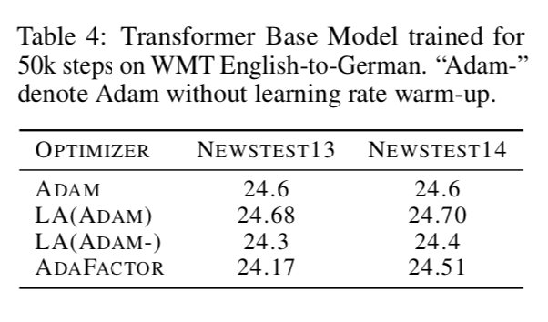

我们的NMT实验进一步证实了**Lookahead**可以改进内部循环优化器的鲁棒性。我们发现，**Lookahead**使Transformer模型可以选择更大范围的学习率{0.02,0.04,0.06}，且所有都收敛到类似的最终损失。详细情况见附录C.4。

### 5.5. 经验分析Empirical analysis

- **内部优化算法的鲁棒性Robustness to inner optimization algorithm，$k$，$\alpha$。**在CIFAR数据集上，我们从经验上说明了，在不同的超参数**hyperparameter**设置下，**Lookahead**可以持续提供快速的收敛性。我们固定慢速权重步长$\alpha=0.5$ 和 $k=5$，并且在具有不同的学习率和动量的内部**SGD**优化器上运行**Lookahead**；结果如**Fig. 8**所示。在一般情况下，我们观察到**Lookahead**可以用更高的学习率**higher learning rates**在基础优化器上微调$k$和$\alpha$训练。这与我们在**Section 3.1**中对方差减少的讨论相一致。我们也通过固定内部优化器和运行不同的$k$和步长$\alpha$来评估**Lookahead**的超参数的鲁棒性；这些结果如**Fig. 9**所示。

  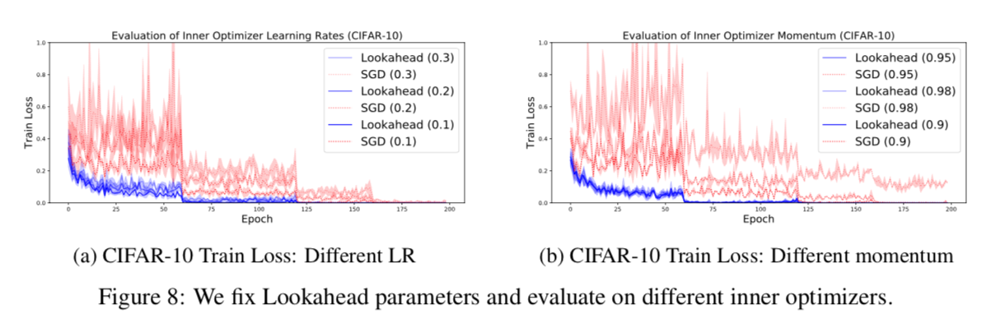

  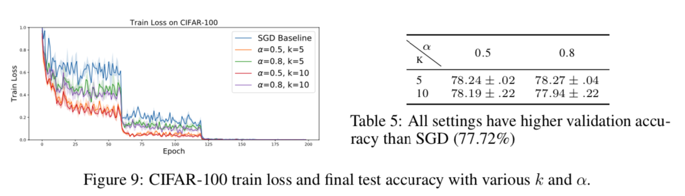

- **内部循环和外部循环的评估Inner loop and outer loop evaluation。**为了更好地理解**Lookahead**的更新，我们还在**Fig. 10**中绘制了**epoch 65**上每次更新的测试准确度。我们发现，在每个内部循环中，快速权重可能导致任务性能显著下降——这反映了我们在**Section 3.1**中对内部循环更新的较高方差的分析。慢速权重步骤恢复外部循环的方差，恢复测试精度**test accuracy**。

  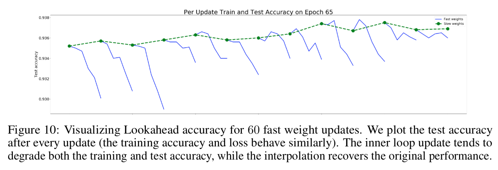

## 6. Conclusion

本文提出了一种可以与任何标准优化方法相结合的**Lookahead**算法。我们的算法通过预先查看*looking ahead*由另一个优化器生成的“快速权重”序列来计算权重更新。我们说明了**Lookahead**如何通过减少方差来提高收敛性，并在许多深度学习基准数据集上显示了强大的经验结果。