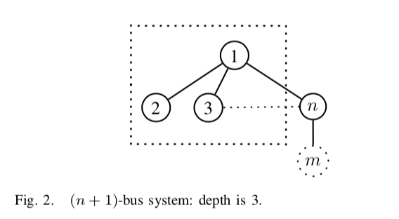
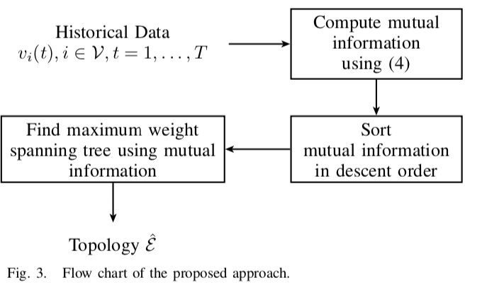
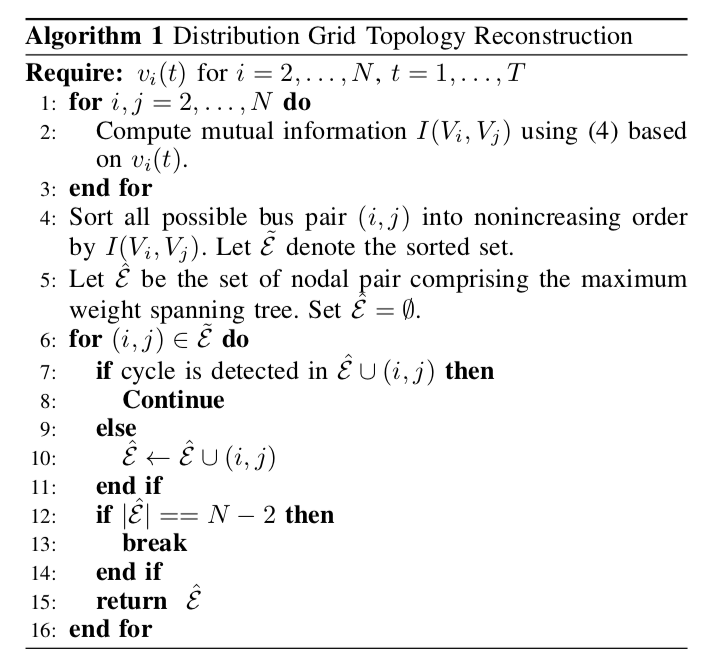

# 配电网拓扑重构：一个信息论方法
## 0. 摘要

最近，分布式发电**distributed generation？？？**的迅速普及引发了各种各样的问题。其中一个关键问题是频繁的配电网重构，这个问题用传统方法是难以检测的。错误的拓扑信息会导致错误的控制信号，使得快速变化的智能电网容易越过稳定边界而崩溃。为了确保系统的健壮性，我们提出了一种新的数据驱动重新配置的方法，这得益于最近公用事业公司在配电系统中逐步部署了更大的传感器网络。具体地说，在对配电系统进行假设和验证的证明的基础上，采用了一种基于信息论的算法——**Chow-Liu算法**。仿真结果表明，IEEE标准分布测试系统的重构估计精度较高。

关键词：配电网 拓扑结构学习 信息论 电压测量

## 1. Introduction

由美国政府发起的快速扩张的智能电网旨在发展成为一个可持续的现代电网。为此目的，分布式能源(DER)，如光伏和存储设备，被迅速集成到可再生能源发电的分布式电网。这是因为在配电网内发电不仅可以创造更多的可持续能源，还可以创造更便宜的电力，减少由于发电和终端消费者之间的路径缩短等造成的损失。

分布式发电的大规模渗透在带来新的机遇的同时，也带来了新的挑战。与输电电网拓扑结构变化有限的情况不同，配电网可以由于许多即插即用组件的临时连接而发生规则的拓扑结构变化。更糟糕的是，配电系统操作员通常缺乏特定的拓扑信息，例如DG连接状态，因为许多DER不属于该实用程序。

错误的拓扑估计会导致一些严重的问题，如潮流的危险逆转**dangerous reversions of power flow**计算错误、电压剖面的快速动态变化描述错误、线路工作危险等。因此，在智能配电网的运行和控制中，需要一个高度主动、准确的拓扑估计过程[1]为配电自动化提供依据。这就需要一个自动、可靠、低成本的方法来探测状态的变化。

基于后状态估计 **post-state estimation** (SE)程序[2]的输电网中存在系统的拓扑误差识别**topology error identification**方法。具体地说，如果基于SE的残差测试**residual test**将与分支**branch**或总线**bus 系统的（总线）**关联的度量**measurements**标记为异常值，则会检测到拓扑错误**topology error**。在传统的输电网中，如果基于“短时间内无明显的拓扑变化**no significant topology change appears**，且有有限的非确定性误差**with limited non-conforming errors**”的假设，是可以采用上述拓扑识别过程的。然而，这种假设在智能电网中将不再成立，在智能电网中拓扑变化频繁**frequent topological changes appear**，可能会导致大量的拓扑错误，使得上述方法很难识别所有的误差。[3]-[5]。

要解决这些问题，可以让公用事业公司在所有拓扑变化组件**topology changing components**(例如交换机)上安装监控设备，以实现配电自动化。但这一过程将需要很长时间。我们还可以假设所有可能的交换机连接映射都是可用的**availability of all possible switch connectivity map**，并搜索正确的组合[6]-[8]。此外，状态估计可以通过假设导纳矩阵**admittance matrix**[9]、[10]的可用性来实现。最后，利用已知导纳矩阵[11]进行潮流检测**power flow examination**。

不幸的是，上述方法需要断路器**circuit breakers** 和/或 导纳矩阵**admittance matrix**的信息，而这些信息在新添加或重新配置的部分配电网中可能是不可知的。即使有这样的信息，这些信息也可能因为缺少能更新信息的人机交互，即配电网中的即插即用组件，而是过时或错误的。这使得这些方法无法在许多智能电网场景中处理极大的拓扑不确定性**large topology uncertainties**。

如今，最可靠的信息通常来自于家庭的智能传感器**smart sensors at household level**，由于最近在通信、传感、计算和控制以及有针对性的对利用先进的计量基础设施(AMIs)的投资和同步加速器**synchrophasors**的发展，为电力行业创造了之前未曾有过的动力和数据来源[12],[13]。因此，在本文中，我们限制于我们只有终端用户的数据**end-user data**[14]，[15]，比如智能电表测量的有功功率、无功功率和电压大小**real & reactive powers and voltage magnitude**[16]-[19]。未来的微相量测量单元**micro phasor measurement unit**(µPMU)[20],[21]被广泛安装时，我们也分析电压相位**voltage phase**。我们的目标是帮助这些设备识别它们运行的物理系统，发现它们附近的总线**their neighbor buses**，并重新配置通信和控制基础设施，以便其能够执行指定的任务。

我们只利用电压相量的两两互信息**pairwise mutual information of voltage phasors**，而不是假设断路器条件已知或估计系统导纳矩阵**assuming the knowledge of circuit breaker conditions or estimating system admittance matrix**[3]。历史数据用于相互信息计算**mutual information calculation**，而不是仅使用单个数据点**a single data point**(当前方法)[22]。我们证明了在智能电网不断变化难以预测的不确定性下，基于本地传感器数据识别大量即插即用设备，电压相量数据**voltage phasors data**可以通过**Chow-Liu Algorithm**找到最优的拓扑连接。

之后，我们在标准IEEE 8-和123-总线分布测试用例[23]、[24]上进行了仿真，验证了数据驱动方法的性能。在历史数据充足的情况下，数据驱动的拓扑估计优于传统方法和最近的[3]方法。值得注意的是，由于我们的检测不依赖于已知拓扑，所以其他方法中的错误传播**error propagation**不会出现在我们的方法中。

论文的其余部分结构如下：第二部分介绍了数据驱动拓扑的建模和识别问题。第三部分证明了**Chow-Liu Algorithm**在配电网拓扑重构中的适用性，并给出了具体的算法。第四部分对新方法的性能进行了评价，第五部分对本文进行总结。

## 2. System Models

为了更好地描述配电网拓扑重构问题，我们需要对配电网拓扑和数据进行描述。分布式网路的特征由以下两点来描述：总线***buses***，$\mathcal{V}=\{1,2, \ldots, N\}$；分支***branches***(电力线)，$\mathcal{E} = \{(i, j), i, j \in \mathcal{V}\}$。在总线$i$和时间$t$的测量数据可以表示如下：有功功率**active power** $p_i(t) \in \mathbb{R}$，无功功率**reactive power**  $q_i(t) \in \mathbb{R}$，和电压 $v_i (t) = |v_i(t)|e^{jθ_i (t)} \in \mathbb{C},\ where\ |v_i (t)|\in \mathbb{R}$表示每单位的电压大小和$\theta_i(t) \in R$表示电压相角的度数**voltage phase angle in degree**。这些测量处于稳态**steady state**，所有电压和电流都是频率相同的正弦信号。

配电网拓扑重构问题定义如下:

+ 问题：基于电压的数据驱动拓扑重构

+ 给定：历史测量序列$v_i(t), i \in V, t = 1,…,T$和部分已知的网格拓扑,如图1所示
+ 查找：图1虚线框中局部网格拓扑$\mathcal{E}$


## 3. Information theory-based topology estimation 基于信息论的拓扑估计

最近布置的智能电表提供了大量高精度的时间序列数据。我们想利用这些数据来重建网格拓扑**grid topology**。表示历史数据的一种方法是使用概率分布**probability diatribution**。例如，电压测量值的联合分布为

$$
\begin{aligned} P(\mathbf{V}) &=P\left(V_{2}, V_{3}, \ldots, V_{N}\right) \\ &=P\left(V_{2}\right) P\left(V_{3} | V_{2}\right) \ldots P\left(V_{N} | V_{2}, \ldots, V_{N-1}\right)   \quad \quad\quad(1)
\end{aligned}
$$
其中$V_i \in \mathbb{C}$为连续的复随机变量，它代表电压测量值$v_i(t)$。这个联合分布中省略了**Bus 1**，因为它是长时间测量电压的松弛总线**slack bus**，即$1 \angle 0$。配电系统网络通常具有径向结构**radial structure**。同时，相邻互联的总线**interconnected neighboring buses**之间的相关性也高于非相邻总线之间的相关性。因此，一个合理的近似(1)是假设一个节点的测量**a nodal measurement**依赖于它相邻的测量**its neighbors' measurements**。将(1)简化为

$$P(\mathbf{V}) \approx P_{t}(\mathbf{V})=\prod_\limits{i=2}^{N} P\left(V_{i} | V_{r(i)}\right)   (2)$$

其中$r(i)$为与总线$i$连接的父总线1 **parent bus**，$P (V_2|V_{r(2)})$定义为$P (V_2)$。这种简化称为乘积近似**product approximation**。这样定义后, 找网格拓扑等价于找到最接近联合分布$P (V)$的条件分布$P_t(V)$。

Chow-Liu Algorithm被证明是求解$P (\mathbf{V})$[25]的最佳乘积近似的最优算法。它利用网络中所有可能的总线对的相互信息，找到最大权值生成树**maximum weight sapnning tree**，使整个交互信息量**mutual information**最大化。交互信息，是信息论中一种度量两个随机变量相互依赖关系的度量，在通信、自然语言处理[27]，生物医学工程[28]等领域得到了广泛的应用。交互信息度量两个随机变量$p(V_i, V_j)$的联合分布与它们单独分布的乘积$p(V_i)p(V_j)$有多相似。对于连续随机变量，相互信息定义为[29]

$$I(V_i, V_j) =\int_{V_i} \int_{V_j} p(v_i, v_j) ln (\frac{p(v_i, v_j)} {p(v_i)p(v_j)}) dv_idv_j\quad(3)$$

另外，相互信息可以用熵来计算

$$I(V_i, V_j) = H(V_i) +H(V_j) - H(V_i, V_j) \quad (4)$$

熵$H(V_i)$的定义:

$$H(V_i) = -\int _{V_i}p(v_i)ln(p(v_i))dv_i$$

并且$H(V_i, V_j)$表示联合分布的熵[29]。在**Theorem 1**中，我们证明了该**Chow-Liu Algorithm**适用于配电网。

> ***Theorem 1.***
>
> 在树形结构的配电网中，Chow-Liu算法可求出$P (\mathbf{V})$的最优乘积近似及其相关的拓扑关系。

*Proof:*



在这里,我们使用 3-bus system  (图2中的虚线框) 证明电压条件独立，即$V_2 | V_1⊥V_3 | V_1$，以此作为应用**Chow-Liu Algorithm**的基础。

令当前的输入$I_i \in \mathbb{C},\ i = 1,2,3$为随机变量，且与其他互相独立。令$y_{ij}\in \mathbb{C}$表示总线$i$与总线$j$的线路导纳**line admittance**。当两个buses之间不存在单一分路single branch时，$y_{i j}=0$。因此，电压与电流的关系为:
$$
\left[\begin{array}{ccc}{y_{12}+y_{13}} & {-y_{12}} & {-y_{13}} \\ {-y_{12}} & {y_{12}} & {0} \\ {-y_{13}} & {0} & {y_{13}}\end{array}\right]\left[\begin{array}{l}{V_{1}} \\ {V_{2}} \\ {V_{3}}\end{array}\right]=\left[\begin{array}{l}{I_{1}} \\ {I_{2}} \\ {I_{3}}\end{array}\right]
$$
当$V_1 = v_1$时，改写上面的关系得到
$$
\left[\begin{array}{cc}{-y_{12}} & {-y_{13}} \\ {y_{12}} & {0} \\ {0} & {y_{13}}\end{array}\right]\left[\begin{array}{l}{V_{2}} \\ {V_{3}}\end{array}\right]=\left[\begin{array}{c}{I_{1}-v_{1}\left(y_{12}+y_{13}\right)} \\ {I_{2}+v_{1} y_{12}} \\ {I_{3}+v_{1} y_{13}}\end{array}\right]
$$
由于第一行是多余的，线性系统变成:
$$
V_{2}=\frac{I_{2}}{y_{12}}+v_{1}, \quad V_{3}=\frac{I_{3}}{y_{13}}+v_{1} 	\quad\quad(5)
$$
因为$I_2$和$I_3$是独立的，则$V_2$和$V_3$在$V_1$的条件下是独立的，即$V_2 | V_1⊥V_3 | V_1$。

接下来，我们将条件独立性扩展到更一般的网络。对于图2所示的网格(除了总线m **Bus m**)，共有n个总线。n - 1总线有一个共同的邻居，即Bus 1。使用与3-bus system示例类似的方法，给定$V_1 = v_1$，对每个bus $i$，我们可以找到如下方程:

$$
V_{i}=\frac{I_{i}+v_{1} y_{1 i}}{y_{i i}}, \quad i=2, \cdots, n \quad\quad (6)
$$
由于在当前设置中$y_{ii} = y_{1i}$，所以该方程的格式和(5)实际上是一致的。同样假设每个输入电流$I_i$互相独立，我们可以得出$V_i|V_1与V_j |V_1$是独立的，对于i, j = 2, n和$i \neq j$。

当Bus $m$与Bus $n$相连时，电流与电压之间的新关系为:

$$
\left[\begin{array}{c}{I_{1}} \\ {I_{2}} \\ {\vdots} \\ {I_{n}} \\ {I_{m}}\end{array}\right]=\left[\begin{array}{ccccc}{y_{11}} & {-y_{12}} & {\dots} & {-y_{1 n}} & {0} \\ {-y_{12}} & {y_{22}} & {\dots} & {0} & {0} \\ {\vdots} & {\vdots} & {\vdots} & {\ddots} & {\vdots} \\ {-y_{1 n}} & {0} & {\dots} & {y_{n n}} & {-y_{n m}} \\ {0} & {\ldots} & {\cdots} & {-y_{n m}} & {y_{m m}}\end{array}\right]\left[\begin{array}{c}{V_{1}} \\ {V_{2}} \\ {\vdots} \\ {V_{n}} \\ {V_{m}}\end{array}\right]
$$
给定$V_1 = v_1$，我们有
$$
\left[\begin{array}{c}{I_{2}+v_{1} y_{12}} \\ {\vdots} \\ {I_{n}+v_{1} y_{1 n}} \\ {I_{m}}\end{array}\right]=\left[\begin{array}{ccccc}{y_{22}} & {0} & {\dots} & {0} & {0} \\ {0} & {y_{33}} & {\dots} & {0} & {0} \\ {\vdots} & {\vdots} & {\ddots} & {\vdots} & {\vdots} \\ {0} & {0} & {\ldots} & {y_{n n}} & {-y_{n m}} \\ {0} & {0} & {\ldots} & {-y_{n m}} & {y_{m m}}\end{array}\right]\left[\begin{array}{c}{V_{2}} \\ {V_{3}} \\ {\vdots} \\ {V_{n}} \\ {V_{m}}\end{array}\right]
$$
对于Bus 2到Bus n - 1，第一部分即(6)的证明仍然成立。唯一的例外是判断**determining**树的依赖性**tree dependence**是否仍然适用于目前与总线$m$相连的总线$n$。为了探索在总线$n$和总线$i\in \left\{2···n−1\right\}$之间的条件独立性，我们需要使用从上面的公式中提取出的这些关系：
$$
\begin{aligned} I_{n}+v_{1} y_{1 n} &=y_{n n} V_{n}-y_{n m} V_{m} \quad\quad(7)
\\ I_{m} &=-y_{n m} V_{n}+y_{m m} V_{m} \quad\quad(8)
\end{aligned}
$$
由于Bus $m$只与Bus $n$连接，所以$y_{mm} = y_{nm}$。进一步，根据导纳矩阵的定义，得到$y_{n n}=y_{n m}+y_{1 n}$。因此，通过(7)和(8)的结合，我们得到：

$$
\begin{aligned} I_{n}+v_{1} y_{1 n}+I_{m} =&y_{n n} V_{n}-y_{n m} V_{m} - y_{n m} V_{n}+y_{m m} V_{m} \\=& y_{1 n} V_{n} \\ V_{n}=& \frac{I_{n}+I_{m}+v_{1} y_{1 n}}{y_{1 n}}  \quad\quad\quad (9)
\end{aligned}
$$
由于电流输入在每个总线是独立的，$I_i ⊥I_j\ ,\ 2≤i≤n−1$和$j = n, m$。那么，$I_n+I_m$也独立于$I_i$。因此，由于(6)(9), $V_n|V_1$与$V_i|V_1$是独立的。

总之，这个证明可以很容易地扩展到每个总线连接一个总线**each bus have one bus connected**的情况，而不是总线1**other than Bus 1**。如果每个总线有超过一个总线连接，我们可以将这些总线聚合成一个总线，并使用上面的证明来说明电压相量**voltage phasors**的条件独立性。

利用总线的条件独立性，通过交互信息，**Chow-Liu Algorithm**找到了对$P (\mathbf{V}), \ P_t(\mathbf{V})$的最优近似。

为了说明**Chow-Liu Algorithm**的步骤，我们将其总结为图3中的流程图以及本节末尾的算法。



上面流程图中的一个关键步骤是比较相互信息**compare the mutual information**。我们使用下面的引理来说明为什么这个概念对于找到正确的拓扑**the correct topology**很重要。

> ***Lemma 1.*** 
>
> 在具有树结构的分布式网络中，沿用Theorem 1中对条件独立性的假设。对给定的$j, k \in r(i), \ k \notin r(j)\ and\ j \notin r(k)$，有$I\left(V_{j}, V_{i}\right) \geq I\left(V_{j}, V_{k}\right)$

*Proof:*
$$
\begin{aligned} I\left(V_{i}, V_{j}, V_{k}\right) &=I\left(V_{i}, V_{j}\right)-I\left(V_{i}, V_{j} | V_{k}\right) \\ &=I\left(V_{j}, V_{k}\right)-I\left(V_{j}, V_{k} | V_{i}\right) \end{aligned}
$$
因为$V_{j} | V_{i}$与$V_{k} | V_{i}$是独立的，条件交互信息$I\left(V_{j}, {V}_{k} | V_{i}\right)$是0。那么我们有
$$
I\left(V_{i}, V_{j}\right)=I\left(V_{j}, V_{k}\right)+I\left(V_{i}, V_{j} | V_{k}\right)
$$
因为交互信息总是非负的，那么我们有
$$
I\left(V_{j}, V_{i}\right) \geq I\left(V_{j}, V_{k}\right)
$$
Lemma 1证毕。

根据引理1，总线**buses**与其附近邻居的交互信息是更高的。在下一节中，我们将使用数值示例来展示这个lemma。利用交互信息作为权重，应用**Theorem 1**，最大权值生成树可以找到一个高度精确的配电网拓扑结构，使得**Chow-Liu Algorithm**可以适用于智能电网的拓扑识别。



> ***算法1:*** 配电网的拓扑重构
>
> **需要：**$v_i(t)$对于$i = 2，…， N, t = 1，…T$
>
> + for i, j = 2, … N do
>   + 利用基于$v_{i}(t)$的公式(4)，计算交互信息$I\left(V_{i}, V_{j}\right)$
> + end for
> + 按照$I\left(V_{i}, V_{j}\right)$，将所有可能的bus pair $(i, j)$，排成不增序列。令$\tilde{\mathcal{E}}$表示排序后的集合。
> + 令$\hat{\mathcal{E}}$为包含最大权重生成树的节点对nodal pair集。设$\hat{\mathcal{E}}=\emptyset$。
> + for $(i, j) \in \tilde{\mathcal{E}}$ do
>   + if $\hat{\mathcal{E}} \cup(i, j)$中检测到环路cycle
>     + continue
>   + else
>     + $\hat{\mathcal{E}} \leftarrow \hat{\mathcal{E}} \cup(i, j)$
>     + 也就是说，如果$\tilde{\mathcal{E}}$中的点对和$\hat{\mathcal{E}}$不构成环路的话，就把$\tilde{\mathcal{E}}$里的这个点添加进来
>   + end if
>   + if $|\hat{\mathcal{E}}|==N-2$
>     + break
>   + end if
>   + return $\hat{\mathcal{E}}$
> + end for

步骤6-16使用成对的交互信息作为权重，来构建最大生成树。该算法是由著名的Kruskal最小权生成树算法[30]，[31]改进而来，该算法对于一个有N个总线的径向配电网的运行时间为$O((N - 2) log(N - 1))$。因此，该算法可以有效地重建拓扑结构，且计算复杂度较低。由于我们的检测方法不依赖于已知的拓扑结构，因此在我们的方法中不会发生错误传播。

## 4. Simulation and Results

在IEEE 8总线和123总线网络[32]的IEEE PES分布网络上进行了仿真。为了更好地可视化配电网拓扑的连接

将原始电网图转换为图1和图4中的树状图。在这些图中，节点表示总线，边表示分支。在每个网络中，选择总线1作为slack总线。利用MATLAB电力系统仿真包(MATPOWER)[23]、[24]对历史数据进行预处理。为了更实际地模拟电力系统的行为，在后续的仿真中采用PJM[33]的负荷剖面作为实功率剖面。使用的负载数据在2008年到2014年之间，数据格式一致。对于母线i处的无功功率(qi)，我们根据一个独立且相同的均匀分布对其进行仿真，即


意思是$\mu_i^q$在IEEE PES的分布网络中给定了。为了获得其他测量值,例如|$v_i(t)|$和$\theta_i(t)$我们运行一个电力系统的功率流生成状态。为了获得时间序列数据，我们运行power flow来生成一年中的每小时数据。T = 8736在每台总线上进行测量。最后，我们只使用电压测量来运行Chow-Liu算法。

为了简化分析，我们将总线$i$上的$V_i$建模为二维实高斯随机向量，而不是复随机变量，

$R (V_i)$和$I(V_i)$表示$V_i$的实部和虚部,$\mu_i \in R^2$表示均值向量和Σi∈R2×2表示协方差矩阵。对一个k维高斯随机向量X∼N(µΣ),其熵的定义是：


在仿真过程中，每条总线的均值向量和协方差矩阵都是通过历史观测得到的。


A.

图5为IEEE 123总线系统相互信息矩阵的热力图。由于相互信息矩阵是对称的$(I(X,Y) = I(Y,X))$，我们只在下三角部分标记分支。圆圈表示真正的连接。交叉表示行索引和列索引之间的连接。如果一个圆与一个十字重叠，就会得到一个正确的拓扑标识。从图5可以看出

•第一行和第一列没有相互信息，因为它们与带有固定电压相量(即1∠0)的slack总线有关。

图5所示。相互信息矩阵的热力图。白色圆圈表示123总线网络中的分支。绿色的十字表示检测到的分支。

图6所示。相互信息矩阵的热图(放大)。白色圆圈表示123总线网络中的分支。绿色的十字表示检测到的分支。

•对角线元素在每一行中具有最大的相互信息，因为它是自信息[29]。

•与true分支关联的坐标在每一行中都有较大的相互信息(不包括对角线元素)，这些信息在图6中被放大。这一事实说明，使用成对的相互信息作为权重与物理行为是一致的。

图7显示了两种特定总线的成对相互信息，即总线26和总线109。我们可以清楚地看到，与其他节点相比，E中节点对的相互信息非常大。


B.检测成功率

为了总结各种仿真情况下的性能，我们将成功检测率(SDR)定义为


在Ê表示估计的树枝和$|\Epsilon|$ 表示集合的大小。表I总结了8总线和123总线系统上的SDR。如第一列所示，该算法可以恢复整个8总线系统，且无误差。当我们试图重构123总线系统时，SDR仍然很高,值为100%或98.4%。在配电网中对只有一个子区域具有未知的拓扑结构, 恢复子网络是一种非常实用的方法。我们将该算法应用于大规模系统的子树重构，即123条总线中的57条总能正确地重构拓扑结构。

在图8中，我们将提出的算法与[3]中的算法进行了比较。x坐标表示需要标识的边的数量。y坐标表示检测成功率。随着未知边数的增加，我们的方法始终有100%的成功率，而另一种方法的检测能力下降。此外，我们证明使用电压幅度测量可以达到类似的结果使用电压相量。

 

### C. 对训练数据长度training data length的敏感性

为了研究该算法对样本数量的敏感性，我们利用10 ~ 300天的数据进行了蒙特卡罗模拟。结果如图9所示。我们观察到，当超过50天的观测数据可用时，我们的算法可以通过历史数据稳定地重建拓扑。对于模拟的功率谱，我们的结果表明，只需要20天的数据。这些结果反映了我们的算法能够提供稳健的重建。

## 5. Conclusion

本文提出了一种基于数据驱动的配电网拓扑重构算法。与现有方法不同的是，我们的算法只使用最新的智能计量数据，而现有方法需要有关分支的知识。我们将拓扑重建问题表示为一个联合分布(电压相量)近似问题。通过对两两互信息的比较，证明了应用乔-刘算法可以得到最优逼近。我们在IEEE 8-和123-总线系统上验证了所提算法的正确性。利用实际负载剖面，我们实现了8总线系统和部分拓扑已知的123总线系统的零重构误差。最后，我们的算法可以在有限的数据量下很好地重建局部拓扑。

## 6. Provided data

### Node123.m

```
function mpc = Node123

%CASE9    Power flow data **for** 8 bus distribution network

%   Please see CASEFORMAT **for** details on the **case** file format.

%


%   LYZ @ Apr 9th, 2015


%% MATPOWER Case Format : Version 2

mpc.version = '2';


%%-----  Power Flow Data  -----%%

%% system MVA base

mpc.baseMVA = 1; %%% xxx


%% bus data

%   bus_i   type    Pd  Qd  Gs  Bs  area    Vm  Va  baseKV  zone    Vmax    Vmin

mpc.bus = [


​	1	3	0.0	0.0	0	0	1	1.044	0.0	1.1	1	1.1	0.9;

​	2	1	0.0	0.0	0	0	1	1.0436	-0.02	1.1	1	1.1	0.9;

​	3	1	0.4	0.2	0	0	1	1.0311	-0.66	1.1	1	1.1	0.9;

​	4	1	0.0	0.0	0	0	1	1.0331	-0.33	1.1	1	1.1	0.9;

​	5	1	0.4	0.2	0	0	1	1.0326	-0.43	1.1	1	1.1	0.9;

​	6	1	0.2	0.1	0	0	1	1.0318	-0.44	1.1	1	1.1	0.9;

​	7	1	0.4	0.2	0	0	1	1.0311	-0.45	1.1	1	1.1	0.9;

​	8	1	0.2	0.1	0	0	1	1.041	-0.33	1.1	1	1.1	0.9;

​	9	1	0.2	0.1	0	0	1	1.0218	-1.13	1.1	1	1.1	0.9;

​	10	1	0.0	0.0	0	0	1	1.0158	-1.44	1.1	1	1.1	0.9;

​	11	1	0.2	0.1	0	0	1	1.0379	-0.74	1.1	1	1.1	0.9;

​	12	1	0.4	0.2	0	0	1	1.0144	-1.47	1.1	1	1.1	0.9;

​	13	1	0.0	0.0	0	0	1	1.0063	-1.5	1.1	1	1.1	0.9;

​	14	1	0.2	0.1	0	0	1	1.006	-1.5	1.1	1	1.1	0.9;

​	15	1	0.4	0.2	0	0	1	1.0057	-1.51	1.1	1	1.1	0.9;

​	16	1	0.0	0.0	0	0	1	1.0079	-1.87	1.1	1	1.1	0.9;

​	17	1	0.4	0.2	0	0	1	1.0187	-1.12	1.1	1	1.1	0.9;

​	18	1	0.0	0.0	0	0	1	1.0183	-1.13	1.1	1	1.1	0.9;

​	19	1	0.4	0.2	0	0	1	1.0173	-1.15	1.1	1	1.1	0.9;

​	20	1	0.2	0.1	0	0	1	1.0178	-1.14	1.1	1	1.1	0.9;

​	21	1	0.0	0.0	0	0	1	1.0	-2.2	1.1	1	1.1	0.9;

​	22	1	0.4	0.2	0	0	1	0.9975	-2.31	1.1	1	1.1	0.9;

​	23	1	0.4	0.2	0	0	1	0.9967	-2.33	1.1	1	1.1	0.9;

​	24	1	0.0	0.0	0	0	1	0.9983	-2.34	1.1	1	1.1	0.9;

​	25	1	0.4	0.2	0	0	1	1.305	-1.25	1.1	1	1.1	0.9;

​	26	1	0.0	0.0	0	0	1	0.9979	-2.39	1.1	1	1.1	0.9;

​	27	1	0.4	0.2	0	0	1	1.0085	-1.23	1.1	1	1.1	0.9;

​	28	1	0.0	0.0	0	0	1	0.9972	-2.45	1.1	1	1.1	0.9;

​	29	1	0.4	0.2	0	0	1	0.9968	-2.48	1.1	1	1.1	0.9;

​	30	1	0.4	0.2	0	0	1	0.9969	-2.5	1.1	1	1.1	0.9;

​	31	1	0.4	0.2	0	0	1	0.9969	-2.5	1.1	1	1.1	0.9;

​	32	1	0.0	0.0	0	0	1	0.9969	-2.5	1.1	1	1.1	0.9;

​	33	1	0.0	0.0	0	0	1	0.997	-2.48	1.1	1	1.1	0.9;

​	34	1	0.0	0.0	0	0	1	0.9966	-2.49	1.1	1	1.1	0.9;

​	35	1	0.2	0.1	0	0	1	1.0017	-1.23	1.1	1	1.1	0.9;

​	36	1	0.2	0.1	0	0	1	1.0013	-1.23	1.1	1	1.1	0.9;

​	37	1	0.4	0.2	0	0	1	0.9953	-2.52	1.1	1	1.1	0.9;

​	38	1	0.0	0.0	0	0	1	0.9988	-2.29	1.1	1	1.1	0.9;

​	39	1	0.4	0.2	0	0	1	0.996	-2.38	1.1	1	1.1	0.9;

​	40	1	0.0	0.0	0	0	1	0.9951	-2.4	1.1	1	1.1	0.9;

​	41	1	0.4	0.2	0	0	1	0.9943	-2.41	1.1	1	1.1	0.9;

​	42	1	0.2	0.1	0	0	1	1.0282	-1.37	1.1	1	1.1	0.9;

​	43	1	0.2	0.1	0	0	1	1.0278	-1.38	1.1	1	1.1	0.9;

​	44	1	0.0	0.0	0	0	1	0.9945	-2.42	1.1	1	1.1	0.9;

​	45	1	0.2	0.1	0	0	1	1.0097	-1.29	1.1	1	1.1	0.9;

​	46	1	0.2	0.1	0	0	1	0.9929	-2.45	1.1	1	1.1	0.9;

​	47	1	0.4	0.2	0	0	1	1.0257	-1.43	1.1	1	1.1	0.9;

​	48	1	0.0	0.0	0	0	1	0.9918	-2.48	1.1	1	1.1	0.9;

​	49	1	0.2	0.1	0	0	1	0.9913	-2.49	1.1	1	1.1	0.9;

​	50	1	0.2	0.1	0	0	1	0.9909	-2.5	1.1	1	1.1	0.9;

​	51	1	0.36	0.25	0	0	1	0.9908	-2.5	1.1	1	1.1	0.9;

​	52	1	0.7	0.5	0	0	1	0.9905	-2.51	1.1	1	1.1	0.9;

​	53	1	0.35	0.25	0	0	1	0.9905	-2.51	1.1	1	1.1	0.9;

​	54	1	0.4	0.2	0	0	1	0.9905	-2.52	1.1	1	1.1	0.9;

​	55	1	0.2	0.1	0	0	1	0.9903	-2.53	1.1	1	1.1	0.9;

​	56	1	0.0	0.0	0	0	1	0.9903	-2.53	1.1	1	1.1	0.9;

​	57	1	0.0	0.0	0	0	1	1.0078	-1.88	1.1	1	1.1	0.9;

​	58	1	0.4	0.2	0	0	1	1.0018	-2.26	1.1	1	1.1	0.9;

​	59	1	0.4	0.2	0	0	1	0.9991	-2.43	1.1	1	1.1	0.9;

​	60	1	0.0	0.0	0	0	1	0.9976	-2.53	1.1	1	1.1	0.9;

​	61	1	0.2	0.1	0	0	1	0.9974	-2.54	1.1	1	1.1	0.9;

​	62	1	0.2	0.1	0	0	1	0.9974	-2.53	1.1	1	1.1	0.9;

​	63	1	0.0	0.0	0	0	1	0.9945	-2.83	1.1	1	1.1	0.9;

​	64	1	0.2	0.1	0	0	1	1.03	-1.63	1.1	1	1.1	0.9;

​	65	1	0.2	0.1	0	0	1	1.0296	-1.63	1.1	1	1.1	0.9;

​	66	1	0.2	0.1	0	0	1	0.988	-3.51	1.1	1	1.1	0.9;

​	67	1	0.4	0.2	0	0	1	0.9872	-3.5	1.1	1	1.1	0.9;

​	68	1	0.4	0.2	0	0	1	0.9866	-3.49	1.1	1	1.1	0.9;

​	69	1	0.75	0.35	0	0	1	0.9863	-3.47	1.1	1	1.1	0.9;

​	70	1	0.35	0.25	0	0	1	0.9856	-3.48	1.1	1	1.1	0.9;

​	71	1	0.75	0.35	0	0	1	0.9858	-3.51	1.1	1	1.1	0.9;

​	72	1	0.0	0.0	0	0	1	0.988	-3.52	1.1	1	1.1	0.9;

​	73	1	0.0	0.0	0	0	1	1.0355	-3.52	1.1	1	1.1	0.9;

​	74	1	0.2	0.1	0	0	1	1.034	-3.79	1.1	1	1.1	0.9;

​	75	1	0.4	0.2	0	0	1	1.0322	-3.83	1.1	1	1.1	0.9;

​	76	1	0.2	0.1	0	0	1	1.031	-3.85	1.1	1	1.1	0.9;

​	77	1	0.4	0.2	0	0	1	1.0303	-3.86	1.1	1	1.1	0.9;

​	78	1	0.0	0.0	0	0	1	1.0359	-3.86	1.1	1	1.1	0.9;

​	79	1	0.4	0.2	0	0	1	1.0321	-2.54	1.1	1	1.1	0.9;

​	80	1	0.4	0.2	0	0	1	1.0303	-2.58	1.1	1	1.1	0.9;

​	81	1	0.4	0.2	0	0	1	1.0293	-2.6	1.1	1	1.1	0.9;

​	82	1	0.7	0.5	0	0	1	1.0358	-3.92	1.1	1	1.1	0.9;

​	83	1	0.4	0.2	0	0	1	1.037	-3.99	1.1	1	1.1	0.9;

​	84	1	0.0	0.0	0	0	1	1.0373	-4.01	1.1	1	1.1	0.9;

​	85	1	0.4	0.2	0	0	1	1.037	-4.02	1.1	1	1.1	0.9;

​	86	1	0.4	0.2	0	0	1	1.0394	-4.07	1.1	1	1.1	0.9;

​	87	1	0.0	0.0	0	0	1	1.0415	-4.14	1.1	1	1.1	0.9;

​	88	1	0.4	0.2	0	0	1	1.0424	-4.18	1.1	1	1.1	0.9;

​	89	1	0.2	0.1	0	0	1	1.0436	-4.2	1.1	1	1.1	0.9;

​	90	1	0.2	0.1	0	0	1	1.0348	-2.91	1.1	1	1.1	0.9;

​	91	1	0.4	0.2	0	0	1	1.0369	-2.93	1.1	1	1.1	0.9;

​	92	1	0.2	0.1	0	0	1	1.0349	-3.95	1.1	1	1.1	0.9;

​	93	1	0.4	0.2	0	0	1	1.0342	-3.97	1.1	1	1.1	0.9;

​	94	1	0.0	0.0	0	0	1	1.0338	-3.96	1.1	1	1.1	0.9;

​	95	1	0.0	0.0	0	0	1	1.0336	-3.96	1.1	1	1.1	0.9;

​	96	1	0.0	0.0	0	0	1	1.0333	-3.97	1.1	1	1.1	0.9;

​	97	1	0.2	0.1	0	0	1	1.0332	-3.96	1.1	1	1.1	0.9;

​	98	1	0.4	0.2	0	0	1	1.0342	-4.0	1.1	1	1.1	0.9;

​	99	1	0.4	0.2	0	0	1	1.0269	-2.72	1.1	1	1.1	0.9;

​	100	1	0.4	0.2	0	0	1	1.0375	-2.69	1.1	1	1.1	0.9;

​	101	1	0.4	0.2	0	0	1	1.0326	-3.98	1.1	1	1.1	0.9;

​	102	1	0.2	0.1	0	0	1	1.0258	-2.73	1.1	1	1.1	0.9;

​	103	1	0.0	0.0	0	0	1	1.0345	-3.82	1.1	1	1.1	0.9;

​	104	1	0.4	0.2	0	0	1	1.0343	-3.83	1.1	1	1.1	0.9;

​	105	1	0.4	0.2	0	0	1	1.0346	-3.82	1.1	1	1.1	0.9;

​	106	1	0.4	0.2	0	0	1	1.0348	-3.82	1.1	1	1.1	0.9;

​	107	1	0.0	0.0	0	0	1	1.0348	-3.82	1.1	1	1.1	0.9;

​	108	1	0.0	0.0	0	0	1	1.0345	-3.82	1.1	1	1.1	0.9;

​	109	1	0.0	0.0	0	0	1	1.0337	-3.86	1.1	1	1.1	0.9;

​	110	1	0.2	0.1	0	0	1	1.0318	-2.44	1.1	1	1.1	0.9;

​	111	1	0.4	0.2	0	0	1	1.0301	-2.47	1.1	1	1.1	0.9;

​	112	1	0.4	0.2	0	0	1	1.0283	-2.51	1.1	1	1.1	0.9;

​	113	1	0.0	0.0	0	0	1	1.0323	-3.9	1.1	1	1.1	0.9;

​	114	1	0.4	0.2	0	0	1	1.029	-2.29	1.1	1	1.1	0.9;

​	115	1	0.4	0.2	0	0	1	1.0275	-2.32	1.1	1	1.1	0.9;

​	116	1	0.0	0.0	0	0	1	1.0309	-3.97	1.1	1	1.1	0.9;

​	117	1	0.0	0.0	0	0	1	1.0309	-3.97	1.1	1	1.1	0.9;

​	118	1	0.4	0.2	0	0	1	1.0267	-4.05	1.1	1	1.1	0.9;

​	119	1	0.0	0.0	0	0	1	1.0248	-4.09	1.1	1	1.1	0.9;

​	120	1	0.2	0.1	0	0	1	1.024	-4.1	1.1	1	1.1	0.9;

​	121	1	0.2	0.1	0	0	1	1.0241	-4.1	1.1	1	1.1	0.9;

​	122	1	0.4	0.2	0	0	1	1.022	-4.14	1.1	1	1.1	0.9;

​	123	1	0.2	0.1	0	0	1	1.0216	-4.15	1.1	1	1.1	0.9;

];


%   bus Pg  Qg  Qmax    Qmin    Vg  mBase   status  Pmax    Pmin    Pc1 Pc2 Qc1min  Qc1max  Qc2min  Qc2max  ramp_agc    ramp_10 ramp_30 ramp_q  apf

mpc.gen = [


​	1	30.0	12.0	300	-300	1.044	1	1	250	0	0	0	0	0	0	0	0	0	0	0	0;

];


%% branch data

%   fbus    tbus    r   x   b   rateA   rateB   rateC   tap   angle   status  angmin  angmax

mpc.branch = [


​	1	2	0.000200320512821	0.000471908900394	0.00248496370416	250	250	250	0	0	1	-360	360;

​	2	3	0.000200320512821	0.000471908900394	0.00248496370416	250	250	250	0	0	1	-360	360;

​	3	4	0.000363671910021	0.000368678828433	0.00123648996611	250	250	250	0	0	1	-360	360;

​	4	5	0.000290937528017	0.000294943062747	0.000989191972891	250	250	250	0	0	1	-360	360;

​	4	6	0.000472773483027	0.000479282476963	0.00160743695595	250	250	250	0	0	1	-360	360;

​	6	7	0.000363671910021	0.000368678828433	0.00123648996611	250	250	250	0	0	1	-360	360;

​	3	8	0.000254570337015	0.000258075179903	0.00086554297628	250	250	250	0	0	1	-360	360;

​	3	9	0.000150240384615	0.000353931675296	0.00186372277812	250	250	250	0	0	1	-360	360;

​	9	10	0.00010016025641	0.000235954450197	0.00124248185208	250	250	250	0	0	1	-360	360;

​	10	11	0.000327304719019	0.00033181094559	0.0011128409695	250	250	250	0	0	1	-360	360;

​	10	12	0.000327304719019	0.00033181094559	0.0011128409695	250	250	250	0	0	1	-360	360;

​	12	13	0.000618242247036	0.000626754008336	0.00210203294239	250	250	250	0	0	1	-360	360;

​	13	14	0.000363671910021	0.000368678828433	0.00123648996611	250	250	250	0	0	1	-360	360;

​	13	15	0.000150240384615	0.000353931675296	0.00186372277812	250	250	250	0	0	1	-360	360;

​	10	16	0.000150240384615	0.000353931675296	0.00186372277812	250	250	250	0	0	1	-360	360;

​	16	17	0.000218203146013	0.00022120729706	0.000741893979668	250	250	250	0	0	1	-360	360;

​	17	18	0.000145468764008	0.000147471531373	0.000494595986445	250	250	250	0	0	1	-360	360;

​	18	19	0.000545507865032	0.00055301824265	0.00185473494917	250	250	250	0	0	1	-360	360;

​	18	20	0.000509140674029	0.000516150359806	0.00173108595256	250	250	250	0	0	1	-360	360;

​	16	21	0.000421287040033	0.000946406076646	0.00540007642035	250	250	250	0	0	1	-360	360;

​	21	22	0.000363671910021	0.000368678828433	0.00123648996611	250	250	250	0	0	1	-360	360;

​	22	23	0.000472773483027	0.000479282476963	0.00160743695595	250	250	250	0	0	1	-360	360;

​	21	24	0.000153195287285	0.000344147664235	0.00196366415285	250	250	250	0	0	1	-360	360;

​	24	25	0.000763711011044	0.00077422553971	0.00259662892884	250	250	250	0	0	1	-360	360;

​	26	27	0.000800078202046	0.000811093422553	0.00272027792545	250	250	250	0	0	1	-360	360;

​	24	26	0.000127662739404	0.000286789720196	0.00163638679405	250	250	250	0	0	1	-360	360;

​	26	28	0.000140429013344	0.000315468692215	0.00180002547345	250	250	250	0	0	1	-360	360;

​	28	29	0.000102130191523	0.000229431776157	0.00130910943524	250	250	250	0	0	1	-360	360;

​	29	30	0.000153195287285	0.000344147664235	0.00196366415285	250	250	250	0	0	1	-360	360;

​	30	31	0.000178727835166	0.000401505608274	0.00229094151166	250	250	250	0	0	1	-360	360;

​	31	32	0.000102130191523	0.000229431776157	0.00130910943524	250	250	250	0	0	1	-360	360;

​	28	33	0.000175280448718	0.000412920287845	0.00195941784828	250	250	250	0	0	1	-360	360;

​	33	34	0.000137720352564	0.000324437369021	0.00153954259508	250	250	250	0	0	1	-360	360;

​	33	35	0.000327304719019	0.00033181094559	0.0011128409695	250	250	250	0	0	1	-360	360;

​	35	36	0.000436406292025	0.00044241459412	0.00148378795934	250	250	250	0	0	1	-360	360;

​	34	37	0.000727343820042	0.000737357656866	0.00247297993223	250	250	250	0	0	1	-360	360;

​	21	38	0.000189401053049	0.000437120393504	0.00221498683295	250	250	250	0	0	1	-360	360;

​	38	39	0.000189401053049	0.000437120393504	0.00221498683295	250	250	250	0	0	1	-360	360;

​	39	40	0.000325520833333	0.000766851963141	0.00363891886109	250	250	250	0	0	1	-360	360;

​	40	41	0.000436406292025	0.00044241459412	0.00148378795934	250	250	250	0	0	1	-360	360;

​	40	42	0.000363671910021	0.000368678828433	0.00123648996611	250	250	250	0	0	1	-360	360;

​	42	43	0.000472773483027	0.000479282476963	0.00160743695595	250	250	250	0	0	1	-360	360;

​	39	44	0.000125200320513	0.000294943062747	0.0015531023151	250	250	250	0	0	1	-360	360;

​	44	45	0.000472773483027	0.000479282476963	0.00160743695595	250	250	250	0	0	1	-360	360;

​	44	46	0.000125200320513	0.000294943062747	0.0015531023151	250	250	250	0	0	1	-360	360;

​	46	47	0.000727343820042	0.000737357656866	0.00247297993223	250	250	250	0	0	1	-360	360;

​	46	48	0.00010016025641	0.000235954450197	0.00124248185208	250	250	250	0	0	1	-360	360;

​	48	49	0.000290937528017	0.000294943062747	0.000989191972891	250	250	250	0	0	1	-360	360;

​	49	50	0.000436406292025	0.00044241459412	0.00148378795934	250	250	250	0	0	1	-360	360;

​	48	51	0.000125200320513	0.000294943062747	0.0015531023151	250	250	250	0	0	1	-360	360;

​	51	52	7.57604212194e-05	0.000174848157401	0.000885994733181	250	250	250	0	0	1	-360	360;

​	51	53	0.000126267368699	0.000291413595669	0.00147665788864	250	250	250	0	0	1	-360	360;

​	53	54	0.000126267368699	0.000291413595669	0.00147665788864	250	250	250	0	0	1	-360	360;

​	54	55	0.000126267368699	0.000291413595669	0.00147665788864	250	250	250	0	0	1	-360	360;

​	55	56	0.000200320512821	0.000471908900394	0.00248496370416	250	250	250	0	0	1	-360	360;

​	16	57	0.000200320512821	0.000471908900394	0.00248496370416	250	250	250	0	0	1	-360	360;

​	57	58	0.000200320512821	0.000471908900394	0.00248496370416	250	250	250	0	0	1	-360	360;

​	58	59	0.00010016025641	0.000235954450197	0.00124248185208	250	250	250	0	0	1	-360	360;

​	59	60	6.26001602564e-05	0.000147471531373	0.000776551157551	250	250	250	0	0	1	-360	360;

​	60	61	0.000137720352564	0.000324437369021	0.00170841254661	250	250	250	0	0	1	-360	360;

​	61	62	0.000137720352564	0.000324437369021	0.00170841254661	250	250	250	0	0	1	-360	360;

​	60	63	0.000176774316179	0.000407979033937	0.00206732104409	250	250	250	0	0	1	-360	360;

​	63	64	0.000363671910021	0.000368678828433	0.00123648996611	250	250	250	0	0	1	-360	360;

​	64	65	0.000363671910021	0.000368678828433	0.00123648996611	250	250	250	0	0	1	-360	360;

​	63	66	0.000378802106097	0.000874240787007	0.00442997366591	250	250	250	0	0	1	-360	360;

​	66	67	0.000416121432404	0.000205776138675	0.0183926822251	250	250	250	0	0	1	-360	360;

​	67	68	0.000291285002683	0.000144043297073	0.0128748775576	250	250	250	0	0	1	-360	360;

​	68	69	0.000582570005365	0.000288086594145	0.0257497551152	250	250	250	0	0	1	-360	360;

​	69	70	0.000707406435086	0.000349819435748	0.0312675597827	250	250	250	0	0	1	-360	360;

​	70	71	0.000540957862125	0.000267508980278	0.0239104868927	250	250	250	0	0	1	-360	360;

​	66	72	0.000175280448718	0.000412920287845	0.00217434324114	250	250	250	0	0	1	-360	360;

​	72	73	0.000175280448718	0.000412920287845	0.00217434324114	250	250	250	0	0	1	-360	360;

​	73	74	0.000290937528017	0.000294943062747	0.000989191972891	250	250	250	0	0	1	-360	360;

​	74	75	0.000400039101023	0.000405546711277	0.00136013896272	250	250	250	0	0	1	-360	360;

​	75	76	0.000472773483027	0.000479282476963	0.00160743695595	250	250	250	0	0	1	-360	360;

​	76	77	0.000400039101023	0.000405546711277	0.00136013896272	250	250	250	0	0	1	-360	360;

​	73	78	0.000138894105569	0.000320554955236	0.0016243236775	250	250	250	0	0	1	-360	360;

​	78	79	0.000400039101023	0.000405546711277	0.00136013896272	250	250	250	0	0	1	-360	360;

​	79	80	0.000509140674029	0.000516150359806	0.00173108595256	250	250	250	0	0	1	-360	360;

​	80	81	0.000581875056034	0.000589886125493	0.00197838394578	250	250	250	0	0	1	-360	360;

​	78	82	0.000101013894959	0.000233130876535	0.00118132631091	250	250	250	0	0	1	-360	360;

​	82	83	0.000200320512821	0.000471908900394	0.00248496370416	250	250	250	0	0	1	-360	360;

​	83	84	5.00801282051e-05	0.000117977225099	0.000621240926041	250	250	250	0	0	1	-360	360;

​	84	85	0.000112680288462	0.000265448756472	0.00139779208359	250	250	250	0	0	1	-360	360;

​	84	86	0.000237880608974	0.000560391819218	0.0029508943987	250	250	250	0	0	1	-360	360;

​	86	87	0.000237880608974	0.000560391819218	0.0029508943987	250	250	250	0	0	1	-360	360;

​	87	88	0.000125200320513	0.000294943062747	0.0015531023151	250	250	250	0	0	1	-360	360;

​	88	89	0.000125200320513	0.000294943062747	0.0015531023151	250	250	250	0	0	1	-360	360;

​	87	90	0.000981914157057	0.00099543283677	0.00333852290851	250	250	250	0	0	1	-360	360;

​	90	91	0.00069097662904	0.000700489774023	0.00234933093562	250	250	250	0	0	1	-360	360;

​	82	92	0.000353548632357	0.000815958067874	0.00413464208818	250	250	250	0	0	1	-360	360;

​	92	93	0.000225360576923	0.000530897512944	0.00279558416718	250	250	250	0	0	1	-360	360;

​	93	94	0.000137720352564	0.000324437369021	0.00170841254661	250	250	250	0	0	1	-360	360;

​	94	95	0.000112680288462	0.000265448756472	0.00139779208359	250	250	250	0	0	1	-360	360;

​	95	96	0.000112680288462	0.000265448756472	0.00139779208359	250	250	250	0	0	1	-360	360;

​	96	97	0.000150240384615	0.000353931675296	0.00186372277812	250	250	250	0	0	1	-360	360;

​	93	98	0.000254570337015	0.000258075179903	0.00086554297628	250	250	250	0	0	1	-360	360;

​	94	99	0.000327304719019	0.00033181094559	0.0011128409695	250	250	250	0	0	1	-360	360;

​	95	100	0.000436406292025	0.00044241459412	0.00148378795934	250	250	250	0	0	1	-360	360;

​	96	101	0.000400039101023	0.000405546711277	0.00136013896272	250	250	250	0	0	1	-360	360;

​	97	102	0.000290937528017	0.000294943062747	0.000989191972891	250	250	250	0	0	1	-360	360;

​	73	103	0.000126267368699	0.000291413595669	0.00147665788864	250	250	250	0	0	1	-360	360;

​	103	104	0.000138894105569	0.000320554955236	0.0016243236775	250	250	250	0	0	1	-360	360;

​	104	105	0.000277788211138	0.000641109910472	0.003248647355	250	250	250	0	0	1	-360	360;

​	105	106	0.000151520842439	0.000349696314803	0.00177198946636	250	250	250	0	0	1	-360	360;

​	106	107	0.000404055579837	0.000932523506141	0.00472530524363	250	250	250	0	0	1	-360	360;

​	103	108	0.000126267368699	0.000291413595669	0.00147665788864	250	250	250	0	0	1	-360	360;

​	108	109	0.000126267368699	0.000291413595669	0.00147665788864	250	250	250	0	0	1	-360	360;

​	109	110	0.000327304719019	0.00033181094559	0.0011128409695	250	250	250	0	0	1	-360	360;

​	110	111	0.000472773483027	0.000479282476963	0.00160743695595	250	250	250	0	0	1	-360	360;

​	111	112	0.00101828134806	0.00103230071961	0.00346217190512	250	250	250	0	0	1	-360	360;

​	109	113	0.000138894105569	0.000320554955236	0.0016243236775	250	250	250	0	0	1	-360	360;

​	113	114	0.000327304719019	0.00033181094559	0.0011128409695	250	250	250	0	0	1	-360	360;

​	114	115	0.000836445393048	0.000847961305396	0.00284392692206	250	250	250	0	0	1	-360	360;

​	113	116	0.000164147579309	0.00037883767437	0.00191965525523	250	250	250	0	0	1	-360	360;

​	116	117	0.000505069474796	0.00116565438268	0.00590663155454	250	250	250	0	0	1	-360	360;

​	116	118	0.000654609438038	0.00066362189118	0.002225681939	250	250	250	0	0	1	-360	360;

​	118	119	0.000436406292025	0.00044241459412	0.00148378795934	250	250	250	0	0	1	-360	360;

​	119	120	0.000836445393048	0.000847961305396	0.00284392692206	250	250	250	0	0	1	-360	360;

​	119	121	0.000181835955011	0.000184339414217	0.000618244983057	250	250	250	0	0	1	-360	360;

​	121	122	0.000763711011044	0.00077422553971	0.00259662892884	250	250	250	0	0	1	-360	360;

​	122	123	0.000472773483027	0.000479282476963	0.00160743695595	250	250	250	0	0	1	-360	360;

];

```

1. 第一个优化是路径压缩，减少tree depth的影响
2. 第二个优化是将krustral 变成tarjan