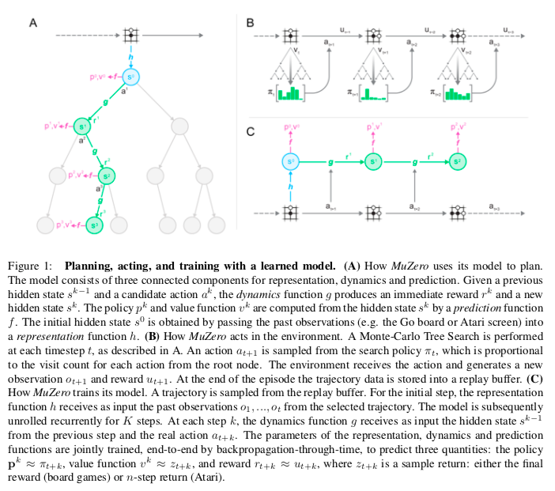
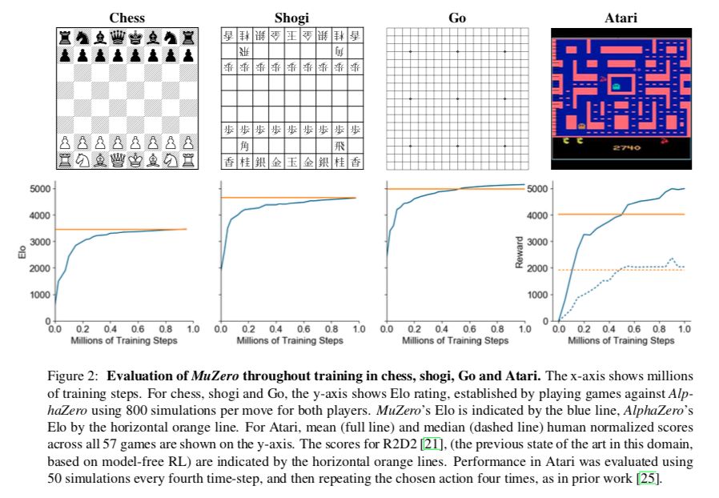

# 0. Abstract

构建具有规划能力的**with planning capabilities** 智能体一直是人工智能研究的主要挑战之一。 基于树的规划方法**Tree-based planning methods** 在一些具有挑战性的领域取得了巨大的成功，例如国际象棋和围棋，在这些领域有一个完美的模拟器。 然而，在现实世界的问题中，支配环境的动力系统**the dynamics governing the environment** 往往是复杂和未知的。 在这项工作中，我们提出了 MuZero 算法，通过结合一个基于树的搜索和一个习得模型**a tree-based search with a learned model** ，在一系列具有挑战性的和视觉复杂的领域，在对底层动力系统没有任何知识的情况下，得到了超人的表现。 Muzero 学会了一个模型，当迭代应用时，它可以预测与计划**planning**最直接相关的量化指标**quantities**: 奖励、行动选择策略和价值函数。 当评估了57个不同的 Atari 游戏——测试 AI 技术的典型视频游戏环境，其中基于模型的规划方法一直在struggled——我们的新算法达到了一个新的艺术水平。 当在围棋、国际象棋和将棋上进行评估时，在对游戏规则一无所知的情况下，MuZero 的性能与被提供了游戏规则的**was supplied with the game rules**  AlphaZero 算法的超人性能相当。

- 为什么说alphazero是被提供了game rules呢？
  - 是因为环境的dynamics被定义的很明确，比如游戏，围棋（真实的simulator）
  - 但是真实
- 这篇paper的idea是否可以应用到control和relational reasoning中呢？
- 这个可以和planet相结合吗？
- 但是这个起码说明了model-based方法是我们要寻找的方向

# 1. Introdcution

基于前瞻搜索的规划算法**Planning algorithms based on lookahead search** 在人工智能领域取得了显著的成就。 人类世界冠军曾在跳棋[34]、国际象棋[5]、围棋[38]和扑克[3,26]等经典游戏中被击败，规划算法在现实世界中的应用，从**logistics**[47]到化学合成[37] ，都产生了重要影响。 然而，这些规划算法都依赖于环境的动态知识**knowledge of the environment’s dynamics** ，比如游戏规则或者精确的模拟器**the rules of the game or an accurate simulator** ，这使得它们无法直接应用于真实世界的领域，比如机器人、工业控制或者智能助手。

基于模型的强化学习模型(RL)[42]旨在通过首先学习环境的动态模型**first learning a model of the environment’s dynamics** ，然后根据习得的模型进行规划**planning with respect to the learned model** 来解决这个问题。 通常，这些模型要么侧重于重建真实的环境状态**reconstructing the true environmental state** [8,16,24] ，要么侧重于完整的观测序列**the sequence of full observations** [14,20]。 然而，之前的工作[4,14,20]在视觉信息丰富的领域**in visually rich domains** ，**state of the art**水平仍然很低，如雅达利2600游戏[2]。 相反，最成功的方法是基于**model-free RL** [9,21,18]——也就是说，他们直接通过与环境的相互作用来估计最优策略和 / 或价值函数。 然而，无模型算法在需要精确和复杂的前瞻性的领域**require precise and sophisticated lookahead** ，例如国际象棋和围棋，也远远不够先进。

在本文中，我们介绍了 MuZero，model-based RL的一种新方法，它在 Atari 2600，一个视觉上复杂的领域集 **a visually complex set of domains**，达到最先进的性能，同时在精确规划任务**precision planning tasks** 中，如国际象棋，将棋和围棋，保持了超人的性能。 Muzero 基于 AlphaZero [39]强大的搜索**powerful search** 和基于搜索的策略迭代算法**search-based policy iteration algorithms** ，但是在训练过程中加入了一个学习模型**incorporates a learned model into the training procedure** 。 Muzero 还将 AlphaZero 扩展到更广泛的环境集，包括单个代理域和即时时间步骤的非零奖励**single agent domains and non-zero rewards at intermediate time-steps** 。

该算法的主要思想(见图1)是预测未来那些与规划直接相关的方面**to predict those aspects of the future that are directly relevant for planning** 。 该模型接收观察**observation**(例如 Go board 或 Atari 屏幕的图像)作为输入，并将其转换为隐藏状态 **transforms it into a hidden state** 。 然后通过一个循环进程迭代地更新隐藏状态，这个循环进程接收前一个隐藏状态和假设的下一个动作 **a recurrent process that receives the previous hidden state and a hypothetical next action** 。 在每一个步骤中，模型都会预测策略(比如移动游戏)**the policy (e.g. the move to play)** 、价值函数(比如预测的赢家)**value function (e.g. the predicted winner)** 和即时回报(比如得分或进球者游戏)**immediate reward (e.g. the points scored by playing a move)** 。 该模型是端到端的训练，唯一的目标是准确估计这三个重要指标**the sole objective of accurately estimating these three important quantities** ，以便匹配对policy和价值的搜索产生以及观察到的报酬的改进的估计。 没有直接的约束或要求隐藏状态捕获所有必要的信息来重建原始观测，大大减少了模型必须维护和预测的信息量**drastically reducing the amount of information the model has to maintain and predict** ; 也没有任何要求隐藏状态匹配未知的，真实的环境状态; 也没有任何其他对状态语义的约束**nor any other constraints on the semantics of state** 。 相反，隐藏状态可以自由地以任何与预测当前和未来的价值和政策相关的方式表示状态。**Instead, the hidden states are free to represent state in whatever way is relevant to predicting current and future values and policies.**   直观地说，agent可以内在地创造导致最精确的计划的规则或动力学**invent the rules or dynamics that lead to most accurate planning** 。

# 2. Prior Work

强化学习可以细分为两大类: 基于模型的和无模型的。 基于模型的 RL 构造环境的模型，把它作为中间步骤。 经典上，这个模型是由两部分组成的马尔可夫决策过程(MDP)[31] : 一个用来预测下一个状态的状态转移模型**a state transition model, predicting the next state** ，和一个在转移过程中预测期望回报的报酬模型**a reward model, predicting the expected reward during that transition** 。 该模型通常取决于所选择的动作，或者一个暂时的抽象行为**a temporally abstract behavior** ，例如一个选项[43]。 一旦建立了模型，就可以直接应用 MDP 规划算法**MDP planning algorithm**，例如值迭代[31]或蒙特卡洛树搜索(MCTS)[7] ，来计算 MDP 的最优值或最优策略。 在大型或部分可观测的环境中，算法必须首先构造模型应该预测的状态表示。 这种表示学习、模型学习和规划**representation learning, model learning, and planning** 三者的分离是存在潜在问题的，因为主体不能优化其表示或模型以达到有效规划的目的，以至于在规划过程中，例如建模错误可能会复合。

基于模型的 RL 通常的方法关注于直接在像素级对观测流建模**directly modeling the observation stream at the pixel-level** 。 它已经假设，深度随机模型可以减轻问题的复合错误[14,20]。 然而，在大规模问题中，像素级粒度的规划**planning at pixel-level granularity** 是不可计算处理的。 其他方法建立一个潜在的状态空间模型，足以在像素级重建观测流[48,49] ，或预测其未来的潜在状态[13,11] ，这有利于更有效的规划，但仍然把模型容量的主要部分关注在潜在的无关细节上**focuses the majority of the model capacity on potentially irrelevant detail** 。 这些先前的方法都没有构建一个模型来促进可视化复杂领域**facilitates effective planning in visually complex domains**  (如 Atari)的有效规划; 结果滞后于经过调优的、无模型的方法，甚至在数据效率方面也是如此[45]。

一种完全不同的方法，以模型为基础的 RL 最近已经被开发，重点是端到端预测的价值函数**end-to-end on predicting the value function** [41]。 这些方法的主要思想是构造一个抽象的 MDP 模型，使抽象的 MDP 中的规划等价于真实环境中的规划**planning in the abstract MDP is equivalent to planning in the real environment** 。 这种等价性是通过确保 价值等价 ***value equivalence*** 来实现的，也就是说，从相同的实际状态出发，抽象 MDP 中的轨迹的累积报酬**the cumulative reward of a trajectory** 与实际环境中的轨迹的累积报酬相匹配。

这种预测[41]首先引入了为了预测值(不包括动作)的值等价模型**value equivalent models for predicting value (without actions)** 。 尽管底层模型**the underlying model** 仍然采用 MDP 的形式，但是不需要它的转换模型匹配环境中的实际状态**there is no requirement for its transition model to match real states in the environment** 。 相反，MDP 模型被看作是一个深层神经网络的隐藏层。 对展开的 MDP **unrolled MDP** 进行训练，使预期的累积奖励总和**the expected cumulative sum of rewards** 与实际环境的预期值**the expected value with respect to the real environment** 相匹配，例如通过时间差异学习。

价值等价模型随后扩展到优化价值(伴随着行动)**optimising value (with actions)** 。 TreeQN [10]学习一个抽象的 MDP 模型，使得在该模型上的树搜索(由树结构神经网络表示)可以逼近最优值函数。 值迭代网络[44]学习一个局部 MDP 模型，使得在该模型上的值迭代(由卷积神经网络表示)接近最优值函数。 价值预测网络**Value prediction networks** [28]也许是最接近 MuZero 的先驱: 他们学习一个基于实际行动的 MDP 模型 **an MDP model grounded in real actions** ; 展开的 MDP 被训练，使得以由一个简单的前瞻搜索产生的实际行动序列为条件的累积奖励总和与真实环境匹配。 与 MuZero 不同，它没有策略预测，而且搜索只使用了价值预测。

# 3. MuZero Algorithm

 现在我们将更详细地描述 MuZero 算法。 在每个时间步骤 t 做预测，这是对 $k=1 \ldots K$中的每一步，基于一个对于参数$\theta$的以过去观察值$O_{1}, \ldots, O_{t}$和未来行动$a_{t+1}, \ldots, a_{t+k}$的模型得到的。这个模型预测了三个未来量化指标：策略**the policy**$\mathbf{p}_{t}^{k} \approx \pi\left(a_{t+k+1} | o_{1}, \ldots, o_{t}, a_{t+1}, \ldots, a_{t+k}\right)$， 值函数**the value function**$v_{t}^{k} \approx \mathbb{E}\left[u_{t+k+1}+\gamma u_{t+k+2}+\ldots | o_{1}, \ldots, o_{t}, a_{t+1}, \ldots, a_{t+k}\right]$，和中间回报**the immediate reward** $r_{t}^{k} \approx u_{t+k}$，其中 $u$ 是真实的，观察到的奖励**the true, observed reward**，$\pi$是用来选择实际行动的策略**the policy used to select real actions** ，$\gamma$是环境的折扣函数。

在内部，在每个时间步骤 t (为简单起见不写下标 $_t$ 了) ，模型由表示函数、动态函数和预测函数**a *representation* function, a *dynamics* function, and a *prediction* function** 的组合来表示。 动力学函数$r^{k}, s^{k}=g_{\theta}\left(s^{k-1}, a^{k}\right)$，是一个反复出现的过程，在每个假设的步骤**at each hypothetical step**  k 中，计算一个即时的奖励**an immediate reward**  $r^{k}$ 和一个内部状态**an internal state**  $s^{k}$。 它反映了 MDP  模型的结构，该模型对给定状态和动作计算期望奖励和状态转换[31]。 然而，与传统的基于模型的 RL [42]方法不同，这种内部状态 $s^{k}$  没有与其相关的环境状态语义**no semantics of environment state attached to it** ——它只是整个模型的隐藏状态，它唯一的目的是要准确预测相关的、未来的量化指标**to accurately predict relevant, future quantities** : 策略、价值和奖励。  本文确定性地表示了动力学函数**the *dynamics* function** ，对随机转移的推广**the extension to stochastic transitions**  留待以后研究。 策略和值函数通过类似于 AlphaZero 的联合策略和值网络的预测函数 $\mathbf{p}^{k}, v^{k}=f_{\theta}\left(s^{k}\right)$从内部状态 $s^{k}$ 计算得到。 “根”状态**The “root” state**  $s^{0}$ 使用一个对过去的观察结果进行编码的$s^{0}=h_{\theta}\left(o_{1}, \dots, o_{t}\right)$表示函数进行初始化; 同样，除了它对未来预测的支持之外，它没有特殊的语义。

给定这样一个模型，就有可以搜索给定过去观测值为$o_{1}, \ldots, o_{t}$的假设的未来轨道**hypothetical future trajectories** $a^{1}, \ldots, a^{k}$。 例如，初级搜索**a naive search** 可以简单地选择使值函数最大化的 $k$ 步操作序列。 更一般地，我们可以将任何 MDP  planning算法应用到动力学函数导致的内在奖励和状态空间**the internal rewards and state space induced by the dynamics function** 。 具体来说，我们使用一个类似于 AlphaZero 的搜索的 MCTS  算法，这个算法是一般化的，允许单个代理域**single agent domains**和中间（即时）奖励**intermediate**(参见方法)。 在每个内部节点上，它利用当前模型参数$\theta$产生的策略、价值和报酬估计。 Mcts  算法输出推荐的策略**a recommended policy** $\pi_{t}$ 和估计的价值 **estimated value** $\nu_{t}$。 然后选择$a_{t+1} \sim \pi_{t}$的动作。

对模型的所有参数进行联合训练**All parameters of the model are trained jointly** ，使每个假设步骤 $k$ 的策略、值和奖励与 $k$ 个实际的时间步骤过去之后**after k actual time-steps have elapsed** 观测到的相应目标值精确匹配。 与 AlphaZero 类似，改进的策略目标是通过 MCTS 搜索生成的**the improved policy targets are generated by an MCTS search** ; 第一个目标是尽量减少预测策略 $\mathbf{p}_{t}^{k}$ 和搜索策略$\pi_{t+k}$之间的误差。 然而，与 AlphaZero  不同的是，我们允许带有折现的长时间幕**long episodes with discounting** 和通过从搜索价值中向未来自举 $n$ 步得到的中间报酬**intermediate rewards by bootstrapping n steps into the future from the search value** ，$z_{t}=u_{t+1}+\gamma u_{t+2}+\ldots+ \gamma^{n-1} u_{t+n}+\gamma^{n} \nu_{t+n}$。棋盘游戏在最后一步的最终结果{失败，平局，胜利}$\{\text {lose}, d r a w, w i n\}$被视为reward $u_{t} \in\{-1,0,+1\}$。 具体来说，第二个目标是使预测值$v_{t}^{k}$ 和值目标**the value target**  $z_{t+k}$之间的误差最小。 奖励目标仅仅是观察到的奖励**the observed rewards** ，因此第三个目标是使预测的奖励 $r_{t}^{k}$ 和观察到的奖励 $u_{t+k}$  之间的误差最小化。 最后，加入 L2正规化，得到整体损失函数:
$$
l_{t}(\theta)=\sum_{k=0}^{K} l^{r}\left(u_{t+k}, r_{t}^{k}\right)+l^{v}\left(z_{t+k}, v_{t}^{k}\right)+l^{p}\left(\pi_{t+k}, \mathbf{p}_{t}^{k}\right)+c\|\theta\|^{2}
$$
其中$l^{r}, l^{v},$ 和 $l^{p}$分别是奖励**reward**、价值**value**和策略**policy**的损失函数。 Supplementary Figure S2 总结了控制 MuZero 算法如何计划、运行和学习**plans, acts, and learns** 的方程。

# 4. Results

我们将 MuZero 算法应用于经典的棋盘游戏围棋、国际象棋和将棋，作为具有挑战性的规划问题的基准，并应用于 Atari 学习环境[2]中的所有57个游戏，作为视觉复杂 RL 领域的基准。

在每一个案例中，我们训练 MuZero 进行 $K=5$ 个假设步骤。 在进行了100万次mini-batches 训练，其中小型棋盘游戏的mini-batch size是2048，Atari游戏的mini-batch size是1024。  在**both**训练和评估期间，MuZero 在棋盘游戏中对每个搜索进行了800次模拟，在 Atari 中对每个搜索进行了50次模拟。 表示函数**The representation function** 采用与  AlphaZero 相同的卷积[23]和残差[15]结构，但残余块数从20个变成16个。 动力学函数**The dynamics function** 使用与表示函数相同的结构，预测函数使用与  AlphaZero 相同的结构。 所有网络都使用256个隐藏平面**hidden planes** (详见Methods )。

- 所以不是都使用同一个结构的意思嘛hhh？

图2显示了在每个游戏的整个训练过程中的表现。 在围棋中，尽管在搜索树中每个节点使用的计算量较少(MuZero  每个计算使用16个残差块，而 AlphaZero 使用20个块），MuZero 还是略微超过了 AlphaZero 的性能。 这表明 MuZero  可能将其计算缓存在搜索树中，并使用动态模型的每一个额外应用程序来获得对位置的更深入的理解。

在雅达利，MuZero 在57款游戏的 Arcade Learning Environment  中实现了平均和中位数标准化得分的最新水平，在57款游戏中的42款游戏中超过了之前的最先进的方法 R2D2 ，在所有游戏中超过了之前最好的基于模型的 SimPLe [20]方法(见表 S1)。

我们还评估了 MuZero 的第二个版本，该版本被优化得到更高的样本效率。 具体来说，它通过使用最新的网络参数重新运行 mcts  来重新分析旧的轨迹**reanalyze old trajectory**，以提供新的目标(见附录 h)。 当应用于57款 Atari 游戏，使用2亿帧的游戏体验时，MuZero reanalyse  的标准化得分中位数达到了731% ，而之前的最先进的无模型游戏 IMPALA [9]、 Rainbow [17]和 LASER  [36]分别达到了192% 、231% 和431% 。

为了理解这个模型在 MuZero 中的作用，我们还做了几个实验，重点是围棋游戏和the Atari game of Ms. Pacman 。

首先，我们在 Go 的权威性规划问题**canonical planning problem**中测试了规划的可伸缩性**scalability of planning**(图3A)。 我们比较了使用一个完美的模型的AlphaZero 的搜索性能和 使用一个习得模型的MuZero  的搜索性能。 具体来说，通过比较不同思维时间的 MCTS，对全程训练的 AlphaZero 和 MuZero 进行评估。  Muzero 匹配上了一个完美模型的性能，即使在执行比模型训练所用时间(大约0.1秒的思考时间，参见图  S3A)大得多的搜索(多达10秒的思考时间)时。

我们还研究了所有 Atari 游戏规划的可扩展性(参见图3B)。 我们使用完全训练的 MuZero 对不同数量的仿真进行了比较。  planning带来的改进远不如围棋明显，可能是因为模型的不准确性更大; 性能随着搜索时间的增加略有提高，但100次模拟左右就保持平稳。  即使使用单一的模拟**with a single simulation** ——也就是说，当只根据策略网络选择动作时—— MuZero  的表现也很好，这表明，在训练结束时，原始策略已经学会了将搜索的好处内在化(参见图 S3B)。

接下来，我们针对一个可对比的model-free学习算法测试了model-based的学习算法(参见图3C)。 我们用 R2D2使用的一个**model-free Q-learning objective** 代替了 MuZero (Equation 1)的训练目标，用对偶值和单头的策略头代表 Q 函数 $Q\left(\cdot | s_{t}\right)$**the dual value and policy heads with a single head representing the Q-function**  。 随后，我们对新模型进行了训练和评估，没有使用任何搜索。 当用 Ms. Pacman 进行评估时，我们的 model-free 算法得到了与  R2D2相同的结果，但是学习速度明显慢于 MuZero，并且收敛到一个更低的最终分数。 我们推测， MuZero 的基于搜索的策略改进步骤**the search-based policy improvement step**比 q  学习使用的高偏差、高方差目标提供了更强的学习信号。

为了更好地理解 MuZero 学习算法的本质，我们测量了 MuZero 在训练过程中使用的搜索量的训练量表。 图3D 显示了在 Ms. Pacman 中的表现，在整个训练过程中，使用了每次移动的不同模拟计数的 MCTS。  令人惊讶的是，与之前的工作相比，即使每次行动只有6次模拟 **only 6 simulations per move** ——少于行动次数 **fewer than the number of actions** —— MuZero 学会了一个有效的策略，并迅速得到改进。  随着模拟次数的增加，性能会明显提高。 要分析每次迭代过程中的策略改进，请参见图 S3 c 和 d。

# 5. Conclusions

人工智能领域的许多突破要么是基于高性能的计划high-**performance planning** [5,38,39] ，要么是基于无模型的强化学习方法**model-free reinforcement learning methods** [25,29,46]。 在本文中，我们介绍了一种结合两种方法的优点的方法。 我们的算法 MuZero  在他们喜欢的领域——逻辑复杂的棋盘游戏logically complex board games，比如国际象棋和围棋——都匹配了高性能规划算法的超人性能，并且在他们喜欢的领域——视觉复杂的 Atari  游戏中表现优于最先进的无模型 RL 算法。  至关重要的是，我们的方法不需要任何关于游戏规则或环境动态学的知识**any knowledge of the game rules or environment dynamics** ，这可能为将强大的学习和规划方法应用于现实世界中没有完美模拟器的许多领域铺平了道路。