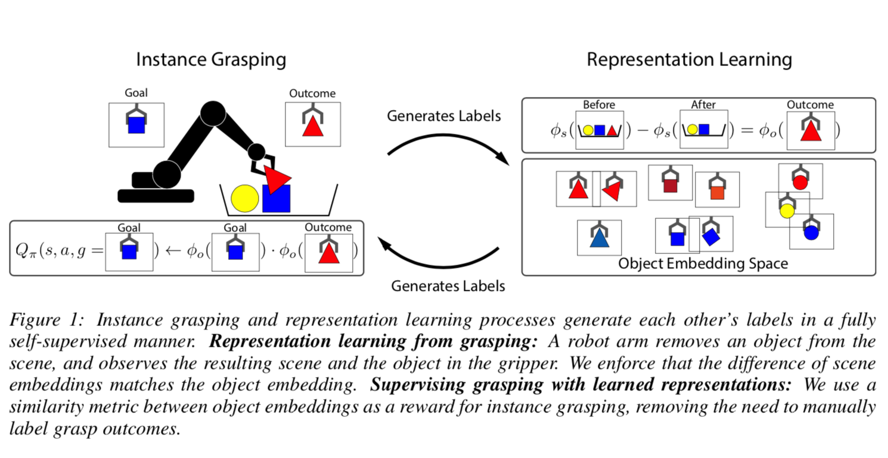
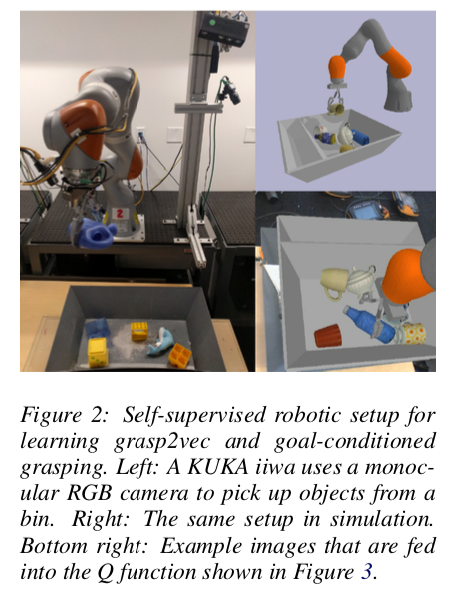
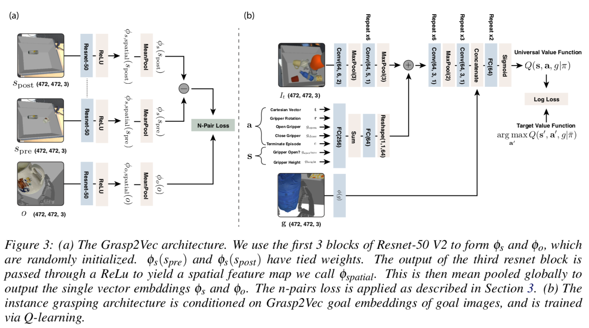
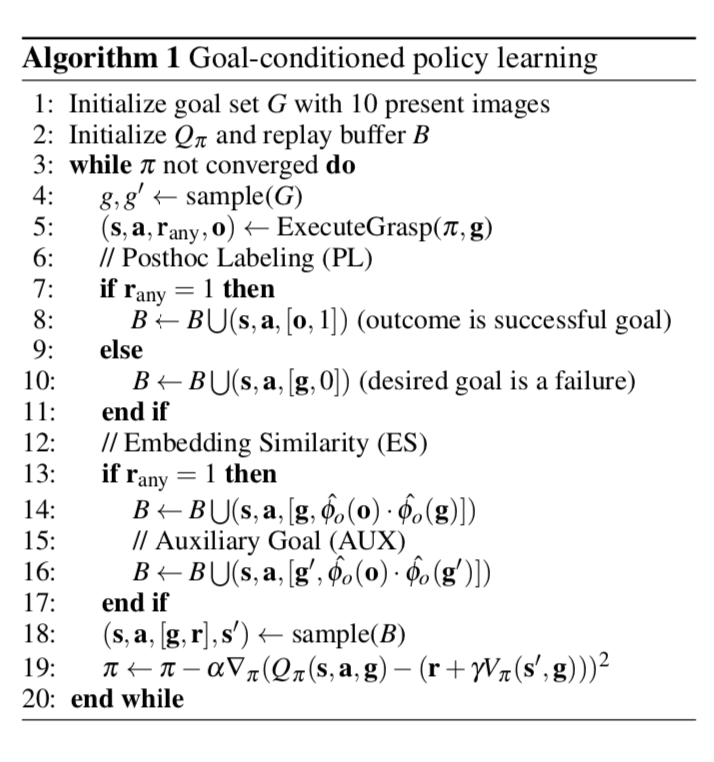
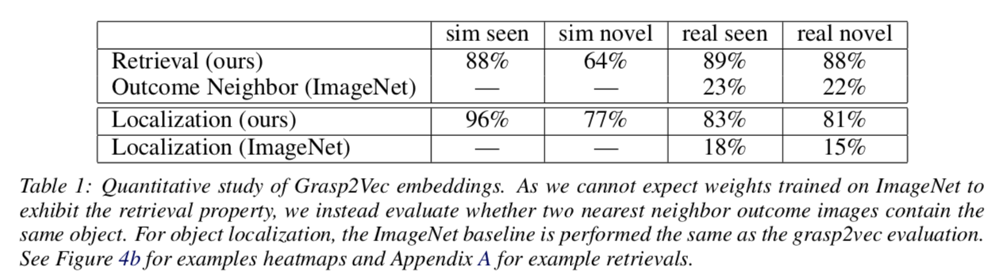
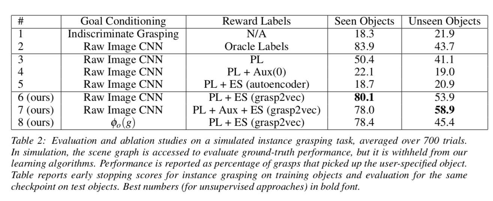

# Grasp2Vec: Learning Object Representations from Self-Supervised Grasping // Grasp2Vec:从自监督抓取中学习对象表示
## 0. Abstract

良好结构的视觉表示**Well structured visual representations**可以提高机器人的学习速度和泛化能力。本文研究了利用机器人与环境的自主交互**autonomous robot interaction with the environment**，在不需要人工标注**without human labeling**的情况下，如何获得机器人操纵任务的有效的以对象为中心的表征**object-centric representations**。随着机器人积累的经验越来越多，这种再现学习方法可以受益于对再现的不断细化**continuous refinement of the representation**，从而使它们能够在没有人工干预的情况下有效地扩展**scale effectively**。我们的表示学习方法**representation learning approach**是基于对象持久性**object persistence**的：当机器人从场景中删除一个对象时，该场景的表示应该根据被重新移动的对象的特征进行更改。我们制定一个从这个观察中得到的特征向量之间的算术关系**arithmetic relationship**，并使用它来学习的表示场景和对象，然后可以用来识别对象实例**identify object instances**，在场景中定位，并执行目标导向的抓取任务**goal-directed grasping tasks**——其中机器人必须从一个箱子 **a bin** 中检索命令对象**retrieve commanded objects**。同样的抓取过程也可以用来为我们的方法自动收集训练数据，通过记录场景图像，抓取和重新移动一个物体，并记录结果。我们的实验证明，这种自我监督**self-supervised**的任务抓取方法在很大程度上优于直接强化学习**direct reinforcement learning**的图像和先前的表示学习方法**prior representation learning methods**。

> **关键词：**
>
> 示例抓取**instance grasping**；无监督学习**unsupervised learning**；强化学习**reinforcement learning**

## 1. Introduction

基于增强学习**reinforcement**、自我监督**self-supervision**和模仿学习**imitation**的机器人学习算法可以从图像中获取端到端的控制器**end-to-end controllers**，用于机器人移动**robotic mobility**[1，2]和目标操纵**object manipulation**[3，4]等不同任务。这些端到端的控制器获取为任务量身定制的感知系统，从而获取对当前控制问题最有用的线索。然而，如果我们的目标是学习可泛化的机器人技能**generalizable robotic skills**，并赋予机器人广泛的行为技能**endow robots with broad behavior repertoires**，我们可能更喜欢更结构化、更有效地分离现实世界场景下的变化因素的感知表示**perceptual representations**，如物体和它们特性的持久性**the persistence of objects and their identities**。这种代表性学习方法**representation learning methods**的一个主要挑战是保持自我监督的好处**retain the benefit of self-supervision**，它允许利用自主收集的大量经验，同时仍然获得能够为下游任务**downstream tasks**提供卓越泛化和可解释性**superior generalization and interpretability**的结构。

在本文中，我们研究了这个问题的一个具体实例：通过与环境的自主机器人交互获取以对象为中心的表示**acquiring object-centric representations**。通过与现实世界的互动，**an agent**可以了解感知和行动的相互作用。例如，观察和拾取对象使机器人能够发现物理实体与其周围环境之间**between physical entities and their surrounding contexts**的关系。如果一个机器人在它所处的环境中抓住某个物体并把它抬离轨道，那么它就可以得出结论，任何仍然可见的东西都不是它所抓住的东西的一部分**anything still visible was not part of what it grasped**。它还可以从一个新的角度看它的抓取器**gripper**和物体。通过主动交互，机器人可以了解图像中的哪些像素是可抓取的对象，并且可以在不受任何人监督的情况下通过不同的姿势**across different poses**识别特定的对象。

虽然可以从语义注释数据**semantically annotated data**（例如，MSCOCO数据集[5]）中学习以对象为中心的表示**object-centric representations**，但这排除了持续的自我改进**precludes continuous self-improvement**：机器人收集的（缺少人类注释的）额外经验**additional experience**不能直接用于提高表示的质量和可靠性。为了实现自动改进，表示**the representation**必须是自我监督的。在这种情况下**In that regime**，机器人与世界进行的每一次交互都会提高其表现力。

我们的表示学习方法基于对象持久性**based on object persistence**：当机器人拿起一个对象并将其从场景中移除时，场景的表示应该以可预测的方式改变**the representation of the scene should change in a predictable way**。我们可以使用这种观察来制定一个**formulate a simple condition**以对象为中心的表示应该满足的简单条件：与一个场景相对应的特征应该大约等于**approximately equal to**删除一个对象后同一场景的特征值减去该对象的特征值（见***Fig. 1***）。在此基础上，我们训练了一个卷积神经网络特征抽取器**a convolutional neural network feature extractor**，证明它可以有效地捕获场景中的单个对象身份**capture individual object identity**，并对场景中的对象集进行编码**encode sets of objects**，而无需任何人工监控。

利用这种表示方法，我们提出了一种基于目标特征向量或图像的自监督抓取策略**a self-supervised grasping policy conditioned on an object feature vector or image**。当 标记正确的对象是否被抓住时 通常需要人的监督（意思是以前需要人标注的方法和我们的不需要标注的方法reward signal一样好），我们表明（用我们的方法学习到的）对象嵌入**object embeddings**之间的相似性提供了同样好的奖励信号。

我们的主要贡献是`grasp2vec`，这是一个通过自我监督学习得到的以对象为中心的视觉嵌入**an object-centric visual embedding**。我们演示了如何将这种表示法用于对象定位、实例检测和目标条件抓取**object localization, instance detection, and goal-conditioned grasping**，在这种情况下，可以将自主收集的抓取经验**autonomously collected grasping experience**与基于我们表示法的抓取目标**grasping goals based on our representation**重新关联**relabel**起来，并用于训练策略来抓取用户指定的对象**grasp user-specified objects**。我们发现，在模拟目标条件抓取结果基准中**in a simulated goal-conditioned grasping results benchmark**，我们的方法优于其他无监督方法。补充说明和视频请访问https://sites.google.com/site/grasp2vec/home

## 2. Related Work

- **Unsupervised representation learning无监督表示学习**。过去关于交互式学习的研究都使用了移动代理**a mobile agent**或戳动动作**poking motions**[6,7,8,9,10]来提供数据高效的感知和控制学习**data-efficient learning of perception and control**。我们的方法学习抽象出位置和外观的表示，同时通过一个单一的特征向量**via a single feature vector**保持对象的同一性和在世界上的组合结构**preserving object identity and the combinatorial structure in the world**（即存在哪些对象）。过去的研究还发现，深度表示**deep representations**可以表现出直观的线性关系**intuitive linear relationships**，例如字嵌入**word embeddings**[11]和面属性**in face attributes**[12]。Wang等人将行为**actions**描述为行为识别**action recognition**中从先决条件到效果的转变**the transformation from precondition to effect**[13]。虽然我们的工作在一次行动过程中**over the course of an action**共享算术一致性的概念**the idea of arithmetic consistency**，但我们优化了不同的标准**optimize a different criterion**，并将模型应用于学习策略，而不是行动识别**learning policies rather than action recognition**。

- **Self-supervised grasping自我监督抓取**。最近的一个工作重点是从RGB图像中提取任意对象**picking up arbitrary objects from RGB images**的深度视觉运动策略**deep visuomotor policies**[14,4,15,16]。通过自动检测是否抓住了某个物体，这些方法可以在无人监督的情况下学习。Ten Pas等人将目标检测与抓取相结合**combine object detection with grasping**，通过为每个对象提供标有类别的训练数据**class labeled training data**[17]并将抓取预测作为对象建议**using grasp predictions as object proposals**，从而能够抓取目标对象。

解决实例抓取**instance grasping**的任务需要推断抓取的对象是否正确**inferring whether the correct object was grasped**。Jang等人提出了一种机器人抓取物体后，将其图像呈现给摄像机并尝试将它们的类别标记为人类给定的标签的系统。[18]Fang等人在模拟中获取标签，并使用域适应**domain adaptation**将策略推广到现实场景，这需要解决模拟到现实的迁移问题**solving a simulation-to-reality transfer problem**[19]。

在标准的RL设置中，过去的一些工作已经研究了用“无意的奖励”**“unintentional rewards”**来标记离线策略行为**off-policy behavior**[20,21]。然而，这些算法并没有解决**如何**检测所需目标是否被实现的问题，这在模拟器之外是非常重要的。我们的方法完全通过自我监督的表示学习**self-supervised representation learning**来规避标签问题。据我们所知，这是第一个以完全无标签的方式学习实例抓取任务的工作。

Florence等人的并行工作**Concurrent work**[22]在抓取对象的深度图像中使用像素级对比损失变化检测**a pixel-wise contrastive loss change detection**来学习描述符号**learn descriptors**。与此相反，我们报告了定量结果，它表明即使在使用不同的视角指定实例时**the instance is specified with a different view**，我们的方法在识别、定位和抓取对象方面**in identifying, localizing, and grasping objects**达到了很高的精度，在严重遮挡或变形情况下**under heavy occlusion, or under deformation**也是如此。

## 3. Grasp2Vec: Representation Learning from Grasping

我们的目标是学习以对象为中心的图像嵌入**an object-centric embedding of images**。嵌入**embeddings**应该通过特征向量来表示对象**represent objects via feature vectors**，这样具有相同对象的图像就可以紧密地联系在一起，而具有不同对象的图像则相距很远。因为指示图像中的对象的标签不可用**labels are not available**，所以我们依赖于自我监督的目标。具体地说，我们利用这样一个事实：当机器人与一个场景交互以抓取一个对象时，这种交互是量化的：它要么抓取一个或多个完整的对象，要么什么都不抓取。当一个物体被拾取时，我们知道初始场景必须包含该物体，并且后面的场景必须少一个该物体。我们利用这个概念来构造图像嵌入**structure image embeddings**，通过要求抓取前后场景的特征差**feature difference of the scene before and after grasping**接近被抓取对象的表示**the representation of the grasped object**。

我们将抓取事件**grasping episodes**记录为图像三元组**images triples**：$\left(s_{\mathrm{pre}}, s_{\mathrm{post}}, \mathbf{o}\right)$，其中$s_{\text {pre}}$是抓取前的场景图像，$s_{\mathrm{post}}$是抓取后的同一场景，$\mathbf{o}$是被抓去举到相机上的物体的图像**an image of the grasped object held up to the camera**。我们在模拟和真实图像实验中使用的特定抓取设置在第5节中进行了描述。让$\phi_{s}\left(s_{\mathrm{pre}}\right)$作为输入场景图像的矢量嵌入**a vector embedding**（即机器人可能从中抓取东西的箱子的图片）。让$\phi_{o}(\mathbf{o})$作为结果图像的矢量嵌入，使$\phi_{s}\left(s_{\mathrm{pre}}\right)$和$\phi_{o}(\mathbf{o})$具有相同的维数。我们可以将上一段中的逻辑表示为这些向量的算术约束**an arithmetic constraint on these vectors**：我们希望$\left(\phi_{s}\left(s_{\mathrm{pre}}\right)-\phi_{s}\left(s_{\mathrm{post}}\right)\right)$等于$\phi_{o}(\mathbf{o})$。我们也希望嵌入是非平凡的**non-trivial**，这样$\left(\phi_{s}\left(s_{\mathrm{pre}}\right)-\phi_{s}\left(s_{\mathrm{post}}\right)\right)$就远离其他未抓取的对象的嵌入。

- **Architecture架构**。为了嵌入场景和结果的图像**embed images of scenes and outcomes**，我们使用卷积神经网络来表示$\phi_{s}$和$\phi_{o}$。这两个网络基于**ResNet-50**[23]结构，后面是**ReLU**（见图3），并且都生成**3D (*H*x*W*x1024)**卷积特征映射$\phi_{s, \text { spatial }}$和$\phi_{g, \text { spatial }}$。由于我们的目标是获得对象和对象集合**objects and sets of objects**的单向量表示**a single vector represention**，我们通过全局平均池**globally average-pooling**将这些映射转换为特征向量：$\phi_{s}=\sum_{i<H} \sum_{j<W} \phi_{s, \text { spatial }}(X)[i][j]/_{H * W}$，$\phi_{o}$也是一样的。这种架构的动机是允许$\phi_{s, \text { spatial }}$对接收字段产生哪些特征**receptive fields produce which features**的对象位置进行编码**encode object position**。通过将**RELU**的非线性应用于空间特征向量**spatial feature vectors**，我们将对象表示**object representations** 约束为非负的。这样可以确保一组对象只能随着添加的对象而增长；一个对象不能与另一个对象相反**one object cannot be the inverse of another**。

- **Objective目标**。这个问题被形式化为度量学习**metric learning**，其中所需的度量位置**the desired metric places**$\left(\phi_{s}\left(s_{\mathrm{pre}}\right)-\phi_{s}\left(s_{\mathrm{post}}\right)\right)$靠近$\phi_{o}(\mathbf{o})$，远离其他嵌入。许多度量学习损失**metric learning losses**使用了“锚”嵌入**an “anchor” embedding**和“正”嵌入**a “positive” embedding**的概念，其中正嵌入更靠近锚，而远离其他“负”嵌入**the positive is brought closer to the anchor and farther from the other “negative” embeddings**。优化这类目标的一种方法是使用**the n-pairs loss**[24]来训练编码器$\phi_{s}$和$\phi_{o}$，从而将成对的示例（即$\left(\phi_{s}\left(s_{\text {pre }}\right)-\phi_{s}\left(s_{\text {post }}\right)\right.$））和$\phi_{o}(\mathbf{o})$推到一起，并将不成对的示例推开**unpaired examples are pushed apart**。**the n-pairs loss**并不是处理显式（锚、正、负）三元组**explicit (anchor, positive, negative) triplets**，而是将一个**mini batch**中的所有 **其他** 正数视为（锚、正）对的负**as negatives for an (anchor, positive) pair**。让$i$索引到一个**mini batch**的锚$a$，让$j$索引到正嵌入$p$。目标是最大化$a_{i} \top p_{i}$，同时最小化$a_{i} \top p_{j \neq i}$。损失是每个锚$i$的**softmax**交叉熵损失与所有阳性的p之和。

$$
\operatorname{NPairs}(a, p)=\sum_{i<B}-\log \left(\frac{e^{a_{i} \top p_{i}}}{\sum_{j<B} e^{a_{i}, p_{j}}}\right)+\lambda\left(\left\|a_{i}\right\|_{2}^{2}+\left\|p_{i}\right\|_{2}^{2}\right)
$$

超参数$\lambda$将嵌入量**the embdding magnitudes**正则化，$B$是batch size。在我们的实验中，$\lambda=0.0005 \text { and } B=16$。这种损失对于锚和正嵌入**anchors and positives**来说是不对称的**asymmetric**，因此我们在两个顺序中都评估嵌入情况**evaluate with the embeddings in both order**，这样我们的最终训练目标是：
$$
\mathscr{L}_{\text {Grasp} 2 \mathrm{Vec}}=\mathrm{NPairs}\left(\left(\phi_{s}\left(s_{\mathrm{pre}}\right)-\phi_{s}\left(s_{\mathrm{post}}\right)\right), \phi_{o}(\mathbf{o})\right)+\mathrm{NPairs}\left(\phi_{o}(\mathbf{o}),\left(\phi_{s}\left(s_{\mathrm{pre}}\right)-\phi_{s}\left(s_{\mathrm{post}}\right)\right)\right)
$$

## 4. Self-Supervised Goal-Conditioned Grasping

`Grasp2Vec`表示可以实现有效的目标条件抓取**effective goal-conditioned grasping**，机器人必须抓取与用户提供的查询匹配的**matching a user-provided query**对象。在这个设置中，相同的抓取系统既可以收集数据来训练表示**training the representation**，也可以利用这个表示来实现指定的目标。抓取任务被表述为马尔可夫决策过程a **Markov decision process (MDP)**，类似于Kalashnikov等人\[25\]提出的不加区分的抓取系统**the indiscriminate grasping system**。动作$\mathbf{a}$对应笛卡尔夹持器运动**Cartesian gripper motion**和夹持器打开和关闭命令**gripper opening and closing commands**，状态$\mathbf{s}$包括当前图像和目标$\mathbf{g}$的表示。我们旨在学习以下奖励函数下的函数$Q_{\pi}(\mathbf{s}, \mathbf{a}, \mathbf{g})$：抓取被$\mathbf{g}$指定的对象会产生一个对所有其他时间步骤的最终奖励**a terminal reward**为$\mathbf{r}=1$ 和 $\mathbf{r}=0$。$Q_{\pi}$的结构如**Fig. 3**所示。

学习这一**Q-function**提出了自我监督目标条件抓取**self-supervised goal-conditioned grasping**所独有的两个挑战：当在学习的早期阶段，极不可能找到正确的目标时，我们必须找到一种方法来训练策略；并且我们还必须在没有真实数据对象标签时**without ground truth object labels**，从事件中提取奖励**extract the reward from the episodes**。

我们假设抓取系统能自动判断抓取对象是否成功，但不能判断抓取的对象是哪一个。例如，机器人可以通过检查抓取器是否完全关闭，以确定它是否持有某种东西。我们将用$\mathbf{r}_{\text {any }}$来表示不区分对象的奖励函数**indiscriminate reward function**，如果抓住了一个对象，最后一个时间步骤是1，否则是0。Q-learning可以从任何$(\mathbf{s}, \mathbf{a}, \mathbf{r}, \mathbf{g})$形式的有效元组**valid tuple**中学习，因此我们使用$\mathbf{r}_{\text {any }}$生成这些不带对象标签的元组**tuples without object labels**。我们利用三种不同的技术自动增加Q-学习的训练数据**automatically augment the training data**，使学习目标条件抓取成为现实：

- **Embedding Similarity (ES) 嵌入相似性。**一个通用的目标标记系统将基于什么是指令**what was commanded**、$\mathbf{g}$、什么被实现了**what was achieved**，$\mathbf{o}$，近似真正的在线策略**on-policy**的奖励函数之间的相似性概念**notion of similarity**来标记奖励**label rewards**。如果`Grasp2Vec`表示捕获了对象之间的这种相似性，那么设置$\mathbf{r}=\hat{\phi}_{o}(\mathbf{g}) \cdot \hat{\phi}_{o}(\mathbf{o})$将可以实现对样例抓取的策略学习。
- **Posthoc Labeling (PL)事后标记。**嵌入相似度**Embedding similarity**将为q函数提供接近正确的奖励，但如果策略永远无法抓住正确的对象，将没有信号可供学习。我们使用类似于Andrychowicz等人\[20\]提出的后视经验回放技术**the hindsight experience replay technique**的数据增强方法**data augmentation approach**。。如果一个事件**episode**中抓住了任何对象，我们可以将$\mathbf{o}$作为该事件中状态和动作的正确目标，并将转换**transition**$(\mathbf{s}, \mathbf{a}, \mathbf{o}, \mathbf{r}=1)$添加到缓冲区**the buffer**中。我们称之为“事后标签”**the posthoc label**。
- **Auxiliary Goal Augmentation (Aux)辅助目标增强。**我们可以通过用未实现的目标重新标记转换**relabling transitions**来进一步增强重播缓冲区**augment the replay buffer**。我们不是对单个目标进行抽样**sampling a single goal**，而是从目标集**the goal set** $G$ 中抽样一对目标$\left(\mathbf{g}, \mathbf{g}^{\prime}\right)$，如果在执行$\mathbf{g}$上的策略后$\mathbf{r}_{\text {any }}==1$，我们将转换$\left(\mathbf{s}, \mathbf{a}, \mathbf{g}^{\prime}, \mathbf{r}=\hat{\phi}_{o}\left(\mathbf{g}^{\prime}\right) \cdot \hat{\phi}_{o}(\mathbf{o})\right)$添加到重播缓冲区**the replay buffer**。在不使用嵌入**embeddings**的**baseline**中，假设$\mathbf{g}^{\prime}$不可能是被抓取的对象时，则将奖励替换为0。

算法1总结了目标奖励重新标注方案**the goal-reward relabeling schemes**的伪代码以及自监督的实例抓取程序**the self-supervised instance grasping routine**。

## 5. Experiments

我们的实验回答了以下问题。对于任何抓取三元组$\left(s_{\mathrm{pre}}, \mathbf{o}, s_{\mathrm{post}}\right)$，矢量$\phi_{s}\left(s_{\text {pre }}\right)-\phi_{s}\left(s_{\text {post }}\right)$能否表示抓住了哪个物体？可以使用$\phi_{s, \text { spatial }}\left(s_{\text{pre}}\right)$来定位场景中的对象吗？最后，我们展示了可以通过使用`grasp2vec`嵌入之间的距离**using distance between grasp2vec embeddings**作为奖励函数来训练实例抓取策略。

- https://sites.google.com/site/grasp2vec/

- **Experimental setup and data collection.实验设置和数据收集。**使用具有双指夹持器**2-finger grippers**的**KUKA LBR iiwa**机器人进行真实数据收集，用于评估真实图像的表示**evaluating the represen- tation on real images**，抓取具有各种视觉属性**various visual attributes**和不同尺寸的物体。单目RGB观察数据**Monocular RGB observations**由肩上相机**over-the-shoulder camera**提供。动作$\textbf{a}$由笛卡尔位移矢量**a Cartesian displacement vector**，垂直手腕旋转**vertical wrist rotation**和打开和关闭夹具的二元命令**binary commands to open and close the gripper**。模拟环境是使用Bullet [26]模拟的真实环境模型。***Fig. 2***描绘了模拟和真实世界的设置，以及机器人相机的图像观察。我们对3个任务在实际和模拟环境中进行训练和评估`grasp2vec`嵌入**train and evaluate grasp2vec embeddings**：从场景差异中回忆对象**object recall from scene differences**，在场景中对象定位**object localization within a scene**，以及用作例如抓取的奖励功能**use as a reward function for instance grasping**。

### 5.1. Grasp2Vec嵌入分析 Grasp2Vec embedding analysis

我们在成功抓取上训练目标和场景嵌入**We train the goal and scene embeddings on successful grasps**。我们为模拟的结果在15k次成功的的抓取上训练**train on 15k successful grasps**，并为现实世界的结果训练了437k次。该目标推动结果图像的嵌入**embeddings of outcome images**接近于它们各自的场景图像的嵌入差异**embedding difference of their respective scene images**，并且彼此远离。通过将场景表示为其对象的总和**the sum of their objects**，我们希望场景嵌入空间**the scene embedding space**是由对象存在**object presence**而不是由对象位置**object location**构成。这由**Fig. 4a**中所示的场景图像的最近的邻居验证**validated by the nearest neighbors of scene images**，其中最近的邻居包含相同的对象而不管位置或姿势**regardless of position or pose**。

**For any grasp triplet $\left(s_{\mathrm{pre}}, \mathbf{o}, s_{\mathrm{post}}\right)$, does the vector $\phi_{s}\left(s_{\text {pre }}\right)-\phi_{s}\left(s_{\text {post }}\right)$indicate which object was grasped? 对于任何抓取三元组$\left(s_{\mathrm{pre}}, \mathbf{o}, s_{\mathrm{post}}\right)$，矢量$\phi_{s}\left(s_{\text {pre }}\right)-\phi_{s}\left(s_{\text {post }}\right)$能否表示抓住了哪个物体？**我们可以通过验证场景特征的差分**difference in scene features**$\phi_{s}\left(s_{\text {pre }}\right)-\phi_{s}\left(s_{\text {post }}\right)$与抓取的对象特征$\phi_{o}(\mathbf{o})$相近，来评估场景和结果特征空间**outcome feature spaces**。由于同一对象的许多结果图像**outcome images**将具有相似的特征，如果最近邻居的结果图像**the nearest neighbor outcome image**包含与从$S_{pre}$抓取的对象相同的物体，则我们将检索***retrieval***定义为正确的。附录A显示了成功和失败的示例。如表1所示，训练模拟对象和所有真实对象都有很高的检索精度**retrieval accuracy**。因为模拟数据比真实数据集中包含的唯一的物体更少，所以在真实图像上训练的嵌入能更好地泛化也就不足为奇了。

**Can $\phi_{s,\text { spatial }}\left(s_{\text {pre }}\right)$ be used to localize objects in a scene? 可以使用$\phi_{s,\text { spatial }}\left(s_{\text {pre }}\right)$来定位场景中的对象吗？**`grasp2vec`架构和目标使我们的方法能够在没有任何空间监督**without any spatial supervision**的情况下定位对象。
通过将场景和单个对象（结果）嵌入到同一空间中，我们可以使用结果嵌入来定位场景中的该对象。如**Fig. 4b**所示，我们计算$\phi_{o}(\mathbf{o})$与$\phi_{s, s p a t i a l}\left(s_{\mathrm{pre}}\right)$的每个像素之间的点积，以获得对应于查询对象与每个像素的感受域**receptive field**之间的亲和度（相似性）**affinity**的图像上的热图**a heatmap**。仅当热图中的最大激活点**the point of maximum activation in the heatmap**位于正确的对象上时，才认为定位是正确的。如**Tab. 1**所示，`grasp2vec`嵌入在训练期间从未见过的物体上以几乎80％的准确度执行定位，而不用接收到任何位置标签。在训练期间看到的模拟物体可以以更高的精度定位。我们期望这种方法可用于提供拾取和放置目标或推动需要特定对象位置的任务。对于这种定位评估，我们将`grasp2vec`嵌入 与 嵌入中使用的同样基于ResNet50的但是是在ImageNet上进行训练的架构进行比较[27]。此网络仅能够以15％的准确度对定位对象，因为抓取器中对象的特征不必与箱子中相同对象的特征类似。

### 5.2. 模拟环境实例抓取Simulated instance grasping

虽然过去的工作已经解决了自我监督的无区分的抓取问题**addressed self-supervised indiscriminate grasping**，但我们表明，可以在没有额外监督的情况下学习实例抓取。我们在模拟环境中进行消融研究**ablation studies**，并分析模型体系结构的选择和目标-奖励的重新标记**goal-reward relabeling**是如何影响实例抓取性能和对看不见的测试对象的泛化性能。
***Tab. 2***中报告了总体实例抓取性能。在奖励函数中使用我们的方法（Grasp2Vec嵌入相似性**Grasp2Vec embedding similarity**）的所有模型在所见对象上实现至少78％的实例抓取成功率。我们的实验得出以下结论：

*How well can a policy learn without any measure of object similarity? 如果没有任何对象相似度，策略的学习效果如何？*观察实验1和3，我们发现**posthoc labeling**的执行次数是不区分抓取**indiscriminate grasping**的两倍，而不需要额外的信息。然而，**the PL only experiment**远远落后于在实验3中使用真实标签的上限**upper bound**。在实验4中添加辅助目标监督**auxiliary goal supervision**，其中通过随机采样不同的目标图像并将其标记为失败的轨迹**a failed trajectory**来进行数据增强，只会让表现结果更差。

> ***post hoc***
>
> adj.(from Latin, formal)(of an argument, etc. 论点等)以先后为因果的；事后归因的 
>
> stating that one event is the cause of another because it happened first 

*Does any embedding of the goal image provide enough supervision? 目标图像的嵌入是否提供了足够的监督？*奖励标签的目标是指示两个目标图像是否包含相同的对象，以奖励抓取正确对象的策略。我们在**Tab. 1**中已经发现ImageNet权重**ImageNet weights**在此任务中失败了。在实验5中，我们发现训练成编码目标图像**encode goal images**的自动编码器**an autoencoder**不能提供良好的奖励标签，表现不比不加选择的策略**a indiscriminate policy**好。

*How close can grasp2vec embeddings get to the oracle performance?  grasp2vec 嵌入与获得oracle性能有多接近？*oracle标签需要知道目标中对象的真实身份**the true identity**和结果图像。目标和结果图像的grasp2vec嵌入的余弦相似性**cosine similarity**要比自动编码器嵌入更好地近似这个标签**approximates this label**。实验6和7表明，使用grasp2vec相似性导致在训练中看到的对象上具有与oracle相当的性能**leads to perfor- mance on-par to the oracle on objects**，并且在策略被训练的新对象上胜过oracle。与oracle不同，在训练或测试期间，grasp2vec相似性不需要对象标识标签**requires no object identity labels**。

*Should the grasp2vec embedding also be used to condition the policy? grasp2vec嵌入是否也应用于制定策略？*在实验8中，我们对嵌入目标图像**the embedding of the goal image**而不是图像本身的策略进行了调整**condition the policy**。这会降低仅在未看到的对象上的性能，这表明嵌入**embeddings**可能会在很小的范围内**by a small margin**损害泛化性能。

- **Composite goals 综合目标。**Grasp2Vec嵌入的附加组合性**additive compositionality**使用户能够以交互方式自由地操纵嵌入，以在测试时实现丰富的行为，而不需要对策略进行明确的训练来处理这些目标。我们的结果表明，以$\phi_{o}$为条件的策略可以掌握两个同时命令的目标嵌入中的一个**one of two simultaneously commanded goal embeddings，**这两个目标嵌入是一起平均的：在模拟中，复合目标条件策略**the composite-goal conditioned policies**分别在已见和未看到物体上获得了51.9％和42.9％的成功率。该策略仅针对单个目标进行了训练，由于grasp2vec嵌入的附加语义**the additive semantics**，因此可以推广**generalize**到复合目标**composite goals**。

### 5.3. 真实世界实例抓取Real-world instance grasping

为了进一步评估真实世界的`grasp2vec`嵌入，我们设计了一种不需要额外的on-policy 训练的实例抓取方法。我们利用`grasp2vec`嵌入的本地化属性**localization property**，并使用不加区别的抓取策略**an indiscriminate grasping policy**（例如，用于收集原始抓取数据的策略）。为了从场景**scene** $s$中掌握$\textbf{g}$中所示的目标对象，我们获得2D定位坐标**2D localization coordinate**$(x,y) = \arg \max \left(\phi_{o}(\mathbf{g}) * \phi_{s, \text { spatial }}(s)\right)$。使用已知的摄像机校准**the known camera calibration**，我们将其转换为手臂基础框架中的3D坐标，并将末端执行器**end-effector**移动到该位置。从那里开始执行不加区别的抓取策略，抓住最靠近抓手**gripper**的物体。为了减少意外拾取错误物体的可能性**reduce the likelihood**，我们计算了腕式摄像机图像**a wrist-mounted camera image与**目标图像的`grasp2vec`余弦相似度**cosine similarity**。如果机器人刚刚抓住一个物体并且相似度低于0.7的阈值，我们就丢弃该物体并重新定位目标物体**re-localize the goal object**。我们最多运行此策略40个时间步长**time steps**。使用这种方法，我们分别在训练和测试对象上获得80.8％和62.9％的实例抓取成功率**instance grasp success**。

## 6. Discussion

我们提出了一种表示学习方法`grasp2vec`，它学习将场景表示为对象集合**represent scenes as sets of objects**，允许在学习的嵌入空间中**in the learned embedding space**进行诸如删除和添加对象之类的基本操作。我们的方法是完全由机器人自主收集的数据来监控的，我们证明了学习到的表示法可以用来定位物体、识别实例**localize objects, recognize instances**，还可以监控通过目标重新定位来学习的目标条件抓取方法**supervise a goal-conditioned grasping method**来拣取用户指定的物体**user-commanded objects**。重要的是，为我们的表示学习方法收集数据的相同抓取系统也可以利用它更好地实现抓取目标，从而形成自主的、自我改进的视觉表示学习方法。我们的工作为未来的研究提出了一些有希望的方向：将语义信息合并到表示中（例如，对象类**object class**）**incorporating semantic information into the representation**，将学习的表示用于空间的、以对象为中心的关系推理任务**spatial, object-centric relational reasoning tasks**（例如[28]），并进一步探索表示中的组合能力**compositionality in the representation**，使得在嵌入空间中能够规划复合技能**enable planning compound skills**。
