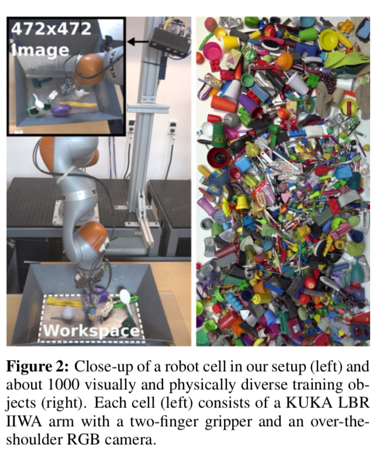
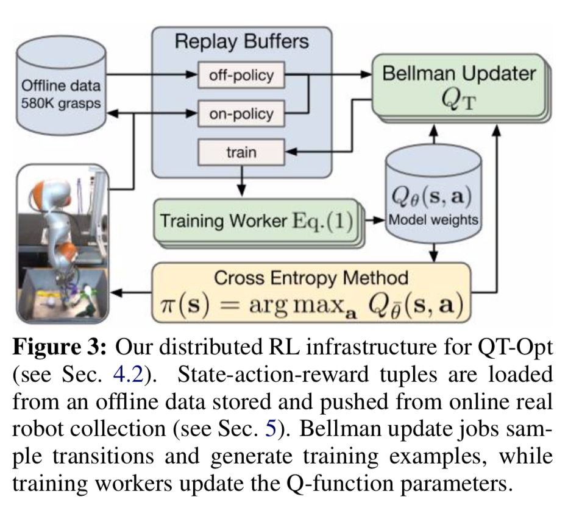
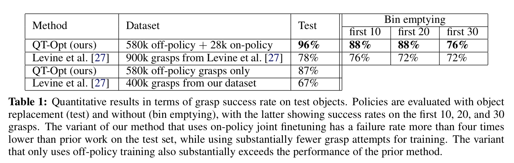
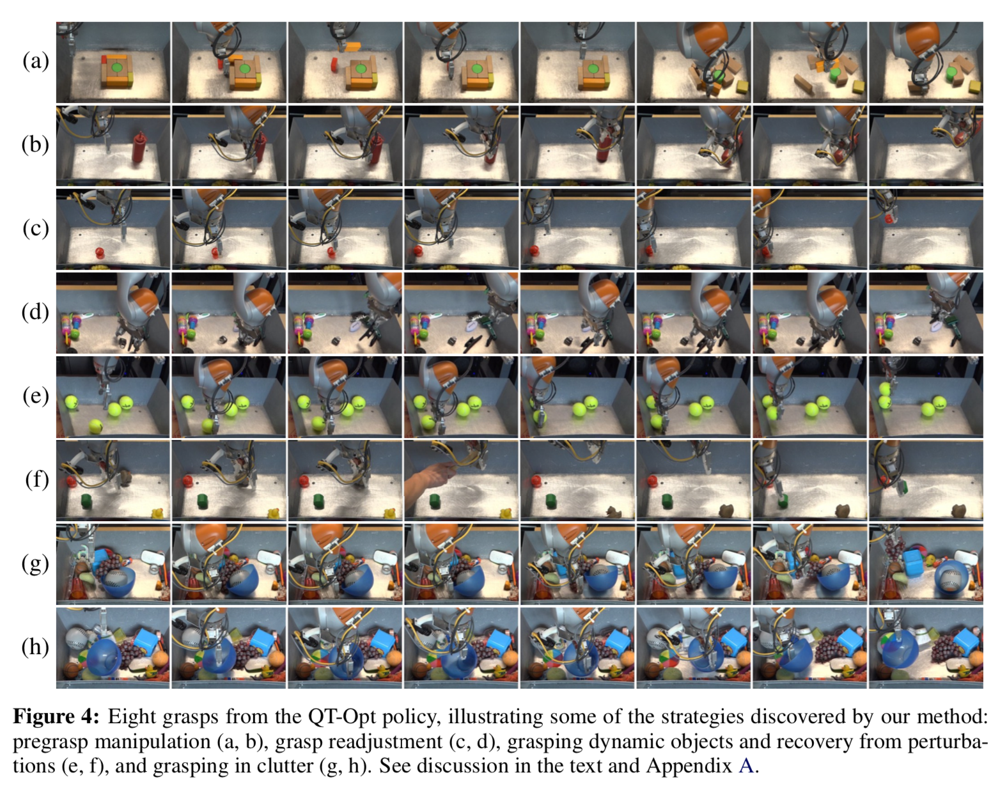

#QT-Opt: Scalable Deep Reinforcement Learning for Vision-Based Robotic Manipulation QT-Opt: 用于基于视觉的机器人操作的具有可扩展性的深度强化学习

## 0. Abstract

本文利用可扩展的强化学习方法**scalable reinforcement learning approach**，研究了基于视觉**vision-based**的动态操作**dynamic manipulation**技能学习问题。我们在抓取**grasping**的背景下研究这个问题，这是机器人操纵长期存在的一个挑战**a longstanding challenge**。相对于静态学习行为**static learning behaviors**选择一个抓取点**a grasp point**，然后执行想要的抓取**execute the desired grasp**，我们的方法实现了基于视觉的闭环控制**closed-loop vision-based control**，机器人根据最近的观察不断**continuously**更新抓取策略，以优化长视距抓取的成功**optimize long-horizon grasp success**。为此**to that end**，我们引入了**QT-Opt**，这是一个可扩展的**scalable**基于自我监督**self-supervised**的视觉**vision-based**强化学习框架，它可以利用**leverage**超过580k的真实世界抓取尝试**grasp attempts**来训练一个具有超过1.2M参数的 **deep neural network Q-function**来执行闭环的真实世界抓取**closed-loop real-world grasping**，并将其推广到对不可见物体**unseen objects**的96%成功抓取率**grasp success**。除了获得非常高的成功率，我们的方法与更标准的抓取系统**more standard grasping system**表现出截然不同的行为**distinct**：只使用实时摄像头**over-the-shoulder camera**进行基于RGB视觉的感知**RGB vision-based perception**,我们的方法自动学习重新抓取策略**regrasping strategies**，探测对象**probe objects**从而找到最有效的抓取**the most effective grasps**，学会重新定位对象**reposition objects**和执行其他不能抓住的预抓取操作**non-prehensile pre-grasp manipulations**，并对扰动**disturbances and perturbations**能够作出动态反应**respond dynamically**。

> **关键词：**
>
> 抓取**grasping**；强化学习**reinforcement learning**；深度学习**deep learning**

## 1. Introduction

与对象交互的操作是机器人技术中最大的开放问题之一：在开放世界环境**open-world environments**中与以前不可见的对象**previously unseen objects**进行智能交互需要更广泛的感知**generalizable perception**、闭环的**closed-loop**基于视觉的控制**vision-based control**和灵巧的操作**dexterous manipulation**。强化学习为解决这一问题提供了一个很有前途的途径，但目前的强化学习工作解决的是掌握个人技能的问题**mastering individual skills**，如击球**hitting a ball**[1]、开门**opening a door**[2,3]或投掷**throwing**[4]。为了满足实际操作的泛化需求**generalization demands**，我们特别关注具有离线策略算法**off-policy algorithm**的可伸缩学习**scalable learning**，并结合具体的抓取问题来研究这个问题。虽然抓取限制了操作问题，但它仍然保留了许多最大的挑战：一个抓取系统应该能够使用真实的传感和驱动，来可靠和有效地抓取预先看不见的物体**pick up previously unseen objects**。因此，它作为一个更大的机器人操作问题的微观世界**microcosm** ，提供了一个具有挑战性和实际应用的模型问题，用于实验一般化和与不同对象地交互。现有的机器人抓取工作大多将任务分解为感知**sensing**、规划**planning**和执行阶段**acting stage**：机器人首先感知场景并确定合适的抓取位置，然后规划到这些位置的路径[5,6,7,8]。这与在人类和动物中观察到的抓取行为是不同的，抓取是一个动态过程**dynamical process**，在每个阶段都紧密地交织着**interleave**感知和控制[9,10]。这种动态闭环抓取**dynamic closed-loop grasping**可能对不可预测的物体物理**unpredictable object physics**、有限的感官信息**limited sensory information**(例如，单目**monocular**相机输入而不是深度**depth**)和不精确的驱动**imprecise actuation**更有鲁棒性。一个为长视距成功**long-horizon success**而训练的闭环抓取系统**closed-loop grasping system**也可以执行智能的预抓取组合，例如推动或重新定位**repositioning**目标以便更容易地抓取。然而，闭环控制的一个主要挑战是传感器运动回路**sensorimotor loop**必须在视觉模态上闭合**closed on the visual modality**，这在新的环境下**in novel settings**很难用标准的最优控制方法**standard optimal control methods**有效地利用。研究了离线策略深度强化学习**off-policy deep reinforcement learning**如何利用完全自监督的数据采集**entirely self-supervised data collection**，获得闭环动态视觉抓取策略**closed-loop dynamic visual grasping strategies**，从而能测试时推广到之前未见过的目标**previously unseen objects**。利用原始摄像机观测值**raw camera observations**直接预测低水平末端执行器运动**low-level end-effector movements**的值，并且整个系统是利用真实世界中的抓取尝试来训练的。虽然深度强化学习的原理已有几十年的历史[11,12]，但要将其应用于能够推广到新对象的实际机器人学习算法中，需要一个稳定的**stable**、可伸缩的**scalable**算法和大型数据集，以及精心的系统设计。

我们实验中的实现做了非常简单的假设：观察来自肩上的单目RGB摄像机(见**Fig 2**)，动作由末端执行器 ***Cartesian***的运动**end-effector Cartesian motion**和夹持器开闭命令**gripper opening and closing commands**组成。强化学习算法在成功地举起物体时，只接受一个二进制的反馈**binary reward**，而不接受任何其他的奖励形状**reward shaping**。这一系列的假设使得该方法可以大规模部署，允许我们在7个真实的机器人系统上收集580k次的抓取尝试。与文献[13,14]中大多数强化学习任务不同的是，该任务的主要挑战不仅是最大化奖励**maximize reward**，而且要有效地将以前未见过的对象一般化**generalize to previously unseen objects**。这在训练过程中需要一个非常具有多样性的物体集**diverse set of objects**。为了最大地利用多样化的物体集，我们提出一个**off-policy**的基于**Q-learning**的连续动作的泛化**continuous-action generalization**的训练方法，我们称之为***QT-Opt***。与其他**continuous action Q-learning**方法[15,16]不同，其他的方法通常由于执行器-评价器的不稳定性**actor-critic instability**[17,18]而不稳定，**QT-Opt**的分配**dispense**需要训练一个显式的执行器**explicit actor**，而不是通过评价器**critic**进行随机优化**stochastic optimization**来选择行为**actions**和目标值**target values**[19,20]。我们表明，即使是完全**off-policy**的训练，也可以比基于先前工作的**strong baselines**表现得更好，而在离线数据**offline data**上适度地对**on-policy**进行联合微调**joint finetuning**可以将具有挑战性的、以前未见过物体的性能提高到96%。

> ***Fig 1.***
>
> 设定了七个机器人来收集具有自主自监督的抓取片段。

> ***Fig 2.*** 
>
> 在我们的设置中，一个机器人单元**cell**的特写(左)和大约1000个视觉和物理上不同的训练对象(右)。每个**cell**(左)由一个 *KUKA LBR IIWA* 手臂和一个两指夹持器和一个肩上的RGB相机组成。

我们的实验评估定性和定量地**quantitatively and qualitatively**证明了该方法的有效性。我们证明，我们的方法在训练过程中的一系列不可见对象**unseen objects**上取得了很高的成功率，而我们的定性实验表明，这种高成功率是由于系统采用了各种策略**adopting a variety of strategies**，而如果没有基于视觉的闭环控制**closed-loop vision-based control**，这些策略将不可行**infeasible**：所学习的策略表现出矫正行为**corrective behaviors**、重新抓取**regrasping**、探测动作**probing motions**以确定最佳抓取、物体的非可抓取的重新定位**non-prehensile repositioning of objects**，以及其他只有在抓取被表述为一个动态的闭环过程**a dynamic, closed-loop process**时才可行的特征。

## 2. Related Work

强化学习已被应用于机器人控制**robotic control**的环境中，使用低维[1,2]和高维[15,16]函数逼近器**low-dimensional and high-dimensional function approximators**，包括视觉输入**visual inputs**[21,3]。然而，所有这些方法都侧重于学习狭窄的**narrow**、独立的任务，而不是对大量新的测试对象进行广泛的泛化**broad generalization**。真实的机器人操纵需要广泛的泛化，实际上大部分的机器人研究把握试图达到这种泛化，要么通过使用把握度量基于第一原理[22]或学习[23,10]，后者类的方法近年来实现最好的结果[8,7]。然而,当前把握系统通常方法把握任务作为掌握姿势预测**predicting a grasp pose**的问题，现场的系统(通常使用深度相机**a depth camera**),选择最佳位置的掌握然后执行一个开环规划师到达这个位置[5,6,7,8]。与此相反，我们的方法采用了带有深度神经网络的强化学习，实现了动态闭环控制**dynamic closed-loop control**。这允许我们的策略执行预抓取操作**pre-grasp manipulation**并能适应动态干扰**respond to dynamic dieturbances**，最重要的是，这允许我们在对任务做出最小假设**makes minimal assumptions about the task**的通用框架**generic framework**中学习抓取。

以往的抓取方法多为开环**open-loop**抓取，而对闭环抓取**closed-loop grasping**的研究只有一些[24,25,26,27]。与这些将闭环抓取作为服务问题**a serving problem**的方法相比，我们的方法使用了一种通用的增强学习算法来解决抓取任务，实现了长视距推理**long-horizon reasoning**。在实践中，这使我们的方法能够自主地**automatically**获得复杂的抓取策略，其中一些我们将在**Section 6**中说明。我们的方法也是完全自我监督的**entirely self-supervised**，只使用机器人自动获取的抓取结果标签**grasp outcome labels**。有几项工作提出了自监督抓取系统**self-supervised grasping systems**[28,27]，但据我们所知，我们是第一个将 通过强化学习的长视距推理**long-horizon reasoning** 融入到 一个 基于自监督现实数据训练的 可推广的基于视觉系统**a generalizable vision-based system**的人。与我们的工作有关的是，Zeng等人最近提出了一个将抓取和推动**grasping and pushing**结合起来的**Q-learning framework**。我们的方法利用了一个更一般的动作空间**a much more generic action space**，直接在三维空间中指挥抓取器的运动**directly commanding gripper motion in 3D**，在实验中表现出了更好的性能和泛化效果。最后，相比当前的许多抓取系统，它们利用深度传感**depth sensing**[7,29]或腕带式相机**wrist-mounted cameras**[25,29]，我们的方法在作用于从肩上的相机**an over-the-shoulder camera**得到的原始单目RGB观察数据**raw monocular RGB observations**，并且我们的方法的性能表明，即使只有非常初级的感知**rudimentary sensing**，有效的学习可以得到优秀的抓取成功率。

## 3. Overview

我们的闭环视觉控制框架是基于作为马尔可夫决策过程(MDP)的机器人操作的一般形式。（虽然部分观测（POMDP）的形式**formulation**最为笼统，但我们假设目前的观测提供了所有必要的信息。在实践中，由此产生的policy仍然对堵塞**occlusions**表现出适度的稳健性，且能更普遍地扩展**recurrent policies**，和Q函数将很直观。）在每个时间步长，该策略从机器人的相机的得到观察图像(见图2)，并选择一个抓取命令**a gripper command**，如第5节所述。这个任务公式**task formulation**是通用的，原则上可以应用于广泛的机器人操作任务。抓取任务的定义很简单，就是在收集数据的过程中给学习者提供一个奖励：一个成功的抓取得到1个奖励，一个失败的抓取得到0个奖励。如果机器人在这一**episode**的最后**at the end of the episode**把一个物体举到一定高度以上，那么这个动作就被认为是成功的。

MDPs框架为此类决策问题提供了一种通用且强大的形式主义**formalism**，但在此框架中学习可能具有挑战性。泛化需要不同的数据，但在每次策略更新后对很多的物体**a wide range of objects**重新收集经验是不切实际的，因此排除**ruling out**了on-policy算法。相反，我们设计了一个基于Q-learning的连续泛化的**based around a continuous generalization of Q-learning**可拓展的非策略强化学习框架**a scalable off-policy reinforcement learning framework**。虽然在连续操作环境中，参与者-批评者算法**actor-critic algorithm**是一种常用的算法，但我们发现了一种更稳定和可伸缩的替代方法，就是只训练一个q函数，并通过使用随机优化使该q函数最大化来隐式地诱导出一个策略**induce a policy implicitly by maximizing this Q-function using stochastic optimization**。我们在第4节中描述了产生的算法**resulting algorithm** QT- Opt，并在第5节中描述了其用于机器人抓取的实例化**instantiation**。为了在我们的方法中处理大型数据集和网络，我们设计了一个分布式的收集和训练系统，该系统异步地**asynchronously**更新目测值、收集on-policy数据、重新加载来自过去经验的off-policy数据，并在分布式优化框架中利用（上述）这两种数据流**data streams**来训练网络(见图3)。

> ***Fig. 3.***我们对 QT-Opt 的分布式 RL 基础架构（请参阅第 4.2 节）。**Our distributed RL infrastructure**
>
> 状态-行动-奖励 三元组 **State-action-reward tuples**从存储的离线数据中加载，并从在线真实机器人采集集合**online real robot collection**中推出**pushed**（参见第 5 节 ）。Bellman update jobs 采集这种转换**sample transitions**并生成训练示例**generate training examples**，而**training workers**更新 Q 函数中的参数。

## 4. Scalable Reinforcement Learning wqqith QT-Opt

在本节中，我们描述了用于闭环视觉抓取方法的增强学习算法。该算法是Q-learning的一个连续动作版本，把它应用于可拓展的学习**scalable learning**，并对稳定性进行优化，使其能够处理抓取等复杂任务中的大量离线图像数据。

### 4.1. Reinforcement Learning and Q-Learning

我们首先回顾了**reinforcement learning**和**Q-Learning**的基本原理，并在此基础上推导出我们的算法。我们将使用$\mathbf{s} \in \mathcal{S}$表示状态**state**，在我们的例子中，状态包括图像观测**image observations**(详见附录D)。$\mathbf{a} \in \mathcal{A}$表示动作**action**，对应机器人手臂的运动**arm motion**和抓取指令**gripper command**。在每一个时间步$t$，算法选择一个动作**action**，转换到一个新的状态**state**，并收到一个奖励**reward** $r\left(\mathbf{s}_{t}, \mathbf{a}_{t}\right)$ 。RL的目标是恢复一个策略**recover a policy**，该策略选择的是将总期望报酬最大化的操作。获得这种最优策略的一种方法是首先求解最优q函数**the optimal Q-function**，有时也称为状态-动作值函数**the state-action value function。**q函数指定在某些状态$s$中执行某个动作$\mathbf{a}$之后将收到的奖励期望**the expected reward**，而最优q函数指定最优策略对应的这个值。在实践中，我们的目标是学习参数化的Q-函数$Q_{\theta}(\mathbf{s}, \mathbf{a})$，其中$θ$可以表示神经网络的权重。我们可以通过最小化**Bellman error**来学习最优q函数，这个误差由下式给出
$$
\mathcal{E}(\theta)=\mathbb{E}_{\left(\mathbf{s}, \mathbf{a}, \mathbf{s}^{\prime}\right) \sim p\left(\mathbf{s}, \mathbf{a}, \mathbf{s}^{\prime}\right)}\left[D\left(Q_{\theta}(\mathbf{s}, \mathbf{a}), Q_{T}\left(\mathbf{s}, \mathbf{a}, \mathbf{s}^{\prime}\right)\right)\right] \quad\quad\quad\quad\quad\quad\quad(1)
$$
其中$Q_{T}\left(\mathbf{s}, \mathbf{a}, \mathbf{s}^{\prime}\right)=r(\mathbf{s}, \mathbf{a})+\gamma V\left(\mathbf{s}^{\prime}\right)$是一个目标值***target value***，和D是一些散度指标**divergence metric**。我们对D使用交叉熵函数**cross-entropy function**，因为总收益**total returns**以[0,1]为界，我们发现这样做比标准的平方差分**the standard squared difference**更稳定(见附录C)。期望是在所有之前观察到的转换**all previously observed transitions**的分布**distribution**下取的，$V\left(\mathbf{s}^{\prime}\right)$是目标值**a target value**。在我们的实现中，我们使用两个目标网络**target network**[15,30,31]提高稳定性**stability**，维护参数向量$\theta$的两个滞后版本$\bar{\theta}_1$和$\bar{\theta}_2$，其中$\bar{\theta}_1$是以平均常数为0.9999的$\theta$的指数加权移动平均，$\bar{\theta}_2$是一个$\bar{\theta}_1$大约滞后6000个梯度步的滞后版本。然后我们根据$V\left(\mathbf{s}^{\prime}\right)=\min _{i=1,2} Q_{\overline{\theta}_{i}}\left(\mathbf{s}^{\prime}, \arg \max _{\mathbf{a}^{\prime}} Q_{\overline{\theta}_{1}}\left(\mathbf{s}^{\prime}, \mathbf{a}^{\prime}\right)\right)$计算目标价值**target value**。这种对应于**Polyak averaging**\[32,33\]和**clipped double Q-learning** [34, 35, 36]的一个组合，我们之后会在附录C中进一步讨论这个设计决策**design decision**。学习Q-function后**Once the Q-function is learned**，策略可以根据$\pi(\mathbf{s})=\arg \max _{\mathbf{a}} Q_{\overline{\theta}_{1}}(\mathbf{s}, \mathbf{a})$来**be recovered**。这种方法的实现从与实际环境互动中收集样本，然后在到目前为止收集到的所有样本上执行off-policy训练\[15,30,31\]。对于本文中处理的这种大规模学习问题，这个过程的并行异步版本**a parallel asynchronous version**极大地提高了我们扩展这个过程**scale up this process**的能力，如第4.3节所讨论的。

### 4.2. QT-Opt for Stable Continuous-Action Q-Learning

利用深度神经网络函数逼近器进行q学习**Q-learning with deep neural network function approximators**，为具有图像观测数据的RL提供了一种简单实用的方案，并易于**is amenable to**直接并行化。然而，如何结合连续动作，例如在我们的抓取中应用中连续的抓取器运动**continuous gripper motion**，是这种方法的一个挑战。之前的工作试图**has sought to address this**通过使用第二个网络**using a second network**来解决这一问题，该网络分期实现最大化**amortizes the maximization**[15,16]，或者将q函数约束为$\mathbf{a}$中的凸函数，从而使最大化的分析变得容易[31,37]。不幸的是，前一类方法是出了名的不稳定的**notoriously unstable**[18]，这使得它在运行超参数扫描的大型RL任务中存在非常昂贵的问题。行动空间中凸的值函数**Action-convex value functions**不太适合复杂的多变量控制任务，如抓取，其中q函数在输入端**input**远不是凸的。例如，对于接近对象的操作**reach toward objects**，q值可能很高，但是对于物体之间的间隙，q值就很低**low for the gaps between objects**。

因此，我们提出了一种简单实用的替代方法，既保持了非凸q函数的通用性**the generality of non-convex Q-functions**，又避免了二次极大化网络**a second maximizer network**的需要。将图像$\mathbf{s}$和动作$\mathbf{a}$作为网络的输入，利用随机优化算法对式(1)中的`arg max`进行评估，类似于[19]和[20]，该算法可以处理非凸的多模态（多峰）优化现象**non-convex and multimodal optimization landscapes**。让$\pi_{\bar{\theta}_1}(\mathbf{s})$成为Q-function $Q_{\overline{\theta}_{1}}\left(\mathbf{s}, \mathbf{a}^{\prime}\right)$隐式诱导出的策略**policy**。我们可以通过用最优策略**optimal policy** $\pi_{\overline{\theta}_{1}}(\mathbf{s})=\arg \max _{\mathbf{a}} Q_{\overline{\theta}_{1}}(\mathbf{s}, \mathbf{a})$替换target Q-function中的`arg max`参数(**argument**指函数调用时的实际参数)，从而**recover Equation(1)**。在我们称为QT-Opt的算法中，与之不同的是，$\pi_{\overline{\theta}_{1}}(\mathbf{s})$通过使用$Q_{\overline{\theta}_{1}}(\mathbf{s}, \mathbf{a})$作为目标值**objective value**，在$\mathbf{a}$上进行随机优化，来进行评估的。我们使用交叉熵方法**cross-entropy method(CEM)**进行优化，该方法对低维问题**low-dimensional problems**[38]容易并行化和对局部最优更加**robust**。CEM是一种简单的无导数优化算法**derivative-free optimization algorithm**，它在每次迭代**iteration**中采样**a batch of** $N$个值，将高斯分布拟合到这些样本中最好的$M < N$个，然后从高斯分布中采样下一批$N$。在我们的实现中，我们使用$N = 64$和$M = 6$，并执行两轮CEM迭代**iteration**。这种方法既可用于在训练时计算目标值**compute targets**，也可用于在现实世界中选择动作**choose actions**。

### 4.3. Distributed Asynchronous QT-Opt

基于强化学习的视觉学习策略对新场景和新对象**new scenes and objects**进行泛化，需要大量不同的数据，就像学习对具有监督学习的复杂视觉任务进行泛化需要大量的数据集一样。在我们的实验中，为了完成抓取任务，我们在7个机器人身上收集了超过$580\ k\ $次抓取**grasps**，历时数周。为了有效地训练如此庞大和多样的RL数据集，我们开发了一个分布式的、异步的QT-Opt算法实现**a distributed, asynchronous implementation of QT-Opt**。**Fig. 3**总结了这一系统。转换**transitions**存储在分布式**replay buffer**数据库中，该数据库既可以从磁盘加载历史数据，也可以接受来自多个机器人的实时实验的在线数据。该缓冲区**buffer**中的数据使用一组1000个**“Bellman updater” jobs**连续标记**target Q-values**，该作业使用当前目标网络**target network**执行CEM优化过程，然后将标记的样本存储在作为环形缓冲区**ring buffer**的第二训练缓冲区中。这种异步过程的一个结果是，训练缓冲区中的一些示例被标记为Q-network的滞后版本。这在附录F.4中有更详细的讨论。**training workers**从训练缓冲区中随机抽取标记了的转换**labeled transitions**，并使用它们更新q函数。我们使用10个**training workers**，每个worker计算梯度，把梯度异步地发送到参数服务器**parameters servers**。我们从经验上发现，由于任务的复杂性以及数据集和模型的大尺寸，训练一个有效的q函数需要大量的**gradient steps**(up to 15M)。系统设计的全部细节见附录F。

## 5. Dynamic Vision-Based Grasping

在本节中，我们将讨论如何应用QT-Opt实现基于视觉的动态抓取。我们的抓取设置如**Fig. 1**所示。该任务需要一个策略**policy**，该策略要能定位一个对象**locate an object**，为了抓取得到定位**position it for grasping**(可能**potentially**通过执行预抓取操作**pre-grasp manipulations**)，捡起该对象，可能根据需要重新抓取，举起该对象**raise the object**，然后发出表示抓取已经完成的信号，从而终止该事件。为了在现实世界中实现自我监督抓取标记，奖励只指示是否成功地捡起了一个物体。这代表了一种完整的端到端抓取方法**end-to-end approach to grasping**：除了可以从数据中自主提取的知识外，没有向模型提供关于对象、物理或运动规划的先验知识**no prior knowledge**。

- **MDP for grasping.** 状态观察值$\mathbf{s} \in \mathcal{S}$包括机器人的当前摄像头的观察结果，RGB图像分辨率**resolution**为$472\times472$，记录从一个肩上单目相机**an over-the-shoulder monocular camera**(见**Fig. 1**)。我们还发现它有利于包括state中 gripper的status，即一个机器爪**gripper**是打开还是关闭的二元指标**a binary indicator**，以及机器爪相对于地板的垂直位置**vertical position**(见附录C中比较)。动作$\mathbf{a} \in \mathcal{A}$由笛卡尔空间$\mathbf{t} \in \mathbb{R}^{3}$中的一个向量构成，这一向量包括所需的夹持位置**gripper position**的变化**desired change**，通过$\mathbf{r} \in \mathbb{R}^{2}$正弦余弦编码**sine-cosine encoding**的方位角**azimuthal angle**的变化，二元机器爪的开启和关闭命令$g_{\text {open }}$ 和 $g_{\text {close }}$，和一个结束事件**episode**的终止命令**termination** $e$，这就是$\mathbf{a}=\left(\mathbf{t}, \mathbf{r}, g_{\text {open }}, g_{\text {close }}, e\right)$。抓取MDP形式**grasping MDP formulation**的详细信息见附录D。

- **Reward function.** 如果抓取者包含一个物体并且高于某一特定高度，则奖励为1，否则为0。如附录D.4所述，成功与否取决于在放下拣取的对象**dropping the picked object**后使用背景减法测试**a background subtraction test**。注意，这种延迟和稀疏的奖励函数对于强化学习系统来说通常是非常具有挑战性的，但对于自动化的自我监督来说，它也是最实用的奖励函数。为了鼓励机器人更快地抓取，当模型发出终止动作**emits the termination action**或超过最大时间步长(20)**exceeds the maximum number of time steps**时，对于终止前的所有时间步长，我们也提供了一个小的惩罚$r\left(\mathbf{s}_{t}, \mathbf{a}_{t}\right)=-0.05$。这个惩罚原则上可能导致$[0,1]$之外的目标值，尽管我们从经验上发现这不会发生。

- **Q-Function representation.** 我们系统中表示的Q-function $Q_{\overline{\theta}_{1}}(\mathbf{s}, \mathbf{a})$是一个有1.2M参数的的大型卷积神经网络，其中图像作为输入提供的卷积栈的底部**the bottom of the convolutional stack**，行动**action**，夹持状态**gripper status**和与地板的距离**distance to floor**被送入堆栈的中间**the middle of the stack**。完整的神经网络结构将在附录E中讨论。

- **Data collection.** 为了使我们的模型能够学习可泛化的策略**generalizable strategies**，这些策略能够拾取新对象，执行预抓取操作，并处理基于视觉的反馈的动态干扰**handle dynamic disturbances with vision-based feedback**，我们必须在足够大且多样化的对象集合上对其进行训练。在单一的策略训练运行**a single on-policy training run**中收集这样的数据集是不切实际的。我们的**off-policy QT-Opt**算法使得从多个机器人和多个实验中收集经验成为可能。我们在**4个月的时间**里收集了用于训练最终模型的完整数据集，总共花费了大约800个机器人小时**800 robot hours**。这些数据是在多个独立的实验中收集的，每个实验都重用**reused**了前一个实验的数据。这降低了我们在现实世界中提供严格控制**rigidly controlled**的实验结果的能力，但是我们将在附录C中提供更严格的控制仿真结果的补充。因为一个完全随机初始政策**a completely random initial policy**将导致一个非常低的成功率与这样一个不受约束的行动空间**such an unconstrained action space**，我们使用一个弱的脚本化探索策略**a weak scripted exploration policy**来引导数据收集**bootstrap data collection**。该策略是随机的，但偏向于合理的抓取**biased toward reasonable grasps**，并取得了大约15-30%的成功率。当这种策略的成功率达到50%时，我们转而使用**QT-Opt**。我们在补充材料中对脚本化策略进行了描述，附录B中收集了7个***LBR IIWA robots***的数据，每个机器人有4-10个训练对象**training objects**。物体在工作时间每4小时更换一次，晚上和周末无人看管**left unattended**。测试中使用的对象与训练数据中的对象不同。

## 6. Experimental Results

我们的实验评估了我们学习的闭环视觉抓取系统，来回答以下研究问题：(1)我们的方法如何**定量地**对训练中从未见过的新对象执行任务？(2)与之前提出的没有明确优化长视距抓取成功**long-horizon grasp success**的自监督抓取系统相比，该系统的性能如何？(3)我们的方法采用了哪些类型的操作策略，是否进行了有意义的、目标导向**goal-directed**的预抓取操作**pre-grasp manipulatis**？(4)我们方法中的各种设计选择如何影响其性能？对于前两个问题，我们在**Section 6.1**通过一组严格的实际量化实验进行讨论。在**Section 6.2**中，我们通过定性实验解决了问题(3)，实验展示在补充视频和线上。在附录C和附录A中，最后一个问题是通过一组详细的对模拟和真实世界**simulation and the real world**的消融研究**ablation studies**解决的。附录的实验还研究了数据集大小**dataset size**和非策略训练对最终性能**off-policy training on final performance**的影响。

### 6.1. Quantitative Performance Evaluation 量化表现评估

在这一节，我们提出了一个对我们的抓取系统量化评估的方法。每个机器人的物理设置如**Fig. 1 (left)**所示：机器人的任务是抓取箱**bin**中的物体，使用的是肩上的RGB摄像头，没有其他传感器。我们使用两个单独的评估方案**evaluation protocols**，使用在训练时没有见过的具有挑战性的对象。在第一个协议中，7个机器人中的每一个都对一组测试对象进行102次抓取尝试。每一次抓取尝试最多持续20步**20 time steps**，任何被抓取的物体都会被放回箱子。虽然一个策略可能会选择多次抓取同一个对象，但我们在实践中发现，每个机器人都在不同的对象上进行抓取尝试，而不是只专注于一个对象。然而，为了控制由于替换**replacement**而产生的潜在混杂效应**potential confounding effects**，我们还使用第二种方案进行了实验，我们将其称为清空箱子**bin emptying**。在这里，一个机器人用30次抓取尝试，卸载了一个装满28个测试对象的杂乱的箱子**a cluttered bin**。这一过程重复5次。第10次、20次和30次时，汇报是否抓取成功的结果，对应的是抓住越来越难的物体。

我们的方法的性能如表1所示。结果中显示了我们方法的一个变体，它是完全使用off-policy数据来训练的，不需要任何额外的从最新的**policy**中收集数据，以及与其他**policy**共同整合**joint finetuning**后的性能数据，这些数据是与**policy**训练同时收集的(联合整合过程的细节放在附录F.3中)。我们的方法在这两种情况下的成功率都很高。有效的**off-policy training**非常有价值，因为它允许在不收集任何数据的情况下快速迭代超参数和体系结构设计**rapid iteration on hyperparameters and architecture design**。然而，额外的**on-policy joint finetuning**始终提供了一个可量化的性能提高，大约只要28,000次额外抓举，就能达到96%的成功抓取率。虽然on-policy数据集没有观察到与off-policy数据集相同的数据多样性**data diversity**，但它可能为策略提供了一种“硬负面挖掘”机制**“hard negative mining” mechanism**，使其能够快速纠正错误和过于乐观的推断**correct erroneous and over-optimistic extrapolations**。附录A讨论了进一步的融合（or结合）**ablations**。

为了将我们的方法与之前的工作进行比较，我们评估了Levine等人提出的[27]技术。该方法也是自监督的，在类似的视觉抓取设置中取得了良好的效果。该方法不考虑长期奖励**long-horizon rewards**：虽然可以在闭环中使用，但该策略贪婪地**greedily**优化下一次抓取的成功，不控制抓取器**gripper**的打开和关闭，不考虑预抓取操作**pre-grasp manipulation**。以来的数据的格式两种方法不同的是由于不同的行动表示**action representation**,之前我们比较这个方法的两个版本：一个变种是在Levine et al[27]循描述的所有数据上训练，另一个变种是适应于我们方法中使用的相同数据，在机器爪**gripper**没有合上的时候放弃抓取的尝试**discard grasp attempts**。表1中的比较表明，我们的方法与先前方法的两个变体在性能上有很大的不同。在实验中，我们的方法在5次试验**trials**中有2次，在30次或更少的抓取**grasps**中清空了箱子，而之前的方法在5次实验中只有有1次清空了箱子。30次抓取的成功率较低**The lower success rate for 30 grasps**，这是由于策略试图抓取最后几个物体，这些物体通常非常小，而且常常被卡在箱子的一个无法到达的角落。例子见附录A。

### 6.2. Analysis of Grasping Strategies with Qualitative Experiments

我们的QT-Opt抓取策略**QT-Opt grasping policy**对以前未见过的测试对象的成功率为96%。这项**policy**采取了什么类型的策略**strategies**呢？与大多数抓取系统相比，该方法通过图像观察实现了一般的闭环控制，可以随时**at any time**选择复位、打开或关闭机器爪**reposition, open, or close the gripper**。这种灵活性，结合对长期成功的训练**training for long-horizon success**和强化学习，使它能够执行通常不被标准抓取系统观察到的行为。我们鼓励读者观看https://goo.gl/ykQn6g提供的补充视频和扩展视频，并在这里讨论一些示例。值得注意的是，所有这些例子都是通过训练策略来优化抓取成功率而自动生成的。

- 分离和预抓取操作**Singulation and pregrasp manipulation**。由于我们的policy是针对整个事件**episode**的成功进行优化，因此它们可以执行预抓取操作**pre-grasp manipulations**，重新定位对象（就是改变物体的位置的意思）**reposition objects**以使其更容易抓取。在**Fig. 4 (a)**中，我们展示了一个例子，在一个以前看不见的块拼图**a previously unseen blocks puzzle**上，由学习策略执行的对象分离序列**object singulation sequence**。在**Fig. 4 (b)**中，我们展示了一个示例，在该示例中，策略选择击倒番茄酱瓶**a ketchup bottle**以使其更容易被捡起。

- 重新抓取**Regrasping**。该策略可以在任何时候打开和关闭抓取器，这使得它能够检测到不稳定抓取**an unstable grasp**的早期迹象**detect early signs**，并更安全地重新抓取对象。在**Fig. 4 (c)**中，我们展示了策略是重复地重新抓取地板上的滑溜溜的物体**a slippery object**的例子，而在**Fig. 4 (d)**中，我们展示了一个例子，在加载阶段**during the load phase**，对象滑出夹持器**the object slips out of the gripper**，策略就重新调整夹持器的位置**repositions the gripper**以获得更安全的抓取。

- 处理干扰和动态物体**Handling disturbances and dynamic objects**。反应策略**The reactive policy**还可以捕捉在抓取过程中动态移动的对象。在**Fig. 4 (e)**中，我们展示了尝试捡起一个球的策略的例子，这个球滚出夹持器**rolls out of the gripper**迫使机器臂跟随**forcing the robot to follow**。在**Fig. 4 (f)**中，我们还展示了在抓取过程中故意将物体推出夹持器的例子。该策略仍然能够成功地纠正和抓取另一个对象。

- 在杂乱情况下抓取**Grasping in clutter**。虽然训练数据一次包含的对象不超过10个，但是该策略仍然可以在密集的杂物中**in dense clutter**进行抓取，如**Fig. 4 (g)**所示。

- 失败案例**Failure cases**。虽然该策略通常是成功的，但我们确实观察到了一些失败案例。特别是在密集的杂物中，策略有时容易在杂乱的对象中重复抓取，如**Fig. 4 (h)**所示。虽然这种策略常常能成功地抓取，但它有些耗时**somewhat time consuming**，不像在不那么杂乱的场景中观察到的行为那样以目标为导向**goal-directed**。

## 7. Discussion and Future Work

基于QT-Opt算法、分布式优化框架和离线与在线训练的结合，我们提出了一种使用原始传感输入**raw sensory inputs**（如images）的可拓展的机器人**scalable robotic reinforcement learning**强化学习框架。我们将此框架应用于抓取任务，学习基于闭环视觉的策略**closed-loop vision-based policies**，这些策略在以前未见过的对象**unseen objects**上获得了很高的成功率，并表现出复杂和智能的闭环行为，包括单点和预抓取操纵、重新抓取和对扰动的动态响应**singulation and pregrasp manipulation, regrasping, and dynamic responses to disturbances**。所有这些行为都是通过QT-Opt优化抓取成功率而自动产生的。虽然我们的策略是基于大量的机器人经验(580k次真实世界的抓取)进行训练的，但是所有这些经验都是在最少的人工干预下自动收集的，并且所需的数据量大大低于之前类似的自监督技术**self-supervised techniques**(例如[27])。我们的结果表明，使用基于视觉的输入**vision-based inputs**进行强化学习可以扩展到**scale**大型数据集和非常大的模型，并且可以使策略有效地泛化到复杂的实际任务中，比如抓取。我们的框架在任务方面是通用的，将该方法扩展到其他操作技能将是未来工作的一个令人兴奋的方向。
