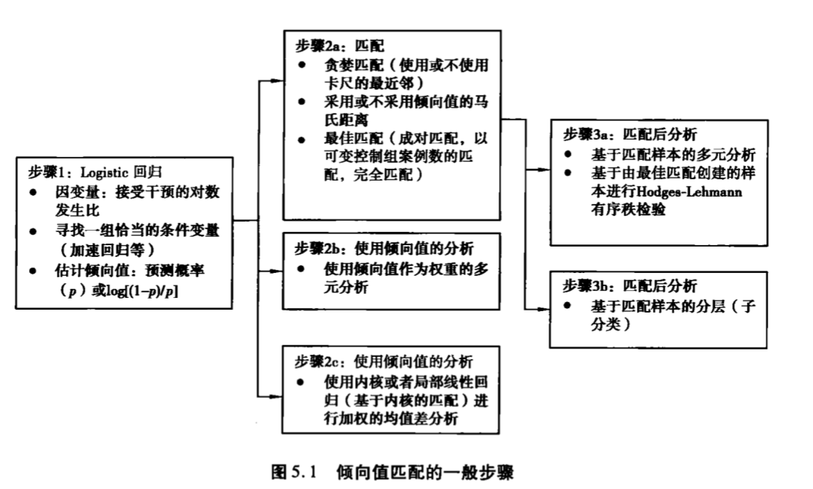

# 1. 简要了解

1. 评估treatment effect的四种模型
   1. Heckman的样本选择模型及其改进形式
      + Heckman's sample selection model
   2. 倾向值匹配及有关的模型
      + propensity score matching
   3. 匹配估计量
      + matching estimators
   4. 非参数回归进行的倾向值分析
2. 准实验研究（quasi-experimental studies）缺乏随机分配（random assignment），但一定包含干预（treatment）
   + 自我选择（self-selection）
   + 管理者选择（administrator selection）
3. **倾向值分析**（propensity score analysis）
   + 1983年，Rosenbaum和Rubin创造该术语，用于修正选择性偏差selection bias
   + 计量经济学传统用结构方程模型**structural equation modeling**
   + 统计学传统用随机化实验
     + 对Neyman-Rubin反事实框架（Neyman-Rubin counterfactual framework）的潜在结果（potential outcomes）进行研究，研究此框架下样本中未暴露于treatment的结果来研究treatment对treated的成员的因果效应
4. 随机化实验
   + 不是控制所有的潜在干扰因素，而是不控制任何因素**control for nothing**
   + **重要特征：**研究者必须在实施之前计算出每一个研究单元（study unit）的可能结果（probable outcomes）
   + 品茶实验
     + 70种可能中猜对了，可以在犯**Type I error**的很小概率情况下拒绝**null hypothesis**
     + significance level；
5. 将多维度的**协变量**covariates缩减为**倾向值**propensity score的一维得分

# 2. 反事实框架与假定

1. 内在效度internal validity
   + A在时间上先于B
   + A与B之间存在共变
   + 此关系无其他可能解释（not spurious）
2. 选择偏差**（！还没对应具体意思）**
   + self-selection
   + bureaucratic selection
   + geographic selection
   + attrition selection 撤退选择
   + instrumental selection
   + measurement selection
3. Neyman-Rubin反事实框架
   1. 任意一个treated的个体i，都有两种潜在的结果$\left(Y_{0 i}, Y_{1 i}\right)$，i.e.，（not treated的潜在结果，treated的潜在结果）
   2. $Y_{i}=W_{i} Y_{1 i}+\left(1-W_{i}\right) Y_{0 i}$
      + 理解为一个switcher，事实是二选一的结果
   3. **因果推断的基本问题：**$Y_{0 i}$观测不到
      + 论文中要解决的核心问题也是怎么估计$Y_{0 i}$
   4. 本框架认为可以通过考察treated member的average outcome和control（not treated）member的average outcome来估计反事实。
      1. i.e., 两个组的平均结果的差值mean difference
      2. 平均干预效应的标准估计量（**standard estimator for the average treatment effect**）（$\tau$就表示treatment effect）$\tau=E\left(Y_{1} | W=1\right)-E\left(Y_{0} | W=0\right)$
      3. 注意，原本想要的是treated在没有treated的情况下的平均效果，即$E\left(Y_{0} | W=1\right)$，但是它不可观测。所以用$E\left(Y_{0} | W=0\right)$作为proxy。因而我们在类似问题（或者paper中），始终想要得到的是能够一致地对真实的平均干预效果进行估计。
      4. 一致估计的一个充分条件是：$E\left(Y_{1} | W=1\right)=E\left(Y_{1} | W=0\right)$和$E\left(Y_{0} | W=0\right)=E\left(Y_{0} | W=1\right)$。
         + 显然random assignment是满足的
         + $\begin{aligned} \overline{\tau}=& \pi(\overline{\tau} | W=1)+(1-\pi)(\overline{\tau} | W=0) \\ =&\pi\left[E\left(Y_{1} | W=1\right)-E\left(Y_{0} | W=1\right)\right]+(1-\pi)\left[E\left(Y_{1} | W=0\right)-E\left(Y_{0} | W=0\right)\right] \\=&\left[\pi E\left(Y_{1} | W=1\right)+(1-\pi) E\left(Y_{1} | W=0\right)\right]-\left[\pi E\left(Y_{0} | W=1\right)-(1-\pi) E\left(Y_{0} | W=0\right)\right] \\=&E\left(Y_{1}\right)-E\left(Y_{0}\right) \end{aligned}$
         + $\begin{aligned} \overline{\tau}=&\left[\pi E\left(Y_{1} | W=1\right)+(1-\pi) E\left(Y_{1} | W=0\right)\right]-\left[\pi E\left(Y_{0} | W=1\right)+\right. (1-\pi) E\left(Y_{0} | W=0\right) ] \\=&\left[\pi E\left(Y_{1} | W=1\right)+(1-\pi) E\left(Y_{1} | W=1\right)\right]-\left[\pi E\left(Y_{0} | W=0\right)+\right. (1-\pi) E\left(Y_{0} | W=0\right) ] \\ =&E\left(Y_{1} | W=1\right)-E\left(Y_{0} | W=0\right) \end{aligned}$
   5. 用dummy表示是否treated受到批评，因为dummy treatment variable 被模型形式设定为外生的，而实际上并不是。
   6. ATE的一个问题在于平均值对因果效应的变异程度（variability）不敏感。
      + 如果个体的因果效应$\left(Y_{i} | W_{i}=1\right)-\left(Y_{i} | W_{i}=0\right)$变异程度较大，ATE不能很好地描述个体上的因果效应
      + mean比较常用，但是其他的treatment parameter也可以试试（selected quantiles等）
4. 无交织性***unconfoundedness***——paper中的***assumption 1***
   1. 可忽略的干预分配假定（ignorable treatment assignment assumption）
      + **！**还是1983年，Rosenbaum和Rubin，应该是propensity同一篇paper吧，之后查一下
   2. **内容：**在控制协变量$\mathbf{X}$的情况下，样本是否被拿去treated，与未被treated的结果$Y_0$和treated的结果$Y_1$是独立的
      + $\left(Y_{0}, Y_{1}\right) \perp W | \mathbf{X}$
   3. **核心思想：**在控制协变量$\mathbf{X}$的情况下，被分配到哪一种状态与potential outcome是无关的
   4. 其他描述：基于可观测变量的选择selection on observables，条件独立性condition independence，外生性exogeneity
   5. 以ols为例的内生性问题：（或者其他导致有偏or不一致）***——这个按照计量看就行（！记得复习计量）***
      1. x上的measuremenr error
      2. omitted variables
      3. misspecification
5. **稳定的单元干预值假定(stable unit treatment value assumption, SUTVA)**（！看起来和paper关系不大，先跳过）
6. 估计treatment effect的方法
   1. 4种方法：同Ch1 的1
   2. 其他方法
      1. 断点回归rdd
         + nsd高级计量公众号好像看过类似的paper
      2. 工具变量iv
         + ***计量***
         + 据说被证明有益于估计局部平均干预效应（Angrist, Imbens & Rubin, 1996）
      3. 间断时间序列设计interrupted time series designs（不知道）
      4. 差异增长率模型differential rate of growth models
         + 不知道，但是听起来像ODE中的growth model，先跳过
      5. 协方差分析模型analysis of covariance models
7. 统计推断的基本逻辑
   1. 根据已知的样本统计量sample statistics来估计未知的总体参数population parameter
      + 要用到hypothesis test和confidence interval
   2. ***非参数检验和参数检验（！wait）***

8. 几种不同treatment的类型**——（！暂时先关注ATE）**
   1. **ATE, or ACE**
   2. 意图中的干预效应ITT效用（intent-to-treat）
   3. 测量效能感效应（efficacy effect, EE）
   4. 干预组的平均干预效应(average treatment effect of the treated, TT)
      + $E\left[\left(Y_{1}-Y_{0}\right) | X, W=1\right]$
      + $\mathrm{TT} \neq \mathrm{ATE}$
   5. 未被干预组的平均干预效应(average treatment effect for the untreated, TUT)（与TT平行）
      + $E\left[\left(Y_{1}-Y_{0}\right) | X, W=0\right]$
   6. 边缘干预效应( marginal treatment effect, MTE)
   7. 局部平均干预效应(local average treatment effect, LATE)

# 3. 数据平衡的传统方法

1. 数据平衡的3种常规方法
   1. ols
      + 根据Gauss-Markov Theorem, blue，如果**所有的covariates都纳入方程**，假设都满足，则$\hat{\boldsymbol{\tau}}$是ATE的unbiased和consistent 估计
   2. 匹配matching
      + 每名treated成员同n名control成员匹配，之后对treated的y上的均值和control上的y均值比较，差值即为估计
   3. 分层
      + 基于某一协变量x，将成员分组成（非重叠的）层
2. 倾向值匹配
   1. 是将回归和匹配两种传统方法合并起来。
   2. 也可以理解成匹配和分层的组合

# 4. 样本选择及相关模型

1. Heckman模型及其两步估计量
   + **这个跟午餐会听的heckman两步法消内生性，应该是一个东西吧（！先跳过）**
2. 干预效应模型
   1. 回归方程：$:y_{i}=\mathbf{x}_{i} \boldsymbol{\beta}+\boldsymbol{w}_{\boldsymbol{i}} \boldsymbol{\delta}+\boldsymbol{\varepsilon}_{\boldsymbol{i}}$
   2. 选择方程：$w_{i}^{*}=\mathbf{z}_{i} \gamma+u_{i}$, （原文p65有typo）
      + $\operatorname{Prob}\left(w_{i}=1 | \mathbf{z}_{i}\right)=\Phi\left(z_{i} \gamma\right)$
        $\operatorname{Prob}\left(w_{i}=0 | \mathbf{z}_{i}\right)=1-\Phi\left(z_{i} \gamma\right)$

3. 工具变量估计量
4. stata
   1. `heckman`可以估计样本选择模型
   2. `treatreg`可以估计干预效应模型
5. 给了一个例子，"反映出一个重要的方法论问题：使用方差的huber-white三明治估计量控制聚群效应clustering effect"
   + 和原文p612的"Much like the sandwich
     variance estimates for OLS regression, our proposed confidence intervals are heteroscedasticity robust even though the underlying point estimates were motivated by using an argument written in terms of a homoscedastic sampling distribution."貌似是类似的
   + **！还需要对着例子再看**

# 5. 倾向值匹配及相关模型

1. ***总体流程***
   
   + 
   
2. 倾向值

   1. **定义**：给定观测协变量向量$\mathbf{x}_{i}$的情况下，成员i分配到某一特定干预$\left(W_{i}=1\right)$而不是非干预$\left(W_{i}=0\right)$的条件概率：$e\left(\mathbf{x}_{i}\right)=\operatorname{pr}\left(W_{i}=1 | \mathbf{X}_{i}=\mathbf{x}_{i}\right)$
      + 这个值之后通常会用估计的logistic回归模型得到的一个预测概率，$\hat{q}(x) = \log [(1-\hat{e}(x) / \hat{e}(x))]$estimated propensity score，近似于正态分布；$\hat{e}(x)$propensity score
   2. 在匹配or分层中的优点：
      + 简化维度——把包括很多协变量的$\mathbf{X}$简化为一个单维的值
   3. 倾向值$\left(e\left(\mathbf{x}_{i}\right)\right)$是一个平衡度量**balancing measure**，所谓最粗的值（**the coarsest score**），概括了向量$\mathbf{x}_{i}$的信息。而在向量$\mathbf{x}_{i}$中，每一个$x$协变量都是一个最细的值**finest score**。
      + **什么是fineset和coarsest呢？**
   4. 性质：
      1. 一个最粗的值可以平衡treated group和control group之间在最细的值上被观察到的差异，i.e., 倾向值会平衡样本中treated group和control group之间的差异
         + 具有相同倾向值treated group和control group的成员在观察到的协变量$\mathbf{X}$上具有同样的分布。
         + 在倾向值上同质的某个层或者匹配集matched set内，在$\mathbf{X}$上可能有所差异；也就是说，如果两个人倾向值相同，他们仍然可能在其他的协变量上不同（如果我们所指的这个fineset协变量是包括在$\mathbf{X}$中）——他们此时的差异是随机差异chance differences，而不是系统差异systematic differences
      2. 给定倾向值的情况下，treatment assignment和观测协变量是有条件地相互独立
         + $\mathbf{x}_{i} \perp w_{i} | e\left(\mathbf{x}_{i}\right)$
         + 控制了倾向值的情况下，协变量$x_i$是与它是否被treat（treatment assignment）相互独立的
         + 也就是说，倾向值相同的人们，相当于random assignment，每个人被treated的概率是相同的**（相当于是通过倾向值分了层or组？然后组内等价于random assignment）**
      3. ？！如果强可忽略干预分配**（strongly ignorable treatment assignment）**假设成立，并且$e\left(\mathbf{x}_{i}\right)$是一个平衡值**？！**——这个地方没给英文，但是感觉应该是balancing measurement的意思，那么$e\left(\mathbf{x}_{i}\right)$对treatment和control的observed response上的期望差值=$e\left(\mathbf{x}_{i}\right)$处的ATE。
         + 此时相当于说，所有倾向值相同的人们，treated group和control group之间mean outcome的差是该倾向值上的ATE的无偏估计
         + $E\left[E\left(Y_{1}, | e\left(\mathbf{x}_{i}\right), W_{i}=1\right)-E\left(Y_{0}, | e\left(\mathbf{x}_{i}\right), W_{i}=0\right)\right]=E\left[Y_{1}-Y_{0} | e\left(\mathbf{x}_{i}\right)\right]$

3. 向量 $\mathbf{X}$中的协变量被称为条件变量或者匹配变量(conditioning or matching variables)**——正确设定协变量对propensity method 特别关键**，因为对treatment的最终估计对这个设定特别敏感。

4. 估计倾向值的方法

   1. 二分类logistic回归
      + 什么是最佳的logistic回归？
   2. 一般加速化建模GBM

5. 匹配matching**（？！跳过）**

   1. 贪婪匹配
   2. 最佳匹配
   3. 精细平衡fine balance

6. 匹配后分析**（除了回归调整？！跳过）**

   1. 贪婪匹配后的分层

   2. 计算协变量不平衡的指数

   3. 最佳匹配后使用Hodges-Lehmann有序秩检验进行结果分析

   4. 基于以最佳成对匹配所得的样本的**回归调整**

      1. 回归调整：对treated 和 control group的结果变量进行差分，将此差分对两个组在协变量上的差分，进行回归。

      2. 步骤

         > Step 1. 取得结果变量Y在treat和control成员之间的差分$\mathbf{Y}=\mathbf{Y}_{1}-\mathbf{Y}_{0}$
         >
         > Step 2. 取得协变量$\mathbf{X}$在treat和control成员之间的差分$\mathbf{X}=\mathbf{X}_{1}-\mathbf{X}_{0}$
         >
         > Step 3.通过Y对$\mathbf{X}$进行回归，得到估计的回归函数$\mathbf{Y}=\hat{\boldsymbol{\alpha}}+\mathbf{X}^{\prime} \hat{\boldsymbol{\beta}}$
         >
         > + $\hat{\alpha}$就是估计的ATE，可以做单尾or双尾检验

   5. 最佳匹配后使用Hodges-Lehmann有序秩得分进行回归调整

7. **倾向值加权——将倾向值作为抽样权重进行多元分析（正是论文中使用的方法）**

   1. 目的：对treat和control进行再加权，使得他们能够代表研究总体；这里的倾向值$\hat{e}(x)$也就表示我们估计的接受treat的可能性
   2. 权重公式
      1. 估计ATE：$\omega(W, x)=\frac{W}{\hat{e}(x)}+\frac{1-W}{1-\hat{e}(x)}$（W = 1是treated group）
      2. 估计ATT：$\omega(W, x)=W+(1-W) \frac{\hat{e}(x)}{1-\hat{e}(x)}$（W = 1是treated group）
   3. 仅在3种情况下是最优的：
      1. 研究对象独立同分布
      2. 选择是外生的
      3. 选择方程被properly 设定（正确的预测变量+函数形式）
   4. 问题：
      1. 加权可能增加估计的因果参数上的偏差
      2. 如果模型设定不当，加权会造成更严重的问题
      3. **一些估计的倾向值很小的时候，使用概率倒数作为权重会对倾向值模型的误设非常敏感**
         + **好像论文中overlap的部分就是设定上下界来限定不会趋近0-1，想处理这样的问题**

8. 对干预剂量**treatment dosage**进行建模**（？！跳过）**

# 6. 匹配估计量matching estimator

